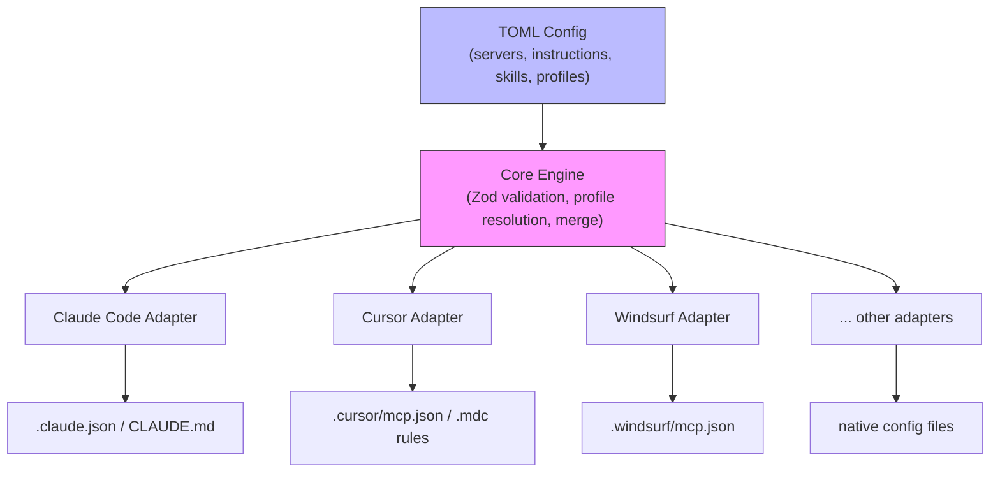

# ADR-0001: Layered Core + Adapter Extensions Architecture

## Context

agent-manager needs to manage AI agent configurations (MCP servers, skills, plugins,
instructions, permissions, models, agents) across 10+ IDE/agent tools (Claude Code,
Cursor, Windsurf, Copilot, Cline, Roo Code, Continue, Gemini CLI, Codex CLI, Amazon Q).

These tools are 90% identical in WHAT they configure but wildly different in HOW:
- MCP server config is near-universal (9/10 tools, identical JSON schema)
- Instructions exist in all tools but with different file formats and activation logic
- Some features are unique to one tool (Claude Code hooks, Roo Code modes, Cursor team rules)

We evaluated three architectural approaches:

- **Approach A (Thin Core, Fat Adapters):** Core only owns truly universal fields.
  Everything else is adapter territory. Maximum flexibility but forces duplication
  of common concepts (instructions, permissions) across every adapter.

- **Approach B (Semantic Core, Translation Adapters):** Core models semantic intent
  for all common features. Adapters only translate format/location. Clean but risks
  lossy translation when tools have subtly different activation semantics.

- **Approach C (Layered Core + Adapter Extensions):** Core models universal entities
  with a semantic schema. Every entity has an optional `[entity.adapters.<name>]`
  escape hatch for tool-specific overrides. Adapters declare capabilities via feature
  flags and handle graceful degradation.

## Decision

We adopt **Approach C: Layered Core + Adapter Extensions**.

The core schema defines 8 entity types: Servers, Instructions, Skills, Plugins,
Agents, Permissions, Models, and Profiles. Each entity supports an optional
`[entity.adapters.<adapter-name>]` TOML subtable for tool-specific extensions.

The adapter interface follows a hybrid of the VS Code contributes manifest pattern
and the ESLint convention-based object shape:
- Adapters are TypeScript objects conforming to the `Adapter` interface
- They declare capabilities as feature flags (e.g., `["mcp", "instructions", "hooks"]`)
- Core validates core fields; each adapter validates its own section (two-phase Zod)
- Features not in an adapter's capability list are silently skipped during export

The `[entity.adapters.<name>]` subtable follows the Cargo `[package.metadata]`
pattern — the core preserves but does not validate adapter sections, leaving
validation to the adapter itself.

## Consequences

### Positive
- Write instructions, permissions, and rules once — deploy to all tools
- Tool-specific features (Claude Code hooks, Roo Code modes) have a clean home
  without polluting the core schema
- New adapters can be added without core schema changes
- Forward-compatible: unknown adapter names in TOML are preserved, not rejected
- Graceful degradation: if a tool doesn't support hooks, the adapter silently skips them

### Negative
- More complex schema than Approach A (thin core) — users see both core fields and
  adapter sections
- Semantic normalization of instructions is imperfect — "always apply" means slightly
  different things in Cursor vs Claude Code
- Two levels of config (core + adapter) creates a learning curve for "where do I put this?"

### Neutral
- The `adapters.<name>` subtable pattern is well-established (Cargo, Terraform, K8s CRDs)
  but novel in the AI tooling space — we're establishing a convention

## Alternatives Considered

- **Approach A (Thin Core):** Rejected because it forces duplicating instructions,
  permissions, and rules per-adapter, violating the core value prop of "define once,
  deploy everywhere."
- **Approach B (Semantic Core):** Rejected as too rigid — subtle differences in
  instruction activation across tools would cause lossy translation or require
  an ever-growing core schema to capture every variant.

## Implementation Status

As of 2026-04-08, this architecture is fully implemented:

- **Config resolution pipeline complete:** `buildResolvedConfig` populates all entity types (servers, instructions, skills, agents) through hierarchical merge and profile inheritance.
- **`mergeConfigs` handles all entity types** including agents, which were added after the initial implementation.
- **13 adapters implemented:** The original 8 (Claude Code, Codex CLI, Copilot, Cursor, ForgeCode, Kilo Code, Kiro, Windsurf) plus 5 additional adapters, all following the `Adapter` interface from `src/adapters/types.ts`.

## References

- [09-adapter-architecture-patterns.md](../research/09-adapter-architecture-patterns.md) — Terraform, VS Code, ESLint, Grafana, Home Assistant patterns
- [10-agent-protocols-and-standards.md](../research/10-agent-protocols-and-standards.md) — MCP universality, AGENTS.md standardization, IDE-unique features catalog
- [11-extensible-schema-patterns.md](../research/11-extensible-schema-patterns.md) — Cargo metadata, CRDs, Zod discriminated unions, two-phase validation
- [04-agent-ide-config-format-survey.md](../research/04-agent-ide-config-format-survey.md) — 10 tools surveyed, MCP near-universal finding
