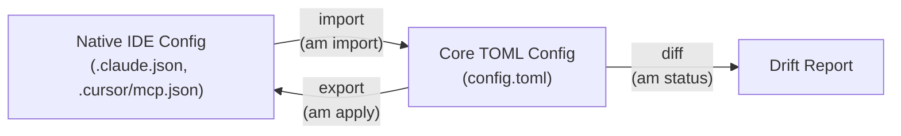

# ADR-0005: Bidirectional Adapters — Import + Export + Diff

## Context

Most config management tools are unidirectional: they generate output from a source
of truth (Terraform apply, chezmoi apply). However, agent-manager faces a unique
challenge: users have EXISTING configurations across multiple tools that they've been
maintaining manually for months or years.

If we only support export (core → IDE config), we force users to manually recreate
their configs in TOML from scratch — a terrible onboarding experience for brownfield
users. Worse, when users inevitably edit their IDE configs directly (adding a server
in Claude Code's UI or Cursor's settings), those changes would be silently overwritten
on the next `am apply`.

## Decision

Every adapter MUST implement three operations:

1. **Import** (native → core): Read existing IDE config files, convert to core schema.
   Used by `am init`, `am import <tool>`, and drift detection.

2. **Export** (core → native): Generate IDE-specific config files from resolved core
   config. Used by `am apply`, `am use <profile>`.

3. **Diff**: Compare the resolved core config against current native files. Detect
   additions, removals, and modifications. Used by `am status`, `am apply --dry-run`.

The adapter interface:

```typescript
interface Adapter {
  meta: { name: string; capabilities: Capability[] };
  detect(): DetectResult;
  import(options: ImportOptions): ImportResult;
  export(config: ResolvedConfig, options: ExportOptions): ExportResult;
  diff(config: ResolvedConfig): DiffResult;
  schema: AdapterSchema;
}
```

Import includes **smart deduplication**: when importing from multiple tools, the
importer matches servers by command (not name), detects duplicates, and prompts users
to reconcile version or naming differences.



## Consequences

### Positive
- Brownfield users onboard in one command: `am import auto`
- Drift detection catches direct IDE edits: `am status` shows divergence
- Users choose how to resolve drift: adopt changes (`am import`) or overwrite (`am apply`)
- Smart dedup prevents duplicate servers when importing from multiple tools
- The tool adapts to user workflow, not the other way around

### Negative
- Adapter implementation is more complex (3 operations vs 1)
- Import must handle messy real-world configs (incomplete fields, nonstandard formats)
- Deduplication heuristics may misidentify distinct servers as duplicates
  (mitigation: always prompt user, never auto-merge silently)

### Neutral
- Adapters that can't implement import (e.g., tools with no readable config) can
  return a "not supported" result — import capability is declared via feature flags

## Alternatives Considered

- **Export-only (like Terraform):** Rejected because it punishes brownfield users and
  overwrites direct IDE edits. Terraform can afford this because infrastructure state
  is dangerous to edit directly — config files are not.
- **Watch mode (filesystem watcher):** Rejected as overly complex and fragile. Drift
  detection on-demand (`am status`) is simpler and sufficient.
- **Bidirectional sync (Dropbox-style):** Rejected as too magical — automatic imports
  could silently change the source of truth. Users should explicitly choose to adopt
  or overwrite.

## References

- [04-agent-ide-config-format-survey.md](../research/04-agent-ide-config-format-survey.md) — config file locations and formats per tool
- [09-adapter-architecture-patterns.md](../research/09-adapter-architecture-patterns.md) — bidirectional translation as unique requirement
