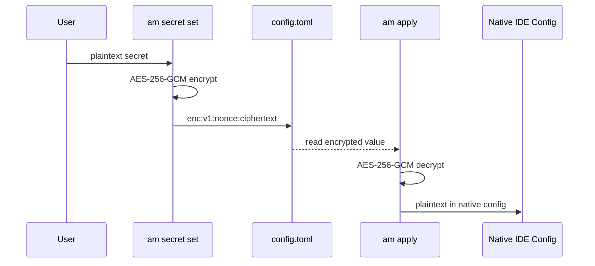

# ADR-0012: Application-Level Encryption with Platform-Agnostic Key Storage

## Context

agent-manager syncs configs via git, and those configs contain sensitive values
(API keys, tokens) in server `env` fields. These values must be encrypted at rest
in the git repo so they can be safely pushed to any remote.

Research (doc 12 — secrets-encryption-strategies.md) evaluated git-crypt, git-secret,
SOPS+age, and platform secrets. Key findings:

- **git-crypt/git-secret:** Only encrypt whole files. We need value-level encryption
  to keep TOML structure readable.
- **SOPS+age:** Encrypts individual values but does not support TOML yet (PR #2031 pending).
  Requires external `sops` and `age` binaries as dependencies.
- **GitHub/GitLab Secrets:** Write-only via API. Cannot read values back. Useful as
  key stores for CI, not as general secret backends.
- **Platform dependency risk:** Tying encryption to GitHub/GitLab means self-hosted
  git (Gitea, Forgejo, bare SSH) users are excluded.

## Decision

agent-manager implements **application-level symmetric encryption** using AES-256-GCM
via Bun's native Web Crypto API. No external binary dependencies.

### How it works

1. **Encryption key** is a 256-bit AES key stored locally, never committed to git.
2. **Sensitive values** in config.toml are encrypted inline with an `enc:` prefix.
3. **`am apply`** decrypts values at apply-time when generating native IDE configs.
4. **`am sync push/pull`** does not handle encryption — values are already encrypted
   in the TOML file itself.

### Config example

```toml
[servers.tavily]
command = "bunx"
args = ["tavily-mcp@latest"]
env = { TAVILY_API_KEY = "enc:v1:nonce:ciphertext_base64" }
```

The `enc:v1:` prefix signals an encrypted value. The nonce and ciphertext are
base64-encoded. Unencrypted values (no `enc:` prefix) work normally.

### Setting secrets

```bash
am secret set TAVILY_API_KEY "sk-live-xxx"
# → Encrypts with local key, writes enc:v1:... to config.toml
# → Commits: "secret: set TAVILY_API_KEY"

am secret list
# → Shows secret names (not values): TAVILY_API_KEY, EXA_API_KEY

am secret get TAVILY_API_KEY
# → Decrypts and displays: sk-live-xxx
```

### Key storage tiers

| Tier | Location | Use case |
|------|----------|----------|
| **Local file** | `.agent-manager/key.txt` (gitignored) | Default. Works with ANY git remote. |
| **Environment variable** | `AM_ENCRYPTION_KEY` (base64) | CI/CD, containers, any platform |
| **Platform adapter** | GitHub Secrets, GitLab Variables | Convenience via git platform adapters (ADR-0013) |

**Priority:** `AM_ENCRYPTION_KEY` env var > `.agent-manager/key.txt` file.

### Key bootstrap (new machine)

```bash
am clone git@github.com:user/config.git
# → "Encrypted values found. Provide decryption key:"
# → Option 1: paste base64 key (copied from password manager)
# → Option 2: am secret import-key ~/.ssh/am-key.txt
# → Option 3: export AM_ENCRYPTION_KEY=base64... (from CI secret)
```

### Key generation

```bash
am init
# → Generates 256-bit AES key via Web Crypto
# → Saves to .agent-manager/key.txt
# → Displays base64 key: "Save this key in your password manager: AGx8f2..."
```

### Implementation

```typescript
// src/core/secrets.ts — encryption functions
const ALGO = "AES-GCM";
const PREFIX = "enc:v1:";

async function encrypt(plaintext: string, key: CryptoKey): Promise<string> {
  const iv = crypto.getRandomValues(new Uint8Array(12));
  const encoded = new TextEncoder().encode(plaintext);
  const ciphertext = await crypto.subtle.encrypt(
    { name: ALGO, iv },
    key,
    encoded,
  );
  const ivB64 = btoa(String.fromCharCode(...iv));
  const ctB64 = btoa(String.fromCharCode(...new Uint8Array(ciphertext)));
  return `${PREFIX}${ivB64}:${ctB64}`;
}

async function decrypt(encrypted: string, key: CryptoKey): Promise<string> {
  if (!encrypted.startsWith(PREFIX)) return encrypted; // not encrypted
  const parts = encrypted.slice(PREFIX.length).split(":");
  const iv = Uint8Array.from(atob(parts[0]), c => c.charCodeAt(0));
  const ct = Uint8Array.from(atob(parts[1]), c => c.charCodeAt(0));
  const plaintext = await crypto.subtle.decrypt(
    { name: ALGO, iv },
    key,
    ct,
  );
  return new TextDecoder().decode(plaintext);
}
```



## Consequences

### Positive
- Zero external dependencies — uses Bun's native Web Crypto (AES-256-GCM)
- Works with ANY git remote (GitHub, GitLab, Gitea, Forgejo, bare SSH, local)
- Value-level encryption — TOML structure stays readable, only sensitive values encrypted
- Key is platform-agnostic — a simple base64 string storable anywhere
- `enc:v1:` prefix is version-tagged for future algorithm changes
- Round-trip safe — encrypted values survive TOML parse/stringify cycles

### Negative
- Symmetric encryption means all users share one key (team scenario)
  (mitigation: Phase 2 can add per-user asymmetric encryption via age)
- Key must be manually distributed to new machines/team members
  (mitigation: store in password manager, or use git platform adapter)
- Lost key means re-entering all secrets (`am secret reset`)

### Neutral
- SOPS can be added as an alternative provider in Phase 2 if users prefer it
- The `enc:v1:` prefix scheme supports future algorithm upgrades (enc:v2:...)

## Alternatives Considered

- **SOPS + age:** Rejected for Phase 1 — requires external binaries, doesn't support
  TOML natively. Good Phase 2 option as an alternative provider.
- **git-crypt:** Rejected — whole-file encryption only, can't encrypt individual values.
- **GitHub/GitLab Secrets as primary store:** Rejected — write-only APIs, platform-dependent,
  excludes self-hosted git users.
- **No encryption (env vars only):** Rejected — users would need to manually set env vars
  on every machine. Defeats the "one config, every machine" value prop.

## References

- [secrets-encryption-strategies.md](../research/adapters/secrets-encryption-strategies.md) — full research
- [Web Crypto API](https://developer.mozilla.org/en-US/docs/Web/API/SubtleCrypto) — AES-256-GCM
- [ADR-0013](0013-git-platform-adapters.md) — git platform adapters for key distribution
