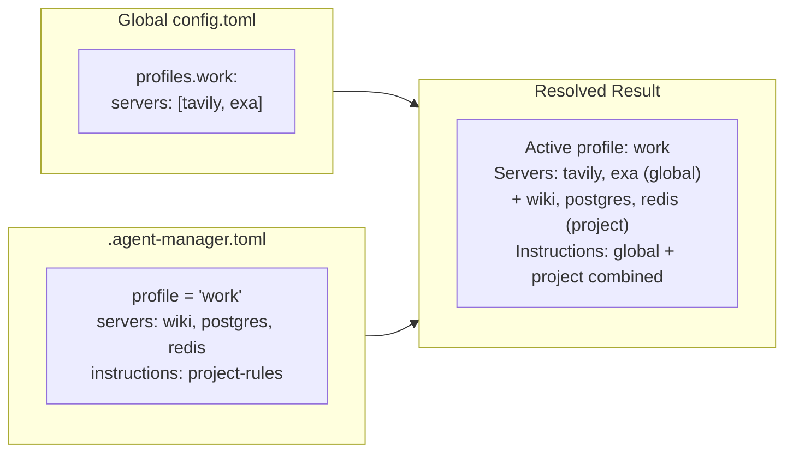

# ADR-0014: Workspace-to-Profile Import

## Context

When a user runs `am` in a workspace that already has AI agent configs (`.mcp.json`,
`CLAUDE.md`, `.cursor/rules/`, `.kiro/settings/mcp.json`, etc.) but no
`.agent-manager.toml`, there's an opportunity to automatically import those configs
into agent-manager's system.

This is the **brownfield onboarding for projects** — analogous to how `am init`
imports global configs from `~/.claude.json`, but at the workspace level.

### The Problem

Today, a developer joins a project that has:
```
my-app/
├── .mcp.json              # 3 project MCP servers
├── CLAUDE.md              # project instructions
├── .cursor/rules/ts.mdc   # Cursor rules
└── src/
```

Without agent-manager, these configs are tool-specific and non-portable. If the
developer uses Windsurf instead of Cursor, they don't get the rules. If they want
the project's MCP servers on another machine, they have to manually copy files.

### Three Levels of Import

1. **Global import** (`am init`): Imports from `~/.claude.json`, `~/.cursor/mcp.json` →
   global `config.toml`. Already implemented.

2. **Workspace import** (this ADR): Imports from project-level configs (`.mcp.json`,
   `CLAUDE.md`, `.cursor/rules/`) → `.agent-manager.toml` project config.

3. **Profile creation**: Optionally creates a named global profile from the workspace
   config, so the user can activate it in other projects.

## Decision

### `am init --project` (or auto-detect)

When `am` runs in a workspace with existing AI configs but no `.agent-manager.toml`,
it offers to import them:

```bash
$ cd ~/projects/my-app
$ am init --project
  Detected workspace configs:
    .mcp.json (3 servers: wiki, postgres, redis)
    CLAUDE.md (project instructions)
    .cursor/rules/ (2 rules: typescript.mdc, testing.mdc)
    .kiro/settings/mcp.json (3 servers, 2 overlap with .mcp.json)

  Import these into .agent-manager.toml? [Y/n] y

  ✓ Imported 4 unique servers (1 duplicate reconciled)
  ✓ Imported 1 instruction from CLAUDE.md
  ✓ Imported 2 instructions from Cursor rules
  ✓ Created .agent-manager.toml

  Also create a global profile "my-app"? [Y/n] y
  ✓ Profile "my-app" added to ~/.config/agent-manager/config.toml
```

### What Gets Created

**`.agent-manager.toml`** (project config, committed to the repo):

```toml
profile = "default"  # or user's active global profile

[project]
name = "my-app"
description = "Imported from workspace AI configs"

# Servers from .mcp.json / .kiro/settings/mcp.json (deduplicated)
[servers.wiki]
command = "amazon-wiki-mcp"
tags = ["project"]

[servers.postgres]
command = "npx"
args = ["pg-mcp"]
tags = ["project", "db"]

[servers.redis]
command = "redis-mcp"
tags = ["project", "db"]

[servers.tickety]
command = "tickety-aws-mcp"
tags = ["project"]

# Instructions from CLAUDE.md
[instructions.project-rules]
content_file = "CLAUDE.md"
scope = "always"

# Instructions from .cursor/rules/
[instructions.typescript-conventions]
content_file = ".cursor/rules/typescript.mdc"
scope = "glob"
globs = ["**/*.ts"]
```

**Optionally, a global profile** (in `~/.config/agent-manager/config.toml`):

```toml
[profiles.my-app]
description = "Imported from ~/projects/my-app workspace"
inherits = "base"
servers = ["wiki", "postgres", "redis", "tickety"]
instructions = ["project-rules", "typescript-conventions"]
```

### Auto-Detection: When to Offer Import

`am` should offer workspace import when ALL of these are true:
1. Current directory has AI config files (`.mcp.json`, `CLAUDE.md`, `.cursor/`, `.kiro/`, `.forge/`, `AGENTS.md`)
2. Current directory does NOT have `.agent-manager.toml`
3. User runs `am apply`, `am status`, or `am init --project`

This is non-intrusive: `am` never modifies the workspace without explicit consent.

### Import Source Priority

When multiple tools have configs in the same workspace, import in this order
(matching the adapter priority from the design spec):

1. `.mcp.json` (Claude Code project servers — most common)
2. `CLAUDE.md` / `AGENTS.md` (instructions)
3. `.cursor/mcp.json` + `.cursor/rules/` (Cursor)
4. `.kiro/settings/mcp.json` + `.kiro/steering/` (Kiro)
5. `.forge/` configs (ForgeCode)
6. `.codex/config.toml` (Codex CLI)
7. `kilo.jsonc` / `.kilo/` (Kilo Code)
8. `.vscode/mcp.json` (Copilot)
9. `.windsurf/` (Windsurf)

Duplicate servers are reconciled using the server identity resolution chain
(ADR-0005, design spec section 7).

### `content_file` vs Inline Content

When importing instructions, use `content_file` references (not inline content)
pointing to the original files. This means:

- `CLAUDE.md` stays as the source file — `.agent-manager.toml` just references it
- Cursor `.mdc` rules stay in `.cursor/rules/` — referenced, not copied
- Changes to the original files are picked up on next `am apply`
- No content duplication

### Relationship to Global vs Project Config



The workspace import creates an **additive layer** on top of the user's global
profile. It does not replace the global config — it supplements it with
project-specific servers and instructions.

### Team Sharing

Once `.agent-manager.toml` exists, it's committed to the repo. Team members who
have agent-manager get the project's servers and instructions automatically:

```bash
# Team member clones the repo
git clone ... && cd my-app
am apply
# ✓ Found .agent-manager.toml (4 project servers, 2 instructions)
# ✓ Merged with your global profile "personal"
# ✓ Claude Code updated (7 servers: 3 global + 4 project)
# ✓ Cursor updated (7 servers)
```

Team members WITHOUT agent-manager still have the original config files
(`.mcp.json`, `CLAUDE.md`) — nothing breaks for them.

## Consequences

### Positive
- Zero-friction workspace onboarding: run one command, project configs are managed
- No content duplication: `content_file` references keep original files as source
- Team sharing via `.agent-manager.toml` in the repo
- Non-destructive: original config files are preserved, not modified
- Optional global profile creation for reuse across projects
- Works with existing projects that have years of accumulated configs

### Negative
- `content_file` references break if original files are renamed/moved
  (mitigation: `am config validate` checks for missing referenced files)
- Auto-detection may be surprising to users who don't expect `am` to scan their workspace
  (mitigation: always prompt, never auto-import)
- Multiple tools' configs may conflict (e.g., different server versions)
  (mitigation: identity-based dedup with user confirmation)

### Neutral
- The import is a one-time operation — after `.agent-manager.toml` exists,
  `am` uses it as the source of truth for the project
- Users can edit `.agent-manager.toml` after import to customize

## Alternatives Considered

- **Always copy content inline:** Rejected — creates duplication, diverges from
  original files over time, makes `.agent-manager.toml` huge.
- **Auto-import without prompting:** Rejected — too surprising. Users should
  explicitly opt in.
- **Only import to global config (no project config):** Rejected — project-specific
  servers belong in the project, not the global catalog.
- **Require manual `am import` per tool:** Rejected — too tedious for brownfield
  projects. One command should import everything.

## References

- [ADR-0003](0003-hierarchical-config.md) — global + project config layers
- [ADR-0005](0005-bidirectional-adapters.md) — bidirectional import/export
- [Design spec section 5](../docs/2026-04-07-agent-manager-design-spec.md) — hierarchical config resolution
