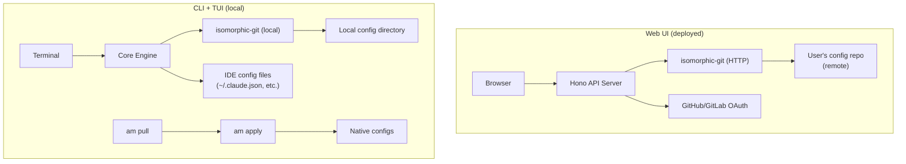

# ADR-0015: Stateless Web UI — Git-Backed, Independently Deployable

## Context

The initial Web UI scaffold (commit 342ec67) assumed the web server runs on the
same machine as the CLI, accessing the local config directory directly. This works
for `am serve` as a local dashboard but limits the Web UI's potential.

The user identified a better architecture: the Web UI should be **stateless and
independently deployable** — a separate system from the CLI that any user can log
into from any browser to manage their agent configs.

### Two Independent Systems

| System | Where it runs | How it accesses config | What it can do |
|--------|-------------|----------------------|----------------|
| **CLI + TUI** | User's local machine | Local filesystem (isomorphic-git local) | Full lifecycle: read, write, apply to IDE files, sync |
| **Web UI** | Deployed anywhere (Fly.io, Railway, Docker, self-hosted) | Git remote via HTTP (isomorphic-git over HTTP or GitHub/GitLab API) | Read, edit, commit, push config. Cannot apply to IDE files. |

The CLI and Web UI share the same config repo as the source of truth but operate
independently. Neither depends on the other.

## Decision

### Architecture



### Web UI Flow

1. **Login:** User clicks "Login with GitHub" or "Login with GitLab"
2. **Select repo:** UI lists the user's repos, they pick their config repo
   (or enter URL). Alternatively, the repo URL can be configured at deploy time
   for single-user instances.
3. **Clone:** Server clones the repo via HTTPS using the OAuth token (shallow clone,
   in-memory or temp directory). isomorphic-git handles this without system git.
4. **Browse:** UI shows servers, profiles, instructions, adapters parsed from config.toml
5. **Edit:** User adds/removes servers, switches profiles, edits instructions through the UI
6. **Save:** Changes are serialized to TOML, committed with auto-generated message,
   pushed to the remote. The UI uses the OAuth token for push auth.
7. **Local sync:** User runs `am pull` on their machine to get the changes, then
   `am apply` to update IDE configs. (Or a CI job can do this.)

### What the Web UI CAN do

- Read and display config.toml (servers, profiles, instructions, agents, adapters)
- Add/remove/edit servers, instructions, profiles
- Switch active profile (by editing config.toml, not state.toml)
- View git history (commits, diffs)
- Create new profiles
- Manage encrypted secrets (if the user provides the encryption key in-session)
- Show which adapters are configured (but not detect which are installed — that's local)

### What the Web UI CANNOT do

- **Apply** — cannot write to `~/.claude.json` or `.cursor/mcp.json` (not on user's machine)
- **Detect tools** — cannot check if Claude Code/Cursor/etc. are installed
- **Read local state** — cannot read `.agent-manager/state.toml` (active profile is per-machine)
- **Drift detection** — cannot compare resolved config against native IDE files

These limitations are by design — the Web UI is a config editor, not a config applier.

### Deployment Models

| Model | Description | For whom |
|-------|-------------|----------|
| **Self-hosted single-user** | Docker container, env var with repo URL | Individual developers |
| **Self-hosted multi-user** | Docker container, OAuth app configured | Small teams |
| **Hosted (future)** | am.dev or similar, shared OAuth app | Public service |

**Single-user self-hosted example:**
```bash
docker run -d -p 3456:3456 \
  -e AM_REPO_URL=git@github.com:user/agent-config.git \
  -e AM_ENCRYPTION_KEY=base64... \
  ghcr.io/baladithyab/agent-manager-web
```

**Multi-user with OAuth:**
```bash
docker run -d -p 3456:3456 \
  -e GITHUB_CLIENT_ID=xxx \
  -e GITHUB_CLIENT_SECRET=xxx \
  ghcr.io/baladithyab/agent-manager-web
```

### Session Management

The Web UI is stateless per request but needs session persistence for OAuth tokens:

- **SQLite** (embedded, for self-hosted): Session table with OAuth tokens, expires
- **Redis/Valkey** (for scaled deployments): Session store
- **Cookie-based** (simplest): Encrypted session cookie with OAuth token
  (no server-side state, but token in cookie)

For Phase 1 of the Web UI, use encrypted session cookies (stateless server).

Decision: Cookie-based encrypted sessions were chosen and implemented.

### Encryption Key Handling in Web UI

The user's encryption key is NOT stored on the server. Options:

1. **Per-session:** User pastes the key at login, stored in encrypted session cookie,
   cleared on logout. Server never persists it.
2. **Browser-only:** Encryption/decryption happens in the browser via Web Crypto.
   The server never sees plaintext secrets. (Requires the TOML parsing to happen
   client-side too.)
3. **No encryption in Web UI:** Encrypted values shown as `enc:v1:...`, user must
   use CLI to manage secrets. Simplest and most secure.

Phase 1: Option 3 (no encryption in Web UI). Phase 2: Option 1 (per-session key).

## Consequences

### Positive
- Web UI is independently deployable — doesn't need to run on user's machine
- Any browser, any device — manage configs from phone, tablet, work computer
- Multi-user support via OAuth — teams can share a deployment
- Stateless architecture scales horizontally
- Config repo is the single source of truth for both CLI and Web UI
- No data stored on the web server (except ephemeral sessions)

### Negative
- Cannot apply configs from the Web UI — user must run `am pull && am apply` locally
  (mitigation: future CI integration that auto-applies on push)
- Session management adds complexity vs local-only server
- OAuth setup required for multi-user deployments
- Encryption keys not available in Web UI by default

### Neutral
- The existing `am serve` command can remain as a local dashboard (reads local files)
- The deployed Web UI is a separate build/deployment from the CLI binary
- Both systems evolve independently — Web UI can get features without CLI updates

## Alternatives Considered

- **Web UI as local-only (`am serve`):** This is what was initially built. Rejected as
  the primary model because it limits Web UI to the user's machine. Kept as a
  convenience feature for local use.
- **Web UI as a Chrome extension:** Rejected — too limited, platform-specific.
- **Web UI with server-side apply (SSH agent forwarding):** Rejected — too complex,
  security risk. Apply should remain a local operation.

## References

- [ADR-0013](0013-git-platform-adapters.md) — GitHub/GitLab OAuth for git operations
- [ADR-0012](0012-application-level-encryption.md) — encryption model
- [07-browser-ui-git-oauth.md](../research/07-browser-ui-git-oauth.md) — Hono, OAuth flows, isomorphic-git
