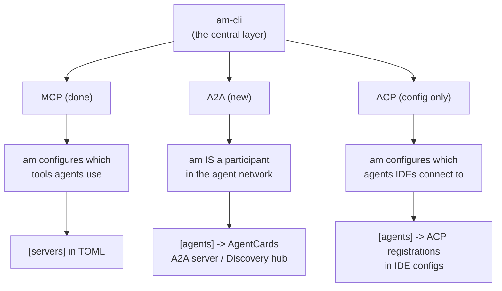
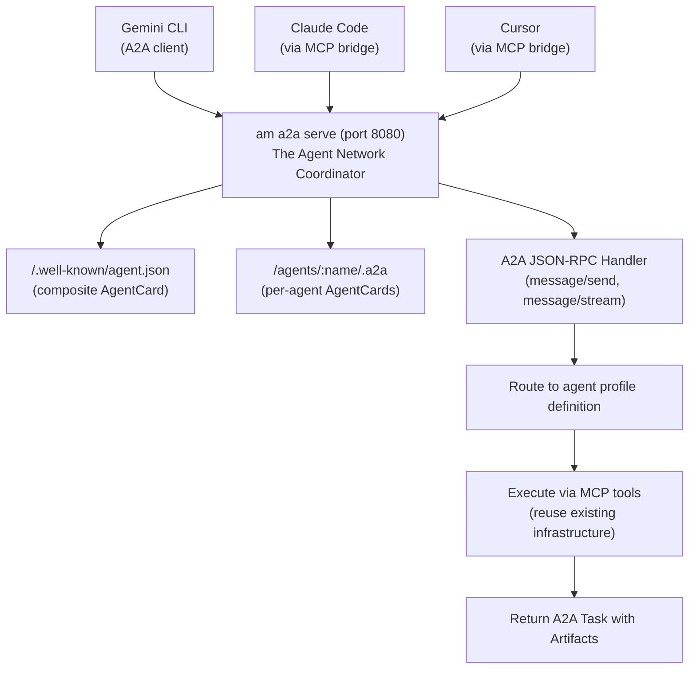
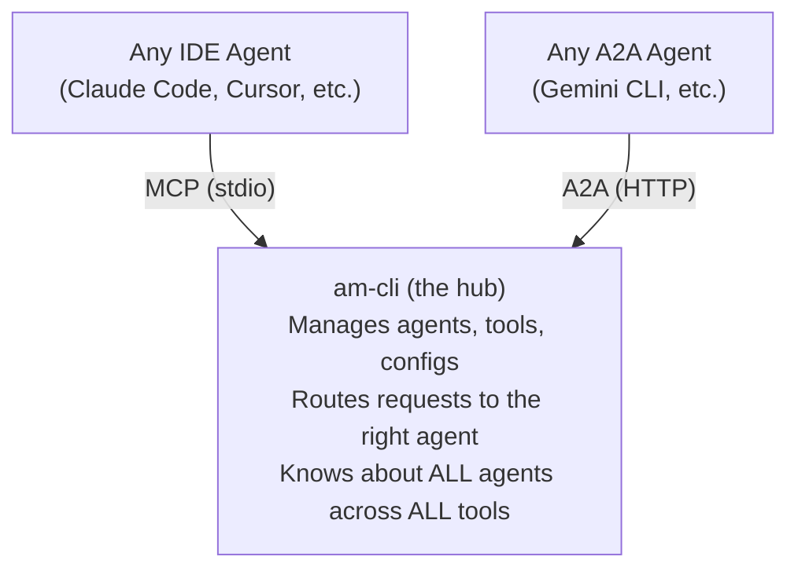
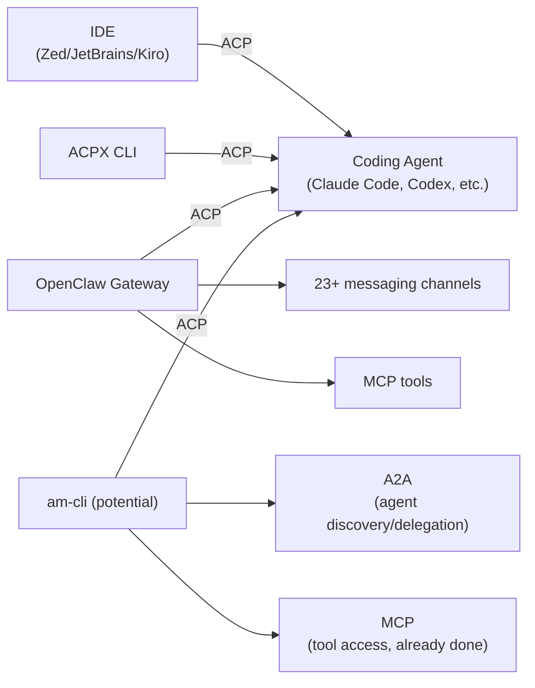

# ADR-0017: Multi-Protocol Agent Integration -- MCP, A2A, and ACP

## Context

agent-manager (`am`) is a central layer through which all agent configs flow.
It defines MCP servers, instructions, skills, and agent profiles once in TOML,
then generates native configs for 13 AI coding tools. am already exposes
itself as an MCP server (ADR-0009), meaning agents can use am as a tool.

The key insight: **am knows about ALL agents across ALL tools.** No single
IDE has this view. This positions am as the natural **agent network
coordinator** -- the layer that can broker discovery, delegation, and
configuration across the entire agent ecosystem.

Three protocols define different facets of agent interoperability:

### MCP -- Agent-to-Tool (Already Integrated)

MCP is the universal tool protocol. am manages MCP server configs and exposes
itself as an MCP server. This is done.

### A2A -- Agent-to-Agent (High Value for am)

The **A2A Protocol** (Google / Linux Foundation AAIF) enables peer-to-peer
agent discovery and task delegation via AgentCards and JSON-RPC 2.0.

| | Details |
|---|---------|
| **Spec** | v0.3.0 at github.com/a2aproject/A2A |
| **Model** | Peer-to-peer: Agent <-> Agent |
| **Governance** | Linux Foundation AAIF (alongside MCP, AGENTS.md) |
| **Backers** | Google, IBM, Linux Foundation |

A2A is the **highest-value new protocol** for am because:
- am knows about every agent. It can export AgentCards for all of them.
- am can act as a discovery hub -- a single A2A endpoint advertising all
  managed agents.
- am can broker task delegation between agents across different tools.
- This makes am the "agent network coordinator" -- exactly its core value
  proposition extended to runtime.

### ACP -- IDE-to-Agent (Honest Assessment Required)

The **Agent Client Protocol (ACP)** from Zed Industries defines how IDEs
(clients) communicate with coding agents (servers). Backed by Zed, JetBrains,
and Kiro.

| | Details |
|---|---------|
| **Website** | agentclientprotocol.com |
| **npm** | @agent-client-protocol/core |
| **Model** | Hierarchical: IDE (client) -> Agent (server) |
| **Backers** | Zed, JetBrains, Kiro |

**Important disambiguation:** This is NOT IBM's deprecated Agent Communication
Protocol (agentcommunicationprotocol.dev), which merged into A2A. Zed's ACP
and IBM's ACP are completely different protocols sharing an abbreviation.

**Honest assessment of ACP's fit with am:**

ACP defines how an IDE controls an agent. am is not an IDE. This creates a
fundamental question: where does am fit in ACP's architecture?

Three possible roles for am with ACP:

1. **am as ACP config manager** (natural fit) -- When Kiro and JetBrains
   ship ACP support, their config files will include ACP agent registrations.
   am's existing adapters (Kiro adapter: 938 lines, 7 files) should generate
   these registrations. This is identical to how am manages MCP server
   registrations today -- am does not implement MCP, it configures which MCP
   servers each IDE connects to. Similarly, am would configure which ACP
   agents each IDE connects to.

2. **am as ACP agent server** (possible but unclear value) -- am could
   implement the ACP server protocol, making am itself an agent that IDEs
   connect to via ACP. But am's MCP server mode (ADR-0009) already serves
   this purpose -- agents can already use am as a tool via MCP. Adding ACP
   server capability would be redundant with `am mcp-serve` unless ACP
   provides capabilities MCP lacks (like IDE context access, which it does).

3. **am does not implement ACP** (let IDEs handle it) -- ACP is fundamentally
   an IDE concern. IDEs implement ACP clients; agents implement ACP servers.
   am sits between them managing config, not implementing the protocol itself.

### Where Each Protocol Fits in am's Architecture



The critical distinction:
- **MCP:** am configures it (in IDE configs) AND implements it (`am mcp-serve`)
- **A2A:** am should implement it -- am IS an A2A participant (discovery hub,
  delegation broker)
- **ACP:** am should configure it (in IDE configs) but NOT implement it --
  ACP is an IDE-agent protocol and am is neither IDE nor agent

### Why A2A is the Priority

am has a unique advantage for A2A that no single IDE has:

1. **Cross-tool visibility** -- am knows about agents configured for Claude
   Code, Cursor, Kiro, Codex, and every other tool. No IDE knows about agents
   in competing IDEs.

2. **AgentCard generation** -- am's `[agents]` section already contains the
   metadata A2A AgentCards need: name, description, capabilities (tools),
   skills, and model.

3. **Discovery hub** -- `am a2a serve` could publish a composite AgentCard
   advertising all managed agents at `/.well-known/agent.json`. Any A2A
   client (including Gemini CLI's `--acp` mode) could discover them.

4. **Delegation broker** -- When agent A (in Claude Code) wants to delegate
   to agent B (in Cursor), am is the natural broker. It knows both agents,
   their capabilities, and their MCP tool configs.

## Decision

Adopt a **protocol-appropriate integration strategy** where each protocol is
integrated according to its natural fit with am's architecture:

- **A2A:** am becomes an active participant (high investment, high value)
- **ACP:** am manages ACP configs in IDE adapters (low investment, natural fit)
- **MCP:** already integrated (done)

### Phase 1: A2A Schema + ACP Config Awareness + MCP Bridge (Now)

**Goal:** Extend the TOML schema for A2A metadata. Update IDE adapters to be
ACP-aware when those IDEs ship ACP config formats. Document MCP-as-bridge for
immediate cross-tool agent communication.

#### 1a. A2A Metadata in Agent Profiles

Use the existing `adapters` passthrough to store A2A-specific agent metadata:

```toml
[agents.code-reviewer]
name = "code-reviewer"
description = "Reviews pull requests for security and quality issues"
model = "claude-sonnet-4"
tools = ["Read", "Grep", "Glob"]
mcp_servers = ["github"]

# A2A metadata (for AgentCard generation)
[agents.code-reviewer.adapters.a2a]
input_modes = ["text", "json"]
output_modes = ["text", "json", "file"]
streaming = true

[agents.code-reviewer.adapters.a2a.skills.review-pr]
description = "Analyzes a PR diff for issues"
input_modes = ["text", "json"]
output_modes = ["json", "text"]
```

No core schema changes needed -- this uses the existing passthrough. Validation
for `adapters.a2a` is added via two-phase validation (ADR-0007).

#### 1b. A2A Discovery Sources in Settings

Add an optional `a2a` section to global config for agent discovery:

```toml
[settings.a2a]
enabled = false                    # Opt-in
discovery_sources = [
  "https://agents.team.internal/.well-known/agent.json",
]

[settings.a2a.publish]
name = "dev-workstation"
description = "Development workstation agents"
provider = "Developer Name"
```

#### 1c. ACP Metadata in Agent Profiles (for IDE Adapters)

Store ACP-specific metadata that IDE adapters will consume when generating
ACP agent registrations:

```toml
# ACP metadata (consumed by Kiro/JetBrains adapters when they support ACP)
[agents.code-reviewer.adapters.acp]
slash_commands = ["review", "security-audit"]
context_awareness = true
streaming = true
```

am does not implement ACP. The Kiro adapter reads `adapters.acp` and generates
Kiro's native ACP agent registration format. This is the same pattern as MCP:
am does not implement MCP in IDE configs, it generates the config that tells
the IDE which MCP servers to connect to.

#### 1d. MCP-as-Agent-Bridge Documentation

Document cross-tool agent communication via MCP (works today, zero new code):

```toml
# Codex CLI as MCP server accessible to Claude Code
[servers.codex-agent]
command = "codex"
args = ["mcp-server"]
description = "Codex CLI agent as MCP tool"
tags = ["agent-bridge"]
transport = "stdio"

# am itself as a bridge
[servers.agent-manager]
command = "am"
args = ["mcp-serve"]
description = "Agent-manager exposing all agents as MCP tools"
tags = ["agent-bridge"]
transport = "stdio"
```

### Phase 2: A2A AgentCard Export + Kiro ACP Support (A2A v0.5+)

**Goal:** am generates A2A AgentCards from agent profiles. Kiro adapter
generates ACP agent registrations when Kiro ships its ACP config format.

#### 2a. A2A AgentCard Generation

For each agent with `adapters.a2a` metadata, generate A2A-compliant
AgentCard JSON:

```bash
am a2a export                           # Export all as AgentCards
am a2a export --agent code-reviewer     # Export specific agent
am a2a export --json                    # Structured output
```

Field mapping:

| agent-manager field | A2A AgentCard field |
|--------------------|-------------------|
| `agents.<name>.name` | `name` |
| `agents.<name>.description` | `description` |
| `agents.<name>.adapters.a2a.url` | `url` |
| `agents.<name>.adapters.a2a.capabilities` | `capabilities` |
| `agents.<name>.adapters.a2a.input_modes` | `defaultInputModes` |
| `agents.<name>.adapters.a2a.output_modes` | `defaultOutputModes` |
| `agents.<name>.adapters.a2a.skills.*` | `skills[]` |
| Config-level `settings.a2a.publish` | `provider`, top-level metadata |

This is implemented as a lightweight A2A adapter (~500 lines):

```typescript
// src/adapters/registry.ts
"a2a": async () => {
  const { a2aAdapter } = await import("./a2a/index.ts");
  return a2aAdapter;
},
```

The A2A adapter is unique -- it targets a protocol, not an IDE. It primarily
implements `export()` (AgentCard generation) and `import()` (parse AgentCards
from discovery URLs into agent profiles).

#### 2b. Kiro Adapter ACP Agent Registration

When Kiro publishes its ACP config format, extend the Kiro adapter to emit
ACP agent registrations from agents with `adapters.acp` metadata:

```typescript
// src/adapters/kiro/export.ts -- extend to emit ACP agent configs
// Reads adapters.acp metadata from agent profiles
// Generates Kiro's native ACP agent registration format
```

This is the natural ACP integration point for am. am does not implement
ACP -- it generates the config that tells Kiro which ACP agents are available,
just as it generates MCP server configs today.

### Phase 3: A2A Server Mode -- am as Agent Network Coordinator (A2A v1.0+)

**Goal:** am acts as an A2A server, becoming the central discovery and
delegation hub for all managed agents. This is where am's unique cross-tool
visibility becomes a runtime capability.

#### 3a. Architecture: am at the Center



am is uniquely positioned here because:
- It knows ALL agents across ALL tools
- It already manages the MCP tools each agent needs
- It already has a Hono HTTP server (web/) and MCP server (mcp/)
- No single IDE has this cross-tool visibility

#### 3b. A2A Server Command

```bash
am a2a serve                            # Start A2A server
am a2a serve --port 8080                # Custom port
am a2a serve --agent code-reviewer      # Expose specific agent
am a2a serve --agent-card-only          # Publish AgentCards without tasks
```

#### 3c. A2A Discovery Command

```bash
am a2a discover https://agents.example.com  # Fetch + display AgentCard
am a2a discover --register                  # Fetch + register in config
am a2a list                                  # List all known A2A agents
am a2a status                                # Health check registered agents
```

#### 3d. New MCP Tools (Extension of ADR-0009)

When A2A server is running, extend the MCP server with agent discovery tools:

| Tool | Description | Tier |
|------|-------------|------|
| `am_a2a_discover` | Fetch an AgentCard from a URL | read-only |
| `am_a2a_list_agents` | List known A2A agents (local + discovered) | read-only |
| `am_a2a_send_message` | Send message to a remote agent | write-remote |

This enables meta-agentic workflows: an agent using am's MCP tools can
discover and delegate to other agents via A2A.

#### 3e. The "am MCP-serve + A2A" Combined Model

am already runs as an MCP server. Phase 3 adds A2A. These are complementary:



- IDEs that support MCP reach am via `am mcp-serve` (stdio, embedded)
- Agents that support A2A reach am via `am a2a serve` (HTTP, standalone)
- am bridges both: an A2A request can be routed to an agent that runs via MCP

### Phase Summary

| Phase | Protocol | am's Role | Code Changes | Risk | Gate |
|-------|----------|-----------|-------------|------|------|
| **1a** | A2A | Schema design | None (passthrough) | Zero | Now |
| **1c** | ACP | Schema design | None (passthrough) | Zero | Now |
| **1d** | MCP | Bridge docs | None (existing config) | Zero | Now |
| **2a** | A2A | AgentCard export | New A2A adapter (~500 lines) | Low | A2A v0.5+ |
| **2b** | ACP | IDE config gen | Kiro adapter extension (~200 lines) | Low | Kiro ships ACP format |
| **3** | A2A | Network coordinator | Hono server + A2A handler (~1500 lines) | Medium | A2A v1.0+ |

### ACPX: ACP Beyond IDEs (OpenClaw Discovery)

**Update:** Research into OpenClaw reveals that ACP is NOT limited to IDEs.

**ACPX** (`npm: acpx`) is a "headless CLI client for the Agent Client Protocol
-- talk to coding agents from the command line." This proves ACP works in CLI
contexts, not just IDEs.

**OpenClaw** (`npm: openclaw`) is a personal AI gateway that depends on BOTH
`@agentclientprotocol/sdk` and `@modelcontextprotocol/sdk`. It uses ACP to
communicate with coding agents and MCP for tool access, bridging agents to
23+ messaging channels (WhatsApp, Telegram, Slack, Discord, etc.).

This changes the assessment of ACP for am:



**Revised ACP role for am:**

1. **am as ACP client** -- am could use ACPX/ACP SDK to talk to any
   ACP-compatible coding agent from the command line. This would let `am`
   orchestrate agents (tell Claude Code to review, tell Codex to implement)
   using a standardized protocol instead of tool-specific CLIs.

2. **am as ACP-aware config manager** -- am could manage ACP agent
   registrations alongside MCP server registrations in config.toml.

3. **am as protocol bridge** -- am sits at the intersection of MCP (tools),
   ACP (agent control), and A2A (agent discovery). It could bridge between
   all three: discover agents via A2A, control them via ACP, provide tools
   via MCP.

This is a Phase 4 consideration. The ACPX SDK is at v0.5.3 and the ACP SDK
is at v0.18.2 -- both are actively maintained. A follow-up ADR should explore
ACP client integration in detail once the A2A foundation (Phases 1-3) is in
place.

### What am Does NOT Do (Current Phases)

- **am does not implement ACP server in Phases 1-3** -- Focus is on A2A
  as the network coordination protocol. ACP client integration is Phase 4.

- **am does not replace IDEs' ACP implementations** -- When Kiro implements
  ACP, Kiro handles the protocol. am generates the config that tells Kiro
  which agents are available.

## Consequences

### Positive

- **am becomes the agent network coordinator** -- A2A integration leverages
  am's unique cross-tool visibility. No single IDE can do this.

- **Forward-compatible schema** -- A2A and ACP metadata use the existing
  `adapters` passthrough. Phase 1 is zero-disruption.

- **Honest protocol fit** -- Each protocol is integrated according to its
  natural role: A2A as a runtime protocol am participates in, ACP as configs
  am generates for IDEs, MCP as already done.

- **ACP config generation is natural** -- Managing ACP agent registrations
  in IDE configs is identical to managing MCP server registrations. am already
  does this for MCP; doing it for ACP is the same pattern.

- **Reuses existing infrastructure** -- A2A server builds on Hono (web/),
  MCP tools (mcp/), and agent profiles (core schema).

- **Cross-tool agent delegation** -- Phase 3 enables the vision: any agent
  in any IDE can discover and delegate to any other managed agent.

### Negative

- **A2A is pre-1.0** -- v0.3.0 may change significantly before v1.0.
  Phases 2a and 3 carry breaking-change risk. Mitigation: gate on spec
  milestones, implement behind feature flags.

- **ACP config format unknown** -- Kiro and JetBrains have not published
  their ACP config formats yet. Phase 2b cannot be implemented until they
  do. Mitigation: Phase 2b is explicitly gated on this.

- **Two "ACP" name confusion** -- IBM's deprecated ACP and Zed's ACP share
  an abbreviation. Mitigation: always use "Agent Client Protocol" or
  "ACP (Zed)" in user-facing text.

- **Runtime dependency for Phase 3** -- A2A server requires HTTP, unlike
  MCP's stdio. Mitigation: clearly separate `am mcp-serve` (stdio) from
  `am a2a serve` (HTTP).

- **Limited A2A IDE adoption** -- Only Gemini CLI supports A2A natively.
  Mitigation: MCP bridge provides cross-tool value today.

### Neutral

- Phase 1 adds no code, only schema conventions and documentation
- Phase 2a adds ~500 lines for AgentCard export
- Phase 2b adds ~200 lines to the existing Kiro adapter
- Phase 3 is the only phase with significant effort and can be deferred
  indefinitely
- IBM's ACP is deprecated and irrelevant; do not confuse with Zed's ACP
- ANP is not prioritized but the adapter architecture allows adding it later

## Alternatives Considered

### 1. Implement am as an ACP Client (Phase 4 Candidate)

**Deferred, not rejected.** The discovery of ACPX (headless CLI ACP client)
and OpenClaw (ACP + MCP gateway) proves ACP works beyond IDEs. am could use
`@agentclientprotocol/sdk` to talk to ACP-compatible coding agents from the
command line, enabling orchestration commands like `am agent run claude-code
--task "review PR #42"`. This is a strong Phase 4 candidate once the A2A
foundation is in place, and warrants its own follow-up ADR.

### 2. Integrate Only A2A, Ignore ACP Entirely

**Rejected.** While am should not implement ACP, it should manage ACP configs
in IDE adapters. When Kiro ships ACP support, its config files will include
ACP agent registrations. am's Kiro adapter should generate these, just as it
generates MCP server configs today. Ignoring ACP means incomplete IDE configs.

### 3. Integrate Only ACP, Ignore A2A

**Rejected.** ACP config management is low value by itself (just another
adapter field). A2A is the high-value protocol because it leverages am's
unique cross-tool visibility for runtime agent discovery and delegation.

### 4. Only Use MCP for Agent Communication

**Partially accepted as Phase 1d.** MCP-as-bridge works today and is
pragmatic. However, MCP lacks:
- Agent discovery (AgentCards)
- Task lifecycle (state machines)
- Rich content negotiation
- Streaming task updates

MCP-only is the stepping stone; A2A is the destination.

### 5. Wait for All Protocols to Reach 1.0

**Rejected for Phase 1.** Phase 1 (schema design + MCP bridge) has zero risk
and immediate value. Phases 2 and 3 ARE gated on protocol milestones.

### 6. Build a Custom Agent Communication Protocol

**Rejected.** am should manage standards, not create them. A2A has
institutional backing (Google, IBM, Linux Foundation). ACP has IDE vendor
backing (Zed, JetBrains, Kiro).

## References

- [17-agent-communication-protocols.md](../research/17-agent-communication-protocols.md) -- Full research on ACP (Zed), A2A, and interop landscape
- [10-agent-protocols-and-standards.md](../research/10-agent-protocols-and-standards.md) -- Prior protocol research
- [ADR-0001](0001-layered-core-plus-adapter-extensions.md) -- Layered architecture with `adapters` passthrough
- [ADR-0007](0007-two-phase-zod-validation.md) -- Two-phase validation (core + adapter)
- [ADR-0009](0009-mcp-server-mode.md) -- MCP server mode (existing agent tool interface)
- ACP (Zed): agentclientprotocol.com, zed.dev/blog/acp-progress-report
- ACP npm: @agent-client-protocol/core
- A2A specification v0.3.0: a2a-protocol.org/v0.3.0/specification
- A2A repository: github.com/a2aproject/A2A
- Linux Foundation AAIF: governs MCP, A2A, AGENTS.md
- IBM ACP (deprecated): github.com/i-am-bee/acp, agentcommunicationprotocol.dev
