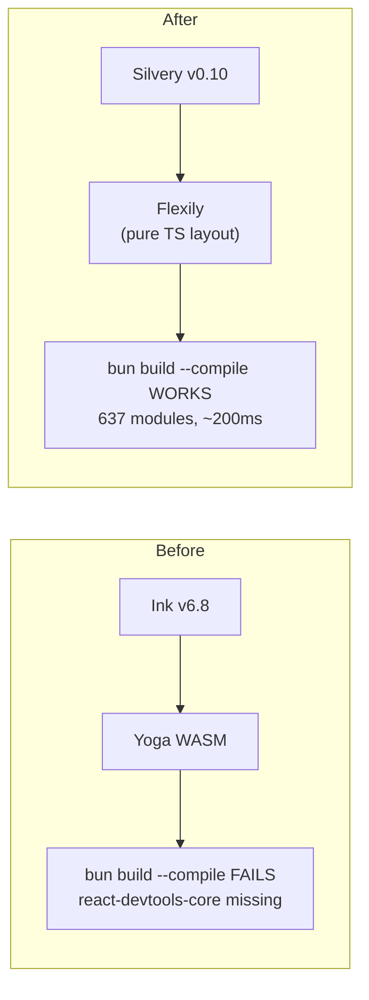

# ADR-0018: Terminal UI Framework -- Ink to Silvery Migration

## Context

The TUI dashboard (`am tui`) originally used Ink (React for terminals) with Yoga WASM
for layout. This worked during development but broke at compile time: `bun build --compile`
could not resolve Ink's `react-devtools-core` dependency, making the TUI unusable in
the distributed single binary.

Research doc `research/06-tui-frameworks-typescript-bun.md` evaluated alternatives
and recommended Silvery as the replacement framework.

The core issue is architectural: Ink depends on Yoga (a WASM-based Flexbox engine),
which creates transitive dependencies that Bun's AOT compiler cannot bundle. This is
not a fixable configuration problem -- it is a fundamental incompatibility between
Ink's dependency tree and `bun build --compile`.

## Decision

Migrate the TUI from Ink to **Silvery** (v0.10+).

Key reasons for choosing Silvery:

1. **Pure TypeScript layout engine (Flexily)** -- no WASM or Yoga dependency. The entire
   layout engine is native TypeScript, which `bun build --compile` handles without issue.

2. **First-class Bun support** -- Silvery lists Bun as a primary runtime target, unlike
   Ink which primarily targets Node.js.

3. **122x faster interactive updates** -- Silvery uses per-node dirty tracking instead of
   Ink's full-tree re-render approach, resulting in dramatically better performance for
   the dashboard's real-time status updates.

4. **45+ built-in components** vs Ink's 6 core + ink-ui's ~10 -- reduces the need for
   custom component development for the dashboard, profile switcher, and status views.

5. **98.9% Ink test compatibility layer** -- Silvery provides a compatibility layer that
   passes nearly all Ink tests, enabling incremental migration rather than a rewrite.

6. **Build compatibility** -- the build script patches `@silvery/create` for compile
   compatibility and externalizes optional dependencies (`yoga-wasm-web`, `@termless/*`).

## Consequences

### Positive

- The compiled single binary includes a fully functional TUI dashboard -- no runtime
  dependencies required on the target machine
- Smaller binary size due to elimination of the Yoga WASM blob
- Faster TUI rendering for real-time dashboard updates (profile status, drift indicators)
- Richer built-in component library reduces custom code in `src/tui/`
- The Ink compatibility layer means existing React-style component patterns remain valid

### Negative

- Silvery is pre-1.0 (v0.10) -- APIs may change in future releases, requiring updates
- Smaller community and ecosystem compared to Ink
- Build script requires patching `@silvery/create` and externalizing optional deps,
  adding a maintenance burden to the build pipeline

### Neutral

- Fallback to Ink is low-cost via the compatibility layer if Silvery development stalls
- Component architecture remains React-like (JSX, hooks, declarative rendering), so
  the mental model for TUI development does not change
- The migration does not affect the TUI's feature set -- all existing views (Dashboard,
  StatusView, ProfileSwitcher, HelpView) are preserved

## Alternatives Considered

- **Ink (status quo):** Rejected because the WASM dependency chain fundamentally breaks
  `bun build --compile`. No workaround exists short of forking Ink to remove Yoga.

- **blessed:** Rejected -- the project is abandoned (last commit 2017) and has no
  TypeScript support. Would require a ground-up rewrite with significant maintenance risk.

- **terminal-kit:** Rejected as too low-level -- provides raw terminal control but no
  component model or layout engine. Would require building a framework on top of it,
  duplicating work that Silvery already provides.

## References

- [research/06-tui-frameworks-typescript-bun.md](../research/06-tui-frameworks-typescript-bun.md) -- TUI framework evaluation and Silvery recommendation
- [ADR-0010](0010-bunts-single-binary.md) -- BunTS single binary distribution (the constraint that drove this decision)
