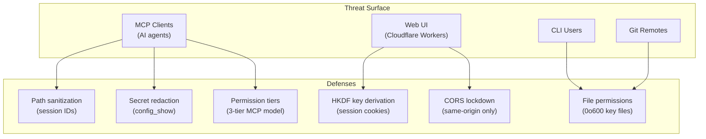

# ADR-0019: Security Hardening -- Threat Model and Fixes

## Context

A multi-facet security review (5-agent team + Codex review) identified 12 security
issues across the agent-manager codebase. The issues spanned path traversal, weak
cryptographic practices, cookie handling bugs, permissive CORS policies, secret
leakage through MCP tools, and overly broad permission classifications.

All 12 issues have been fixed. This ADR documents the threat model, the consolidated
fixes, and the defense-in-depth strategy applied across the codebase.

agent-manager has three distinct attack surfaces: MCP clients (AI agents calling tools
over stdio), the Cloudflare Workers web UI (browser-based with GitHub OAuth), and the
CLI itself (local user executing commands). Each surface requires different defenses.

## Decision

Apply defense-in-depth across 6 categories, addressing all identified vulnerabilities:

### 1. Path Traversal -- Session ID Sanitization

The `loadSession` function in the web worker accepted session IDs directly from cookies
without validation. A crafted session ID containing `../`, `\`, or null bytes could
traverse outside the intended session directory.

**Fix:** Regex validation rejects session IDs containing `/`, `\`, `\0`, or `..`
before any filesystem operation.

### 2. Cryptographic -- HKDF Key Derivation

Session cookie encryption used the raw encryption key padded with zeros to reach
the required length. This is a weak key derivation practice that reduces effective
key entropy.

**Fix:** Replaced pad-with-zeros with HKDF (HMAC-based Key Derivation Function)
to derive the session cookie encryption key from the master key. Additionally,
key files created by `am secret set` now enforce `0o600` permissions (owner-only
read/write).

### 3. Cookie Security -- Headers.append for Set-Cookie

The web worker joined multiple `Set-Cookie` headers with commas in a single header
value. RFC 6265 requires each `Set-Cookie` to be a separate header -- comma-joining
breaks cookie parsing in many browsers.

**Fix:** Use `Headers.append("Set-Cookie", ...)` for each cookie, which correctly
emits multiple `Set-Cookie` headers.

### 4. CORS -- Removed Permissive Origin-Reflecting Policy

The Workers API reflected the requesting origin in `Access-Control-Allow-Origin`,
effectively allowing any origin to make authenticated requests.

**Fix:** Removed the permissive origin-reflecting CORS policy. The API now uses
same-origin restrictions by default.

### 5. Secret Redaction -- MCP config_show

The `config_show` MCP tool returned the full resolved config including encrypted
secret values (`enc:v1:nonce:ciphertext`). While encrypted, exposing the ciphertext
to MCP clients is unnecessary and increases the attack surface.

**Fix:** `config_show` now redacts all `enc:v1:*` values to `[encrypted]` in its
output.

### 6. Permission Model -- am_apply Reclassification

The `am_apply` MCP tool was classified as `write-remote`, requiring explicit opt-in
via `settings.mcp_serve.allow_apply`. However, `am apply` only writes to local files
(native IDE configs). The `write-remote` classification was overly restrictive and
the `allow_apply` gate was redundant with the tier system.

**Fix:** Reclassified `am_apply` to `write-local` tier. Removed `allow_apply` from
the `write-remote` gate check.

## Consequences

### Positive

- All 12 identified security issues are resolved with defense-in-depth
- Path traversal is structurally prevented, not just discouraged
- Cryptographic key derivation follows best practices (HKDF)
- MCP clients cannot exfiltrate encrypted secret material
- CORS policy no longer allows arbitrary cross-origin access
- Permission model accurately reflects the risk level of each MCP tool

### Negative

- HKDF key derivation is not backward-compatible -- existing session cookies
  encrypted with the old method will be invalidated (users must re-authenticate)
- Removing the permissive CORS policy may break third-party integrations that
  relied on cross-origin access to the Workers API (none known, but possible)

### Neutral

- The security fixes do not change any user-facing CLI behavior
- The 3-tier MCP permission model (read-only, write-local, write-remote) is
  unchanged in structure -- only `am_apply`'s classification moved
- Key file permissions (`0o600`) match standard practice for SSH keys and other
  sensitive credential files

## Alternatives Considered

- **Allowlist-based session IDs (UUID-only):** Would be more restrictive than regex
  rejection but would break existing session ID formats. Regex rejection is sufficient
  and backward-compatible.

- **Encrypt-then-MAC for cookies (instead of HKDF + AES-GCM):** AES-GCM already
  provides authenticated encryption (MAC is built in). Adding a separate MAC layer
  would be redundant. HKDF addresses the key derivation weakness specifically.

- **Remove MCP config_show entirely:** Too restrictive -- agents need to read config
  for legitimate operations. Redaction preserves utility while eliminating secret
  exposure.

## References

- [ADR-0009](0009-mcp-server-mode.md) -- MCP server mode and the 3-tier permission model
- [ADR-0012](0012-application-level-encryption.md) -- Application-level encryption (AES-256-GCM)
- [ADR-0015](0015-stateless-web-ui.md) -- Stateless web UI (Cloudflare Workers, session cookies)
