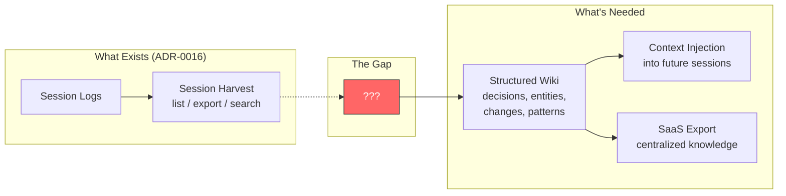
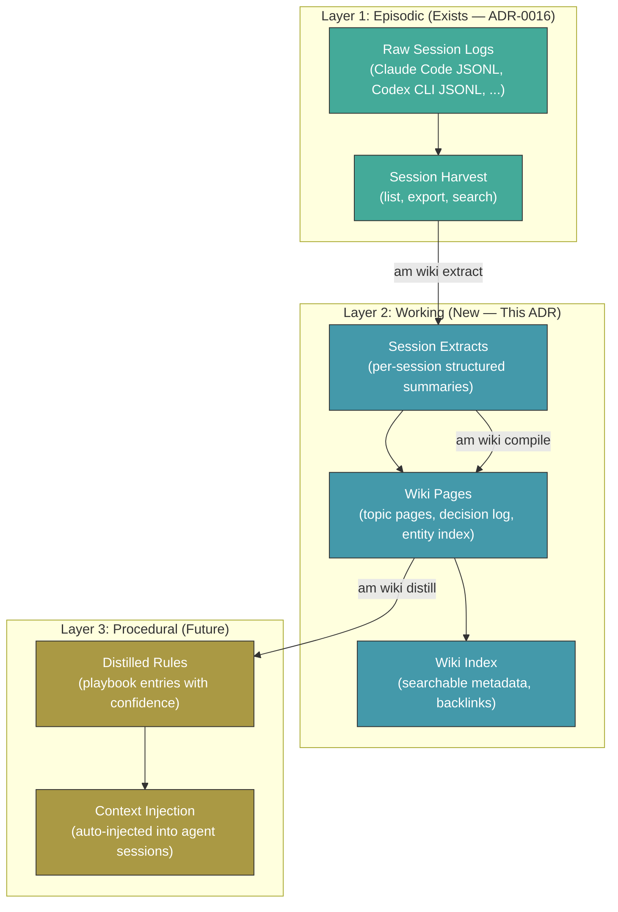
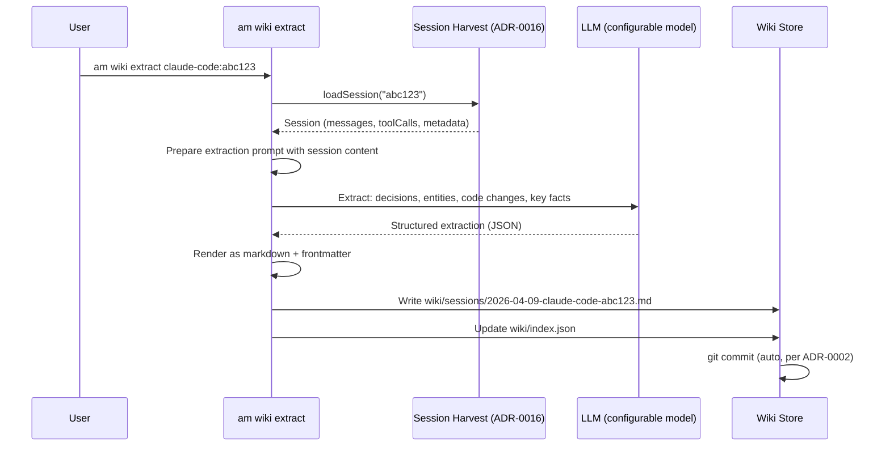
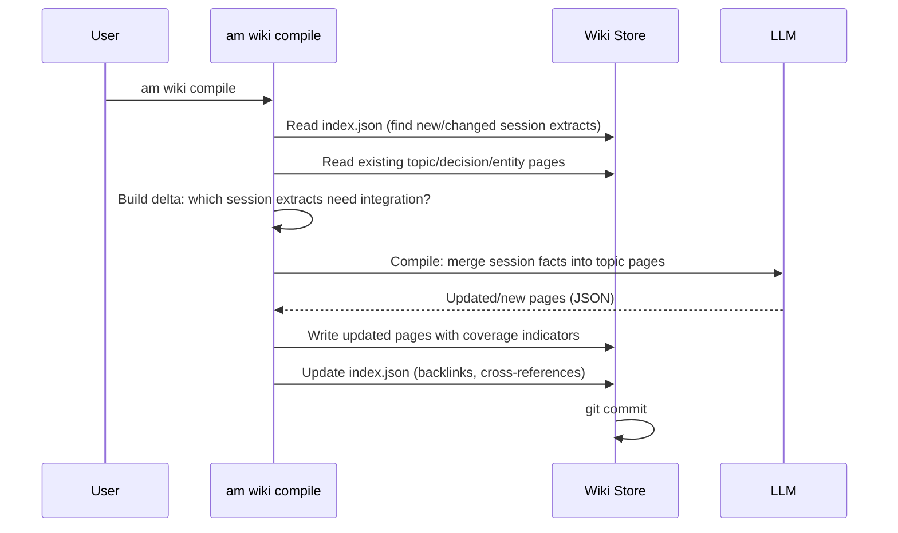
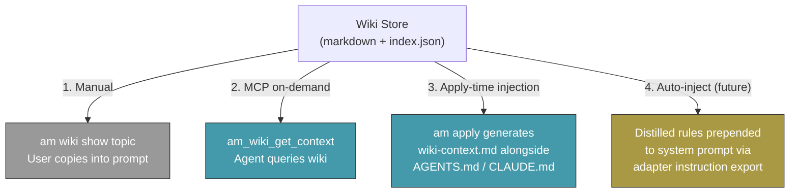

# ADR-0020: Session Knowledge Synthesis — LLM Wiki from Agent Sessions

## Context

Developer knowledge is created inside AI agent sessions — decisions are made, code is
written, bugs are diagnosed, architectures are debated — then the session ends and the
knowledge evaporates. The raw session logs persist on disk (Claude Code JSONL, Codex CLI
JSONL, and eventually others), but they are:

1. **Unstructured** — Thousands of messages mixing tool calls, thinking, and conversation
2. **Tool-siloed** — Each agent stores sessions in its own format and location
3. **Unsearchable at scale** — `am session search` does O(n*m) substring matching across
   every message in every session
4. **Never synthesized** — No mechanism distills "what was decided" or "what was built"
   from the raw transcript into durable, reusable knowledge
5. **Invisible to future sessions** — A new agent session starts with a blank context
   (plus whatever the user manually put in AGENTS.md/CLAUDE.md)

ADR-0016 built the **Session Harvest** layer — a read-only pipeline that extracts raw
sessions from 2 of 13 adapters (Claude Code, Codex CLI) into a unified
`Session`/`Message` type model with filtering and export. This gives us the *raw
material*. What's missing is the *refinery*: an automated pipeline that transforms raw
session transcripts into a structured, searchable, evolving knowledge base — a **project
wiki built from agent conversations**.

### The Knowledge Lifecycle Gap



### Prior Art

The problem of extracting durable knowledge from LLM conversations is actively being
solved across the industry:

| System | Approach | Key Insight |
|--------|----------|-------------|
| **Karpathy LLM Wiki** (2026) | Raw sources → LLM compile → structured markdown wiki → lint/query | Markdown is the universal format. No vector DB needed at personal scale. The LLM is a compiler, not a database. |
| **Graphiti/Zep** (24k stars) | Temporal knowledge graph with bi-temporal model | Contradiction resolution via edge invalidation (invalidate, don't delete). Hybrid search: semantic + BM25 + graph traversal. |
| **cass-memory** | Three-layer cognitive architecture: Episodic → Working → Procedural | Cross-agent session mining. ACE pipeline: Generate diary → Reflect across sessions → Curate rules with confidence tracking. |
| **OpenViking** | Auto-extract on session commit, LLM dedup (skip/merge/create) | Dedup prevents memory bloat: vector pre-filter → LLM decides whether to skip, merge, or create. |
| **Claude Memory** | Raw history search via `memory_search`/`memory_store` tools | No lossy summarization — searches actual past conversations at query time. |
| **ChatGPT Memory** | AI-generated user profile facts | Lossy by design — distills preferences, not project knowledge. |
| **MCP Memory Server** (reference) | Entity-observation-relation graph in local JSON | Minimal viable model: entities have observations, entities have relations. 6 tools. |

The Karpathy pattern is most aligned with agent-manager's philosophy: local-first,
git-backed, human-readable, no infrastructure dependencies. The cass-memory layered
model (episodic → working → procedural) maps naturally onto our existing session harvest
(episodic) with wiki extraction (working) and distilled rules (procedural) as new layers.

## Decision

Build a **Session Knowledge Synthesis** system — internally called the **LLM Wiki** —
that automatically extracts, synthesizes, and organizes knowledge from agent session
transcripts into a structured, git-backed, human-readable wiki. The wiki serves as a
durable project memory that compounds over time and can be surfaced back to future agent
sessions as context.

### Core Architecture: Three-Layer Knowledge Model

Inspired by cass-memory's cognitive architecture and adapted for agent-manager's
git-backed, TOML-driven design:



### Wiki Storage Layout

All wiki data lives within the git-managed config directory, consistent with ADR-0002
(Git-Backed Everything). The wiki directory sits alongside the existing config:

```
~/.config/agent-manager/
├── config.toml                    # Existing core config
├── state.toml                     # Existing ephemeral state (gitignored)
├── key.txt                        # Existing encryption key (gitignored)
├── wiki/                          # NEW — knowledge wiki
│   ├── index.json                 # Master index: all pages, backlinks, metadata
│   ├── sessions/                  # Layer 2a: per-session extracts
│   │   ├── 2026-04-09-claude-code-abc123.md
│   │   └── 2026-04-09-codex-cli-def456.md
│   ├── topics/                    # Layer 2b: synthesized topic pages
│   │   ├── validation.md
│   │   ├── encryption.md
│   │   └── adapter-pattern.md
│   ├── decisions/                 # Layer 2c: decision log
│   │   ├── use-zod-for-validation.md
│   │   └── toml-over-yaml.md
│   ├── entities/                  # Layer 2d: entity pages (projects, tools, people)
│   │   ├── agent-manager.md
│   │   └── isomorphic-git.md
│   ├── changelog/                 # Layer 2e: what-was-built timeline
│   │   └── 2026-04-09.md
│   └── rules/                    # Layer 3: distilled playbook (future)
│       ├── typescript-patterns.md
│       └── testing-conventions.md
└── .git/                          # All wiki changes auto-committed
```

Project-level wikis follow the same pattern in `.agent-manager/wiki/` at the repo root,
scoped to that project's sessions.

### Wiki Page Format

Every wiki page uses markdown with YAML frontmatter — human-readable, git-diffable,
editable by hand or LLM:

```markdown
---
type: decision
title: "Use Zod for Two-Phase Validation"
created: 2026-04-07
updated: 2026-04-09
source_sessions:
  - claude-code:session-abc123
  - codex-cli:session-def456
entities: [zod, validation, schema, adapter]
supersedes: null
confidence: high
coverage: 3
tags: [core, architecture]
---

# Use Zod for Two-Phase Validation

## Summary

Core fields validated strictly by Zod schemas. Adapter-specific sections use
`z.record(z.string(), z.unknown())` passthrough — preserved by core, validated
by each adapter's own schema at export time.

## Rationale

- TypeScript type inference from Zod schemas eliminates manual type definitions
  (session-abc123, 2026-04-07)
- Two-phase approach allows adapter evolution without core schema changes
  (session-def456, 2026-04-08)

## Source Context

> "We tried io-ts first but the verbosity was unacceptable for 5 entity types
> plus adapter extensions" — session-abc123, message 47

## Related

- [[validation]] — Topic page
- [[ADR-0007]] — Two-Phase Zod Validation
- [[adapter-pattern]] — How adapters use passthrough validation
```

### Frontmatter Schema

```typescript
// src/core/wiki.ts (new file)

interface WikiPageMeta {
  type: "session" | "topic" | "decision" | "entity" | "changelog" | "rule";
  title: string;
  created: string;              // ISO date
  updated: string;              // ISO date
  source_sessions: string[];    // composite IDs: "adapter:session-id"
  entities: string[];           // cross-reference slugs
  tags: string[];               // freeform taxonomy
  confidence: "high" | "medium" | "low";
  coverage: number;             // count of corroborating sessions
  supersedes?: string;          // slug of page this replaces
  superseded_by?: string;       // slug of page that replaced this
}
```

### Extraction Pipeline

The pipeline runs in three stages, each independently invocable:

#### Stage 1: Extract (`am wiki extract`)

Per-session LLM-powered extraction. Takes a raw session transcript and produces a
structured session extract page.



**What the LLM extracts from each session:**

| Category | Description | Example |
|----------|-------------|---------|
| **Decisions** | Architectural or implementation choices made | "Chose Zod over io-ts for validation" |
| **Entities** | Projects, technologies, libraries, concepts discussed | "isomorphic-git", "AES-256-GCM", "Hono" |
| **Code Changes** | Files created/modified/deleted (from tool calls) | "Created src/core/resolver.ts (profile inheritance)" |
| **Key Facts** | Important findings, constraints, requirements | "Bun --compile doesn't support dynamic requires" |
| **Open Questions** | Unresolved issues or deferred decisions | "Windows path handling needs investigation" |
| **Patterns** | Reusable patterns or conventions established | "All adapters follow the 6-file structure" |

**Extraction prompt structure:**

```
You are a knowledge extraction system. Given this agent session transcript,
extract structured knowledge into the following categories:

## Session Context
- Tool: {adapter}
- Project: {project}
- Date: {date}
- Duration: {duration}
- Message count: {count}

## Transcript
{formatted session content}

## Extract the following:

1. DECISIONS: What was decided? Include the rationale and alternatives considered.
2. ENTITIES: What projects, tools, libraries, concepts were discussed?
3. CODE_CHANGES: What files were created, modified, or deleted? Summarize each.
4. KEY_FACTS: What important facts, constraints, or requirements were established?
5. OPEN_QUESTIONS: What was left unresolved or explicitly deferred?
6. PATTERNS: What reusable patterns or conventions were established?

Return as JSON matching this schema: { decisions: [...], entities: [...], ... }
```

**Auto-extract mode:** When `wiki.auto_extract = true` in config, extraction runs
automatically after `am session list` detects new sessions not yet in the wiki index.

#### Stage 2: Compile (`am wiki compile`)

Cross-session synthesis. Reads all session extracts and compiles them into topic pages,
decision logs, entity pages, and changelogs. This is the Karpathy "compile" step adapted
for developer sessions.



**Incremental compilation:** Only processes session extracts created or modified since
the last compile. Each session extract has a `compiled_at` timestamp in the index. The
compile step reads the delta and updates only affected pages.

**Contradiction handling:** When session N says X and session N+1 says Y:
- The newer fact gets a wiki page with `supersedes: old-slug`
- The old page gets `superseded_by: new-slug` and `confidence: low`
- Both pages are preserved (invalidate, don't delete — per Graphiti's insight)
- The compile step adds a `## Revision History` section to affected pages

**Coverage indicators** per wiki section (from the Karpathy pattern):
- **High** — Corroborated by 3+ sessions
- **Medium** — Mentioned in 1-2 sessions
- **Low** — Single mention with no corroboration

#### Stage 3: Lint (`am wiki lint`)

Periodic health check for wiki quality. No LLM required for basic checks; LLM-assisted
for semantic analysis.

```
$ am wiki lint

Wiki Health Report
──────────────────
  Pages:        47 (12 topics, 8 decisions, 15 entities, 12 sessions)
  Coverage:     73% high, 18% medium, 9% low
  Last compile: 2026-04-09 11:30 AM

  Warnings:
    2 orphan pages (no backlinks)
    1 contradiction detected (encryption-key-storage)
    3 stale pages (source sessions > 30 days old, no recent corroboration)
    1 missing entity page (referenced but not created: "silvery")

  Suggestions:
    Run 'am wiki compile' to integrate 3 uncompiled session extracts
    Review contradiction in 'encryption-key-storage' (wiki/decisions/...)
```

### CLI Commands

| Command | Description | LLM Required |
|---------|-------------|:------------:|
| `am wiki extract <session-id>` | Extract knowledge from a single session | Yes |
| `am wiki extract --all` | Extract all sessions not yet in wiki | Yes |
| `am wiki compile` | Synthesize session extracts into wiki pages | Yes |
| `am wiki lint` | Health check: orphans, contradictions, staleness | Basic: No, Semantic: Yes |
| `am wiki query <question>` | Natural language search against wiki content | Optional (enhances results) |
| `am wiki list` | List wiki pages with metadata | No |
| `am wiki show <slug>` | Display a wiki page | No |
| `am wiki export --format <fmt>` | Export wiki to external format | No |
| `am wiki push` | Push wiki to SaaS endpoint (Phase 5) | No |

### MCP Tools (Extension of ADR-0009)

| Tool | Tier | Description |
|------|------|-------------|
| `am_wiki_search` | read-only | Search wiki by query, entity, tag, or date range |
| `am_wiki_get_page` | read-only | Retrieve a specific wiki page by slug |
| `am_wiki_get_context` | read-only | Get relevant wiki context for a given topic/question |
| `am_wiki_extract` | write-local | Trigger extraction for a session |
| `am_wiki_compile` | write-local | Trigger wiki compilation |

The `am_wiki_get_context` tool is the primary integration point for agent sessions.
An agent can call it at session start or when encountering an unfamiliar topic:

```json
{
  "method": "tools/call",
  "params": {
    "name": "am_wiki_get_context",
    "arguments": {
      "query": "How does profile inheritance work in agent-manager?",
      "max_tokens": 2000
    }
  }
}
```

Returns relevant wiki excerpts ranked by relevance and coverage confidence.

### Context Injection into Future Sessions

Four mechanisms, progressively more automatic:



1. **Manual** — User runs `am wiki query` or `am wiki show` and pastes into conversation
2. **MCP on-demand** — Agent calls `am_wiki_get_context` tool during session
3. **Apply-time injection** — `am apply` generates a `wiki-context.md` file alongside
   native configs, containing the most relevant recent decisions and high-confidence facts
   for the current project. Each adapter's instruction export includes a reference to it.
4. **Auto-inject (Phase 5)** — Distilled rules (Layer 3) are injected into the system
   prompt via the adapter instruction export, similar to how `instructions.ts` generates
   format-specific instruction blocks today

### Config Integration

```toml
# ~/.config/agent-manager/config.toml or .agent-manager.toml

[wiki]
enabled = true
auto_extract = false             # Extract on new session detection
auto_compile = false             # Compile after extraction
inject_on_apply = false          # Generate wiki-context.md during am apply

[wiki.extraction]
model = "sonnet"                 # LLM model for extraction (provider from config)
max_session_tokens = 100000      # Skip sessions exceeding this estimate
include_tool_calls = true        # Include tool call details in extraction
include_thinking = false         # Include reasoning/thinking blocks if available

[wiki.compilation]
model = "sonnet"                 # LLM model for compilation
coverage_threshold = 3           # Sessions needed for "high" confidence
stale_days = 30                  # Days before a page is flagged as stale

[wiki.export]
saas_endpoint = ""               # SaaS wiki API endpoint (Phase 5)
saas_api_key = "enc:v1:..."      # Encrypted API key (ADR-0012)
format = "markdown"              # Export format: markdown, json, html
```

### Implementation Phases

#### Phase 1: Session Extraction (Now — builds directly on ADR-0016)

**Gate:** Session harvest works for at least 2 adapters (already true).

- New module: `src/core/wiki.ts` — Types, index management, page rendering
- New command: `src/commands/wiki.ts` — `am wiki extract`, `am wiki list`, `am wiki show`
- LLM integration: Provider-agnostic via configurable model setting
- Storage: Markdown files in `wiki/sessions/` with YAML frontmatter
- Index: `wiki/index.json` with page metadata, session-to-page mapping
- Git: Auto-commit on extraction (consistent with ADR-0002)
- Tests: Extraction prompt fixtures, index management, page rendering

**Code changes:**

| File | Change |
|------|--------|
| `src/core/wiki.ts` | New — Types, index CRUD, page rendering, extraction prompt builder |
| `src/core/schema.ts` | Add `WikiConfig` schema to settings |
| `src/commands/wiki.ts` | New — CLI commands (extract, list, show) |
| `src/cli.ts` | Register wiki subcommand |
| `test/core/wiki.test.ts` | New — Unit tests |
| `test/commands/wiki.test.ts` | New — CLI command tests |

#### Phase 2: Wiki Compilation (After Phase 1 is validated)

**Gate:** Users have 10+ session extracts and want synthesized pages.

- Compile command: `am wiki compile` — incremental synthesis
- Topic/decision/entity page generation
- Contradiction detection and resolution (`supersedes` / `superseded_by`)
- Coverage indicators (high/medium/low)
- Backlink generation and index update
- `am wiki lint` — basic health checks (orphans, staleness, missing entities)

#### Phase 3: MCP Integration and Context Injection

**Gate:** Wiki has useful content; agents would benefit from querying it.

- MCP tools: `am_wiki_search`, `am_wiki_get_page`, `am_wiki_get_context`
- Apply-time injection: `am apply` generates `wiki-context.md`
- Instruction export integration: adapters include wiki context reference

#### Phase 4: Distilled Rules (Procedural Layer)

**Gate:** Enough compiled wiki content to identify recurring patterns.

- `am wiki distill` — extract high-confidence rules from compiled wiki
- Rule format: condition → action with confidence score and source citations
- Rules stored in `wiki/rules/` as markdown
- Feedback loop: rules have helpful/harmful counters (cass-memory pattern)
- Auto-injection into system prompts via adapter instruction export

#### Phase 5: SaaS Export and Centralized Knowledge Base

**Gate:** Users want to share wiki across teams or access via web.

- `am wiki push` — export wiki to SaaS endpoint via REST API
- Incremental sync (only changed pages since last push)
- Authentication via encrypted API key (ADR-0012)
- Format negotiation: markdown, JSON, or HTML
- Bidirectional sync (future): pull wiki updates from SaaS

### Phase Summary

| Phase | What | CLI Commands | MCP Tools | LLM Required | Code Changes | Risk | Gate |
|-------|------|-------------|-----------|:------------:|--------------|------|------|
| **1** | Session extraction | `extract`, `list`, `show` | — | Yes | `wiki.ts`, `commands/wiki.ts` | Low | Session harvest works |
| **2** | Wiki compilation | `compile`, `lint` | — | Yes | Extend `wiki.ts` | Medium | 10+ session extracts |
| **3** | MCP + context injection | `query` | 5 tools | Optional | `mcp/server.ts`, instruction export | Medium | Wiki has content |
| **4** | Distilled rules | `distill` | — | Yes | `wiki.ts` rules layer | Medium | Enough compiled content |
| **5** | SaaS export | `push` | — | No | `wiki.ts` sync, `web/` endpoint | Low | External demand |

### What This ADR Does NOT Cover

- **Real-time session tailing** — Live extraction during an active session. This is a
  future concern; sessions are processed after completion.
- **Multi-user wiki merging** — Conflict resolution when multiple developers push wiki
  changes. Standard git merge applies for now.
- **Vector/embedding search** — At personal/team scale (hundreds to low thousands of
  pages), markdown + index.json + grep is sufficient. Embedding search is a Phase 5+
  optimization if scale demands it.
- **Graph database backend** — The wiki uses flat markdown files. A Neo4j/FalkorDB
  backend (as in Graphiti) is possible as a future export target but not the primary
  store.

## Consequences

### Positive

- **Knowledge compounds over time** — Every agent session adds to the wiki. After 50
  sessions, a new agent starts with a rich context of decisions, patterns, and
  conventions rather than a blank slate. This is the primary value proposition.
- **Cross-tool knowledge synthesis** — Decisions made in a Claude Code session become
  available to a Codex CLI session, or a Cursor session, or a Kilo Code session. The
  wiki is tool-agnostic; the session harvest layer handles the per-tool differences.
- **Human-readable and auditable** — Markdown files in git. A developer can read, edit,
  or delete any wiki page with a text editor. No opaque databases, no vendor lock-in.
  `git log` shows the full evolution of project knowledge.
- **Git-native sync** — Wiki pages auto-commit and sync via `am push`/`am pull`, reusing
  the existing git-backed infrastructure (ADR-0002). No new sync mechanism needed.
- **Incremental cost** — LLM calls happen only at extraction and compilation time, not
  at read/query time. A project with 100 sessions might cost $2-5 total to extract and
  compile (at current Sonnet pricing). Reads are free — just markdown files.
- **Natural extension of session harvest** — Builds directly on the `SessionReader`
  interface, `filterMessages` pipeline, and `formatMarkdown`/`formatJson` renderers
  from ADR-0016. No redesign of existing infrastructure required.
- **Progressive adoption** — Each phase is independently useful. Phase 1 alone
  (session extracts) provides value without compilation or MCP integration.
- **SaaS pathway** — The markdown-with-frontmatter format is trivially exportable to any
  wiki system (Notion, Confluence, Obsidian, GitBook, custom SaaS) via format conversion.

### Negative

- **LLM dependency for write path** — Extraction and compilation require LLM API calls.
  Users without API keys or in air-gapped environments cannot use the write side (though
  they can still read/query manually-created wiki pages).
- **Extraction quality varies** — LLM extraction is non-deterministic. The same session
  may produce slightly different extracts on re-run. Mitigated by storing extracts as
  durable markdown (not re-extracting on every read) and allowing manual editing.
- **Storage growth** — Each session extract is ~2-10 KB of markdown. A project with 500
  sessions might grow the wiki directory to ~5 MB — trivial for git but worth monitoring.
  The index.json file is the bottleneck; at 1000+ pages it may need pagination or
  splitting.
- **New complexity surface** — Compilation, contradiction handling, coverage tracking, and
  lint add complexity. Each phase is gated to control this — Phase 1 is intentionally
  minimal.
- **Prompt engineering maintenance** — The extraction prompt is a critical component that
  needs tuning as LLM capabilities evolve. Different models may need different prompt
  strategies.

### Neutral

- **No new infrastructure dependencies** — No database, no embedding service, no vector
  store. Just markdown files, JSON index, and LLM API calls. This is a deliberate
  tradeoff: simpler infrastructure at the cost of less sophisticated search (no semantic
  search until Phase 5+).
- **Wiki is optional** — The `[wiki]` config section defaults to `enabled = false`. Users
  who don't want it pay zero cost. The existing session harvest commands work unchanged.
- **Thinking blocks remain excluded** — ADR-0016's session readers skip thinking/reasoning
  blocks. The wiki extraction prompt works from the visible conversation only. This is
  acceptable for knowledge extraction (decisions and facts are in the visible text) but
  means reasoning chains are lost. The `include_thinking` config option is reserved for
  future adapters that can surface thinking blocks.

## Alternatives Considered

### 1. Vector Database + RAG

Use embeddings and a vector store (ChromaDB, Qdrant, pgvector) for semantic search over
raw session transcripts.

**Rejected because:**
- Adds infrastructure dependency (embedding model + vector DB) at odds with
  agent-manager's zero-dependency philosophy (single binary, no daemons)
- Opaque retrieval — can't audit what the system "knows" without inspecting embedding
  space
- No synthesis — RAG retrieves relevant chunks but doesn't synthesize knowledge across
  sessions
- Doesn't produce human-readable artifacts
- At personal/team scale (100-1000 sessions), structured markdown + grep outperforms
  the complexity overhead

**Not rejected outright** — vector search could be added as an optional Phase 5+ backend
for large-scale deployments. The markdown wiki remains the source of truth.

### 2. Graph Database (Neo4j/FalkorDB via Graphiti)

Use a temporal knowledge graph as the primary store, with entities, relationships, and
bi-temporal metadata.

**Deferred because:**
- Requires running a graph database (Neo4j or FalkorDB) — conflicts with single-binary
  distribution model
- Graphiti is Python-based; agent-manager is TypeScript/Bun
- Over-engineered for Phase 1 needs — we need session summaries and topic pages, not a
  queryable graph
- The markdown wiki format can export to a graph database later if needed

**Complementary, not competing** — The entity index in `wiki/entities/` is a lightweight
graph (entities with backlinks). If users need full graph queries, Graphiti can be an
export target.

### 3. MCP Memory Server as Primary Store

Use the MCP reference memory server's entity-observation-relation model as the knowledge
store, exposed via MCP tools.

**Rejected because:**
- MCP memory model is too primitive — no temporal metadata, no contradiction handling,
  no coverage tracking
- JSON storage is not git-diffable in a meaningful way (entire file changes on each
  entity update)
- Not human-readable — developers can't browse "what does the system know?" without
  calling MCP tools
- No synthesis — stores facts but doesn't compile them into coherent pages

### 4. Auto-Generate CLAUDE.md / AGENTS.md Only

Skip the wiki entirely and instead append extracted knowledge directly to existing
instruction files (CLAUDE.md, AGENTS.md).

**Rejected because:**
- Instruction files have a different purpose (prescriptive rules) than wiki pages
  (descriptive knowledge)
- Would bloat instruction files unboundedly — a 100-session project would produce
  enormous CLAUDE.md files that exceed context windows
- No structure — extracted facts mixed with handwritten instructions
- No search, no backlinks, no contradiction handling
- No export pathway to SaaS

However, the **context injection mechanism** (Phase 3) does append relevant wiki excerpts
to generated instruction files — it's a curated subset, not a raw dump.

### 5. External Wiki Tool (Obsidian, Notion, Confluence)

Use an existing wiki tool and build an export bridge.

**Deferred to Phase 5 because:**
- Adds external dependency for core functionality
- Different tools have different APIs and formats
- Local-first use case doesn't need a web-based wiki
- The markdown format we chose is already Obsidian-compatible (backlinks via `[[slug]]`)
- SaaS export (Phase 5) naturally targets these platforms

## References

- [ADR-0002](0002-git-backed-everything.md) — Git-Backed Everything (wiki pages are
  git-committed)
- [ADR-0007](0007-two-phase-zod-validation.md) — Two-Phase Zod Validation (wiki config
  schema follows same pattern)
- [ADR-0009](0009-mcp-server-mode.md) — MCP Server Mode (wiki tools extend MCP surface)
- [ADR-0012](0012-application-level-encryption.md) — Application-Level Encryption (SaaS
  API keys use `enc:v1:` format)
- [ADR-0016](0016-session-harvest.md) — Session Harvest (direct foundation for this ADR)
- [Karpathy LLM Wiki Pattern](https://gist.github.com/karpathy/442a6bf555914893e9891c11519de94f)
  — Raw → Compile → Lint → Query architecture for personal knowledge bases
- [Graphiti/Zep](https://github.com/getzep/graphiti) — Temporal knowledge graph with
  bi-temporal model and contradiction resolution
- [cass-memory](https://github.com/Dicklesworthstone/cass_memory_system) — Three-layer
  cognitive architecture (Episodic → Working → Procedural) for cross-agent session mining
- [MCP Memory Server](https://github.com/modelcontextprotocol/servers/tree/main/src/memory)
  — Reference implementation for entity-observation-relation model
- [OpenViking Session Management](https://docs.bswen.com/blog/2026-03-16-openviking-session-memory-extraction)
  — LLM-powered deduplication pipeline (skip/merge/create)
- [llm-wiki-compiler](https://github.com/ussumant/llm-wiki-compiler) — Implementation
  of Karpathy pattern as a Claude Code plugin
