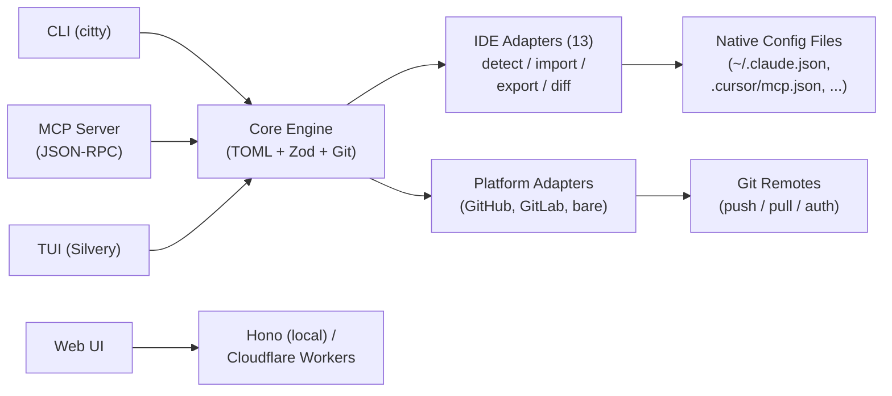

# agent-manager (`am`)

**chezmoi for AI agent configs** -- define your MCP servers, skills, instructions,
and agent profiles once in TOML, sync via git, and generate native configs for
every AI coding tool.

[](LICENSE)
[](#testing)
[](#supported-tools)
[](https://bun.sh)

```bash
am init                    # detect installed tools, import existing configs
am add server tavily \
  --command "bunx tavily-mcp@latest" \
  --tags search,web        # add an MCP server to your catalog
am use work                # switch to your work profile
am apply                   # generate native configs for all detected tools
```

One TOML file. Thirteen tools. Git-synced across every machine.

---

## Why

Every AI coding tool stores configuration differently:

| Data | Claude Code | Cursor | Copilot | Windsurf | Kiro |
|------|-------------|--------|---------|----------|------|
| MCP servers | `~/.claude.json` | `.cursor/mcp.json` | `.vscode/mcp.json` | `~/.windsurf/mcp.json` | `.kiro/mcp.json` |
| Instructions | `CLAUDE.md` | `.cursor/rules/*.mdc` | `.github/instructions/*.md` | `.windsurf/rules/*.md` | `.kiro/steering/*.md` |

The data is the same -- MCP server definitions, instruction files, model settings --
but every tool wants it in a different format, in a different location.

**agent-manager** is the universal translation layer. Define once in TOML, generate
native configs for all tools, sync across machines via git, switch contexts with
profiles, and detect when someone edits an IDE config directly.

---

## Supported Tools

| Tool | Adapter | Capabilities |
|------|---------|-------------|
| Claude Code | `claude-code` | MCP servers, instructions, permissions, models, skills, agents, hooks |
| Codex CLI | `codex-cli` | MCP servers, instructions, agents |
| Cursor | `cursor` | MCP servers, instructions (`.mdc` rules), permissions, models |
| GitHub Copilot | `copilot` | MCP servers, instructions (`.instructions.md`), models |
| Windsurf | `windsurf` | MCP servers, instructions (rules), models |
| ForgeCode | `forgecode` | MCP servers, instructions, permissions |
| Kilo Code | `kilo-code` | MCP servers, instructions, modes, JSONC parsing |
| Kiro | `kiro` | MCP servers, instructions (steering files), specs |
| Gemini CLI | `gemini-cli` | MCP servers, instructions |
| Cline | `cline` | MCP servers, instructions |
| Roo Code | `roo-code` | MCP servers, instructions, modes |
| Amazon Q | `amazon-q` | MCP servers, instructions |
| Continue.dev | `continue` | MCP servers, instructions |

All 13 adapters implement full bidirectional support: detect, import, export, and diff.

---

## Quick Start

### Install

```bash
# macOS / Linux
curl -fsSL https://raw.githubusercontent.com/baladithyab/agent-manager/main/scripts/install.sh | bash
```

### First-Time Setup

```bash
# Detect installed tools and import their configs
am init

# Output:
#   Detected: Claude Code (15 servers), Cursor (8 servers), Kiro (5 servers)
#   Import all? [Y/n] y
#   Merged 22 unique servers (6 duplicates resolved)
#   Created profile "default"
#   Written to ~/.config/agent-manager/config.toml
```

### Daily Usage

```bash
am use work                # switch to work profile
am apply                   # write native configs for all tools
am status                  # check for drift across tools
am add server playwright \
  --command "npx @playwright/mcp@latest" \
  --tags testing,browser   # add a new server (auto-commits)
am push                    # sync to remote
```

### New Machine

```bash
am init                    # setup + pull from remote
am apply                   # instant parity with your other machines
```

---

## Core Concepts

### Servers

MCP server definitions -- the most universal entity across tools. Define once, apply everywhere.

```toml
[servers.tavily]
command = "bunx tavily-mcp@latest"
tags = ["search", "web"]

[servers.tavily.adapters.claude-code]
always_allow = ["tavily_search", "tavily_extract"]
```

### Instructions

Markdown content with semantic activation rules. Core captures intent; each adapter translates to its native format (CLAUDE.md, `.mdc`, `.instructions.md`, steering files, rules).

```toml
[instructions.typescript-conventions]
content = """
Use strict TypeScript with no `any` types.
Prefer `interface` over `type` for object shapes.
"""
scope = "glob"
globs = ["**/*.ts", "**/*.tsx"]
```

### Skills

Reusable agent capabilities with tool-specific triggers.

```toml
[skills.research-rabbithole]
path = "skills/research-rabbithole"
description = "Multi-agent parallel research"
tags = ["research"]
```

### Agent Profiles

Named agent configurations with prompts, models, tools, and MCP server subsets.

```toml
[agents.researcher]
name = "researcher"
description = "Deep research agent"
prompt = "You are a thorough researcher..."
model = "opus"
mcp_servers = ["tavily", "fetch"]
```

### Config Profiles

Profile-based subsets with single inheritance and tag-based server activation.

```toml
[profiles.base]
description = "Always-on utilities"
servers = ["fetch", "context7"]

[profiles.work]
inherits = "base"
servers = ["outlook", "tavily"]
server_tags = ["work"]
instructions = ["typescript-conventions"]
agents = ["researcher"]
```

Switch with `am use work`. The active profile is stored locally (never committed), so each machine can use a different profile from the same config.

### Encryption

AES-256-GCM encryption for secrets in TOML. Encrypted values are stored as `enc:v1:nonce:ciphertext` and decrypted at apply time.

```bash
am secret init             # generate encryption key
am secret set API_KEY      # encrypt and store a secret
am secret get API_KEY      # decrypt and display
```

Key from `AM_ENCRYPTION_KEY` env var or `~/.config/agent-manager/.agent-manager/key.txt` (gitignored).

### Git Sync

Every durable config change is an automatic commit. Git IS the sync protocol.

```bash
am push                    # push config to remote
am pull                    # pull + auto-apply
am undo                    # revert last change (git revert HEAD)
am log                     # config change history
```

---

## Configuration

### Config Hierarchy

```
~/.config/agent-manager/config.toml          # global catalog (git-synced)
~/.config/agent-manager/config.local.toml    # machine-specific (gitignored)
<repo>/.agent-manager.toml                   # project config (version-controlled)
<repo>/.agent-manager.local.toml             # personal project overrides (gitignored)
```

Resolution order (highest wins):

```
CLI flags -> ENV vars -> .agent-manager.local.toml -> .agent-manager.toml
         -> config.local.toml -> config.toml -> Built-in defaults
```

### Full Example

```toml
# ~/.config/agent-manager/config.toml

[settings]
default_profile = "work"

[settings.mcp_serve]
allow_apply = true
allow_push = false

[servers.outlook]
command = "aws-outlook-mcp"
env = { MIDWAY_AUTH = "true" }
tags = ["email", "calendar", "work"]
description = "Outlook email and calendar"

[servers.tavily]
command = "bunx tavily-mcp@latest"
tags = ["search", "web"]

[servers.tavily.adapters.claude-code]
always_allow = ["tavily_search", "tavily_extract"]

[instructions.typescript-conventions]
content = """
Use strict TypeScript with no `any` types.
Prefer `interface` over `type` for object shapes.
"""
scope = "glob"
globs = ["**/*.ts", "**/*.tsx"]

[agents.researcher]
name = "researcher"
description = "Deep research agent"
prompt = "You are a thorough researcher..."
model = "opus"
mcp_servers = ["tavily", "fetch"]

[profiles.base]
description = "Always-on utilities"
servers = ["fetch", "context7"]

[profiles.work]
inherits = "base"
servers = ["outlook", "tavily"]
server_tags = ["work"]
instructions = ["typescript-conventions"]
agents = ["researcher"]
```

---

## CLI Reference

### Config Management

| Command | Description |
|---------|-------------|
| `am init` | First-time setup -- detect tools, import configs, init git repo |
| `am init --project` | Initialize project-level `.agent-manager.toml` in current repo |
| `am add server <name>` | Add an MCP server to global or project catalog |
| `am list servers` | List servers with status, tags, and profile filtering |
| `am use <profile>` | Switch active profile |
| `am apply` | Generate native config files for all detected tools |
| `am apply --dry-run` | Preview what would be written without writing |
| `am apply --target cursor` | Apply to a specific tool only |
| `am status` | Drift detection across all tools + git sync state |
| `am config` | View and edit configuration settings |
| `am profile` | Manage profiles (list, show, create) |

### Git Sync

| Command | Description |
|---------|-------------|
| `am push` | Push config repo to remote |
| `am pull` | Pull from remote + auto-apply |
| `am undo` | Revert last config change (git revert HEAD) |
| `am log` | Config change history with formatted git log |

### Tools and Diagnostics

| Command | Description |
|---------|-------------|
| `am import <adapter>` | Import native config from a specific tool |
| `am adapter list` | Show all adapters with install status and capabilities |
| `am doctor` | Health check -- validate config, check adapters, verify git |
| `am secret set <key>` | Encrypt and store a secret (AES-256-GCM) |
| `am secret get <key>` | Decrypt and display a secret |
| `am secret init` | Generate an encryption key |
| `am version` | Print version information |

### Session Harvest

Cross-tool AI coding session discovery, export, and search.

| Command | Description |
|---------|-------------|
| `am session list` | List sessions across all detected tools |
| `am session export <id>` | Export a session (markdown or JSON) |
| `am session search <query>` | Full-text search across session messages |

Session harvest currently reads conversation data from Claude Code and Codex CLI (the two adapters with SessionReader implementations). Export sessions to review what your agents did, search across tools for past conversations, or archive session data.

### Interfaces

| Command | Description |
|---------|-------------|
| `am mcp-serve` | Run as MCP server (JSON-RPC over stdio) |
| `am tui` | Interactive terminal dashboard (Silvery/React) |
| `am serve` | Local web UI server (Hono on Bun) |

### Global Flags

```
--profile <name>     Override active profile for this invocation
--json               JSON output for scripting and AI agents
--verbose, -v        Increase log verbosity
--quiet, -q          Suppress non-essential output
```

Every command supports `--json` for structured output, making `am` a first-class tool for AI agents and scripts.

---

## MCP Server Mode

`am mcp-serve` turns agent-manager into an MCP server that AI agents can call to manage their own configuration. 14 tools across 3 permission tiers:

| Tier | Tools | Default |
|------|-------|---------|
| Read-only | `am_list_servers`, `am_list_profiles`, `am_status`, `am_config_show`, `am_session_list`, `am_session_export`, `am_session_search` | Always on |
| Write-local | `am_add_server`, `am_remove_server`, `am_use_profile`, `am_import`, `am_apply` | On by default |
| Write-remote | `am_sync_push`, `am_sync_pull` | Opt-in via config |

Add to any tool's MCP config:

```json
{
  "mcpServers": {
    "agent-manager": {
      "command": "am",
      "args": ["mcp-serve"]
    }
  }
}
```

Configure write-remote access in your config:

```toml
[settings.mcp_serve]
allow_apply = true
allow_push = false
```

---

## Drift Detection

`am status` uses structural comparison (not textual diff) to detect when native configs diverge from your TOML source of truth:

```bash
$ am status
  Profile: work
  Sync: up to date with origin/main

  Tool Status:
    Claude Code   in sync
    Cursor        drifted (2 changes)
      + server "playwright-mcp" added locally
      ~ server "tavily" args changed
    Kiro          in sync

  Run `am import cursor` to adopt changes
  Run `am apply --target cursor` to overwrite
```

Drift is surfaced, never silently overwritten. You choose whether to adopt the changes (`am import`) or restore your config (`am apply`).

---

## Web UI

### Local Server

```bash
am serve
# Opens http://localhost:3000 -- dashboard, server list, profile switcher
```

REST API + SSE for real-time updates. Endpoints: `/api/config`, `/api/servers`, `/api/profiles`, `/api/status`, `/api/events`, `/api/apply`.

### Cloudflare Workers

The dashboard deploys to Cloudflare Workers for browser-based management from any device. Fully stateless -- config lives in GitHub (accessed via API), sessions use AES-GCM encrypted cookies. No KV, D1, or R2.

```bash
wrangler secret put GITHUB_CLIENT_ID
wrangler secret put GITHUB_CLIENT_SECRET
wrangler secret put SESSION_SECRET
bun run deploy:web
```

---

## Architecture



**Core engine** -- TOML config store, Zod validation, profile resolver with inheritance, structural diff engine, isomorphic-git operations, AES-256-GCM encryption, shared instruction generation.

**IDE adapters** -- each implements `detect()`, `import()`, `export()`, `diff()`. All 13 are built into the binary with lazy factory instantiation.

**Platform adapters** -- GitHub, GitLab, and bare git handle remote URL detection and auth for push/pull.

**Two-phase validation** (ADR-0007) -- core validates core fields strictly; adapter sections are passthrough at the core level, then each adapter validates its own section with its Zod schema.

Design decisions are documented in [17 ADRs](ADRs/README.md). The full design spec is at [docs/2026-04-07-agent-manager-design-spec.md](docs/2026-04-07-agent-manager-design-spec.md).

---

## Development

```bash
bun install                       # install dependencies
bun test                          # run all 982 tests
bun test --watch                  # watch mode
bun test test/core/schema.test.ts # single file
bun run dev -- <command> [args]   # run CLI from source
bun run lint                      # Biome check
bun run typecheck                 # tsc --noEmit
bun run build                     # macOS arm64 binary -> dist/am-darwin-arm64
bun run build -- --all            # all 5 platform targets
```

### Testing

Tests use `bun:test`. Set `AM_CONFIG_DIR` to a temp directory to isolate from real config.

```bash
bun test                          # 982 tests across 106 files
bun test:unit                     # core + adapter unit tests
bun test:integration              # end-to-end tests
```

### Building

Single binary via `bun build --compile`. Five targets:

| Platform | Target |
|----------|--------|
| macOS ARM64 | `bun-darwin-arm64` |
| macOS Intel | `bun-darwin-x64` |
| Linux x64 | `bun-linux-x64` |
| Linux ARM64 | `bun-linux-arm64` |
| Windows x64 | `bun-windows-x64` |

### Project Stats

| Metric | Count |
|--------|-------|
| Source files | 136 |
| Test files | 106 |
| Tests | 982 |
| Assertions | 2,604 |
| IDE adapters | 13 |
| Platform adapters | 3 |
| CLI commands | 21 |
| MCP tools | 14 |
| ADRs | 17 |

### Tech Stack

| Layer | Choice |
|-------|--------|
| Language | TypeScript (strict, ES2022) |
| Runtime / Bundler | Bun (`bun build --compile` for single binary) |
| CLI framework | citty + @clack/prompts |
| Config | @iarna/toml + Zod |
| Git | isomorphic-git (pure JS, no system git dependency) |
| Web | Hono (local server + Cloudflare Workers) |
| TUI | Silvery + React |
| Encryption | Web Crypto API (AES-256-GCM) |
| Testing | bun:test |
| Linting | Biome |

---

## License

[MIT](LICENSE)
