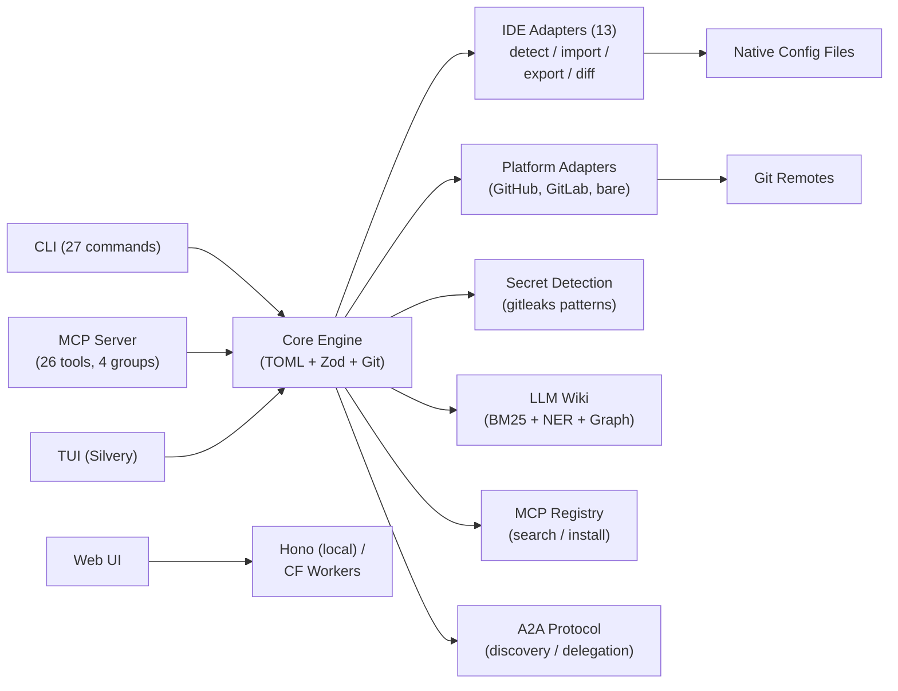

# agent-manager (`am`)

**chezmoi for AI agent configs** -- define your MCP servers, skills, instructions,
and agent profiles once in TOML, sync via git, and generate native configs for
every AI coding tool. Single source of truth with MCP registry integration,
knowledge synthesis, and agent-to-agent protocol support.

[](LICENSE)
[](#testing)
[](#adapter-support-matrix)
[](#mcp-server-mode)
[](#cli-reference)
[](https://bun.sh)

```bash
am init                    # detect installed tools, import existing configs
am add server tavily \
  --command "bunx tavily-mcp@latest" \
  --tags search,web        # add an MCP server (secrets auto-detected)
am use work                # switch to your work profile
am apply                   # generate native configs for all detected tools
```

One TOML file. Thirteen tools. Git-synced across every machine.

---

## Why

Every AI coding tool stores configuration differently:

| Data | Claude Code | Cursor | Copilot | Windsurf | Kiro |
|------|-------------|--------|---------|----------|------|
| MCP servers | `~/.claude.json` | `.cursor/mcp.json` | `.vscode/mcp.json` | `~/.windsurf/mcp.json` | `.kiro/mcp.json` |
| Instructions | `CLAUDE.md` | `.cursor/rules/*.mdc` | `.github/instructions/*.md` | `.windsurf/rules/*.md` | `.kiro/steering/*.md` |

The data is the same -- MCP server definitions, instruction files, model settings --
but every tool wants it in a different format, in a different location.

**agent-manager** is the universal translation layer. Define once in TOML, generate
native configs for all tools, sync across machines via git, switch contexts with
profiles, and detect when someone edits an IDE config directly.

---

## Adapter Support Matrix

| Capability | Claude Code | Codex CLI | Cursor | Copilot | Windsurf | ForgeCode | Kilo Code | Kiro | Gemini CLI | Cline | Roo Code | Amazon Q | Continue |
|:-----------|:-:|:-:|:-:|:-:|:-:|:-:|:-:|:-:|:-:|:-:|:-:|:-:|:-:|
| **MCP Servers** | Y | Y | Y | Y | Y | Y | Y | Y | Y | Y | Y | Y | Y |
| **Instructions** | Y | Y | Y | Y | Y | Y | Y | Y | Y | Y | Y | Y | Y |
| **Agent Profiles** | Y | Y | Y | - | - | Y | Y | Y | - | - | - | - | - |
| **Skills** | Y | - | - | - | - | Y | Y | Y | - | - | - | - | - |
| **Permissions** | Y | Y | - | - | - | - | - | - | - | - | - | - | - |
| **Models** | Y | - | - | - | - | Y | - | - | - | - | - | - | - |
| **Modes** | - | - | - | - | - | - | Y | - | - | - | Y | - | - |
| **Plugins** | Y | - | - | - | - | - | - | - | - | - | - | - | - |
| **Hooks** | Y | - | - | - | - | - | - | - | - | - | - | - | - |
| **Session Harvest** | Y | Y | - | - | - | - | - | - | - | - | - | - | - |
| **Import** | Y | Y | Y | Y | Y | Y | Y | Y | Y | Y | Y | Y | Y |
| **Export** | Y | Y | Y | Y | Y | Y | Y | Y | Y | Y | Y | Y | Y |
| **Drift Detection** | Y | Y | Y | Y | Y | Y | Y | Y | Y | Y | Y | Y | Y |

All 13 adapters implement full bidirectional sync: detect, import, export, and drift detection.

---

## Install

```bash
# Shell script (macOS / Linux) -- checksums verified
curl -fsSL https://raw.githubusercontent.com/baladithyab/agent-manager/main/install.sh | sh

# Homebrew
brew tap baladithyab/am && brew install am

# npm
npm install -g agent-manager

# From source
git clone https://github.com/baladithyab/agent-manager.git
cd agent-manager && bun install && bun run build
```

---

## Quick Start

### First-Time Setup

```bash
am init
#   Detected: Claude Code (15 servers), Cursor (8 servers), Kiro (5 servers)
#   Import all? [Y/n] y
#   Merged 22 unique servers (6 duplicates resolved)
#   3 potential secrets detected -- run `am secret scan` to review
#   Created profile "default"

am secret scan --fix       # auto-encrypt any detected API keys
```

### Daily Usage

```bash
am use work                # switch to work profile
am apply                   # write native configs for all tools
am status                  # check for drift across tools
am add server playwright \
  --command "npx @playwright/mcp@latest" \
  --tags testing,browser   # add a new server (auto-commits)
am push                    # sync to remote
```

### New Machine

```bash
am init                    # setup + pull from remote
am apply                   # instant parity with your other machines
```

### MCP Registry

```bash
am search tavily                        # search the MCP registry
am install tavily-mcp                   # install with env var prompts + encryption
am install tavily-mcp --version 1.2.0   # pin version
am update                               # check for newer versions
am uninstall tavily                     # remove a package
```

---

## Core Concepts

### Servers

MCP server definitions -- the most universal entity across tools. Define once, apply everywhere.

```toml
[servers.tavily]
command = "bunx tavily-mcp@latest"
env = { TAVILY_API_KEY = "${TAVILY_API_KEY}" }   # ${VAR} resolved at apply time
tags = ["search", "web"]

[servers.tavily.adapters.claude-code]
always_allow = ["tavily_search", "tavily_extract"]

[servers.tavily._registry]                        # auto-set by am install
package = "tavily-mcp"
version = "1.2.0"
installed_at = "2026-04-09T10:30:00Z"
```

### Instructions

Markdown content with semantic activation rules. Core captures intent; each adapter translates to its native format (CLAUDE.md, `.mdc`, `.instructions.md`, steering files, rules).

```toml
[instructions.typescript-conventions]
content = """
Use strict TypeScript with no `any` types.
Prefer `interface` over `type` for object shapes.
"""
scope = "glob"
globs = ["**/*.ts", "**/*.tsx"]
```

### Skills

Reusable agent capabilities with tool-specific triggers.

```toml
[skills.research-rabbithole]
path = "skills/research-rabbithole"
description = "Multi-agent parallel research"
tags = ["research"]
```

### Agent Profiles

Named agent configurations with prompts, models, tools, and MCP server subsets.

```toml
[agents.researcher]
name = "researcher"
description = "Deep research agent"
prompt = "You are a thorough researcher..."
model = "opus"
mcp_servers = ["tavily", "fetch"]
```

### Config Profiles

Profile-based subsets with single inheritance and tag-based server activation.

```toml
[profiles.work]
inherits = "base"
servers = ["outlook", "tavily"]
server_tags = ["work"]
instructions = ["typescript-conventions"]
agents = ["researcher"]
```

Switch with `am use work`. The active profile is stored locally (never committed), so each machine can use a different profile from the same config.

### Encryption and Secret Detection

AES-256-GCM encryption for secrets in TOML. Encrypted values are stored as `enc:v1:nonce:ciphertext` and decrypted at apply time.

Dynamic secret detection scans server configs for inline API keys using patterns derived from [gitleaks](https://github.com/gitleaks/gitleaks), extended with AI/LLM provider-specific patterns. Detects keys for 24+ services including OpenAI, Anthropic, AWS, GitHub, Stripe, Tavily, and more.

```bash
am secret init             # generate encryption key
am secret scan             # audit all servers for exposed secrets
am secret scan --fix       # auto-substitute with ${VAR} + encrypt
am secret set API_KEY      # encrypt and store a secret
am secret get API_KEY      # decrypt and display
```

Secrets detected during `am import` and `am add server` are flagged automatically with confidence levels (high/medium/low) and the user is prompted to encrypt them.

### Git Sync

Every durable config change is an automatic commit. Git IS the sync protocol.

```bash
am push                    # push config to remote
am pull                    # pull + auto-apply
am undo                    # revert last change (git revert HEAD)
am log                     # config change history
```

---

## Knowledge Wiki

An LLM-optimized knowledge base following the [Karpathy llm-wiki](https://gist.github.com/karpathy/442a6bf555914893e9891c11519de94f) pattern -- one markdown file per concept/entity/topic with YAML frontmatter, BM25 full-text search via [MiniSearch](https://github.com/lucaong/minisearch), and rule-based NER for automatic cross-linking.

### Dual Location Storage (ADR-0022)

- **Global wiki** (`~/.config/agent-manager/wiki/global/`): cross-project knowledge
- **Project wikis** (`wiki/projects/<name>/`): project-scoped knowledge
- Projects access their wiki via symlink: `.agent-manager/wiki` -> central AM repo
- Everything syncs via the git-backed AM repo (`am push`/`am pull`)
- Browsable via the stateless web UI

### Usage

```bash
am wiki init                    # initialize wiki for current project (symlink + gitignore)
am wiki search "authentication" # BM25 full-text search
am wiki add                     # interactively add a knowledge entry
am wiki show <slug>             # display a wiki page
am wiki harvest                 # extract knowledge from agent sessions
am wiki ingest                  # create wiki pages from sessions
am wiki lint                    # check for orphans, stale pages, broken links
am wiki graph --json            # export knowledge graph for visualization
am wiki synthesize <query>      # generate context block from knowledge base
am wiki briefing <agent-id>     # generate agent briefing document
am wiki export --format json    # full knowledge base export
am wiki import <file>           # import entries from JSON or markdown
```

### Architecture

- **BM25 search** via MiniSearch with fuzzy matching and field boosting
- **Rule-based NER** extracts file paths, package names, config keys, CLI commands, function names, URLs, and 38+ known tool names
- **Knowledge graph** (JSON adjacency list) with wikilink edges and entity mention edges
- **Session harvesting** extracts knowledge from Claude Code and Codex CLI transcripts with Jaccard similarity deduplication

---

## Agent-to-Agent Protocol (A2A)

Support for Google's Agent-to-Agent protocol (ADR-0017). Enables agent discovery and task delegation between agent-manager instances and other A2A-compatible agents.

```bash
am agents add https://agent.example.com   # discover agent via Agent Card
am agents list                            # show registered agents
am agents ping my-agent                   # verify reachable
am agents delegate my-agent "review PR"   # send task, stream response
am agents remove my-agent                 # remove from roster
```

Agent Cards are served at `/.well-known/agent.json` on the local web server. The A2A server handles `tasks/send`, `tasks/get`, and `tasks/cancel` via JSON-RPC.

---

## MCP Server Mode

`am mcp-serve` turns agent-manager into an MCP server that AI agents can call to manage their own configuration. 26 tools across 3 permission tiers, grouped by function:

### Tool Grouping

Control which tools are exposed via `settings.mcp_serve.tools`. Default: `["core"]` (14 tools).

```toml
[settings.mcp_serve]
allow_push = false
tools = ["core", "registry", "a2a", "wiki"]   # expose all 26 tools
```

| Group | Tools | Tier |
|-------|-------|------|
| **core** (14) | `am_list_servers`, `am_list_profiles`, `am_status`, `am_config_show`, `am_session_list`, `am_session_export`, `am_session_search`, `am_add_server`, `am_remove_server`, `am_use_profile`, `am_import`, `am_apply`, `am_sync_push`, `am_sync_pull` | read/write-local/write-remote |
| **registry** (3) | `am_registry_search`, `am_registry_install`, `am_registry_list_installed` | read/write-local |
| **a2a** (4) | `am_agent_discover`, `am_agent_list`, `am_agent_delegate`, `am_agent_task_status` | read/write-remote |
| **wiki** (5) | `am_wiki_search`, `am_wiki_add`, `am_wiki_synthesize`, `am_wiki_briefing`, `am_wiki_harvest` | read/write-local |

Add to any tool's MCP config:

```json
{
  "mcpServers": {
    "agent-manager": {
      "command": "am",
      "args": ["mcp-serve"]
    }
  }
}
```

---

## Drift Detection

`am status` uses structural comparison to detect when native configs diverge from your TOML source of truth:

```
$ am status
  Profile: work
  Sync: up to date with origin/main

  Tool Status:
    Claude Code   in sync
    Cursor        drifted (2 changes)
      + server "playwright-mcp" added locally
      ~ server "tavily" args changed
    Kiro          in sync

  Run `am import cursor` to adopt changes
  Run `am apply --target cursor` to overwrite
```

Drift covers servers and instructions. Drift is surfaced, never silently overwritten.

---

## Configuration

### Config Hierarchy

```
~/.config/agent-manager/config.toml          # global catalog (git-synced)
~/.config/agent-manager/config.local.toml    # machine-specific (gitignored)
<repo>/.agent-manager.toml                   # project config (version-controlled)
<repo>/.agent-manager.local.toml             # personal project overrides (gitignored)
```

Resolution order: project.local > project > global.local > global > built-in defaults.

### Full Example

```toml
# ~/.config/agent-manager/config.toml

[settings]
default_profile = "work"

[settings.mcp_serve]
allow_push = false
tools = ["core", "registry"]

[servers.tavily]
command = "bunx tavily-mcp@latest"
env = { TAVILY_API_KEY = "${TAVILY_API_KEY}" }
tags = ["search", "web"]

[servers.tavily._registry]
source = "mcp-registry"
package = "tavily-mcp"
version = "1.2.0"
installed_at = "2026-04-09T10:30:00Z"

[servers.tavily.adapters.claude-code]
always_allow = ["tavily_search", "tavily_extract"]

[instructions.typescript-conventions]
content = "Use strict TypeScript. No `any` types."
scope = "glob"
globs = ["**/*.ts", "**/*.tsx"]

[agents.researcher]
name = "researcher"
description = "Deep research agent"
prompt = "You are a thorough researcher..."
model = "opus"
mcp_servers = ["tavily", "fetch"]

[profiles.base]
description = "Always-on utilities"
servers = ["fetch", "context7"]

[profiles.work]
inherits = "base"
servers = ["outlook", "tavily"]
server_tags = ["work"]
instructions = ["typescript-conventions"]
agents = ["researcher"]
```

---

## CLI Reference

### Config Management

| Command | Description |
|---------|-------------|
| `am init` | First-time setup -- detect tools, import configs, init git repo |
| `am init --project` | Initialize project-level `.agent-manager.toml` |
| `am add server <name>` | Add an MCP server (secrets auto-detected) |
| `am list servers` | List servers with status, tags, and profile filtering |
| `am use <profile>` | Switch active profile |
| `am apply` | Generate native config files for all detected tools |
| `am status` | Drift detection across all tools + git sync state |
| `am config` | View and edit configuration settings |
| `am profile list\|show\|create\|delete` | Manage profiles |

### Git Sync

| Command | Description |
|---------|-------------|
| `am push` | Push config repo to remote |
| `am pull` | Pull from remote + auto-apply |
| `am undo` | Revert last config change (git revert HEAD) |
| `am log` | Config change history |

### MCP Registry

| Command | Description |
|---------|-------------|
| `am search <query>` | Search MCP registry (`--tag`, `--verified`, `--limit`, `--json`) |
| `am install <package...>` | Install MCP server packages (`--version`, `--dry-run`, `--yes`) |
| `am uninstall <name>` | Remove a server package (`--dry-run`, `--yes`) |
| `am update` | Check for and apply registry updates (`--dry-run`, `--yes`) |

### Knowledge Wiki

| Command | Description |
|---------|-------------|
| `am wiki init` | Initialize wiki for current project (symlink + gitignore) |
| `am wiki search <query>` | BM25 full-text search (`--json`, `--global`) |
| `am wiki add` | Interactive knowledge entry creation |
| `am wiki show <slug>` | Display a wiki page |
| `am wiki delete <slug>` | Remove a wiki page (`--force`) |
| `am wiki harvest` | Extract knowledge from agent sessions |
| `am wiki ingest` | Create wiki pages from sessions |
| `am wiki lint` | Check for orphans, stale pages, broken links |
| `am wiki graph` | Export knowledge graph (`--json`) |
| `am wiki synthesize <query>` | Generate context block |
| `am wiki briefing <agent-id>` | Generate agent briefing |
| `am wiki export` | Export knowledge base (`--format json\|markdown`) |
| `am wiki import <file>` | Import from JSON or markdown |

### Agent-to-Agent

| Command | Description |
|---------|-------------|
| `am agents list` | List all discovered A2A agents |
| `am agents add <url>` | Add agent by fetching its Agent Card |
| `am agents remove <name>` | Remove from roster |
| `am agents ping <name>` | Verify reachable, show capabilities |
| `am agents delegate <name> <task>` | Send task, stream response |

### Tools and Diagnostics

| Command | Description |
|---------|-------------|
| `am import <adapter>` | Import native config (secrets auto-detected) |
| `am adapter list` | Show all adapters with install status |
| `am doctor` | Health check -- config, adapters, git, secret audit |
| `am secret init` | Generate encryption key |
| `am secret set\|get <key>` | Encrypt/decrypt secrets |
| `am secret scan` | Audit servers for exposed secrets (`--fix` to auto-encrypt) |
| `am session list\|export\|search` | Cross-tool session discovery and export |
| `am version` | Print version (`--json`) |

### Interfaces

| Command | Description |
|---------|-------------|
| `am mcp-serve` | Run as MCP server (JSON-RPC over stdio) |
| `am tui` | Interactive terminal dashboard (Silvery/React) |
| `am serve` | Local web UI server with Bearer token auth |

### Global Flags

```
--profile <name>     Override active profile for this invocation
--json               JSON output for scripting and AI agents
--verbose, -v        Increase log verbosity
--quiet, -q          Suppress non-essential output
```

---

## Web UI

### Local Server

```bash
am serve
# Opens http://localhost:3000 with Bearer token auth
# Token stored at ~/.config/agent-manager/web-token.txt
```

REST API + SSE for real-time updates.

### Stateless Web UI (Cloudflare Workers)

A browser-based management dashboard that accesses your git-backed AM repo via the GitHub/GitLab API. Fully stateless -- config and wiki data live in your git backend, sessions use AES-GCM encrypted cookies. No KV, D1, or R2.

Users can browse their config, wiki, and make changes through the web UI rather than the CLI -- both access the same git-backed source of truth.

```bash
wrangler secret put GITHUB_CLIENT_ID
wrangler secret put GITHUB_CLIENT_SECRET
wrangler secret put SESSION_SECRET
bun run deploy:web
```

---

## Architecture



Design decisions documented in [22 ADRs](ADRs/README.md).

---

## Development

```bash
bun install                       # install dependencies
bun test                          # run all 1130 tests
bun test --watch                  # watch mode
bun run dev -- <command> [args]   # run CLI from source
bun run lint                      # Biome check
bun run typecheck                 # tsc --noEmit
bun run build                     # macOS arm64 binary -> dist/am-darwin-arm64
bun run build -- --all            # all 5 platform targets
```

### Project Stats

| Metric | Count |
|--------|-------|
| Source files | ~160 |
| Test files | 117 |
| Tests | 1,130 |
| Assertions | 2,954 |
| IDE adapters | 13 |
| Platform adapters | 3 |
| CLI commands | 27 |
| MCP tools | 26 |
| ADRs | 22 |

### Tech Stack

| Layer | Choice |
|-------|--------|
| Language | TypeScript (strict mode, zero `as any`) |
| Runtime / Bundler | Bun (`bun build --compile` for single binary) |
| CLI framework | citty + @clack/prompts |
| Config | @iarna/toml + Zod |
| Git | isomorphic-git (pure JS, no system git) |
| Web | Hono (local server + Cloudflare Workers) |
| TUI | Silvery + React |
| Encryption | Web Crypto API (AES-256-GCM) |
| Search | MiniSearch (BM25 for wiki) |
| Secret detection | gitleaks-derived patterns (24+ services) |
| Testing | bun:test |
| Linting | Biome |

---

## License

[MIT](LICENSE)
