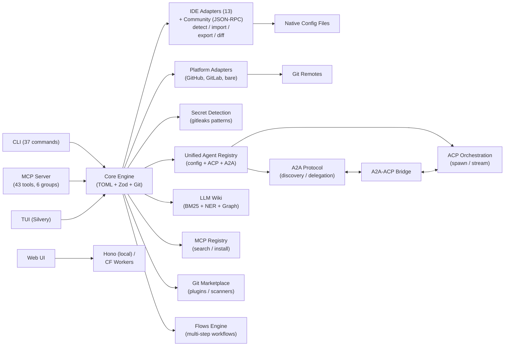

# agent-manager (`am`)

**The control plane for your AI agents.** Define your catalog once (TOML,
git-backed). Route any agent through a unified MCP gateway. Delegate locally
via ACP or remotely via A2A. Install MCP servers from the registry and vendor
skills/instructions/agents via git. Remember sessions in an LLM-wiki. Edit from
terminal, local web, or cloud.

[](LICENSE)
[](#development)
[](https://github.com/Codeseys-Labs/agent-manager/actions/workflows/ci.yml)
[](#adapter-support-matrix)
[](#mcp-server-mode)
[](https://bun.sh)

```bash
am setup                   # guided first run: detect tools, import existing configs,
                           # key + profile, apply, ending on a green health check
am add server tavily \
  --command "bunx tavily-mcp@latest" \
  --tags search,web        # add an MCP server (secrets auto-detected)
am use work                # switch to your work profile
am apply                   # generate native configs for all detected tools
```

One catalog. Thirteen tools. Git-synced across every machine. Agent-aware.

---

## The six pillars

agent-manager is not "chezmoi for configs" — it outgrew that framing. It is
a control plane for AI agents, built on six composing pillars:

1. **Catalog + git sync.** Entity types (servers, instructions, skills, agents,
   profiles) defined once in TOML. User's choice of git backend. Load-bearing
   sub-features worth naming: **brownfield import** (`am import` reads native
   IDE configs with intelligent merge), **drift detection** (`am status` catches
   when any of the 13 tools diverged from your catalog), **secret hygiene**
   (AES-256-GCM at rest + 40+ provider-pattern detection on import), and the **MCP
   Package Registry** (`am search/install/update/uninstall` browses the
   upstream package index).
2. **MCP gateway.** `am mcp-serve` exposes the catalog as a stable MCP
   endpoint. 43 tools (38 canonical + 5 deprecated aliases that still dispatch),
   concurrency-safe writers, bearer auth, progress notifications for streaming
   agent invocations.
3. **Protocol router.** ACP for local subprocess agents (spawnable tier-1:
   Claude Code, Codex, Gemini, Kiro; Cursor and Copilot are catalog-only —
   config is written but they are not spawned). A2A for remote. Bridge routes
   remote delegations into local ACP. **Agent auto-detection** now shows which
   agents are actually installed. Unified `am agent list` + `am_agent_invoke`.
4. **Marketplace (deferred to v2) + git-vendored bundles.** The marketplace
   (pillar 4) is **deferred to v2** — it pairs with the hosted web platform and
   is kept out of the v1 CLI's advertised surface, but it is **not** deleted:
   `src/marketplace/*` still ships. This product decision supersedes the
   ADR-0039 retire / ADR-0052 deletion target — do NOT execute that deletion.
   For v1, use the MCP Package Registry (`am search`/`am install`) for servers
   and git subtree/submodule vendoring for skills, instructions, and
   agent-profile bundles.
5. **LLM-wiki.** Karpathy-style session context. **Session harvest**
   (`am session` + `am wiki ingest`) is the cross-tool read pipeline that
   feeds the wiki — without it, this pillar is an empty shelf. Globally
   git-backed; locally mirrored per project. Browse via `am wiki`.
6. **Three UIs over one core.** TUI (`am tui`), local web (`am serve`),
   Cloudflare web (multi-device, auth-gated). All three route through
   `core/controller.ts` — no parallel implementations, no feature drift.

See [ADR-0031](ADRs/0031-product-scope-and-pillars.md) for the formal
statement of scope and explicit non-goals.

---

## Why

Every AI coding tool stores configuration differently:

| Data | Claude Code | Cursor | Copilot | Windsurf | Kiro |
|------|-------------|--------|---------|----------|------|
| MCP servers | `~/.claude.json` | `.cursor/mcp.json` | `.vscode/mcp.json` | `~/.windsurf/mcp.json` | `.kiro/mcp.json` |
| Instructions | `CLAUDE.md` | `.cursor/rules/*.mdc` | `.github/instructions/*.md` | `.windsurf/rules/*.md` | `.kiro/steering/*.md` |

The data is the same -- MCP server definitions, instruction files, model settings --
but every tool wants it in a different format, in a different location.

**agent-manager** is the universal translation layer. Define once in TOML, generate
native configs for all tools, sync across machines via git, switch contexts with
profiles, and detect when someone edits an IDE config directly.

---

## Adapter Support Matrix

| Capability | Claude Code | Codex CLI | Cursor | Copilot | Windsurf | ForgeCode | Kilo Code | Kiro | Gemini CLI | Cline | Roo Code | Amazon Q | Continue |
|:-----------|:-:|:-:|:-:|:-:|:-:|:-:|:-:|:-:|:-:|:-:|:-:|:-:|:-:|
| **MCP Servers** | Y | Y | Y | Y | Y | Y | Y | Y | Y | Y | Y | Y | Y |
| **Instructions** | Y | Y | Y | Y | Y | Y | Y | Y | Y | Y | Y | Y | Y |
| **Agent Profiles** | Y | Y | Y | - | - | Y | Y | Y | - | - | - | - | - |
| **Skills** | Y | - | - | - | - | Y | Y | Y | - | - | - | - | - |
| **Permissions** | Y | Y | - | - | - | - | - | - | - | - | - | - | - |
| **Models** | Y | - | - | - | - | Y | - | - | - | - | - | - | - |
| **Modes** | - | - | - | - | - | - | Y | - | - | - | Y | - | - |
| **Plugins** | Y | - | - | - | - | - | - | - | - | - | - | - | - |
| **Hooks** | Y | - | - | - | - | - | - | - | - | - | - | - | - |
| **Session Harvest** | Y | Y | - | - | - | - | - | - | - | - | - | - | - |
| **Import** | Y | Y | Y | Y | Y | Y | Y | Y | Y | Y | Y | Y | Y |
| **Export** | Y | Y | Y | Y | Y | Y | Y | Y | Y | Y | Y | Y | Y |
| **Drift Detection** | Y | Y | Y | Y | Y | Y | Y | Y | Y | Y | Y | Y | Y |

All 13 adapters implement full bidirectional sync: detect, import, export, and drift detection.

---

## Install

```bash
# Shell script (macOS / Linux) -- checksum-verified, downloads the latest release binary
curl -fsSL https://raw.githubusercontent.com/Codeseys-Labs/agent-manager/main/install.sh | sh

# From source (requires Bun)
git clone https://github.com/Codeseys-Labs/agent-manager.git
cd agent-manager && bun install && bun run build
# compiled binary -> dist/am-<platform>; add it to your PATH
```

> **Homebrew and npm are coming at v1.0.** They are intentionally not published
> yet — the unscoped npm name `agent-manager` is owned by an unrelated package,
> and the Homebrew tap is not yet live. Until then use the `curl | sh` installer
> (checksum-verified against GitHub Releases) or build from source.

---

## Quick Start

### First-Time Setup

```bash
am setup                   # guided wizard: detect tools → import their existing
                           # configs into your catalog → set up an encryption key →
                           # create a profile → apply → ends on a green `am doctor`
                           # health check
```

`am setup` is idempotent (safe to re-run — it resumes/repairs rather than
clobbering) and fully scriptable: `--yes`/`--json`/`--non-interactive` for CI,
`--from <git-url>` to clone an existing catalog onto a new machine, `--no-import`
to skip pulling native configs into the catalog, `--no-apply` to stop short of
writing native configs. The brownfield import runs the same `am import auto`
engine (ADR-0028): in an interactive run it asks first; non-interactively it
imports by default (opt out with `--no-import`), and is skipped after a `--from`
clone (the cloned catalog is authoritative). The individual steps remain
available standalone (`am init`, `am import auto`, `am secret scan --fix`,
`am apply`).

### Daily Usage

```bash
am use work                # switch to work profile
am apply                   # write native configs for all tools
am status                  # check for drift across tools
am add server playwright \
  --command "npx @playwright/mcp@latest" \
  --tags testing,browser   # add a new server (auto-commits)
am push                    # sync to remote
```

### New Machine

```bash
# One command clones your existing catalog into the config dir and applies it:
am setup --from <your-config-remote>   # full git URL, or a user/repo shorthand
am setup --from alice/dotfiles --ssh   # shorthand → git@github.com:alice/dotfiles.git
```

`--from` accepts a full git URL, an scp-style `git@host:org/repo`, a local path,
or a chezmoi-style `user/repo` (default host `github.com`) / `host/user/repo`
shorthand; `--ssh` selects the SSH remote form. The clone lands in
`~/.config/agent-manager` (or `$AM_CONFIG_DIR`), then `am setup` runs the rest of
the wizard (profile → apply → health check) for instant parity with your other
machines. The manual equivalent still works if you prefer it:

```bash
git clone <your-config-remote> ~/.config/agent-manager
am apply
```

### MCP Registry

```bash
am search tavily                        # search the MCP registry
am install tavily-mcp                   # install with env var prompts + encryption
am install tavily-mcp --version 1.2.0   # pin version
am update                               # check for newer versions
am uninstall tavily                     # remove a package
```

### Bundles from git

The marketplace (pillar 4) is **deferred to v2**, where it pairs with the hosted
web platform — its surface is kept out of the v1 CLI, but the code still ships
(this supersedes the ADR-0039 retire / ADR-0052 deletion target; the deletion
will NOT happen). For v1, use the MCP Registry commands above for MCP servers.
For skills, instructions, and agent profiles, vendor a trusted git repository
into your config repo with `git subtree add` or `git submodule add`, then run
`am import`/`am apply` as appropriate.

### LLM-Wiki (pillar 5)

Session context capture that agents using am can read. Globally git-backed;
locally mirrored per project so the current directory has context of what
was done. Inspired by Karpathy's LLM-Wiki pattern.

```bash
am wiki list                            # recent entries
am wiki show <slug>                     # print one entry
am wiki search "auth middleware"        # grep + semantic search
am wiki sync                            # push/pull the global wiki via git
am wiki path                            # print local wiki dir — cd "$(am wiki path)"
```

Entries flow in automatically from `am session` (transcript harvest) and can
be authored manually via `am wiki add`. See [`docs/wiki/`](docs/) for the
full authoring reference.

### Brownfield Import

Import configs from existing tool installations with intelligent merge and
conflict resolution:

```bash
am import claude-code                           # interactive import (default)
am import claude-code --auto                    # auto-resolve conflicts
am import claude-code --report                  # show conflict report only
am import claude-code --marketplace             # include tool-native plugins/extensions
```

**Direction matters.** `am import` merges tool-side config INTO your catalog
(intelligent merge, conflict prompts). `am apply` pushes the catalog OUT to
every tool — the catalog is the source of truth, and any `mcpServers` entry
that exists in a tool's native config but not in your catalog is **replaced
on apply**. If you added a server by hand in Claude Code or Cursor and want
to keep it, run `am import <tool>` first to bring it into the catalog. A
`--merge` mode that preserves unmanaged keys is planned for 0.6.

---

## Core Concepts

### Servers

MCP server definitions -- the most universal entity across tools. Define once, apply everywhere.

```toml
[servers.tavily]
command = "bunx tavily-mcp@latest"
env = { TAVILY_API_KEY = "${TAVILY_API_KEY}" }   # ${VAR} resolved at apply time
tags = ["search", "web"]

[servers.tavily.adapters.claude-code]
always_allow = ["tavily_search", "tavily_extract"]

[servers.tavily._registry]                        # auto-set by am install
package = "tavily-mcp"
version = "1.2.0"
installed_at = "2026-04-09T10:30:00Z"
```

### Instructions

Markdown content with semantic activation rules. Core captures intent; each adapter translates to its native format (CLAUDE.md, `.mdc`, `.instructions.md`, steering files, rules).

```toml
[instructions.typescript-conventions]
content = """
Use strict TypeScript with no `any` types.
Prefer `interface` over `type` for object shapes.
"""
scope = "glob"
globs = ["**/*.ts", "**/*.tsx"]
```

### Skills

Reusable agent capabilities with tool-specific triggers.

```toml
[skills.research-rabbithole]
path = "skills/research-rabbithole"
description = "Multi-agent parallel research"
tags = ["research"]
```

### Agent Profiles

Named agent configurations with prompts, models, tools, and MCP server subsets.

```toml
[agents.researcher]
name = "researcher"
description = "Deep research agent"
prompt = "You are a thorough researcher..."
model = "opus"
mcp_servers = ["tavily", "fetch"]
```

### Config Profiles

Profile-based subsets with single inheritance and tag-based server activation.

```toml
[profiles.work]
inherits = "base"
servers = ["outlook", "tavily"]
server_tags = ["work"]
instructions = ["typescript-conventions"]
agents = ["researcher"]
```

Switch with `am use work`. The active profile is stored locally (never committed), so each machine can use a different profile from the same config.

### Encryption and Secret Detection

AES-256-GCM encryption for secrets in TOML. Encrypted values are stored as `enc:v1:nonce:ciphertext` and decrypted at apply time.

Dynamic secret detection scans server configs for inline API keys using patterns derived from [gitleaks](https://github.com/gitleaks/gitleaks), extended with AI/LLM provider-specific patterns. Detects keys across 40+ provider patterns (60 key-name regexes) including OpenAI, Anthropic, AWS, GitHub, Stripe, Tavily, and more.

```bash
am secret init             # generate encryption key
am secret scan             # audit all servers for exposed secrets
am secret scan --fix       # auto-substitute with ${VAR} + encrypt
am secret set API_KEY      # encrypt and store a secret
am secret get API_KEY      # decrypt and display
```

Secrets detected during `am import` and `am add server` are flagged automatically with confidence levels (high/medium/low) and the user is prompted to encrypt them.

### Git Sync

Every durable config change is an automatic commit. Git IS the sync protocol.

```bash
am push                    # push config to remote
am pull                    # pull + auto-apply
am undo                    # revert last change (git revert HEAD)
am log                     # config change history
```

---

## Knowledge Wiki

An LLM-optimized knowledge base following the [Karpathy llm-wiki](https://gist.github.com/karpathy/442a6bf555914893e9891c11519de94f) pattern -- one markdown file per concept/entity/topic with YAML frontmatter, BM25 full-text search via [MiniSearch](https://github.com/lucaong/minisearch), and rule-based NER for automatic cross-linking.

### Dual Location Storage (ADR-0022)

- **Global wiki** (`~/.config/agent-manager/wiki/global/`): cross-project knowledge
- **Project wikis** (`wiki/projects/<name>/`): project-scoped knowledge
- Projects access their wiki via symlink: `.agent-manager/wiki` -> central AM repo
- Everything syncs via the git-backed AM repo (`am push`/`am pull`)
- Browsable via the stateless web UI

### Usage

```bash
am wiki init                    # initialize wiki for current project (symlink + gitignore)
am wiki search "authentication" # BM25 full-text search
am wiki add                     # interactively add a knowledge entry
am wiki show <slug>             # display a wiki page
am wiki harvest                 # extract knowledge from agent sessions
am wiki ingest                  # create wiki pages from sessions
am wiki lint                    # check for orphans, stale pages, broken links
am wiki graph --json            # export knowledge graph for visualization
am wiki synthesize <query>      # generate context block from knowledge base
am wiki briefing <agent-id>     # generate agent briefing document
am wiki export --format json    # full knowledge base export
am wiki import <file>           # import entries from JSON or markdown
```

### Architecture

- **BM25 search** via MiniSearch with fuzzy matching and field boosting
- **Rule-based NER** extracts file paths, package names, config keys, CLI commands, function names, URLs, and 38+ known tool names
- **Knowledge graph** (JSON adjacency list) with wikilink edges and entity mention edges
- **Session harvesting** extracts knowledge from Claude Code and Codex CLI transcripts with Jaccard similarity deduplication

---

## A2A-ACP Bridge

The bridge connects remote A2A delegation to local ACP agent execution (ADR-0026 Phase 4, ADR-0030). When an external agent sends an A2A task, agent-manager resolves the target locally, spawns it via ACP, and returns the result as an A2A response.

```bash
# Remote agent sends: "run claude: fix the failing tests"
# Bridge resolves "claude" → ACP spawn → executes → returns A2A response
```

The **Unified Agent Registry** (`src/core/agent-registry.ts`) merges three sources with priority: config agents > ACP built-in (tiered — see ADR-0033) > A2A roster. Same agent name available both locally and remotely gets both protocols.

---

## Agent-to-Agent Protocol (A2A)

Support for Google's Agent-to-Agent protocol (ADR-0017). Enables agent discovery and task delegation between agent-manager instances and other A2A-compatible agents.

```bash
am agents add https://agent.example.com   # discover agent via Agent Card
am agents list                            # show registered agents
am agents ping my-agent                   # verify reachable
am agents delegate my-agent "review PR"   # send task, stream response
am agents remove my-agent                 # remove from roster
```

Agent Cards are served at `/.well-known/agent.json` on the local web server. The A2A server handles `tasks/send`, `tasks/get`, and `tasks/cancel` via JSON-RPC.

**Security & reliability features:**
- **Bearer token auth:** Optional `auth_token` protects A2A server endpoints
- **TTL eviction:** Terminal tasks auto-expire after 1 hour, two-phase eviction (TTL then capacity-based LRU)
- **SSE streaming:** Real-time event streaming for task progress and agent updates
- **Auto-discovery:** Configure `settings.a2a.discovery_sources` URLs for automatic agent roster population
- **Async polling:** `sendAndPoll()` convenience method for fire-and-wait task delegation

---

## ACP Agent Orchestration

Drive ACP-compatible coding agents headlessly through a unified interface (ADR-0026).

```bash
am run claude "fix the failing tests"          # one-shot: spawn, prompt, wait, exit
am run codex "add error handling to api.ts"    # different agent, same interface
am run --session backend claude "continue"     # named session (resume previous work)
am run --cwd /path/to/project claude "refactor" # override working directory
am run session list                            # list active ACP sessions
am run session cancel <sessionId>              # cancel active session
```

Agents are resolved via the **Unified Agent Registry** (ADR-0030): config
overrides > built-in ACP agents > A2A roster entries. Register custom agents
in config.toml under `[agents.<name>]` with `acp` and/or `a2a` subtables.

### Agent tiers (ADR-0033)

Not every agent in the catalog is runnable through `am run`. `am apply` writes
config for all three tiers, but only Tier 1 and opted-in Tier 2 shims can be
spawned as ACP subprocesses. See
[ADR-0033](ADRs/0033-acp-agent-tiers-and-shim-wrapper.md) for the full model.

| Tier | Example | Runnable via | Security posture |
|------|---------|--------------|------------------|
| **1 — Native** | `claude`, `codex`, `gemini`, `kiro` | `am run <name>` | ACP permission model + am admission layer. The agent asks via ACP before writing files; am approves / denies per the configured permission policy. |
| **2 — Shim** | `aider` (opt-in), `amazon-q`, `cody` | `am run <name>` after `am agent enable-shim <name>` | **Inherits the wrapped CLI's trust posture.** Read the shim's `--help` warning before enabling — see caveat below. |
| **3 — Catalog-only** | `cline`, `continue`, `windsurf`, `cursor`, `kilo-code`, `copilot`, `roo-code` | *not runnable* — `am apply` writes config; use from the native UI | n/a |

**Tier-2 security caveat.** Tier 2 shim wrappers **do not interpose on
file-write permissions**. If the wrapped CLI's flags auto-approve file
writes (e.g. `aider --yes`), every file mutation the agent requests
proceeds without am's approval UI. The shim is a transport bridge, not a
sandbox. Use Tier 2 only with agents whose auto-approve mode you trust in
your environment. `am agent enable-shim <name>` is explicit opt-in
precisely so this trade-off is a deliberate choice.

**Listing by tier.**

```bash
am agent list --tier native       # tier-1 only — runnable out of the box
am agent list --tier shim         # tier-2 — needs am agent enable-shim
am agent list --tier catalog      # tier-3 — config-only, not spawnable
am-acp-shell <wrapped-agent>      # low-level: invoke the shell-wrapper directly
```

Config overrides at `[agents.<name>.acp]` are always honoured verbatim —
they bypass the tier logic. The local-binary preference ([acpx][acpx]-style
npx short-circuit for `claude`-`claude-agent-acp` and `codex`-`codex-acp`)
is applied to built-in tier-1 defaults only; user-supplied commands are
never second-guessed.

[acpx]: docs/references/openclaw-acpx.md

---

## Agent Variants

One agent name, many backends. The same `claude` you run today may
actually need to reach Anthropic's direct API at your desk, AWS Bedrock
on a work laptop, Vertex on a partner project, or OpenRouter on a
personal machine. Variants ([ADR-0036](ADRs/0036-agent-variants.md))
let you declare those backends side-by-side under one agent entry and
pick between them at spawn time, instead of forking the agent or
juggling shell aliases.

```toml
[agents.claude]
default_variant = "anthropic"

[agents.claude.variants.anthropic]
protocol = "acp"
command  = "npx -y @agentclientprotocol/claude-agent-acp@latest"
env      = { ANTHROPIC_API_KEY = "${ANTHROPIC_API_KEY}" }

[agents.claude.variants.bedrock]
protocol = "acp"
command  = "npx -y @agentclientprotocol/claude-agent-acp@latest"
env      = {
  CLAUDE_CODE_USE_BEDROCK = "1",
  AWS_PROFILE             = "work",
  AWS_REGION              = "us-east-1",
}
# Live-enforced as of DWL-T13: variant.permission_policy now wires
# directly into the ACP permission layer at spawn, not just dry-run.
permission_policy = "auto-approve"
```

The `${ANTHROPIC_API_KEY}` reference flows through the existing envelope
encryption layer (ADR-0012) — secrets stay encrypted at rest and are
decrypted only when the variant is selected.

```bash
am run claude --variant bedrock "fix the failing tests"
```

**Resolution order** (highest priority wins):

1. Explicit `--variant <name>` on the CLI.
2. Project config `default_variant` in `.agent-manager.toml`.
3. Global config `default_variant` under `[agents.<name>]`.
4. If exactly one variant is declared, it is the implicit default.
5. Otherwise: error — `set default_variant or pass --variant`.

**Permission-policy precedence.** A variant-declared `permission_policy`
wins when present; otherwise `--no-auto-approve` maps to `"deny"`, and
the absence of both leaves the spawn at `"auto-approve"`.

---

## Flows Engine

Multi-step workflow orchestration for ACP agents. Define workflows as typed node
graphs (acp, action, compute, checkpoint) with conditional routing, then run them
from the CLI. Flow state is persisted for crash recovery and status inspection.

```bash
am flow run deploy-pipeline              # execute a flow
am flow list                             # list recent runs
am flow status <run-id>                  # inspect a run
```

See ADR-0026 Phase 3 for the design.

---

## Community Adapters

Extend agent-manager with third-party adapters loaded as JSON-RPC subprocesses.
Install from npm or git, and they integrate seamlessly alongside the 13 built-in
adapters.

```bash
am adapter list                          # show all adapters (built-in + community)
am adapter install <name>                # install from npm/git
am adapter remove <name>                 # uninstall
am adapter update                        # update all community adapters
am adapter verify <name>                 # health-check
```

See ADR-0027 for the loading architecture.

---

## MCP Server Mode

`am mcp-serve` turns agent-manager into an MCP server that AI agents can call to manage their own configuration. 43 tools (38 canonical + 5 deprecated aliases) across 3 permission tiers, grouped by function:

### Tool Grouping

Control which tools are exposed via `settings.mcp_serve.tools`. Default: `["core"]` (18 tools).

```toml
[settings.mcp_serve]
allow_push = false
tools = ["core", "registry", "a2a", "wiki", "session", "acp"]   # expose all 43 tools (38 canonical + 5 deprecated aliases)
```

| Group | Tools | Tier |
|-------|-------|------|
| **core** (18) | `am_list_servers`, `am_list_profiles`, `am_list_skills`, `am_list_instructions`, `am_status`, `am_config_show`, `am_doctor`, `am_add_server`, `am_remove_server`, `am_server_update`, `am_profile_create`, `am_profile_delete`, `am_undo`, `am_use_profile`, `am_import`, `am_apply`, `am_sync_push`, `am_sync_pull` | read/write-local/write-remote |
| **registry** (4) | `am_registry_search`, `am_registry_install`, `am_registry_list_installed`, `am_registry_uninstall` | read/write-local |
| **a2a** (4) | `am_agent_discover`, `am_agent_list`, `am_agent_delegate`, `am_agent_task_status` | read/write-remote |
| **wiki** (5) | `am_wiki_search`, `am_wiki_add`, `am_wiki_synthesize`, `am_wiki_briefing`, `am_wiki_harvest` | read/write-local |
| **session** (3) | `am_session_list`, `am_session_export`, `am_session_search` | read-only |
| **acp** (9) | **Canonical:** `am_agent_invoke`, `am_agent_session_list`, `am_agent_session_cancel`, `am_agent_status`, `am_agent_detect`. **Deprecated aliases** (still dispatch; removal v1.0): `am_run_agent`→`am_agent_invoke`, `am_acp_list_agents`→`am_agent_list`, `am_acp_session_list`→`am_agent_session_list`, `am_acp_session_cancel`→`am_agent_session_cancel` | write-local |

> **Tool count: 43** = 38 canonical + 5 deprecated aliases (the `am_run_agent`,
> `am_acp_list_agents`, `am_acp_session_list`, `am_acp_session_cancel`, and
> `am_agent_delegate` aliases still dispatch to their `am_agent_*` replacements
> and are slated for removal in v1.0). Prefer the canonical `am_agent_*` tools.

Add to any tool's MCP config:

```json
{
  "mcpServers": {
    "agent-manager": {
      "command": "am",
      "args": ["mcp-serve"]
    }
  }
}
```

---

## Drift Detection

`am status` uses structural comparison to detect when native configs diverge from your TOML source of truth:

```
$ am status
  Profile: work
  Sync: up to date with origin/main

  Tool Status:
    Claude Code   in sync
    Cursor        drifted (2 changes)
      + server "playwright-mcp" added locally
      ~ server "tavily" args changed
    Kiro          in sync

  Run `am import cursor` to adopt changes
  Run `am apply --target cursor` to overwrite
```

Drift covers servers and instructions. Drift is surfaced, never silently overwritten.

---

## Configuration

### Config Hierarchy

```
~/.config/agent-manager/config.toml          # global catalog (git-synced)
~/.config/agent-manager/config.local.toml    # machine-specific (gitignored)
<repo>/.agent-manager.toml                   # project config (version-controlled)
<repo>/.agent-manager.local.toml             # personal project overrides (gitignored)
```

Resolution order: project.local > project > global.local > global > built-in defaults.

### Full Example

```toml
# ~/.config/agent-manager/config.toml

[settings]
default_profile = "work"

[settings.mcp_serve]
allow_push = false
tools = ["core", "registry"]

[servers.tavily]
command = "bunx tavily-mcp@latest"
env = { TAVILY_API_KEY = "${TAVILY_API_KEY}" }
tags = ["search", "web"]

[servers.tavily._registry]
source = "mcp-registry"
package = "tavily-mcp"
version = "1.2.0"
installed_at = "2026-04-09T10:30:00Z"

[servers.tavily.adapters.claude-code]
always_allow = ["tavily_search", "tavily_extract"]

[instructions.typescript-conventions]
content = "Use strict TypeScript. No `any` types."
scope = "glob"
globs = ["**/*.ts", "**/*.tsx"]

[agents.researcher]
name = "researcher"
description = "Deep research agent"
prompt = "You are a thorough researcher..."
model = "opus"
mcp_servers = ["tavily", "fetch"]

[profiles.base]
description = "Always-on utilities"
servers = ["fetch", "context7"]

[profiles.work]
inherits = "base"
servers = ["outlook", "tavily"]
server_tags = ["work"]
instructions = ["typescript-conventions"]
agents = ["researcher"]
```

---

## CLI Reference

### Config Management

| Command | Description |
|---------|-------------|
| `am setup` | Guided first run -- detect tools, import existing configs, set up an encryption key, create a profile, apply, end on a green `am doctor` (resumable, scriptable via `--yes`/`--json`/`--from`) |
| `am init` | Granular sub-step of `am setup`: detect tools + init git repo only (run `am import auto` to import existing configs) |
| `am init --project` | Initialize project-level `.agent-manager.toml` |
| `am add server <name>` | Add an MCP server (secrets auto-detected) |
| `am list servers` | List servers with status, tags, and profile filtering |
| `am use <profile>` | Switch active profile |
| `am apply` | Generate native config files for all detected tools |
| `am status` | Drift detection across all tools + git sync state |
| `am config` | View and edit configuration settings |
| `am profile list\|show\|create\|delete` | Manage profiles |

### Git Sync

| Command | Description |
|---------|-------------|
| `am push` | Push config repo to remote |
| `am pull` | Pull from remote + auto-apply |
| `am undo` | Revert last config change (git revert HEAD) |
| `am log` | Config change history |

### MCP Registry

| Command | Description |
|---------|-------------|
| `am search <query>` | Search MCP registry (`--tag`, `--verified`, `--limit`, `--json`) |
| `am install <package...>` | Install MCP server packages (`--version`, `--dry-run`, `--yes`) |
| `am uninstall <name>` | Remove a server package (`--dry-run`, `--yes`) |
| `am update` | Check for and apply registry updates (`--dry-run`, `--yes`) |

### Knowledge Wiki

| Command | Description |
|---------|-------------|
| `am wiki init` | Initialize wiki for current project (symlink + gitignore) |
| `am wiki search <query>` | BM25 full-text search (`--json`, `--global`) |
| `am wiki add` | Interactive knowledge entry creation |
| `am wiki show <slug>` | Display a wiki page |
| `am wiki delete <slug>` | Remove a wiki page (`--force`) |
| `am wiki harvest` | Extract knowledge from agent sessions |
| `am wiki ingest` | Create wiki pages from sessions |
| `am wiki lint` | Check for orphans, stale pages, broken links |
| `am wiki graph` | Export knowledge graph (`--json`) |
| `am wiki synthesize <query>` | Generate context block |
| `am wiki briefing <agent-id>` | Generate agent briefing |
| `am wiki export` | Export knowledge base (`--format json\|markdown`) |
| `am wiki import <file>` | Import from JSON or markdown |

### Agent-to-Agent

| Command | Description |
|---------|-------------|
| `am agents list` | List all discovered A2A agents |
| `am agents add <url>` | Add agent by fetching its Agent Card |
| `am agents remove <name>` | Remove from roster |
| `am agents ping <name>` | Verify reachable, show capabilities |
| `am agents delegate <name> <task>` | Send task, stream response |

### ACP Agent Orchestration

| Command | Description |
|---------|-------------|
| `am run <agent> "<prompt>"` | Drive an ACP-compatible agent headlessly |
| `am run --session <name> <agent> "<prompt>"` | Named session (resume previous work) |
| `am run --cwd <path> <agent> "<prompt>"` | Override working directory |
| `am run session list` | List active ACP sessions |
| `am run session cancel <id>` | Cancel an active session |

**Env passthrough.** `am run` scrubs the parent process env before spawning ACP
agents (ADR-0033 Phase B security gate). The allow-list covers `PATH`, `HOME`,
`TERM`, `LANG`, etc. — secret-shaped names (`*_TOKEN`, `*_KEY`, `*_PASSWORD`,
`AWS_*`, `OPENAI_*`, `ANTHROPIC_*`, etc.) are always denied.

If a Tier-1 Node-based agent you're running genuinely needs `NODE_OPTIONS` (e.g.
`--max-old-space-size=4096` for large transcripts), pass it explicitly instead
of relying on inheritance:

```bash
am run --env NODE_OPTIONS="--max-old-space-size=4096" <agent> "<prompt>"
```

REV-4 MED-2 removed `NODE_OPTIONS` from the inherited allow-list because a
parent-process `NODE_OPTIONS=--require /tmp/evil.js` would load arbitrary code
inside the agent subprocess. Explicit forwarding preserves the legitimate use
case without the injection surface.

### Flows

| Command | Description |
|---------|-------------|
| `am flow run <file>` | Execute a multi-step workflow from a TOML definition |
| `am flow list` | List recent flow runs |
| `am flow status <id>` | Show status of a flow run |

### Marketplace (deferred to v2)

The marketplace (pillar 4) is **deferred to v2**: its commands are kept out of
the v1 advertised surface and currently print a notice, but the surface is
**not** being removed — it returns with the hosted web platform in v2. This
supersedes the ADR-0039 retire / ADR-0052 deletion target. For v1, prefer the
MCP Registry commands and git-vendored bundles.

| Command | Description |
|---------|-------------|
| `am marketplace add <url>` | Deprecated: add a git-based marketplace repo |
| `am marketplace remove <name>` | Deprecated: remove a marketplace |
| `am marketplace list` | Deprecated: list marketplaces and available plugins (`--installed`) |
| `am marketplace search <query>` | Deprecated: search across marketplaces |
| `am marketplace install <id>` | Deprecated: install a plugin from a marketplace |
| `am marketplace uninstall <name>` | Deprecated: remove an installed plugin |
| `am marketplace update` | Deprecated: update marketplace repos |

### Community Adapters

| Command | Description |
|---------|-------------|
| `am adapter list` | Show all adapters (built-in + community) with install status |
| `am adapter install <name>` | Install a community adapter from npm/git |
| `am adapter remove <name>` | Remove a community adapter |
| `am adapter update` | Update all community adapters |
| `am adapter verify <name>` | Health-check a community adapter |

### Tools and Diagnostics

| Command | Description |
|---------|-------------|
| `am import <adapter>` | Import native config (`--auto`, `--report`, `--marketplace` for tool-native plugins/extensions) |
| `am doctor` | Health check -- config, adapters, git, secret audit |
| `am secret init` | Generate encryption key |
| `am secret set\|get <key>` | Encrypt/decrypt secrets |
| `am secret scan` | Audit servers for exposed secrets (`--fix` to auto-encrypt) |
| `am pair accept\|finalize\|add` | Cross-device encryption-key handoff — rewrap secret envelopes for a new device (ADR-0047) |
| `am mcp-superset check\|apply` | Enforce that a project `.mcp.json` is a superset of global `~/.claude.json` (CI-gateable) |
| `am session list\|export\|search` | Cross-tool session discovery and export |
| `am version` | Print version (`--json`) |

### Interfaces

| Command | Description |
|---------|-------------|
| `am mcp-serve` | Run as MCP server (JSON-RPC over stdio) |
| `am tui` | Interactive terminal dashboard (Silvery/React) |
| `am serve` | Local web UI server with Bearer token auth |
| `am completion bash\|zsh\|fish` | Generate shell completion scripts |

### Global Flags

```
--profile <name>     Override active profile for this invocation
--json               JSON output for scripting and AI agents
--verbose, -v        Increase log verbosity
--quiet, -q          Suppress non-essential output
```

---

## Web UI

### Local Server

```bash
am serve
# Opens http://localhost:3000 with Bearer token auth
# Token stored at ~/.config/agent-manager/web-token.txt
```

REST API + SSE for real-time updates. Includes wiki browser UI for browsing knowledge base pages, search, and graph visualization.

### Stateless Web UI (Cloudflare Workers)

A browser-based management dashboard that accesses your git-backed AM repo via the GitHub/GitLab API. Fully stateless -- config and wiki data live in your git backend, sessions use AES-GCM encrypted cookies. No KV, D1, or R2.

Users can browse their config, wiki, and make changes through the web UI rather than the CLI -- both access the same git-backed source of truth. Wiki pages are browsable from both local and worker web UIs.

```bash
wrangler secret put GITHUB_CLIENT_ID
wrangler secret put GITHUB_CLIENT_SECRET
wrangler secret put SESSION_SECRET
bun run deploy:web
```

---

## Architecture



Design decisions documented in [57 ADRs](ADRs/README.md).

---

## Development

```bash
bun install                       # install dependencies
bun test                          # run all tests (3520)
bun test --coverage --coverage-reporter=text --coverage-reporter=lcov --config=/dev/null
                                  # run coverage locally; writes coverage/lcov.info
bun test --watch                  # watch mode
bun run dev -- <command> [args]   # run CLI from source
bun run lint                      # Biome check
bun run typecheck                 # tsc --noEmit
bun run build                     # macOS arm64 binary -> dist/am-darwin-arm64
bun run build -- --all            # all 5 platform targets
```

### CI/CD — Blacksmith Runners

CI runs on [Blacksmith](https://blacksmith.sh) bare-metal runners for 2x faster builds
and 4x faster cache downloads. Drop-in replacement for GitHub-hosted runners.

| Runner | Platform | Used In |
|--------|----------|---------|
| `blacksmith-2vcpu-ubuntu-2404` | Linux x64 | CI test + lint + typecheck + build |
| `blacksmith-6vcpu-macos-latest` | macOS arm64 | Build verify |
| `blacksmith-2vcpu-windows-2025` | Windows x64 | Build verify (continue-on-error) |

Bun is installed via `useblacksmith/setup-bun@v1` which uses Blacksmith's colocated
cache for faster downloads.

**CI pipeline** (`.github/workflows/ci.yml` — triggers on push to main + PRs):
1. Type check — `tsc --noEmit` filtered to `src/` errors only
2. Lint — `biome check`
3. Test with coverage — `bun test --coverage --coverage-reporter=text --coverage-reporter=lcov --config=/dev/null` (3520 tests)
   and publish `coverage/lcov.info` to the GitHub Actions job summary/artifact
4. Build smoke test — all 5 platform targets
5. Cross-platform build verify — Ubuntu + macOS + Windows

**Release pipeline** (`.github/workflows/release.yml` — triggers on `v*.*.*` tags):
1. Build all 5 binaries on native runners (Linux on Ubuntu, macOS on macOS, Windows on Windows)
2. Generate SHA-256 checksums
3. Create GitHub Release with all artifacts
4. Regenerate the Homebrew formula
5. Publish to npm — **gated** on the `NPM_TOKEN` secret (`if: secrets.NPM_TOKEN != ''`)

The npm publish step (step 5) exists but is **gated/deferred until v1.0**: the unscoped
`agent-manager` name is owned by an unrelated package and no `NPM_TOKEN` is configured,
so the step is **skipped** (the release job stays green) and nothing is pushed to npm
today. It auto-activates if a token is ever added. GitHub Releases (consumed by
`install.sh`) are the distribution channel until the name is resolved.

**Workarounds documented in CI:**
- Bun exits 1 when test code writes to stderr even with 0 failures — CI captures
  output and checks for actual `N fail` lines where N > 0
- Silvery ships `.ts` source in `node_modules` causing tsc errors — typecheck filters
  to `src/` files only
- Windows has 59 pre-existing path separator failures — marked `continue-on-error`

### Project Stats

> Stats below are regenerated by `bun run scripts/stats.ts` — do not hand-edit.

<!-- stats:start -->
| Metric | Count |
|--------|-------|
| Source files | 223 |
| Test files | 273 |
| Tests | 3,520 |
| Assertions | 11,002 |
| IDE adapters | 13 (+community) |
| Platform adapters | 3 |
| CLI commands | 37 |
| MCP tools | 43 (38 canonical + 5 deprecated aliases) |
| ADRs | 57 |
<!-- stats:end -->

### Tech Stack

| Layer | Choice |
|-------|--------|
| Language | TypeScript (strict mode, zero `as any`) |
| Runtime / Bundler | Bun (`bun build --compile` for single binary) |
| CLI framework | citty + @clack/prompts |
| Config | @iarna/toml + Zod |
| Git | isomorphic-git (pure JS, no system git) |
| Web | Hono (local server + Cloudflare Workers) |
| TUI | Silvery + React |
| Encryption | Web Crypto API (AES-256-GCM) |
| Search | MiniSearch (BM25 for wiki) |
| Secret detection | gitleaks-derived patterns (40+ providers, 60 key-name regexes) |
| Testing | bun:test |
| Linting | Biome |

---

## Troubleshooting

### `NODE_OPTIONS` doesn't reach your ACP agent

By design, `NODE_OPTIONS` is **not** forwarded from your parent shell into
spawned ACP agents. This is a security hardening (ADR-0019, REV-4 MED-2) —
`NODE_OPTIONS` can load arbitrary JS at startup, so inherited values would
let a compromised parent env attack every subprocess.

If you need it for a specific tier-1 Node agent (e.g. to raise the heap
with `--max-old-space-size=4096`), pass it explicitly via `ConnectOptions.env`
in your programmatic ACP client, or add it to the agent's entry under
`[agents.<name>.acp.env]` in `config.toml`:

```toml
[agents.claude.acp]
command = "claude-agent-acp"
[agents.claude.acp.env]
NODE_OPTIONS = "--max-old-space-size=4096"
```

`am_agent_invoke` will merge that map on top of the sandboxed base env
inside `AmAcpClient.connect` without falling back to the parent shell's
value.

### `am-acp-shell: command not found` when running a tier-2 shim

The second binary `am-acp-shell` ships alongside `am` in rc6+ installs
(install.sh, Homebrew formula, binary release). If you installed a
pre-rc6 binary, `am run <tier-2-shim>` emits a clear error from
`checkShimPreflight` telling you to reinstall. The install.sh one-liner
places both binaries into `~/.local/bin`:

```bash
curl -fsSL https://raw.githubusercontent.com/Codeseys-Labs/agent-manager/main/install.sh | sh
```

---

## License

[MIT](LICENSE)
