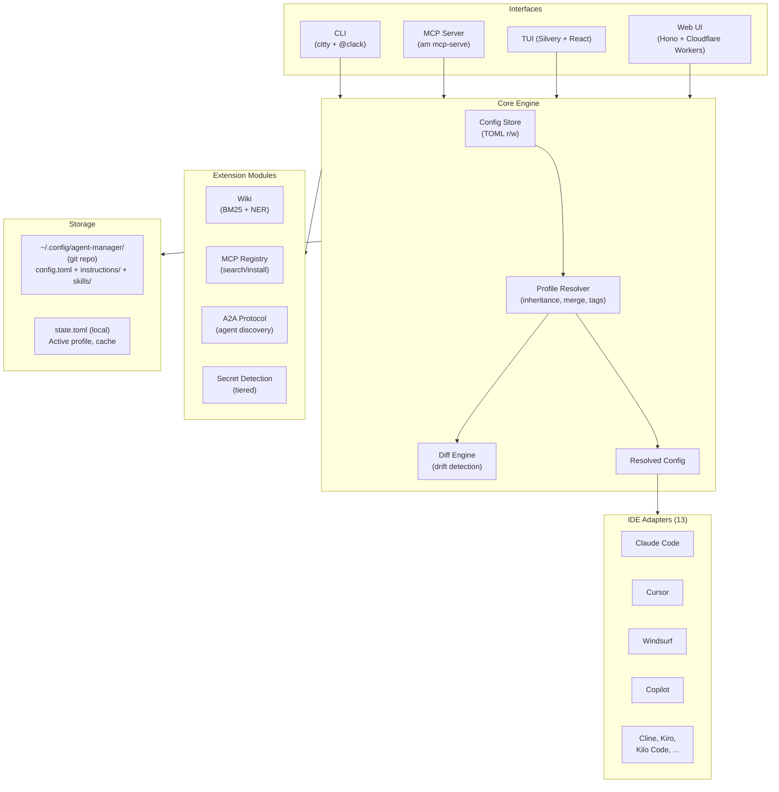
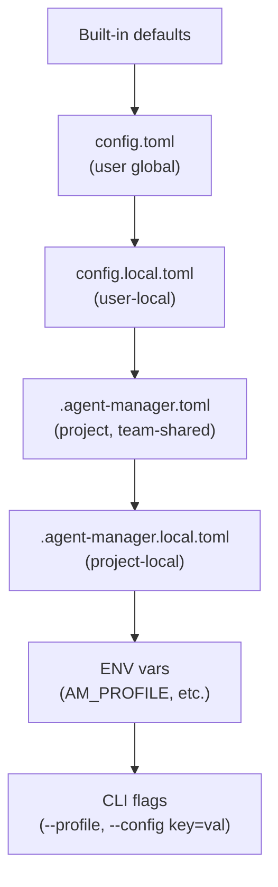
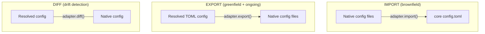

# agent-manager Design Specification

> **Version:** 0.3.0
> **Date:** 2026-04-13
> **Status:** Updated with ADRs 0018-0024 (registry, wiki, A2A, secret detection, tool grouping)
>
> chezmoi for AI agent configs — define your MCP servers, skills, and instructions
> once in TOML, sync via git, and generate native configs for every AI coding tool.

---

## 1. Problem Statement

Every AI coding tool stores configuration differently. MCP server definitions live
in `~/.claude.json`, `.mcp.json`, `~/.cursor/mcp.json`, `.vscode/mcp.json`, and a
dozen other locations. Instructions live in `CLAUDE.md`, `.cursor/rules/*.mdc`,
`.github/copilot-instructions.md`, `GEMINI.md`, and more.

Developers who use multiple AI tools — or even a single tool across multiple
machines — face a fragmented, manual, error-prone configuration experience.

**agent-manager (`am`)** solves this by providing a single TOML source of truth
that generates native configs for all tools, syncs across machines via git, and
supports profile-based subsets for context switching.

### Target Users

- **Multi-tool developers** — consistent MCP configs across Claude Code + Cursor + Copilot
- **Multi-machine developers** — configs follow them across laptop, desktop, cloud
- **Team leads** — define standard servers/instructions distributable via git
- **Power users** — 20+ MCP servers, need profiles to switch contexts
- **AI agents** — programmatic config management via MCP server mode and `--json` output

---

## 2. Architecture Overview

### Core Principles (from ADRs 0001-0024)

| Principle | ADR | Summary |
|-----------|-----|---------|
| Layered Core + Adapter Extensions | 0001 | Universal core schema + `[adapters.<name>]` escape hatches |
| Git-backed everything | 0002 | Every action is a commit; git IS the sync protocol |
| Hierarchical config | 0003 | Global + project layers, same schema both levels |
| TOML format | 0004 | Human-friendly, comments, Codex-validated pattern |
| Bidirectional adapters | 0005 | Import + export + diff for brownfield and greenfield |
| Drift detection | 0006 | Don't overwrite direct IDE edits; detect and surface |
| Two-phase Zod validation | 0007 | Core validates core, adapters validate their sections |
| Profile-based subsets | 0008 | Cargo inherits + Docker Compose tag activation |
| MCP server mode | 0009 | AI agents as first-class users |
| BunTS single binary | 0010 | Zero runtime deps, cross-platform |
| Built-in adapters | 0011 | All adapters in binary, lazy factory, subprocess escape hatch |
| Application-level encryption | 0012 | AES-256-GCM, platform-agnostic key storage |
| Git platform adapters | 0013 | GitHub, GitLab, bare git with URL-based detection |
| Workspace-to-profile import | 0014 | Import from existing workspace configs |
| Stateless web UI | 0015 | Git-backed, independently deployable, encrypted cookies |
| Session harvest | 0016 | Cross-tool conversation export and analysis |
| Multi-protocol agent integration | 0017 | MCP, A2A, and ACP protocol landscape |
| TUI Framework | 0018 | Silvery + React for terminal UI |
| Security Hardening | 0019 | Threat model, token auth, secret detection |
| Knowledge Synthesis | 0020 | LLM Wiki: BM25 search, NER, knowledge graph |
| MCP Tool Grouping | 0021 | Profile-based tool groups, gateway mode experimental |
| Wiki Location | 0022 | Global store + project symlinks, dual location |
| Secret Detection | 0023 | Tiered: key-name (built-in) + BetterLeaks (optional) |
| MCP Registry | 0024 | Package search, install, update with provenance |

### System Architecture



---

## 3. Phase 1 Scope Fence

Phase 1 builds the minimum viable product. Everything else is designed but deferred.

| In Phase 1 | Deferred |
|------------|----------|
| 4 core entities: Servers, Instructions, Skills, Profiles | Plugins, Agents, Permissions, Models (adapter-only until normalizable across 3+ tools) |
| 1 adapter: Claude Code | Cursor (Phase 2), Windsurf, Copilot, etc. |
| 11 CLI commands: init, add server, list servers, use, apply, status, import, push, pull, undo, log | profile create/delete, doctor, mcp-serve, config edit |
| Git sync: init, commit, push, pull, revert | Encrypted secrets (Phase 2), batch mode |
| Stateless drift detection | MCP server mode (Phase 3) |
| macOS binary | Cross-platform (Phase 2), TUI (Phase 4), Web UI (Phase 5) |

**Promotion criteria:** An entity moves from adapter-only to core when it can be
meaningfully normalized across 3+ tools with defined lossiness rules.

---

## 4. Data Model — Core Schema

### 4 Core Entity Types (Phase 1)

Every entity supports an optional `[entity.adapters.<adapter-name>]` subtable for
tool-specific extensions (ADR-0001). Plugins, Agents, Permissions, and Models live
in adapter sections only until cross-tool normalization is proven.

#### 4.1 Servers (MCP) — Phase 1

The most universal entity — identical JSON schema across 9/10 tools.

```toml
[servers.outlook]
command = "aws-outlook-mcp"
args = []
env = { MIDWAY_AUTH = "true" }
transport = "stdio"                  # stdio | streamable-http | sse
description = "Outlook email and calendar"
tags = ["email", "calendar", "work"]
enabled = true

[servers.outlook.adapters.claude-code]
always_allow = ["email_search", "calendar_view"]

[servers.outlook.adapters.cline]
always_allow = true
```

#### 4.2 Instructions — Phase 1

Markdown content with semantic activation rules. Core captures intent; adapters
translate to tool-specific formats.

Instructions use **either** inline `content` or a `content_file` reference (mutually
exclusive, enforced by Zod validation):

```toml
# Short rules: inline content (under ~20 lines)
[instructions.typescript-conventions]
content = """
Use strict TypeScript with no `any` types.
Prefer `interface` over `type` for object shapes.
"""
scope = "glob"                       # always | glob | agent-decision | manual
globs = ["**/*.ts", "**/*.tsx"]
description = "TypeScript coding conventions"
targets = ["claude-code", "cursor", "windsurf", "copilot"]

# Long rules: file reference
[instructions.code-review-checklist]
content_file = "instructions/code-review-checklist.md"  # relative to config dir
scope = "always"
description = "Code review checklist"

[instructions.typescript-conventions.adapters.cursor]
format = "mdc"
always_apply = false
```

**`content` vs `content_file` rules:**
- Mutually exclusive — Zod rejects both on the same instruction
- `content_file` paths are relative to the config directory (`~/.config/agent-manager/`)
- For project config, paths are relative to the project root
- At resolution time, `content_file` is read and treated identically to inline `content`

**Generated outputs per adapter:**

| Adapter | Output | Transformation |
|---------|--------|----------------|
| Claude Code | `CLAUDE.md` (appended) | Strip frontmatter, concatenate |
| Cursor | `.cursor/rules/<name>.mdc` | Convert to .mdc YAML frontmatter |
| Windsurf | `.windsurf/rules/<name>.md` | Convert to Windsurf frontmatter |
| Copilot | `.github/instructions/<name>.instructions.md` | Convert to Copilot frontmatter |
| AGENTS.md-compatible | `AGENTS.md` (appended) | Universal fallback format |

#### 4.3 Skills — Phase 1

```toml
[skills.research-rabbithole]
path = "skills/research-rabbithole"
description = "Multi-agent parallel research"
tags = ["research"]

[skills.research-rabbithole.adapters.claude-code]
trigger = "/research-rabbithole"
```

#### 4.4 Adapter-Only Entities (deferred from core)

These entities exist only in `[adapters.<name>]` sections until proven normalizable
across 3+ tools:

```toml
# Plugins — only Claude Code has a real plugin system
[adapters.claude-code]
plugins = ["superpowers"]

# Permissions — radically different shapes per tool
[adapters.claude-code]
permission_mode = "allowEdits"

[adapters.cline]
always_allow_read = true

# Models — env vars vs UI vs structured config
[adapters.claude-code]
model = "opus[1m]"
ANTHROPIC_SMALL_FAST_MODEL = "global.anthropic.claude-haiku-4-5-20251001-v1:0"

# Agents/subagents — only Claude Code and Roo Code
[adapters.claude-code.agents.code-reviewer]
subagent_type = "feature-dev:code-reviewer"

[adapters.roo-code.modes.code-review]
tools = ["Read", "Grep", "Glob"]
```

#### 4.5 Profiles — Phase 1

```toml
[profiles.base]
description = "Always-on utilities"
servers = ["fetch", "context7"]

[profiles.work]
inherits = "base"
servers = ["tavily", "exa"]
server_tags = ["work"]
skills = ["research-rabbithole", "admin-lint"]
plugins = ["superpowers"]
instructions = ["typescript-conventions"]

[profiles.work.adapters.claude-code]
hooks.PostToolUse = ["scripts/lint-check.sh"]
output_style = "learning"

[profiles.work.env]
AWS_PROFILE = "work-sso"
```

---

## 5. Hierarchical Config (ADR-0003)

### Two Layers + Local Overrides

```
~/.config/agent-manager/
  config.toml              # Global catalog (git-synced via am's repo)
  config.local.toml        # Machine-specific (gitignored)
  instructions/            # Instruction markdown files
  skills/                  # Skill definitions
  .agent-manager/
    key.txt                # AES-256-GCM encryption key (gitignored)
    state.toml             # active profile, last-apply time (gitignored)

<repo>/
  .agent-manager.toml      # Project config (version-controlled in repo)
  .agent-manager.local.toml # Personal project overrides (gitignored)
```

### Resolution Order (highest wins)



### Composition Rules

| Section | Strategy | Behavior |
|---------|----------|----------|
| Servers | Union (additive) | Project adds to global |
| Skills/Plugins | Union (additive) | Project adds to global |
| Instructions | Union (additive) | Project adds its own |
| Settings | Key-level override | Project overrides per-key |
| Env vars | Key-level override | Project overrides per-key |
| Adapter sections | Deep merge | Project adapter config merges into global |

### Merge Semantics

**Scalars (strings, numbers, booleans):** Higher-precedence layer wins completely.

**Arrays (servers, skills lists):** Union, deduped by value. Child adds to parent.
Explicit removal: use `enabled = false` in server definition, not array subtraction.

**Tables (settings, env):** Shallow merge. Each key from higher layer replaces same
key from lower layer. Keys not present in higher layer are inherited. To remove a
key: set it to empty string `""`.

**Adapter sections:** Core preserves them as-is (passthrough). Adapter receives all
layers and merges them with its own logic. Core does NOT deep-merge adapter sections.

**Generated files (CLAUDE.md, .mdc):** Fully regenerated on each `am apply`. No
merge, no preservation of hand-edits. Hand-edits detected by `am status` as drift.

### Secret Resolution Pipeline

Resolution order (highest priority wins):

```
1. CLI flags (--config key=value)
2. Environment variables (process env at am apply time)
3. config.local.toml values
4. AES-256-GCM decrypted `enc:v1:` values
5. Profile [env] section values
6. config.toml literal values
7. .agent-manager.local.toml values
8. .agent-manager.toml values
```

**Interpolation rules:**
- Syntax: `${VAR_NAME}` (dollar-brace only)
- Escaping: `$${VAR_NAME}` produces literal `${VAR_NAME}`
- Interpolation happens at `am apply` time, NOT tool runtime
- Unresolved variables: warn and leave as-is (tool may resolve)
- `am apply --strict` fails on unresolved variables (for CI/CD)

**Phase 1:** Supports levels 1, 2, 3, 5, 6, 7, 8. Secrets.age (level 4) deferred to Phase 2.

### Project Config Example

```toml
# <repo>/.agent-manager.toml — shared with team
profile = "work"

[project]
name = "ADMINISTRIVIA"
description = "Personal productivity vault"

[servers.wiki]
command = "amazon-wiki-mcp"
tags = ["wiki", "work"]

[servers.tickety]
command = "tickety-aws-mcp"
tags = ["tickets"]

[adapters.claude-code.hooks.Stop]
command = "scripts/board-sync-check.sh"
```

---

## 6. Git-Backed Everything (ADR-0002)

The config directory IS a git repository. Durable config changes commit automatically.
Ephemeral state (active profile) does not.

### State Categories

| Category | Examples | Storage | Committed? |
|----------|----------|---------|------------|
| Durable config | Server defs, profiles, instructions | config.toml | Yes (auto-commit) |
| Active state | Current profile, last-applied time | .agent-manager/state.toml | No (gitignored) |
| Ephemeral | --profile flag, --config overrides | In-memory | No |

**Key distinction:** `am use <profile>` changes active state in `state.toml`, NOT
`config.toml`. It does not create a commit. Only `am add`, `am remove`, `am import`,
and `am config edit` modify config.toml and create commits.

The `default_profile` in config.toml IS committed (the intended default). `am use`
overrides it locally without modifying it.

### Automatic Commits (durable changes only)

| Action | Commit Message |
|--------|---------------|
| `am add server tavily ...` | `add server: tavily (search, web)` |
| `am import claude-code` | `import: claude-code (15 servers, 2 skills)` |
| `am remove server old-mcp` | `remove server: old-mcp` |

### Key Commands

```bash
am log                  # git log with am formatting
am undo                 # git revert HEAD + am apply
am push                 # git push to remote
am pull                 # git pull + am apply
am remote add <url>     # git remote add origin
am clone <url>          # clone config repo + auto-apply
```

### What's in Git vs Gitignored

| Git-tracked | Gitignored |
|-------------|------------|
| `config.toml` | `config.local.toml` |
| `instructions/`, `skills/` | `.agent-manager/key.txt` (AES key) |
| Encrypted `enc:v1:` values in config.toml | `.agent-manager/state.toml` |
| `.agent-manager.toml` (project) | `.agent-manager.local.toml` |

---

## 7. Adapter System (ADRs 0005, 0011)

### Adapter Interface

```typescript
interface Adapter {
  meta: {
    name: string;                      // "claude-code"
    displayName: string;               // "Claude Code"
    version: string;
    capabilities: Capability[];        // what this adapter supports
  };

  detect(): DetectResult;              // Is this tool installed?

  import(options: ImportOptions): ImportResult;     // native -> core
  export(config: ResolvedConfig, options: ExportOptions): ExportResult; // core -> native
  diff(config: ResolvedConfig): DiffResult;         // detect drift

  schema: AdapterSchema;               // Zod schemas for adapter TOML fields
}

type Capability =
  | "mcp" | "instructions" | "permissions" | "models"
  | "skills" | "plugins" | "agents" | "hooks" | "modes";
```

### Built-In Adapters (ADR-0011)

All 13 adapters ship in the binary with lazy factory instantiation:

| Adapter | Capabilities |
|---------|-------------|
| `claude-code` | mcp, instructions, permissions, models, skills, plugins, agents, hooks |
| `codex-cli` | mcp, instructions, agents |
| `cursor` | mcp, instructions, permissions, models |
| `copilot` | mcp, instructions, models |
| `windsurf` | mcp, instructions, models |
| `forgecode` | mcp, instructions, permissions |
| `kilo-code` | mcp, instructions, modes |
| `kiro` | mcp, instructions, specs |
| `gemini-cli` | mcp, instructions |
| `cline` | mcp, instructions |
| `roo-code` | mcp, instructions, modes |
| `amazon-q` | mcp, instructions |
| `continue` | mcp, instructions |

Auto-detection: each adapter's `detect()` checks if the tool is installed.
Only detected tools are active unless overridden in config.

### Bidirectional Flow



### Server Identity Resolution (Import)

During import, servers are matched using a ranked signal chain:

1. **Explicit name match** — same server name key across tools (highest confidence)
2. **Package identity** — extract npm/pip package name from command+args:
   - `npx -y tavily-mcp@latest` / `bunx tavily-mcp@latest` → `tavily-mcp`
   - Strip `npx -y`, `bunx`, `uvx`, `pipx run` prefixes and `@version` suffixes
3. **Endpoint identity** — for proxy-wrapped servers, extract upstream URL:
   - `uvx mcp-proxy --endpoint https://mcp.exa.ai/sse` → `mcp.exa.ai`
4. **Command basename** — last resort: `/usr/local/bin/aws-outlook-mcp` → `aws-outlook-mcp`

| Match confidence | Behavior |
|-----------------|----------|
| Signal 1 or 2 | Auto-merge (prompt on field conflicts) |
| Signal 3 | Suggest merge (user confirms) |
| Signal 4 only | Warn of possible duplicate |
| No match | New server |

### Diff Model (Drift Detection)

Drift detection uses **structural comparison**, not textual diff:

1. Adapter parses native config into normalized object
2. Deep-compare against resolved config object
3. Normalization rules (applied before comparison):
   - Sort object keys alphabetically
   - Strip fields with default values
   - Normalize paths (resolve `~`, remove trailing slashes)
   - Treat null/missing as equivalent for optional fields

```typescript
interface DiffResult {
  status: "in-sync" | "drifted" | "unmanaged";
  changes: DiffChange[];
}

interface DiffChange {
  entity: "server" | "instruction" | "skill" | "setting";
  name: string;
  type: "added-locally" | "removed-locally" | "modified" | "added-in-config";
  details?: { field: string; expected: unknown; actual: unknown }[];
}
```

---

## 8. Drift Detection (ADR-0006)

```bash
$ am status
  Profile: work
  Sync: up to date with origin/main

  Tool Status:
    Claude Code   in sync
    Cursor        drift detected
      + server "playwright-mcp" added locally
      ~ server "tavily" args changed
    Copilot       in sync
    Windsurf      not installed

  Run `am import cursor` to adopt changes
  Run `am apply --target cursor` to overwrite
```

- `am status` uses each adapter's `diff()` method
- `am apply` warns on drift, offers options
- `am apply --force` overrides drift detection
- `am import <tool>` adopts native changes into config.toml

**Enterprise/managed layer limitation:** agent-manager detects drift in user-writable
config only. Enterprise-managed settings (Claude `managed-settings.json`, Cursor Team
Rules, Windsurf system rules) are invisible to `am status`. The `am doctor` command
warns if managed config files are detected.

---

## 9. UX Design

### Zero-Config Start

```bash
$ am init
  Detected: Claude Code (15 servers), Cursor (8 servers), Copilot (3 servers)
  Import all? [Y/n] y
  Merged 15 unique servers (3 duplicates reconciled)
  Created profile "default"
  Written to ~/.config/agent-manager/config.toml
  Sync to git? [Y/n] y
  Repository URL: git@github.com:user/agent-config.git
  Pushed initial config
```

### One-Command Operations

```bash
am use work              # switch profile + auto-apply (one command, one intent)
am clone <url>           # new machine setup (one command to full parity)
am status                # drift check across all tools
am undo                  # rollback last change
```

### Agent Experience (AX)

Every command supports `--json` for structured output:

```bash
$ am list servers --json
{
  "servers": [
    { "name": "outlook", "command": "aws-outlook-mcp", "tags": ["work"], "active": true }
  ]
}
```

MCP server mode (ADR-0009):

```json
{
  "mcpServers": {
    "agent-manager": { "command": "am", "args": ["mcp-serve"] }
  }
}
```

**MCP Server Permission Model (26 tools across 4 groups):**

Tool groups are controlled by `settings.mcp_serve.tools` (ADR-0021). Default: `["core"]`.

| Group | Count | Tier | Tools |
|-------|-------|------|-------|
| `core` | 14 | Mixed | am_list_servers, am_list_profiles, am_status, am_config_show, am_add_server, am_remove_server, am_use_profile, am_import, am_apply, am_sync_push, am_sync_pull, am_session_list, am_session_export, am_session_search |
| `registry` | 3 | Mixed | am_registry_search, am_registry_install, am_registry_list_installed |
| `a2a` | 4 | Mixed | am_agent_discover, am_agent_list, am_agent_delegate, am_agent_task_status |
| `wiki` | 5 | Mixed | am_wiki_search, am_wiki_add, am_wiki_synthesize, am_wiki_briefing, am_wiki_harvest |

```toml
[settings.mcp_serve]
allow_push = false    # enables am_sync_push (off by default)
```

Self-referential loop prevention: `am_add_server` rejects adding a server with
command `am` or `agent-manager`.

---

## 10. CLI Command Tree

```
am
├── init                              # First-time setup (detect, import, git init)
├── clone <url>                       # New machine setup from remote
├── add
│   ├── server <name> [--project]     # Add to global or project catalog
│   ├── skill <name|path>
│   └── plugin <name>
├── remove
│   ├── server <name>
│   ├── skill <name>
│   └── plugin <name>
├── list
│   ├── servers [--active|--global|--project|--json]
│   ├── skills [--active|--json]
│   ├── plugins [--active|--json]
│   ├── profiles [--json]
│   └── adapters [--json]
├── use <profile>                     # Switch profile + auto-apply
├── apply [--dry-run|--diff|--force]  # Generate IDE configs
│   └── --target <adapter>            # Apply to specific tool only
├── import
│   ├── <adapter>                     # Import from specific tool
│   └── auto                          # Auto-detect and import all
├── status [--json]                   # Drift detection + sync state
├── profile
│   ├── show <name>                   # Show computed config
│   ├── create <name> [--inherits]
│   └── delete <name>
├── push                              # Git push
├── pull                              # Git pull + auto-apply
├── log                               # Git log with am formatting
├── undo                              # Git revert HEAD + apply
├── remote
│   ├── add <url>
│   └── remove
├── config
│   ├── show [--resolved]             # Show config (raw or resolved)
│   ├── edit [--project]              # Open in $EDITOR
│   └── validate                      # Schema validation
├── doctor                            # Health check
├── mcp-serve                         # MCP server mode (stdio)
├── search <query>                    # Search MCP registry
├── install <packages>                # Install from MCP registry
├── uninstall <name>                  # Remove MCP server package
├── update                            # Check/apply registry updates
├── secret
│   ├── set <key> <value>             # Encrypt and store a secret
│   ├── get <key>                     # Decrypt and display
│   ├── init                          # Generate encryption key
│   ├── scan [--fix]                  # Audit config for unencrypted secrets
│   └── install-scanner               # Download BetterLeaks binary
├── session
│   ├── list                          # List cross-tool sessions
│   ├── export <id>                   # Export session transcript
│   └── search <query>               # Search session content
├── wiki
│   ├── search <query>                # BM25 search wiki pages
│   ├── add <title>                   # Add a wiki page
│   ├── show <slug>                   # Display a wiki page
│   ├── delete <slug>                 # Remove a wiki page
│   ├── ingest --session <id>         # Harvest knowledge from session
│   ├── synthesize <query>            # Generate context from wiki
│   ├── briefing                      # Agent briefing from wiki
│   ├── export                        # Export wiki (JSON/markdown)
│   ├── import                        # Import wiki data
│   ├── lint                          # Wiki health check
│   └── graph                         # Knowledge graph export
├── agents
│   ├── list                          # List A2A agents in roster
│   ├── add <url>                     # Discover and add agent
│   ├── remove <name>                 # Remove agent from roster
│   ├── ping <name>                   # Health check agent
│   └── delegate <name> <task>        # Send task to agent
├── tui                               # Interactive terminal dashboard
├── serve                             # Local web UI server
├── adapter list                      # Show registered adapters
└── version
```

### Global Flags

```
--profile <name>         Override active profile
--config key=value       TOML-valued per-run override
--json                   JSON output for scripting/agents
--verbose / -v           Increase log verbosity
--quiet / -q             Suppress non-essential output
```

---

## 11. Validation (ADR-0007)

Two-phase Zod validation:

**Phase 1 — Core:** Validates all core fields strictly. Adapter sections are
`z.record(z.string(), z.unknown()).optional()` — preserved but not validated.

**Phase 2 — Adapter:** Each installed adapter validates its own
`[entity.adapters.<name>]` section with its Zod schema.

| Situation | Behavior |
|-----------|----------|
| Unknown core field | Warn (likely typo) |
| Unknown adapter name | Preserve silently, optional info message |
| Invalid adapter field | Warn (adapter validation failure) |
| Missing required core field | Error (fail validation) |

---

## 12. Build & Distribution (ADR-0010)

### Tech Stack

| Layer | Choice |
|-------|--------|
| Language | TypeScript |
| Runtime/Bundler | Bun (`bun build --compile`) |
| CLI framework | citty (command routing) + @clack/prompts (wizards) |
| Config | @iarna/toml (parser) + Zod (validation) |
| Git | isomorphic-git (pure JS, no system git dependency) |
| Encryption | Web Crypto API (AES-256-GCM) |
| TUI | Silvery + React (pure TS layout, Bun-compatible) |
| Web | Hono (local + Cloudflare Workers) |
| Search | MiniSearch (BM25 for wiki full-text search) |
| Secret scanning | Tiered: key-name patterns (built-in) + BetterLeaks (optional) |
| State | Flat TOML file (.agent-manager/state.toml) |

### Build Targets

| Platform | Target |
|----------|--------|
| macOS ARM64 | `bun-darwin-arm64` |
| macOS Intel | `bun-darwin-x64` |
| Linux x64 | `bun-linux-x64` |
| Linux ARM64 | `bun-linux-arm64` |
| Windows x64 | `bun-windows-x64` |

### Distribution

| Channel | Method |
|---------|--------|
| GitHub Releases | Pre-compiled binaries |
| Homebrew | `brew install baladithyab/tap/agent-manager` |
| npm | `npx agent-manager` / `bunx agent-manager` |

Binary: `agent-manager` with `am` as symlink/alias.

---

## 13. Implementation Roadmap

### Phase 1: MVP — CLI + TOML + Git + Claude Code

**Core entities:** Servers, Instructions, Skills, Profiles (4 only).
**Adapter:** Claude Code only. **Platform:** macOS only.

| Component | Description |
|-----------|-------------|
| Project scaffold | Bun + TypeScript + citty + Zod |
| TOML engine | Read/write config.toml, profile resolution, merge semantics |
| Claude Code adapter | import + export + diff for ~/.claude.json, .mcp.json, CLAUDE.md |
| Git layer | isomorphic-git: init, commit, push, pull, log, revert |
| Import wizard | `am init` with auto-detect and @clack/prompts |
| Diff engine | Structural comparison with normalization rules |
| Secret interpolation | `${VAR}` resolution from env + config.local.toml (no age yet) |
| Binary build | `bun build --compile` for macOS |

**CLI (11 commands):** `am init`, `am add server`, `am list servers`, `am use`,
`am apply`, `am status`, `am import claude-code`, `am push`, `am pull`, `am undo`, `am log`

### Phase 2: Multi-Adapter + Full Profiles

| Component | Description |
|-----------|-------------|
| Cursor adapter | import + export + diff |
| Windsurf adapter | import + export + diff |
| Copilot adapter | import + export + diff |
| Instruction generator | CLAUDE.md, .mdc, .windsurf/rules, AGENTS.md |
| Profile management | create, delete, show, auto-detect |
| Secret encryption | age-based encryption for env vars |
| Cross-platform build | All 5 targets + CI/CD pipeline |

**Deliverable:** `am apply --target all`, full profile switching, encrypted secrets

### Phase 3: Remaining Adapters + MCP Server Mode

| Component | Description |
|-----------|-------------|
| Cline, Roo Code, Continue, Gemini, Codex, Amazon Q adapters | Complete coverage |
| MCP server mode | `am mcp-serve` with tool definitions |
| `--json` on all commands | Structured output for agents |
| Homebrew tap + npm package | Distribution channels |

**Deliverable:** Full 13-adapter coverage, MCP server mode, distribution

### Phase 4: TUI (Implemented)

| Component | Description |
|-----------|-------------|
| Silvery + React TUI | Dashboard, server list, profile switcher, sync status |
| `am tui` command | Interactive terminal dashboard |

### Phase 5: Web UI (Implemented)

| Component | Description |
|-----------|-------------|
| Hono API server | REST API + SSE for real-time |
| Static HTML dashboard | Visual config management |
| GitHub/GitLab OAuth | Device flow + PKCE |
| `am serve` command | Launch web dashboard |

---

## 14. Project Structure

```
agent-manager/
├── src/
│   ├── cli.ts                    # Entry point (citty command routing)
│   ├── commands/                 # CLI command handlers
│   │   ├── init.ts
│   │   ├── add.ts
│   │   ├── use.ts
│   │   ├── apply.ts
│   │   ├── import.ts
│   │   ├── status.ts
│   │   ├── push.ts
│   │   ├── pull.ts
│   │   └── ...
│   ├── core/                     # Core engine
│   │   ├── config.ts             # TOML read/write
│   │   ├── resolver.ts           # Profile resolution + merge
│   │   ├── git.ts                # Git operations (isomorphic-git)
│   │   ├── secrets.ts            # AES-256-GCM encryption + ${VAR} interpolation
│   │   └── schema.ts             # Core Zod schemas
│   ├── adapters/                 # Built-in adapters
│   │   ├── registry.ts           # Lazy factory registry
│   │   ├── types.ts              # Adapter interface
│   │   ├── claude-code/
│   │   │   ├── index.ts          # detect, import, export, diff
│   │   │   └── schema.ts         # Adapter-specific Zod schema
│   │   ├── cursor/
│   │   ├── windsurf/
│   │   ├── copilot/
│   │   └── ...
│   ├── mcp/                      # MCP server mode
│   │   └── server.ts             # JSON-RPC 2.0, 26 tools, 4 groups
│   ├── registry/                 # MCP package registry
│   │   ├── types.ts              # RegistryPackage, provenance types
│   │   └── client.ts             # HTTP client with LRU cache, retry
│   ├── protocols/
│   │   └── a2a/                  # Agent-to-Agent protocol
│   │       ├── types.ts          # Agent Card, Task, Message
│   │       ├── client.ts         # A2A HTTP client
│   │       ├── server.ts         # A2A server endpoint
│   │       ├── discovery.ts      # Agent roster, URL-based discovery
│   │       └── generate-card.ts  # Agent Card from am config
│   └── wiki/                     # LLM Wiki / Knowledge Synthesis
│       ├── types.ts              # Wiki entry, page, index types
│       ├── storage.ts            # TOML-backed wiki with symlinks
│       ├── harvester.ts          # Session → wiki page extraction
│       ├── synthesizer.ts        # Context blocks, agent briefings
│       ├── ner.ts                # Named entity recognition
│       └── graph.ts              # Knowledge graph, orphan detection
├── test/                         # 1214 tests
│   ├── core/
│   ├── adapters/
│   └── fixtures/                 # Sample config files per tool
├── ADRs/                         # 24 architectural decisions
├── research/                     # Research documents
├── docs/                         # Design specs
├── scripts/
│   └── build.ts                  # Cross-platform build script
├── package.json
├── tsconfig.json
└── bunfig.toml
```

---

## 15. MCP Registry Integration (ADR-0024)

agent-manager integrates with the public MCP package registry for server discovery
and installation.

### Registry Client

`src/registry/client.ts` provides an HTTP client for the MCP registry:
- Default endpoint: `https://registry.modelcontextprotocol.io` (configurable via `AM_REGISTRY_URL`)
- In-memory LRU cache (50 entries, 5-minute TTL)
- Exponential backoff on 429/5xx (3 retries, 1s/2s/4s)
- Graceful fallback to cache on network failure

### Provenance Tracking

Registry-installed servers carry `_registry` metadata:

```toml
[servers.tavily._registry]
source = "mcp-registry"
package = "tavily-mcp"
version = "1.2.0"
installed_at = "2026-04-10T10:30:00Z"
```

`am update` compares installed versions against the registry to detect available
upgrades. Provenance is preserved through config merges and profile resolution.

### Secret Handling on Install

Registry packages declare required env vars. During `am install`:
1. User is prompted for env var values
2. Values are auto-encrypted via the Tier 1 secret detection pipeline (ADR-0023)
3. Config is written with `${VAR}` references and encrypted originals in `settings.env`

### CLI: `am search`, `am install`, `am uninstall`, `am update`

| Command | Description |
|---------|-------------|
| `am search <query>` | Search registry with `--tag`, `--verified`, `--limit`, `--json` |
| `am install <package...>` | Resolve, prompt for env vars, encrypt, add to config |
| `am uninstall <name>` | Remove server with confirmation |
| `am update` | Check for newer versions of registry-installed servers |

---

## 16. Knowledge Wiki (ADRs 0020, 0022)

The LLM Wiki synthesizes durable, searchable knowledge from agent session transcripts.
It follows a three-layer model: episodic (raw sessions, ADR-0016), working (structured
wiki pages, this feature), and procedural (distilled rules, future).

### Search and Indexing

- **BM25 via MiniSearch** — full-text search over wiki pages with ranked results
- **Rule-based NER** — named entity recognition for auto-linking wiki entries
  (projects, tools, libraries, concepts)
- **Knowledge graph** — entity-relationship graph with orphan detection and JSON export

### Dual Location (ADR-0022)

Wiki data lives in two locations:
- **Global:** `~/.config/agent-manager/wiki/global/` — cross-project knowledge
- **Per-project:** `~/.config/agent-manager/wiki/projects/<name>/` — project-specific

Projects access their wiki via a symlink: `.agent-manager/wiki` points to the
central store. The symlink is gitignored in the project repo. All wiki data syncs
via `am push`/`am pull` through the git-backed AM config repo.

### Session Harvesting

`am wiki ingest --session <id>` extracts structured knowledge from a session transcript:
decisions, entities, code changes, key facts, open questions, and patterns. The
harvester uses NER to auto-link entities and builds wiki pages with TOML frontmatter.

### CLI: 13 wiki subcommands

| Command | Description |
|---------|-------------|
| `am wiki search <query>` | BM25 search wiki pages |
| `am wiki add <title>` | Add a wiki page |
| `am wiki show <slug>` | Display a wiki page |
| `am wiki delete <slug>` | Remove a wiki page |
| `am wiki ingest` | Harvest knowledge from sessions |
| `am wiki synthesize <query>` | Generate context blocks |
| `am wiki briefing` | Agent briefing from wiki |
| `am wiki export` | Export wiki (JSON/markdown) |
| `am wiki import` | Import wiki data |
| `am wiki lint` | Health check: orphans, staleness |
| `am wiki graph` | Knowledge graph export |

---

## 17. A2A Protocol Integration (ADR-0017)

agent-manager implements Google's Agent-to-Agent (A2A) protocol for inter-agent
communication and task delegation.

### Architecture

| Component | File | Purpose |
|-----------|------|---------|
| Types | `src/protocols/a2a/types.ts` | Agent Card, Task, Message types per A2A spec |
| Client | `src/protocols/a2a/client.ts` | HTTP client for sending tasks to remote agents |
| Server | `src/protocols/a2a/server.ts` | A2A endpoint handling for incoming tasks |
| Discovery | `src/protocols/a2a/discovery.ts` | Agent roster management, `/.well-known/agent.json` |
| Card generation | `src/protocols/a2a/generate-card.ts` | Generate Agent Card from am config |

### Agent Roster

Discovered agents are persisted in config. Each agent entry stores the URL, Agent Card
metadata (name, description, skills), and health status from the last ping.

### CLI: 5 agent subcommands

| Command | Description |
|---------|-------------|
| `am agents list` | List agents in roster |
| `am agents add <url>` | Discover agent via `/.well-known/agent.json` and add to roster |
| `am agents remove <name>` | Remove agent from roster |
| `am agents ping <name>` | Health check a registered agent |
| `am agents delegate <name> <task>` | Send a task to a remote agent |

---

## 18. Secret Detection (ADR-0023)

### Tiered Architecture

**Tier 1 — Built-in (always runs):** Key-name pattern matching in `src/core/secret-detection.ts`.
If a server env var key matches known patterns (`/api[_-]?key/i`, `/secret/i`, `/token/i`,
`/password/i`, or 40+ provider-specific patterns like `/openai/i`, `/anthropic/i`,
`/tavily/i`), the value is treated as a secret. Covers >90% of MCP server configs.

**Tier 2 — BetterLeaks (when installed):** Value-based and inline secret detection via
`betterleaks stdin --report-format json`. Handles secrets in `args` arrays, `command`
strings, and env values where key names aren't recognized. Managed at
`~/.config/agent-manager/bin/betterleaks`, installed via `am secret install-scanner`.

### Auto-Encrypt on Import/Add

During `am import` and `am add server`:
1. Tier 1 + Tier 2 scan detects secrets
2. Encryption key is auto-generated if none exists (`am secret init`)
3. Each secret value is replaced with `${KEY_NAME}` reference
4. Original value is AES-256-GCM encrypted in `settings.env`
5. Config is committed — git backend never contains raw secrets

Users can opt out with `--no-encrypt`.

### CLI Commands

| Command | Description |
|---------|-------------|
| `am secret scan` | Show detected unencrypted secrets |
| `am secret scan --fix` | Auto-substitute and encrypt detected secrets |
| `am secret install-scanner` | Download BetterLeaks binary |
| `am secret init` | Generate AES-256-GCM encryption key |
| `am secret set <key> <value>` | Encrypt and store a secret |
| `am secret get <key>` | Decrypt and display a secret |

---

## 19. MCP Tool Grouping (ADR-0021)

### Configuration

```toml
[settings.mcp_serve]
allow_push = false
tools = ["core", "registry"]  # Only expose these tool groups
# Available groups: core, registry, a2a, wiki
# Default: ["core"]
```

### Tool Groups

| Group | Count | Description |
|-------|-------|-------------|
| `core` | 14 | Config management: list, add, remove, apply, import, status, sync, sessions |
| `registry` | 3 | MCP registry: search, install, list installed |
| `a2a` | 4 | Agent protocol: discover, list, delegate, task status |
| `wiki` | 5 | Knowledge wiki: search, add, synthesize, briefing, harvest |

When `settings.mcp_serve.tools` is unset, the default is `["core"]` — the original
config management tools from ADR-0009. This ensures backward compatibility while
reducing LLM token usage and tool selection noise.

Permission tiers (read-only, write-local, write-remote) from ADR-0009 compose
orthogonally with tool groups. A tool must pass both the group filter and the tier
check to be exposed.

**Gateway mode** (experimental, not recommended): am-cli could proxy MCP tool calls
through to configured servers, acting as both MCP server and client. Deferred — the
import/export model covers the primary use case.

---

## References

- [Research Index](../research/agent-manager-research-index.md) — 13 research documents
- [ADR Index](../ADRs/README.md) — 24 architectural decisions
- [GitHub Repository](https://github.com/baladithyab/agent-manager)
