# CLI Lifecycle Guide

> How `am` works from installation through daily use, for human developers and AI agents alike.
>
> This document traces every major user flow through the system, showing what happens
> at each step -- which functions run, which files are read and written, and how the
> pieces connect.

---

## 1. Installation

Three ways to get `am` on a machine. All produce the same single binary with zero
runtime dependencies.

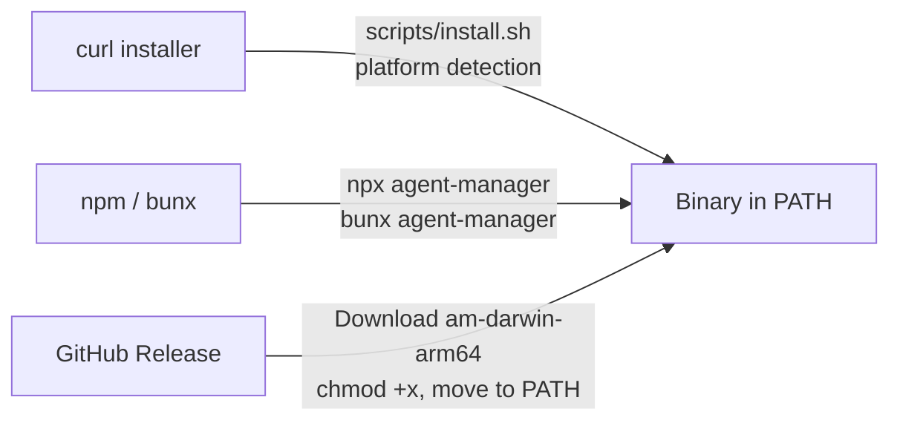

**curl installer** (`scripts/install.sh`): Detects OS and architecture, downloads the
matching binary from GitHub Releases, places it in `~/.local/bin` or `/usr/local/bin`,
and verifies it runs.

**npm/bun**: `npx agent-manager` or `bunx agent-manager` downloads and runs the
package. Good for trying out `am` without a global install.

**Manual binary**: Download from GitHub Releases. Five targets are built:
`am-darwin-arm64`, `am-darwin-x64`, `am-linux-x64`, `am-linux-arm64`, `am-windows-x64.exe`.

---

## 2. First-Time Setup -- `am init`

`am init` is the entry point for new users. It creates the config directory, initializes
a git repository, detects installed tools, and optionally generates an encryption key.

### Init Flow

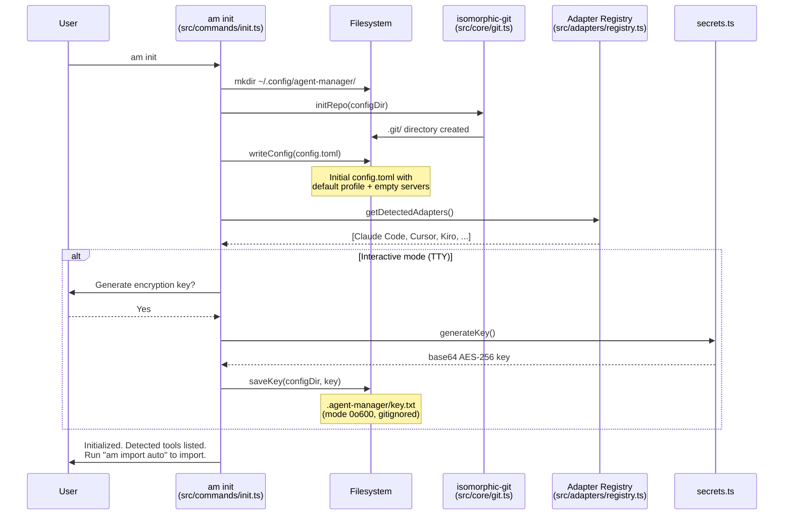

### What Happens to the Filesystem

After `am init`, the config directory looks like this:

```
~/.config/agent-manager/
  .git/                    # isomorphic-git repo
  config.toml              # Initial config (settings + default profile)
  .agent-manager/
    key.txt                # AES-256 encryption key (if user said yes)
```

The initial `config.toml` contains:

```toml
[settings]
default_profile = "default"

[profiles.default]
description = "Default profile — all servers"
```

### Interactive vs Non-Interactive

When `--json` is passed, `am init` skips all interactive prompts (encryption key
generation, import offers). The result is returned as structured JSON:

```json
{
  "status": "initialized",
  "configDir": "~/.config/agent-manager",
  "configPath": "~/.config/agent-manager/config.toml",
  "detectedTools": ["Claude Code", "Cursor", "Kiro"],
  "keyGenerated": false
}
```

This makes `am init --json` safe for use by AI agents via MCP or scripting.

---

## 3. Importing Existing Configs -- `am import`

`am import` reads native config files from installed tools and merges them into
`config.toml`. This is the brownfield path -- users who already have MCP servers
configured in Claude Code, Cursor, etc. can adopt them without re-entering anything.

### Import Flow

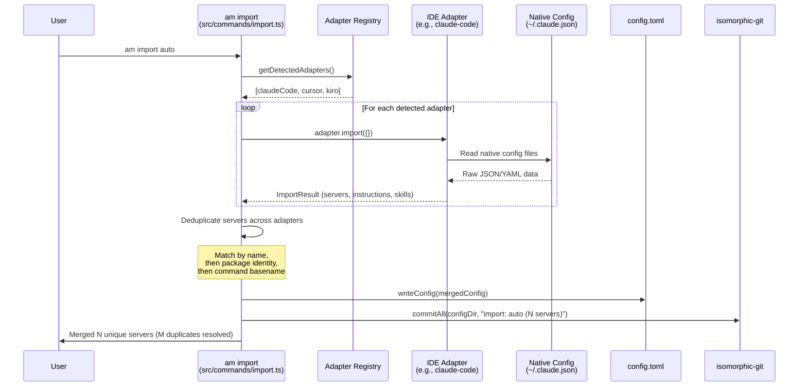

### `am import auto` vs `am import <adapter>`

- **`am import auto`**: Iterates all detected adapters, collects servers from each,
  deduplicates across adapters, then writes a single merged config.
- **`am import cursor`**: Imports from only the named adapter. Skips deduplication
  across tools (but still skips servers that already exist in config.toml by name).

### Server Identity Resolution (Deduplication)

When the same MCP server appears in multiple tools under different names or slightly
different configurations, `am` uses a ranked signal chain to detect duplicates:

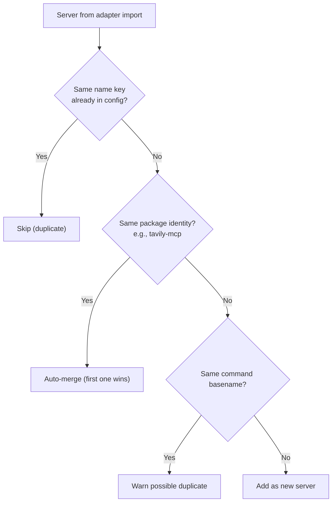

Package identity is extracted from the command by stripping runner prefixes (`npx -y`,
`bunx`, `uvx`, `pipx run`) and version suffixes (`@latest`, `@1.2.3`). For example,
`npx -y tavily-mcp@latest` and `bunx tavily-mcp@0.3.0` both resolve to identity
`tavily-mcp`.

---

## 4. Daily Workflow

Once set up, the typical daily cycle involves editing config, applying changes,
checking for drift, and syncing across machines.

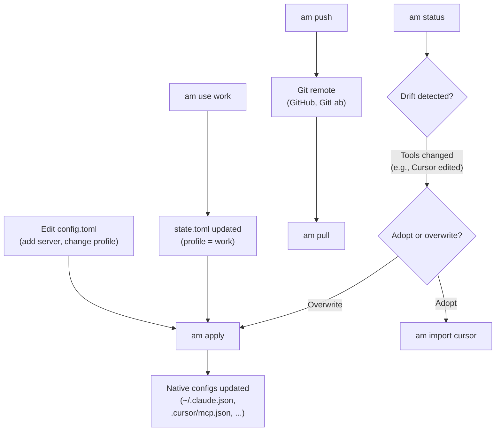

### Profile Switching

`am use <profile>` writes the active profile to `state.toml` (gitignored). It does
NOT modify `config.toml` or create a git commit. This means each machine can use a
different profile from the same config repository.

```
am use work     -> state.toml: profile = "work"
am use personal -> state.toml: profile = "personal"
```

The profile name is resolved at apply time through a priority chain:
1. `--profile` CLI flag (highest)
2. `state.toml` active profile (from `am use`)
3. `config.settings.default_profile`
4. `"default"` (fallback)

---

## 5. The Apply Pipeline

`am apply` is the most important command. It reads the merged config, resolves the
active profile, decrypts secrets, builds a `ResolvedConfig`, and exports native
config files for every detected IDE.

### Full Pipeline

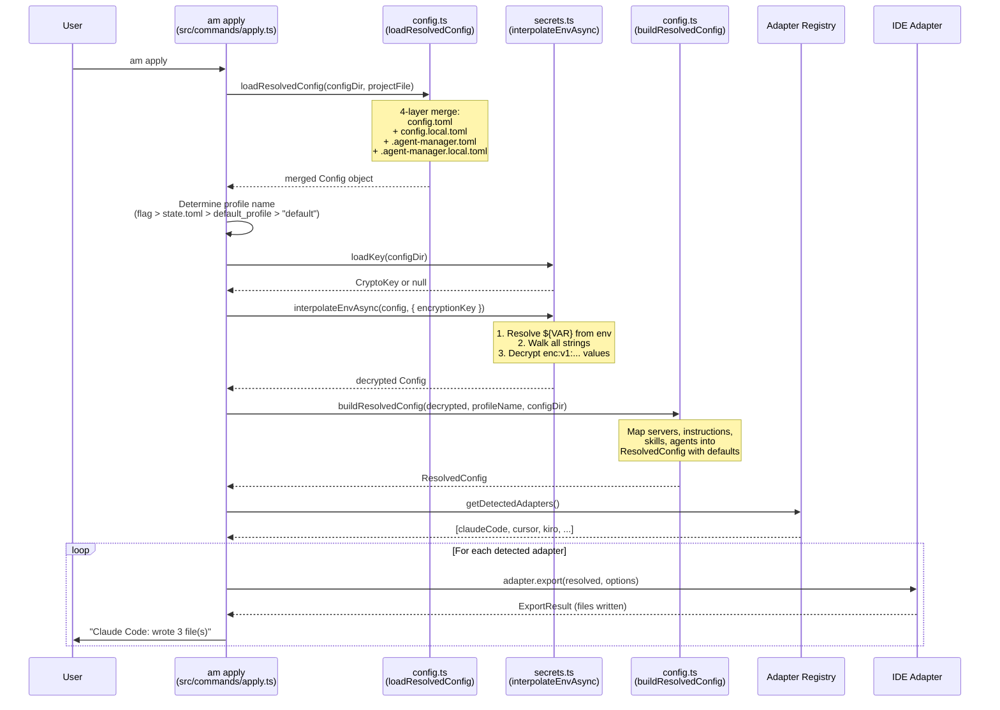

### The 4-Layer Config Merge

`loadResolvedConfig()` in `src/core/config.ts` merges four config files in order
(lowest to highest precedence):

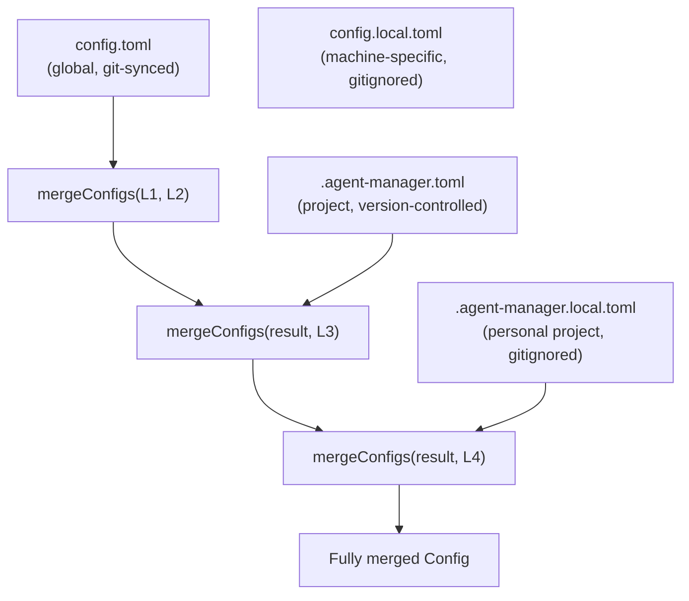

Merge semantics from `mergeConfigs()`: servers, skills, instructions, agents, and
profiles use union (same-name key in higher layer wins). Settings and env use
shallow merge (per-key override).

### What Files Get Written

Each adapter's `export()` writes to tool-specific locations. Examples:

| Adapter | Files Written |
|---------|---------------|
| `claude-code` | `~/.claude.json` (MCP servers), `.mcp.json` (project MCP), `CLAUDE.md` (instructions) |
| `cursor` | `~/.cursor/mcp.json` (global MCP), `.cursor/rules/*.mdc` (instructions) |
| `copilot` | `.vscode/mcp.json` (MCP servers), `.github/instructions/*.instructions.md` |
| `windsurf` | `~/.windsurf/mcp.json` (global MCP), `.windsurf/rules/*.md` (instructions) |
| `kiro` | `.kiro/mcp.json` (MCP servers), `.kiro/steering/*.md` (instructions) |

### Dry Run

`am apply --dry-run` runs the entire pipeline but skips writing files. Each adapter
returns the file paths and content it would have written:

```
$ am apply --dry-run
  Claude Code: would write 3 file(s)
    ~/.claude.json
    .mcp.json
    CLAUDE.md
  Cursor: would write 5 file(s)
    ~/.cursor/mcp.json
    .cursor/rules/typescript-conventions.mdc
    ...
```

---

## 6. Encryption Lifecycle

Secrets (API keys, tokens) are encrypted at rest in `config.toml` using AES-256-GCM.
They are decrypted only at apply time when generating native IDE configs.

### Full Encryption Flow

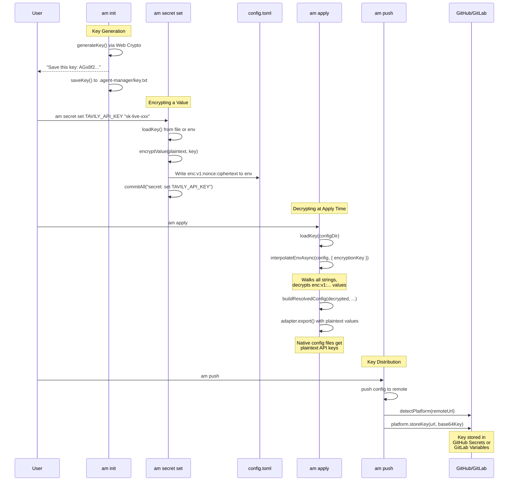

### Key Loading Priority

`loadKey()` in `src/core/secrets.ts` checks two sources in order:

1. **`AM_ENCRYPTION_KEY` environment variable** (base64-encoded) -- used in CI/CD,
   containers, and any environment where file-based keys are impractical.
2. **`.agent-manager/key.txt` file** -- the default local storage. Created by
   `am init` or `am secret init`. Gitignored so it never enters the config repo.

### New Machine Key Bootstrap

On a new machine after `am pull`, encrypted values in `config.toml` cannot be
decrypted without the key. Options:

- Paste the base64 key from your password manager
- Copy `key.txt` from another machine
- Set `AM_ENCRYPTION_KEY` environment variable
- Platform adapter retrieves from GitHub Secrets / GitLab Variables

---

## 7. Git Sync Lifecycle

Every durable config change creates an automatic git commit. `am push` and `am pull`
sync the config repository with a remote.

### Push/Pull Flow

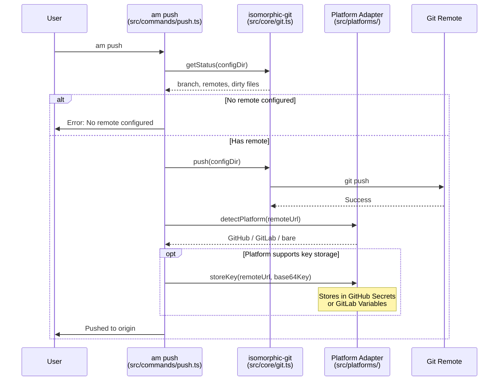

### What Auto-Commits vs What Does Not

| Action | Commits? | Commit Message |
|--------|----------|----------------|
| `am add server tavily` | Yes | `add server: tavily` |
| `am import cursor` | Yes | `import: cursor (8 servers)` |
| `am secret set API_KEY` | Yes | `secret: set API_KEY` |
| `am config edit` | Yes | `config: edit` |
| `am use work` | No | Writes to state.toml (gitignored) |
| `am apply` | No | Writes to native configs (outside config repo) |

### Conflict Resolution

`am` does not implement custom merge conflict resolution. If `am pull` encounters
a git conflict, it reports the error. The user resolves it using standard git tools
or by running `am undo` to revert.

The primary conflict prevention mechanism is **drift detection** (`am status`).
By surfacing when native configs have diverged from the TOML source of truth,
users can resolve differences before they become git conflicts.

---

## 8. Session Harvest

`am session` reads AI coding session data from tools that store conversation
history. Currently supported: Claude Code (JSONL) and Codex CLI (JSONL).

### Session Pipeline

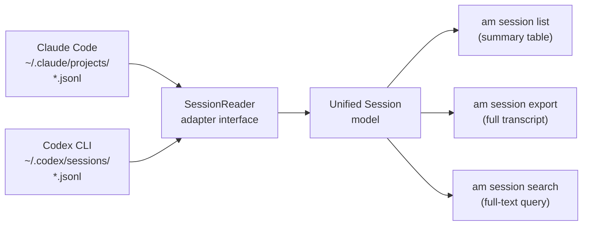

### `am session list`

Lists all sessions across all tools with SessionReader support. Returns session ID,
adapter name, project path, message count, and start date. Sort by date (default)
or by token count (`--sort tokens`).

### `am session export <id>`

Exports a single session with optional filtering:

- `--role user` -- user messages only
- `--role assistant` -- AI responses only
- `--no-tools` -- strip tool call/result messages
- `--no-system` -- strip system prompts
- `--format md` -- markdown output (default)
- `--format json` -- structured JSON

The filter pipeline in `src/core/session.ts` applies in order:
role filter, then `noTools`, then `noSystem`, then query match.

### `am session search <query>`

Full-text search across all sessions from all supported adapters. Returns matching
sessions with context snippets around the query string. Filters by role with `--role`
and by adapter with `--adapter`.

---

## 9. Agent Usage -- MCP Server Mode

`am mcp-serve` turns agent-manager into an MCP server that AI agents can call to
manage their own configuration. The server communicates over stdio using JSON-RPC 2.0.

### Agent Interaction Flow

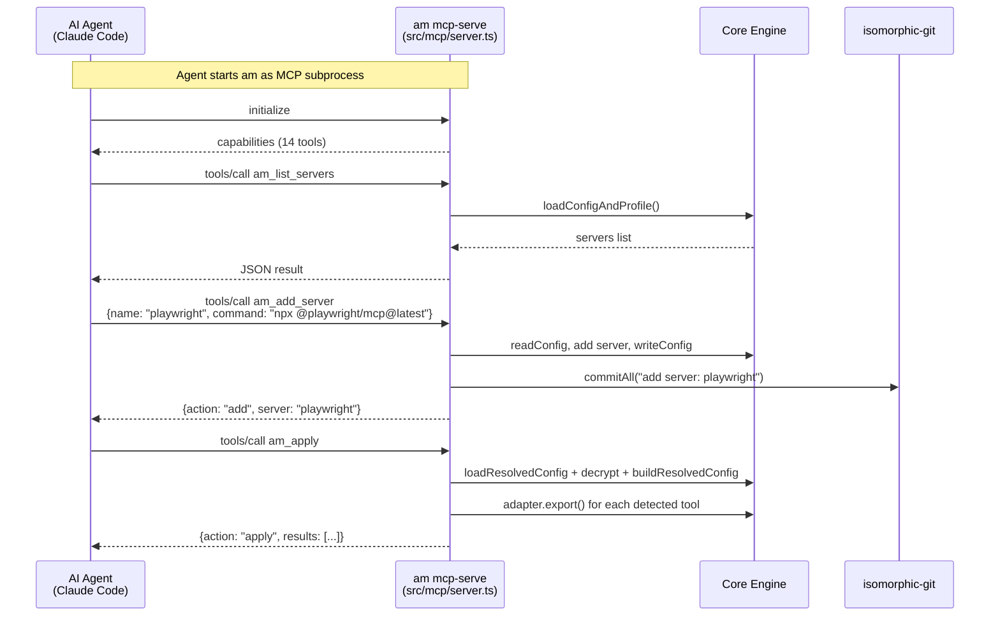

### Permission Tiers

The MCP server implements three permission tiers from `src/mcp/server.ts`:

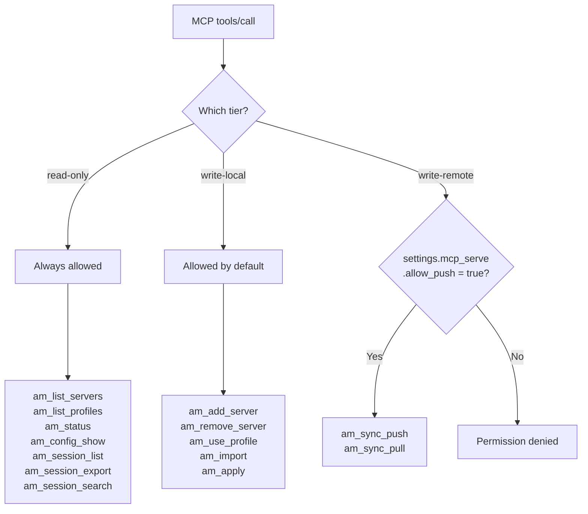

Write-remote tools require explicit opt-in in `config.toml`:

```toml
[settings.mcp_serve]
allow_push = true
```

### MCP Configuration

To enable an AI agent to use `am`, add it to the tool's MCP server config:

```json
{
  "mcpServers": {
    "agent-manager": {
      "command": "am",
      "args": ["mcp-serve"]
    }
  }
}
```

### Security

- `am_config_show` redacts all encrypted values (`enc:v1:...` becomes `[encrypted]`)
- `am_apply` is classified as write-local (it only writes native config files locally)
- Write-remote tools are gated behind explicit config opt-in
- Secret values are never returned through any MCP tool

---

## 10. Workspace Import -- `am init --project`

`am init --project` scans the current repository for existing AI tool configs and
generates a `.agent-manager.toml` project config. This is for teams that want to
adopt `am` in a project where tools already have configs checked in.

### Workspace Import Flow

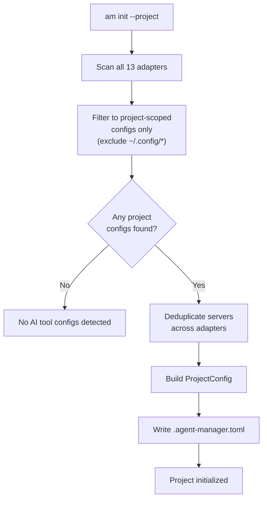

### What Gets Scanned

The `scanAdapters()` function in `src/commands/init-project.ts` iterates all 13
registered adapters. For each:

1. Call `adapter.import({ projectPath })` to get servers and instructions
2. Filter to project-scoped content only (exclude global configs from `~/.config/`)
3. Instructions with a `sourcePath` inside the project directory are included
4. Instructions from global paths (home directory) are excluded

### Deduplication

Servers are deduplicated using the same identity resolution as `am import`:
name match first, then package identity (extracted from command + args), then
command basename. Duplicates are logged with warnings.

Instructions from different adapters that describe the same content get
deduplicated by name, with adapter-prefixed fallback names on collision.

---

## 11. Error Handling

### Config Not Found

When `config.toml` does not exist (user has not run `am init`), commands that
need config fail with:

```
error: Config not found. Run `am init` first.
```

In `--json` mode:

```json
{ "error": "Config not found. Run `am init` first." }
```

### Encryption Key Not Found

When `am apply` encounters `enc:v1:` values but no encryption key is available:

- `loadKey()` returns `null`
- `interpolateEnvAsync()` receives no key, so encrypted values pass through unchanged
- The adapter receives the literal `enc:v1:nonce:ciphertext` string as an env value
- The tool will see the encrypted string instead of the plaintext secret

To fix: run `am secret init` to generate a key, or set `AM_ENCRYPTION_KEY`.

### Git Remote Not Configured

When `am push` is called with no remote:

```
error: No remote configured
  suggestion: Add a remote URL to your config repo
```

### Adapter Not Found

When `--target` specifies a non-existent adapter:

```
error: Adapter "fake-tool" not found
  available: claude-code, cursor, copilot, windsurf, kiro, ...
```

### `--json` Error Format

All errors in `--json` mode follow this shape:

```json
{
  "error": "Human-readable error message",
  "suggestion": "Optional remediation hint"
}
```

The `error()` helper from `src/lib/output.ts` handles formatting for both JSON
and text output modes. Exit code is set to 1 on errors.
