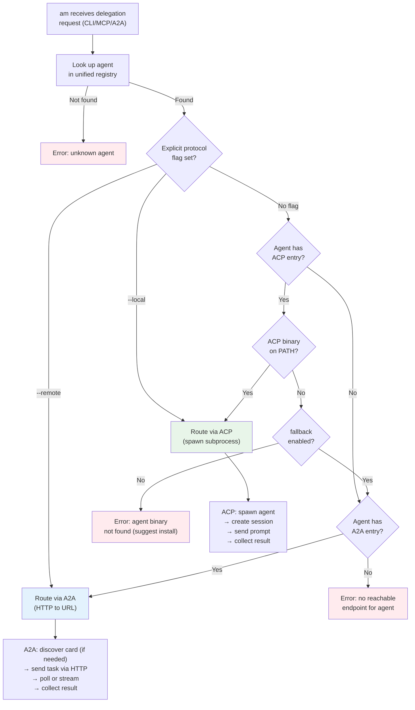

# A2A vs ACP Protocol Positioning in agent-manager

**Date:** 2026-04-16
**Status:** Design proposal
**Related ADRs:** ADR-0017 (Multi-Protocol Agent Integration), ADR-0026 (ACP Runtime Integration)

---

## Executive Summary

agent-manager (`am`) sits at the intersection of three protocols: MCP (tools), ACP (agent
control), and A2A (agent-to-agent delegation). This document formalizes the positioning of
A2A and ACP in am's architecture, defines the routing model for local vs remote agents,
and proposes a unified agent registry that spans both protocols.

**The user's mental model is correct and well-supported by the specs:**

| Protocol | Domain | Transport | Agent Location | am's Role |
|----------|--------|-----------|----------------|-----------|
| **ACP** | Client-to-Agent | stdio (primary), HTTP (draft) | **Local** — installed on machine, spawned as subprocess | ACP client: spawn, session, prompt |
| **A2A** | Agent-to-Agent | HTTP/JSON-RPC 2.0 (only) | **Remote** — network service at a URL | A2A client & server: discover, delegate, serve |
| **MCP** | Agent-to-Tool | stdio / SSE / Streamable HTTP | Either | Config manager & server (done) |

---

## 1. Protocol Specifications — What We Learned

### 1.1 ACP (Agent Client Protocol)

- **Spec:** agentclientprotocol.com (Zed Industries)
- **Version:** SDK v0.18.x, spec still pre-1.0
- **Backers:** Zed, JetBrains, Kiro
- **Transport:**
  - **stdio** is the primary and only finalized transport. The spec states agents and
    clients "SHOULD support stdio whenever possible." The client spawns the agent as
    a child process; the agent reads JSON-RPC from stdin and writes to stdout.
  - **HTTP** exists as a draft proposal only — not yet specified, not implemented.
  - Messages are framed as NDJSON (newline-delimited JSON).
- **Relationship model:** Client (editor/CLI) -> Server (agent). Hierarchical, not peer.
- **Session lifecycle:** initialize -> session/new -> session/prompt -> session/close.
  Also: session/list, session/fork, session/resume, session/delete (some as RFDs).
- **Rich client callbacks:** The agent can call back to the client for filesystem access
  (readTextFile, writeTextFile), terminal operations (createTerminal, terminalOutput,
  killTerminal), permission requests (requestPermission), and session update notifications.
- **Headless use:** ACPX (openclaw/acpx) proves ACP works headlessly from CLI tools, not
  just IDEs. am's ACP client (`src/protocols/acp/client.ts`) already implements this.
- **MCP-over-ACP RFD:** An active RFD proposes `"acp"` as a new MCP transport type. Three
  new messages (`mcp/connect`, `mcp/message`, `mcp/disconnect`) allow MCP tool calls to
  be tunneled over existing ACP channels. This means a client can inject project-aware
  MCP tools into an ACP session without spawning separate processes.

**Key insight:** ACP is fundamentally a **local, subprocess protocol**. The HTTP draft
exists but is unfinished. When am talks to agents via ACP, it spawns them.

### 1.2 A2A (Agent-to-Agent Protocol)

- **Spec:** a2a-protocol.org (Google / Linux Foundation AAIF)
- **Version:** v1.0.0 (released 2026-03-12)
- **Backers:** Google, IBM, Linux Foundation AAIF
- **Transport:**
  - **HTTP/HTTPS + JSON-RPC 2.0** is the primary binding.
  - Also: gRPC and HTTP+JSON/REST bindings.
  - **No stdio transport.** No local subprocess model.
- **Relationship model:** Peer-to-peer. Any agent can discover and delegate to any other.
- **Discovery:** Agent Cards at `/.well-known/agent.json`. Extended cards available via
  `GetExtendedAgentCard` after authentication. Cards can be signed (JWS).
- **Task state machine:**
  - Active: `submitted` -> `working`
  - Interrupted: `input-required`, `auth-required`
  - Terminal: `completed`, `failed`, `canceled`, `rejected`
- **JSON-RPC methods:** `SendMessage`, `SendStreamingMessage`, `GetTask`, `ListTasks`,
  `CancelTask`, `SubscribeToTask`, plus push notification CRUD.
- **Streaming:** SSE (Server-Sent Events) via `SendStreamingMessage` and `SubscribeToTask`.
- **Localhost:** Not prohibited. A2A uses standard HTTP, so `http://localhost:8080` is a
  valid agent URL. Push notifications require a reachable HTTP endpoint on the client side.

**Key insight:** A2A is fundamentally a **network, HTTP protocol**. It can run on localhost
but there is no subprocess/stdio variant. When am talks to agents via A2A, it sends HTTP.

### 1.3 MCP-over-ACP — Implications

The MCP-over-ACP RFD has significant implications for am:

1. **Today:** ACP manages the session "in front" of the agent, MCP provides tools "behind."
   They are complementary halves.
2. **With MCP-over-ACP:** A single ACP channel can carry both session control AND tool
   invocations. The client can inject MCP servers into the ACP session at runtime.
3. **For am:** When am spawns an agent via ACP (`am run claude "fix tests"`), it could also
   inject am's own MCP tools into that session. The agent would then have access to am's
   config management, registry, and A2A discovery tools — via the same ACP channel.
4. **Status:** Active RFD with a reference implementation in `sacp-conductor` (Rust). Not
   yet in the TypeScript SDK. am should track but not depend on this yet.

---

## 2. am's Current Implementation State

### 2.1 ACP Implementation (`src/protocols/acp/`)

| File | Lines | Status | Purpose |
|------|-------|--------|---------|
| `client.ts` | 408 | **Working** | Full ACP client: connect (subprocess spawn), newSession, prompt, cancel, loadSession, listSessions, disconnect. Uses `@agentclientprotocol/sdk`. |
| `types.ts` | 138 | **Working** | Config types (ACPAgentRegistration, ACPAdapterMetadata) + Runtime types (ConnectOptions, PromptPart, PromptResult, AcpConnection) |
| `registry.ts` | 94 | **Working** | Agent name -> spawn command resolution. Built-in registry of 16 agents (claude, codex, gemini, cursor, copilot, kiro, aider, amazon-q, amp, augment, cline, roo-code, goose, windsurf, devin, sourcegraph). Config overrides via `[settings.acp.agents]`. |

**Observations:**
- ACP client is **complete for Phase 1** of ADR-0026.
- Spawns agents as subprocesses via `Bun.spawn` — purely local.
- Implements full client-side callbacks (filesystem, terminal, permissions).
- Auto-approves permissions in headless mode (appropriate for am's use case).
- No HTTP transport support (correct — ACP HTTP is not yet specified).

### 2.2 A2A Implementation (`src/protocols/a2a/`)

| File | Lines | Status | Purpose |
|------|-------|--------|---------|
| `client.ts` | 455 | **Working** | Full A2A client: discoverAgent, sendTask, getTask, cancelTask, pollTask, sendSubscribe (SSE). |
| `types.ts` | 183 | **Working** | AgentCard, Task, TaskState, Message, Part, Artifact, JSON-RPC envelope, AgentRosterEntry. |
| `discovery.ts` | 205 | **Working** | Multi-source discovery: URL-based, roster file (agents.toml), config discovery_sources. Batched parallel fetching. |
| `server.ts` | 665 | **Working** | Hono-based A2A server: `/.well-known/agent.json` + `/a2a` JSON-RPC endpoint. tasks/send, tasks/get, tasks/cancel, tasks/sendSubscribe (SSE). Task store with TTL eviction. |
| `generate-card.ts` | 155 | **Working** | AgentCard generation from resolved config. Built-in skills + agent-profile-derived skills. |

**Observations:**
- A2A implementation is **substantial and complete** for ADR-0017 Phase 2-3.
- Client speaks HTTP (fetch-based) — purely remote/network.
- Server runs on Hono with SSE streaming support.
- Discovery supports three sources: direct URL, local roster file, config-defined sources.
- The roster file (`agents.toml`) stores discovered remote agents.
- `defaultTaskHandler` maps A2A commands to am operations (status, config, servers, agents).

### 2.3 The Gap: Separate Registries

Currently ACP and A2A maintain **separate agent registries**:

| Registry | Storage | Content | Lookup |
|----------|---------|---------|--------|
| ACP | `src/protocols/acp/registry.ts` (in-memory + config) | 16 built-in agents + config overrides | `resolveAgent(name)` -> spawn command |
| A2A | `agents.toml` + `settings.a2a.discovery_sources` | Discovered remote agents with URLs | `loadRoster(configDir)` -> URL entries |

These registries do not know about each other. An agent that is available both locally
(via ACP) and remotely (via A2A) appears as two unrelated entries.

---

## 3. The Routing Model

### 3.1 Decision Flowchart

```
am receives delegation request (CLI, MCP tool, or A2A task)
│
├─ Is the target agent specified by name?
│  ├─ YES: Look up in unified registry
│  │  ├─ Found with ACP entry (local)?
│  │  │  ├─ Agent binary available locally? → ACP: spawn subprocess, create session, prompt
│  │  │  └─ Agent binary NOT available?     → Fall through to A2A
│  │  ├─ Found with A2A entry (remote)?     → A2A: send task via HTTP, poll or stream
│  │  ├─ Found with BOTH?                   → Prefer ACP (local) unless --remote flag
│  │  └─ Not found?                         → Error: unknown agent
│  │
│  └─ NO: Is it specified by URL?
│     └─ YES: → A2A: discover agent card, send task via HTTP
│
├─ Is the target an MCP server?              → MCP: route to configured server (existing)
│
└─ Is the target a capability/skill match?   → Future: skill-based routing across registry
```

### 3.2 Protocol Selection Rules

| Signal | Protocol | Rationale |
|--------|----------|-----------|
| Agent name resolves to a spawn command | **ACP** | Local subprocess is faster, no network latency |
| Agent name resolves to a URL | **A2A** | Network agent, HTTP required |
| Agent has both spawn command AND URL | **ACP first** | Prefer local for latency; A2A as fallback |
| `--remote` flag or `remote: true` in config | **A2A** | Explicit override to use network path |
| `--local` flag or `local: true` in config | **ACP** | Explicit override to force local spawn |
| Target is a URL (not a name) | **A2A** | URLs imply network agents |
| Target is an MCP server name | **MCP** | Tool invocation, not agent delegation |

### 3.3 Fallback Chain

```
1. ACP (local subprocess)
   ├─ Success → return result
   └─ Failure (binary not found, spawn error, timeout)
       │
2.     A2A (remote HTTP)
       ├─ Agent has A2A URL → try remote
       │  ├─ Success → return result
       │  └─ Failure (network error, timeout, rejected)
       │      └─ Error: agent unreachable via both protocols
       └─ No A2A URL → Error: agent not available remotely
```

The fallback is **not automatic by default** — it requires `fallback: true` in the agent
config or `--fallback` on the CLI. Reason: silently falling back from local to remote
could send sensitive prompts to an unexpected endpoint. The user should opt in.

---

## 4. Unified Agent Registry Design

### 4.1 Merged Schema

Replace the two separate registries with a single unified registry where each agent can
have ACP (local) and/or A2A (remote) capabilities:

```toml
# In config.toml

[agents.claude]
name = "Claude Code"
description = "Anthropic's Claude Code agent"

# ACP: local subprocess
[agents.claude.acp]
command = "npx -y @agentclientprotocol/claude-agent-acp@latest"
# source = "built-in"  # implied for built-in entries

# A2A: remote endpoint (optional — only if the user has a remote Claude agent)
# [agents.claude.a2a]
# url = "https://my-claude-agent.internal.example.com"

[agents.codex]
name = "Codex CLI"
description = "OpenAI Codex CLI agent"
[agents.codex.acp]
command = "npx @zed-industries/codex-acp@latest"

[agents.my-review-bot]
name = "Review Bot"
description = "Custom code review agent running on internal infrastructure"
# No ACP — this agent is only available remotely
[agents.my-review-bot.a2a]
url = "https://review-bot.internal.example.com"

[agents.hybrid-agent]
name = "Hybrid Agent"
description = "Available both locally and remotely"
fallback = true  # Enable ACP -> A2A fallback
[agents.hybrid-agent.acp]
command = "./my-agent --acp"
[agents.hybrid-agent.a2a]
url = "https://hybrid-agent.example.com"
```

### 4.2 Registry Resolution

```typescript
interface UnifiedAgentEntry {
  name: string;
  description?: string;
  acp?: {
    command: string;
    source: "built-in" | "config";
  };
  a2a?: {
    url: string;
    card?: AgentCard;       // cached from discovery
    lastSeen?: string;
  };
  fallback?: boolean;       // enable ACP -> A2A fallback
  preferred?: "acp" | "a2a"; // explicit preference override
}

function resolveAgent(name: string): UnifiedAgentEntry | null {
  // 1. Check config overrides (both ACP and A2A sections)
  // 2. Check built-in ACP registry
  // 3. Check A2A roster (agents.toml)
  // 4. Merge into unified entry
}

function selectProtocol(agent: UnifiedAgentEntry, opts: RouteOptions): "acp" | "a2a" {
  if (opts.forceLocal) return "acp";
  if (opts.forceRemote) return "a2a";
  if (agent.preferred) return agent.preferred;
  if (agent.acp) return "acp";  // prefer local
  if (agent.a2a) return "a2a";
  throw new Error(`Agent "${agent.name}" has no reachable endpoint`);
}
```

### 4.3 CLI Surface

```bash
# Unified agent listing
am agents list                      # Show all agents with protocol indicators
am agents list --local              # Only ACP-capable agents
am agents list --remote             # Only A2A-capable agents

# Delegation routes through unified registry
am run claude "fix tests"           # Resolves to ACP (local) by default
am run claude "fix tests" --remote  # Force A2A
am run review-bot "check PR"       # Resolves to A2A (only remote available)

# Discovery adds to unified registry
am a2a discover https://example.com # Discover and register as A2A entry
am agents add my-agent --acp "my-agent --acp"  # Add local ACP agent
am agents add my-agent --a2a "https://..."      # Add remote A2A agent
```

### 4.4 MCP Tool Surface

When am runs as an MCP server (`am mcp-serve`), the unified registry enables tools like:

| Tool | Description |
|------|-------------|
| `am_run_agent` | Delegate to any agent (auto-selects ACP or A2A) |
| `am_agents_list` | List all agents with protocol availability |
| `am_a2a_discover` | Discover remote agent from URL |
| `am_agent_status` | Check if an agent is reachable (ping ACP binary / A2A health) |

---

## 5. Can the Same Agent Be Both Local and Remote?

**Yes.** This is the "hybrid agent" scenario. Real-world examples:

1. **Claude Code:** Installed locally (ACP via `claude --acp`), but a team could also run
   a shared Claude Code instance as a network service (A2A).
2. **Custom agents:** A team builds an agent that each developer runs locally during
   development but deploys to shared infrastructure for CI/CD pipelines.
3. **Capacity overflow:** Use local when available, fall back to remote when the local
   machine is resource-constrained.

The unified registry supports this by allowing both `[agents.X.acp]` and `[agents.X.a2a]`
on the same agent entry.

---

## 6. Can A2A Agents Be Local?

**Yes, with caveats.** A2A runs over HTTP, so an agent running on `http://localhost:8080`
is a valid A2A agent. am's own A2A server (`am a2a serve`) does exactly this.

However, this is **not the same as ACP local**:

| Aspect | ACP Local | A2A on Localhost |
|--------|-----------|------------------|
| Transport | stdio (subprocess) | HTTP (network stack) |
| Lifecycle | am spawns and owns the process | Process must be running independently |
| Startup | On-demand (spawn when needed) | Must be pre-started or daemonized |
| Overhead | Minimal (pipes) | HTTP stack (parsing, headers, TCP) |
| Session model | Persistent session with state | Stateless tasks (state in server) |
| Client callbacks | Yes (filesystem, terminal, permissions) | No (agent is autonomous) |

**Recommendation:** Use ACP for local agents that am spawns on demand. Use A2A on
localhost only for agents that run as persistent services (daemons, Docker containers,
etc.) that am does not lifecycle-manage.

---

## 7. Auto-Detection: Local vs Remote

am should **not** auto-detect by default. The protocol choice has security implications
(a prompt sent locally stays on-machine; a prompt sent via A2A goes over the network).

Instead, am should:

1. **Explicit registration:** Agents declare their available protocols in config.
2. **Deterministic resolution:** The routing rules in section 3.2 are deterministic.
3. **Opt-in fallback:** The `fallback: true` flag enables automatic ACP -> A2A fallback.
4. **Binary detection for ACP:** When an ACP agent is registered but the binary is not on
   `$PATH`, am could warn (not silently fall back) and suggest installing or using A2A.

One exception: `am agents scan` could be a discovery command that checks which registered
agents are actually reachable (ACP binary on PATH? A2A endpoint responding?) and reports
the status.

---

## 8. Decision Matrix

| Question | Answer | Rationale |
|----------|--------|-----------|
| Is ACP strictly local subprocess? | **Yes** (today). HTTP transport is a draft with no implementation. | ACP spec: "SHOULD support stdio whenever possible." |
| Is A2A strictly HTTP/network? | **Yes.** No stdio variant exists or is planned. | A2A spec v1.0.0 defines only HTTP, gRPC, and REST bindings. |
| Should am auto-detect local vs remote? | **No.** Explicit registration with deterministic routing. | Security: prompt destination should be predictable. |
| Can the same agent be both ACP and A2A? | **Yes.** Unified registry supports dual protocol entries. | Real-world: same agent, different deployment contexts. |
| What is the default preference? | **ACP (local) preferred** over A2A (remote). | Latency, security, no network dependency. |
| Should fallback be automatic? | **No.** Opt-in via `fallback: true` per agent. | Security: don't silently route prompts to network. |
| How to unify the two registries? | Merge into `[agents.X.acp]` / `[agents.X.a2a]` in config. | Single source of truth, one lookup path. |
| Where does MCP-over-ACP fit? | Future: inject am's MCP tools into ACP sessions. | Depends on ACP TypeScript SDK support for the RFD. |
| Should am implement ACP server? | **No.** am is not an agent. MCP server mode covers "am as tool." | ACP servers are agents that receive prompts. am sends them. |
| Should am implement A2A server? | **Yes.** am IS a participant in the agent network. | am's cross-tool visibility makes it a natural discovery hub. |

---

## 9. Routing Flowchart (Mermaid)



---

## 10. Implementation Roadmap

### Phase 1: Unified Agent Registry (Low effort, high clarity)

- Merge ACP `registry.ts` and A2A `discovery.ts` roster into a unified lookup.
- Extend `[agents.*]` config schema with optional `acp` and `a2a` sub-sections.
- Keep built-in ACP registry as defaults (16 agents) but make them overridable.
- Update `am agents list` to show protocol availability columns.

### Phase 2: Protocol-Aware Routing (Medium effort)

- Implement `selectProtocol()` logic with fallback chain.
- Update `am run <agent> <prompt>` to route through unified registry.
- Add `--local` / `--remote` / `--fallback` CLI flags.
- Update MCP tools (`am_run_agent`) to use unified routing.

### Phase 3: MCP-over-ACP Injection (Gated on ACP SDK support)

- When the ACP TypeScript SDK supports `mcp/connect`, `mcp/message`, `mcp/disconnect`:
  inject am's MCP tools into ACP sessions so spawned agents get am's capabilities.
- This enables: `am run claude "fix tests"` where Claude automatically has access to am's
  config, registry, and A2A discovery tools via the ACP channel.

### Phase 4: A2A-ACP Bridge (ADR-0026 Phase 4)

- Receive A2A tasks, route to local ACP agents.
- External agent sends A2A request -> am receives -> am spawns local agent via ACP ->
  returns result via A2A.
- am becomes a true protocol bridge.

---

## 11. ADR-0030 Recommendation

This design should be codified as **ADR-0030: Unified Agent Registry and Protocol Routing**.
Key decisions:

1. **ACP = local, A2A = remote** as the default mental model and routing preference.
2. **Unified registry** merges ACP and A2A agent entries under `[agents.*]`.
3. **No auto-detection** — explicit registration with deterministic resolution rules.
4. **Opt-in fallback** — ACP -> A2A fallback requires `fallback: true` per agent.
5. **am does not implement ACP server** — only ACP client.
6. **am implements A2A server** — the natural discovery hub role.

---

## Appendix A: Protocol Comparison Table

| Dimension | ACP | A2A | MCP |
|-----------|-----|-----|-----|
| **Full name** | Agent Client Protocol | Agent-to-Agent Protocol | Model Context Protocol |
| **Maintainer** | Zed Industries | Google / Linux Foundation AAIF | Anthropic / Linux Foundation AAIF |
| **Spec version** | Pre-1.0 (SDK v0.18.x) | v1.0.0 (2026-03-12) | v1.x (stable) |
| **Relationship** | Client -> Server (hierarchical) | Peer-to-peer | Client -> Server (hierarchical) |
| **Transport** | stdio (primary), HTTP (draft) | HTTP, gRPC, REST | stdio, SSE, Streamable HTTP |
| **Discovery** | Agent binary on PATH or config | Agent Cards at `/.well-known/agent.json` | Server config in IDE files |
| **Session model** | Stateful sessions (create, prompt, fork, resume) | Stateless tasks (send, poll, subscribe) | Stateless tool calls |
| **Streaming** | Session update notifications via NDJSON | SSE via `SendStreamingMessage` | SSE / Streamable HTTP |
| **Client callbacks** | Yes (fs, terminal, permissions, elicitation) | No (agents are autonomous) | No |
| **Localhost** | Yes (native — subprocess) | Yes (HTTP to localhost) | Yes (stdio or localhost HTTP) |
| **Remote** | No (HTTP draft unfinished) | Yes (native — HTTP) | Yes (SSE, Streamable HTTP) |
| **am implements** | Client (spawn + prompt agents) | Client AND Server (discovery hub) | Server (`am mcp-serve`) + config manager |
| **What am uses it for** | Drive local coding agents | Discover + delegate to remote agents; advertise am's capabilities | Expose am as a tool; manage tool configs |

## Appendix B: MCP-over-ACP Message Flow

```
Client (am)                          Agent (claude --acp)
    │                                       │
    │── session/new {mcpServers: [          │
    │     {name: "am-tools",               │
    │      transport: "acp",               │
    │      id: "am-tools-1"}              │
    │   ]} ──────────────────────────────► │
    │                                       │
    │◄── mcp/connect {acpId: "am-tools-1"} │
    │── mcp/connect response               │
    │   {connectionId: "conn-42"} ────────►│
    │                                       │
    │◄── mcp/message {connectionId,        │
    │     body: {method: "tools/call",     │
    │            params: {name: "am_status"}│
    │     }} ────────────────────────────── │
    │── mcp/message response               │
    │   {connectionId, body: {result: ...}}►│
    │                                       │
    │◄── mcp/disconnect {connectionId} ──── │
```

## Appendix C: Files Modified / Created

| Path | Action | Description |
|------|--------|-------------|
| `src/protocols/acp/registry.ts` | Refactor | Extract into unified registry |
| `src/protocols/a2a/discovery.ts` | Refactor | Roster merges into unified registry |
| `src/protocols/registry.ts` (new) | Create | Unified agent registry with dual-protocol lookup |
| `src/protocols/router.ts` (new) | Create | Protocol selection logic and fallback chain |
| `ADRs/0030-unified-agent-registry.md` (new) | Create | Architectural decision record |
