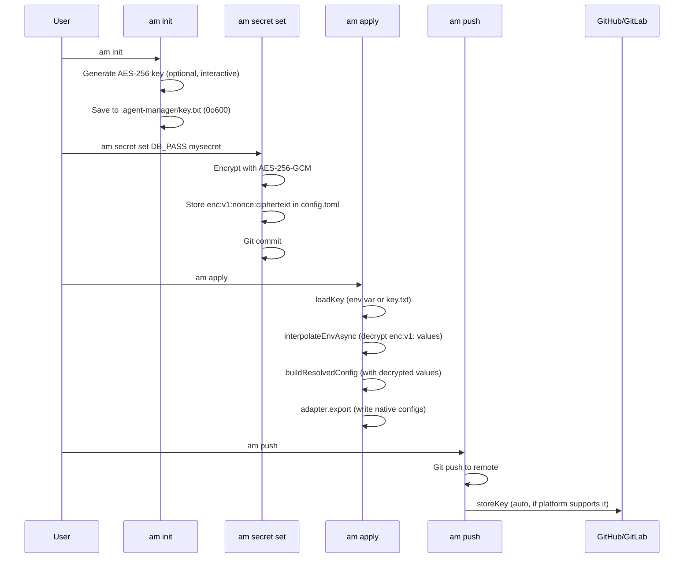
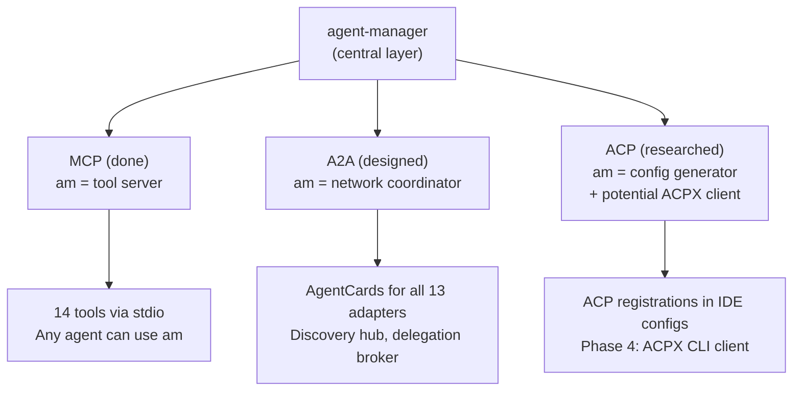

# agent-manager Project Snapshot

> **Timestamp:** 2026-04-09 11:55 AM PST
> **Branch:** main
> **HEAD:** `08091e9` (docs: ADR-0018 + ADR-0019)
> **Release:** v0.2.0 (3 platform binaries on GitHub Releases)
> **CI:** Green (last run: 24206291710)

---

## Session Summary

This snapshot captures the state of agent-manager after a single extended development
session that expanded the project from a functional MVP to a comprehensive multi-tool
agent configuration manager.

### Session Stats

| Metric | Start of Session | End of Session | Delta |
|--------|-----------------|----------------|-------|
| Source files | ~99 | 136 | +37 |
| Test files | 67 | 108 | +41 |
| Tests | 647 | 982 | +335 |
| Assertions | 1,569 | 2,604 | +1,035 |
| IDE Adapters | 8 | 13 | +5 |
| Platform Adapters | 2 (+1 stub) | 3 | +1 (GitLab complete) |
| MCP Tools | 11 | 14 | +3 |
| CLI Commands | 20 | 21 | +1 (session) |
| ADRs | 16 | 19 | +3 |
| Mermaid diagrams | 0 | 50 | +50 |
| Git commits | 0 | 27 | +27 |
| Agent teams spawned | 0 | 8 | — |
| Total agents dispatched | 0 | ~40 | — |

### Teams Spawned During Session

| # | Team | Purpose | Agents | Outcome |
|---|------|---------|--------|---------|
| 1 | am-phase2 | Build 5 adapters + session harvest + tests | 5 | 15/15 tasks completed |
| 2 | am-review | Multi-facet code/architecture review | 5 | 30 findings (7 P0, 10 P1) |
| 3 | am-fixes | Fix P0/P1 from review | 5 | All P0/P1 fixed |
| 4 | am-bugfix-loop | Fix bugs from Codex review + write tests | 4 | 5 Codex findings fixed |
| 5 | am-final-review | Deep review after all fixes | 5 | 9 bugs + 7 test gaps + 16 doc issues |
| 6 | am-docs | README rewrite + CLAUDE.md/CONTRIBUTING.md update | 2 | Comprehensive docs update |
| 7 | am-docs-overhaul | Mermaid diagram conversion + accuracy audit | 4 | 50 diagrams, 0 ASCII remaining |
| 8 | am-final-canvass | Final deep canvass across all layers | 4 | 11 code bugs, 19 doc issues, roadmap |

---

## What's DONE (Shipped, Tested, Documented)

### Core Engine — Complete

| Module | File | Status | Notes |
|--------|------|--------|-------|
| Config TOML read/write | `src/core/config.ts` | Done | 4-layer hierarchical merge |
| Profile resolver | `src/core/resolver.ts` | Done | Inheritance chains, tag activation |
| Git operations | `src/core/git.ts` | Done | isomorphic-git (pure JS) |
| Encryption | `src/core/secrets.ts` | Done | AES-256-GCM, HKDF for cookies |
| Instruction generation | `src/core/instructions.ts` | Done | 7 format generators |
| Session harvest | `src/core/session.ts` | Done | Types, filters, formatters |
| Schema validation | `src/core/schema.ts` | Done | Zod, 5 entity types |
| Resolved config builder | `src/core/config.ts` | Done | Maps all entity types (servers, instructions, skills, agents) |

### IDE Adapters — 13/13 Complete

| Adapter | Directory | Capabilities | Session Reader | Cross-Platform |
|---------|-----------|-------------|----------------|----------------|
| Claude Code | `src/adapters/claude-code/` | mcp, instructions, permissions, models, skills, plugins, agents, hooks | Yes | N/A (CLI) |
| Codex CLI | `src/adapters/codex-cli/` | mcp, instructions, permissions, agents | Yes | N/A (CLI) |
| Cursor | `src/adapters/cursor/` | mcp, instructions, agents | No | Partial (Windows path bug) |
| Copilot | `src/adapters/copilot/` | mcp, instructions | No | Yes |
| Windsurf | `src/adapters/windsurf/` | mcp, instructions | No | Partial (Windows path bug) |
| ForgeCode | `src/adapters/forgecode/` | mcp, instructions, skills, agents, models | No | Partial (Windows path bug) |
| Kilo Code | `src/adapters/kilo-code/` | mcp, instructions, skills, agents, modes | No | Yes (JSONC parser) |
| Kiro | `src/adapters/kiro/` | mcp, instructions, skills, agents | No | Yes |
| Gemini CLI | `src/adapters/gemini-cli/` | mcp, instructions | No | Yes |
| Cline | `src/adapters/cline/` | mcp, instructions | No | Yes (cross-platform globalStorage) |
| Roo Code | `src/adapters/roo-code/` | mcp, instructions, modes | No | Yes (cross-platform globalStorage) |
| Amazon Q | `src/adapters/amazon-q/` | mcp, instructions | No | Yes |
| Continue.dev | `src/adapters/continue/` | mcp, instructions | No | Yes |

### Platform Adapters — 3/3 Complete

| Platform | File | Auth | Key Storage | Key Retrieval |
|----------|------|------|-------------|---------------|
| GitHub | `src/platforms/github.ts` | `gh auth login` | `gh secret set` (write-only) | Returns null |
| GitLab | `src/platforms/gitlab.ts` | `glab auth login` | `glab variable set --project` | `glab variable get` |
| Bare git | `src/platforms/bare.ts` | N/A | N/A | N/A |

### CLI Commands — 21

| Group | Commands |
|-------|----------|
| Config Management | `init`, `add`, `list`, `config`, `profile` |
| Git Sync | `apply`, `status`, `push`, `pull`, `undo`, `log` |
| Tools/Diagnostics | `import`, `adapter`, `doctor`, `secret`, `version` |
| Session Harvest | `session list`, `session export`, `session search` |
| Interfaces | `mcp-serve`, `serve`, `tui` |

### MCP Server — 14 Tools, 3 Tiers

| Tier | Tools |
|------|-------|
| Read-only (always) | `am_list_servers`, `am_list_profiles`, `am_status`, `am_config_show`, `am_session_list`, `am_session_export`, `am_session_search` |
| Write-local (default) | `am_add_server`, `am_remove_server`, `am_use_profile`, `am_import`, `am_apply` |
| Write-remote (opt-in) | `am_sync_push`, `am_sync_pull` |

### Encryption Pipeline — Fully Wired



### Session Harvest — ADR-0016

| Component | File | Status |
|-----------|------|--------|
| Core types + filters | `src/core/session.ts` | Done |
| Claude Code reader | `src/adapters/claude-code/session.ts` | Done (JSONL parser) |
| Codex CLI reader | `src/adapters/codex-cli/session.ts` | Done (JSONL parser) |
| CLI commands | `src/commands/session.ts` | Done (list, export, search) |
| MCP tools | `src/mcp/server.ts` | Done (3 read-only tools) |
| Path traversal protection | Both session readers | Done (/, \, \0, .. rejected) |

### Security Hardening — ADR-0019

| Fix | File | Status |
|-----|------|--------|
| Path traversal (session IDs) | `claude-code/session.ts`, `codex-cli/session.ts` | Done |
| HKDF key derivation | `web/worker.ts` | Done |
| Set-Cookie headers | `web/worker.ts` | Done (Headers.append) |
| Key file permissions | `core/secrets.ts` | Done (0o600) |
| CORS lockdown | `web/worker.ts` | Done (removed wildcard) |
| Secret redaction | `mcp/server.ts` | Done (enc:v1: → [encrypted]) |
| am_apply tier | `mcp/server.ts` | Done (write-remote → write-local) |
| allow_apply removed from write-remote gate | `mcp/server.ts` | Done |

### TUI — Silvery Migration (ADR-0018)

| Component | File | Framework |
|-----------|------|-----------|
| App (tabs, navigation) | `src/tui/App.tsx` | Silvery |
| Dashboard | `src/tui/Dashboard.tsx` | Silvery |
| Profile switcher | `src/tui/ProfileSwitcher.tsx` | Silvery |
| Status view | `src/tui/StatusView.tsx` | Silvery |
| Help view | `src/tui/HelpView.tsx` | Silvery |
| Data loading | `src/tui/data.ts` | Pure TS |
| Build patch | `scripts/build.ts` | Patches @silvery/create for compile compat |

### Documentation — 19 ADRs

| ADR | Title | Status |
|-----|-------|--------|
| 0001 | Layered Core + Adapter Extensions | Accepted |
| 0002 | Git-Backed Everything | Accepted |
| 0003 | Hierarchical Config | Accepted |
| 0004 | TOML Config Format | Accepted |
| 0005 | Bidirectional Adapters | Accepted |
| 0006 | Drift Detection Over Overwrite | Accepted |
| 0007 | Two-Phase Zod Validation | Accepted |
| 0008 | Profile-Based Config Subsets | Accepted |
| 0009 | MCP Server Mode | Accepted |
| 0010 | BunTS Single Binary | Accepted |
| 0011 | Built-In Adapters | Accepted |
| 0012 | Application-Level Encryption | Accepted |
| 0013 | Git Platform Adapters | Accepted |
| 0014 | Workspace-to-Profile Import | Accepted |
| 0015 | Stateless Web UI | Accepted |
| 0016 | Session Harvest | Implemented (status says "proposed") |
| 0017 | Multi-Protocol Agent Integration (MCP + A2A + ACP) | Proposed |
| 0018 | TUI Framework — Silvery | Accepted |
| 0019 | Security Hardening | Accepted |

### Protocol Research — ADR-0017

| Protocol | Purpose | am's Role | Status |
|----------|---------|-----------|--------|
| MCP | Agent ↔ Tools/Data | Server (14 tools) | Done |
| A2A | Agent ↔ Agent | Network coordinator (AgentCard export, discovery hub) | Designed, Phases 1-3 |
| ACP | IDE ↔ Agent | Config generator (writes ACP registrations in IDE configs) | Researched |
| ACPX | CLI ↔ Agent | Potential ACP client (OpenClaw pattern) | Researched, Phase 4 |

### CI/CD — Green

| Workflow | Trigger | Status |
|----------|---------|--------|
| CI | Push to main, PRs | Green (lint + typecheck + tests + build) |
| Release | Tag `v*` | Working (3/5 platform binaries) |

### Release v0.2.0

| Platform | Binary | Status |
|----------|--------|--------|
| macOS arm64 (Apple Silicon) | `am-darwin-arm64` | Published |
| Linux x64 | `am-linux-x64` | Published |
| Linux arm64 | `am-linux-arm64` | Published |
| macOS x64 (Intel) | `am-darwin-x64` | Cancelled (runner timeout) |
| Windows x64 | `am-windows-x64.exe` | Failed (cross-platform test issues) |

---

## Known Issues (From Final Canvass — 2026-04-09 11:30 AM PST)

### Code Bugs — 11 findings

| # | Severity | Bug | File:Line |
|---|----------|-----|-----------|
| 1 | **HIGH** | TUI `handleApply` duplicates stale ResolvedConfig — drops instructions/skills/agents | `src/tui/index.tsx:43-69` |
| 2 | **HIGH** | Web `/api/apply` skips `interpolateEnvAsync` — encrypted env vars written raw | `src/web/server.ts:161` |
| 3 | **HIGH** | ForgeCode diff always returns "unmanaged" — projectPath never wired | `src/adapters/forgecode/diff.ts:31-33` |
| 4 | MEDIUM | Version hardcoded `v0.1.0` — BUILD_VERSION env var dead code | `src/commands/version.ts:6` |
| 5 | MEDIUM | Kiro frontmatter dropped on marker update; YAML injection via description | `src/core/instructions.ts:242-255` |
| 6 | MEDIUM | Windows `lastIndexOf("/")` breaks mkdir in cursor/forgecode export | `src/adapters/cursor/export.ts:77` |
| 7 | MEDIUM | Batch JSON-RPC not handled (MCP spec non-compliance) | `src/mcp/server.ts:880-905` |
| 8 | MEDIUM | Silvery build patch regex fragile — no warning on match failure | `scripts/build.ts:59-66` |
| 9 | LOW | `extraEnv` cannot override real env vars in interpolation | `src/core/secrets.ts:117` |
| 10 | LOW | Push/pull asymmetric double-check on permissions | `src/mcp/server.ts:717,736` |
| 11 | LOW | Session filter object inconsistency CLI vs MCP | `src/commands/session.ts:167` |

### Documentation Issues — 19 findings

| # | Severity | Issue | Location |
|---|----------|-------|----------|
| 1 | **HIGH** | `allow_apply` config example in README/design-spec — dead config | README:377, design-spec:627 |
| 2 | MEDIUM | CLAUDE.md: 647 tests, 67 files, 8 adapters, 20 subcommands — all stale | CLAUDE.md:19,27,43-58 |
| 3 | MEDIUM | ADR count says 17 everywhere — actual is 19 | README, CONTRIBUTING, AGENTS, design-spec |
| 4 | MEDIUM | ADR-0016 status "proposed" but session harvest is implemented | ADR-0016 frontmatter |
| 5 | MEDIUM | Design spec: TUI "Phase 4 Future", Web UI "Phase 5 Future" — both built | design-spec:116,796-811 |
| 6 | MEDIUM | Design spec: `src/core/diff.ts` listed but doesn't exist | design-spec:833 |
| 7 | MEDIUM | ADR-0001 claims 8 entity types; schema has 5 core entities | ADR-0001:38-39 |
| 8 | LOW | ADR-0011 registry example shows ~10 adapters; 13 exist | ADR-0011:35-49 |
| 9 | LOW | ADR-0015 presents SQLite/Redis as live options; Workers was chosen | ADR-0015:111-119 |
| 10 | LOW | Research index missing doc 17 | research/index |

### Test Gaps — 6 untested modules

| Module | Risk | Notes |
|--------|------|-------|
| `src/lib/output.ts` | Medium | JSON/quiet/verbose mode interactions untested |
| `src/lib/errors.ts` | Low-Medium | AmError, formatError used everywhere |
| `src/commands/mcp-serve.ts` | Medium | stdio lifecycle wiring untested |
| `src/commands/serve.ts` | Low | Thin wrapper |
| MCP session tools | Medium | Only tested with empty-result adapters |
| Worker HKDF derivation | Medium | Not directly tested |

### CI/CD Issues — 5 findings

| # | Severity | Issue |
|---|----------|-------|
| 1 | HIGH | `typecheck || true` masks real type errors |
| 2 | HIGH | npm publish missing `.npmrc` auth setup |
| 3 | MEDIUM | VERSION env var dead — version.ts hardcodes v0.1.0 |
| 4 | MEDIUM | macOS 13 runner being deprecated |
| 5 | LOW | CI only runs on macOS — no Linux test runner |

---

## What's NOT Built (Prioritized Roadmap)

### P0 — Fix Known Bugs

| Item | Effort | Impact |
|------|--------|--------|
| Fix TUI handleApply (use buildResolvedConfig) | S | HIGH — silent data loss |
| Fix web server /api/apply encryption skip | S | HIGH — silent data loss |
| Fix ForgeCode diff dead code | S | HIGH — drift detection broken |
| Fix VERSION hardcode in version.ts | S | MEDIUM — binary shows wrong version |
| Fix CLAUDE.md stale numbers (647→982, 8→13, etc.) | S | MEDIUM — AI sessions get wrong info |
| Fix ADR count 17→19 across all docs | S | LOW — consistency |

### P1 — High Value Features

| Item | Effort | Impact |
|------|--------|--------|
| MCP Registry integration (`am search`, `am install`) | M | HIGH — #1 gap vs MCPM |
| Kilo Code + Roo Code session readers | M | HIGH — session harvest completeness |
| Homebrew formula + tap repo | S | HIGH — macOS adoption |
| `am import --all` auto-import | S | MEDIUM — onboarding UX |
| `am doctor` tool-discovery hints | S | MEDIUM — post-init UX |
| npm publish `.npmrc` fix | S | MEDIUM — distribution |
| Fix typecheck `|| true` (add @ts-ignore to 3 citty sites) | S | MEDIUM — CI safety |

### P2 — Strategic

| Item | Effort | Impact |
|------|--------|--------|
| A2A Phase 1: schema conventions | S | MEDIUM |
| A2A Phase 2: AgentCard export | M | MEDIUM |
| Gitea/Forgejo platform adapter | S | MEDIUM |
| Web UI config editor | M | MEDIUM |
| Linux CI runner | S | MEDIUM |
| Windows test fixes | M | MEDIUM |

### P3 — Long Horizon

| Item | Effort | Impact |
|------|--------|--------|
| A2A Phase 3: server mode (agent network coordinator) | L | HIGH (future) |
| ACP Phase 4: ACPX client integration | L | MEDIUM (future) |
| External adapter subprocess (ADR-0011) | M | LOW |
| Per-user age encryption (ADR-0012 Phase 2) | M | LOW |
| Agent templates / profile sharing | M | MEDIUM |

---

## Competitive Position

| Feature | MCPM | Smithery | MCP-Hub | **am v0.2.0** |
|---------|------|---------|---------|--------------|
| Cross-tool adapters | 9 | Agent-only | Any MCP | **13** |
| Git-based sync | No | No (cloud) | No | **Yes** |
| TOML config | No | No | JSON5 | **Yes** |
| Profile inheritance | Basic | No | No | **Yes (deep)** |
| Session harvest | No | No | No | **Yes (unique)** |
| MCP server mode | No | No | No | **Yes (14 tools)** |
| Single binary | No (Python) | No (Node) | No (Node) | **Yes (Bun)** |
| Web UI | No | Yes | Pending | **Yes** |
| TUI | Pending | No | Pending | **Yes** |
| Encryption | No | Cloud | No | **Yes (AES-256-GCM)** |
| MCP registry | **Yes** | Yes | No | **No (gap)** |

**#1 competitive gap:** MCP registry integration. MCPM has `mcpm search` / `mcpm install`.

---

## Architecture Diagram (Current State)

```mermaid
graph TD
    subgraph Interfaces
        CLI["CLI<br/>(citty + @clack)"]
        MCP["MCP Server<br/>(14 tools, 3 tiers)"]
        TUI["TUI<br/>(Silvery + React)"]
        Web["Web UI<br/>(Hono local + CF Workers)"]
    end

    subgraph Core
        Config["Config Store<br/>(TOML r/w, 4-layer merge)"]
        Resolver["Profile Resolver<br/>(inheritance, tags)"]
        Secrets["Secrets<br/>(AES-256-GCM, HKDF)"]
        Git["Git<br/>(isomorphic-git)"]
        Session["Session Harvest<br/>(JSONL parse, filter)"]
        Instructions["Instructions<br/>(7 format generators)"]
    end

    subgraph "IDE Adapters (13)"
        CC["Claude Code"]
        CX["Codex CLI"]
        CU["Cursor"]
        CP["Copilot"]
        WS["Windsurf"]
        FC["ForgeCode"]
        KC["Kilo Code"]
        KI["Kiro"]
        GC["Gemini CLI"]
        CL["Cline"]
        RC["Roo Code"]
        AQ["Amazon Q"]
        CO["Continue.dev"]
    end

    subgraph "Platform Adapters (3)"
        GH["GitHub"]
        GL["GitLab"]
        BG["Bare Git"]
    end

    CLI --> Config
    MCP --> Config
    TUI --> Config
    Web --> Config

    Config --> Resolver
    Resolver --> Secrets
    Config --> Git

    Resolver --> CC
    Resolver --> CX
    Resolver --> CU
    Resolver --> CP
    Resolver --> WS
    Resolver --> FC
    Resolver --> KC
    Resolver --> KI
    Resolver --> GC
    Resolver --> CL
    Resolver --> RC
    Resolver --> AQ
    Resolver --> CO

    Git --> GH
    Git --> GL
    Git --> BG
```



## Protocol Landscape (Future)



---

## File Counts (Verified)

```
src/               136 TypeScript files
  core/              7 files (config, git, instructions, resolver, schema, secrets, session)
  adapters/         13 directories × ~6 files each = ~85 files + registry + types
  commands/         22 files (21 commands + init-project helper)
  mcp/               1 file (server.ts, 918 lines)
  tui/               7 files (index, App, Dashboard, ProfileSwitcher, StatusView, HelpView, data)
  web/               2 files (server.ts, worker.ts) + public/
  platforms/         5 files (github, gitlab, bare, registry, types)
  lib/               2 files (output, errors)

test/              108 test files
  core/              8 files
  adapters/         ~72 files (13 adapters × ~5-6 each + registry)
  commands/         19 files
  mcp/               1 file
  tui/               1 file
  web/               2 files
  platforms/         4 files
  integration/       2 files
  helpers/           1 file

ADRs/               19 files (0001-0019 + README + template)
research/           13 files (01-12 + 17)
docs/                3 files (design spec, adapter guide, this snapshot)
```

---

*This snapshot was generated during an extended development session using
Claude Opus 4.6 (1M context) with 8 agent teams (~40 total agents) for
parallel implementation, multi-facet review, and comprehensive documentation.*
