# System Architecture Guide

> Technical reference for how `am` is structured internally. For contributors building
> new features and AI agents that need to understand the codebase to make changes.
>
> All file paths are relative to the repository root. All type names reference actual
> TypeScript types in the codebase.

---

## 1. System Overview

`am` follows a **Layered Core + Dual-Axis Adapter Extensions** architecture (ADR-0001,
ADR-0013). Four interface layers (CLI, MCP, TUI, Web) all route through a single core
engine, which delegates to two adapter axes: IDE adapters (13 tools) and platform
adapters (3 git hosts).

### Layer Diagram

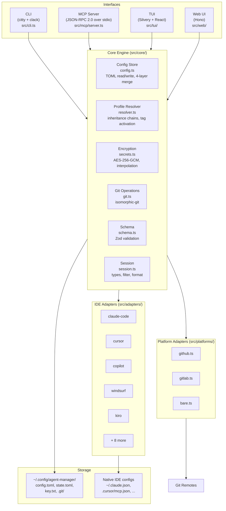

### Data Flow Summary

All user-facing operations follow the same pattern:
1. **Interface** receives user intent (CLI command, MCP tool call, web API request)
2. **Core** loads config, resolves profile, decrypts secrets, builds `ResolvedConfig`
3. **IDE adapters** translate `ResolvedConfig` into native config files (export) or
   parse native files back into core format (import)
4. **Platform adapters** handle git remote authentication and key storage for push/pull

---

## 2. Core Engine

The core engine in `src/core/` owns the universal data model, config loading and
merging, profile resolution, encryption, git operations, and session types.

### Type Relationships

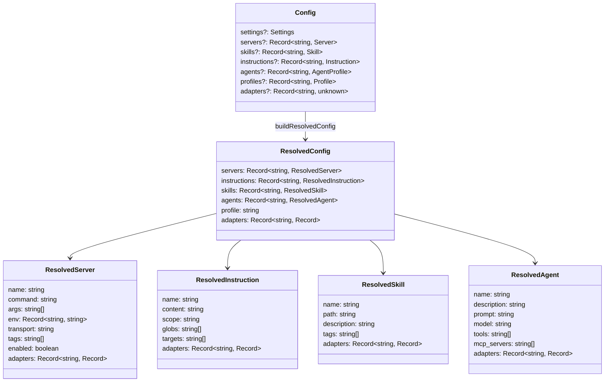

### Config Loading Pipeline

`loadResolvedConfig()` in `src/core/config.ts` implements the 4-layer merge:

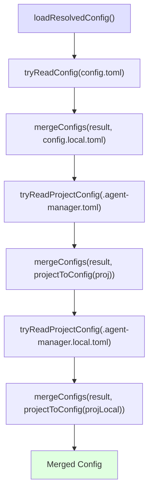

Each `mergeConfigs(a, b)` call applies these rules:
- **Servers, skills, instructions, agents, profiles**: spread merge (`{...a, ...b}`) --
  same-name key in `b` wins
- **Settings**: spread merge -- per-key override
- **Adapters**: spread merge by adapter name

### Profile Resolution

`resolveProfile()` in `src/core/resolver.ts` walks the inheritance chain:

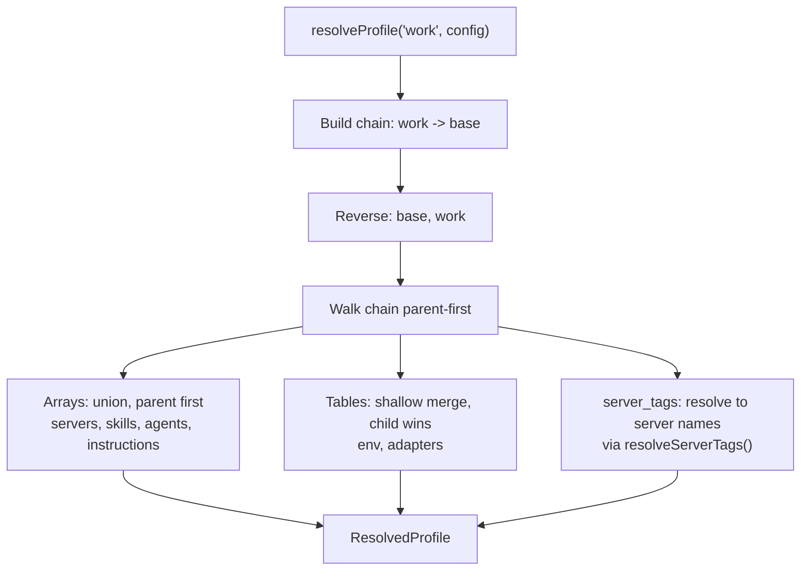

Tag resolution: `resolveServerTags()` scans the server catalog and returns all server
names whose tags overlap with the requested `server_tags` array. Disabled servers
(`enabled = false`) are skipped.

---

## 3. Adapter Architecture

All 13 IDE adapters implement the `Adapter` interface defined in `src/adapters/types.ts`.

### Adapter Interface

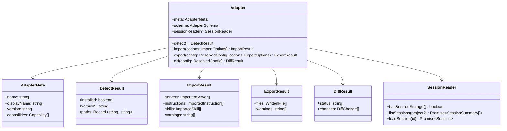

### Adapter Lifecycle

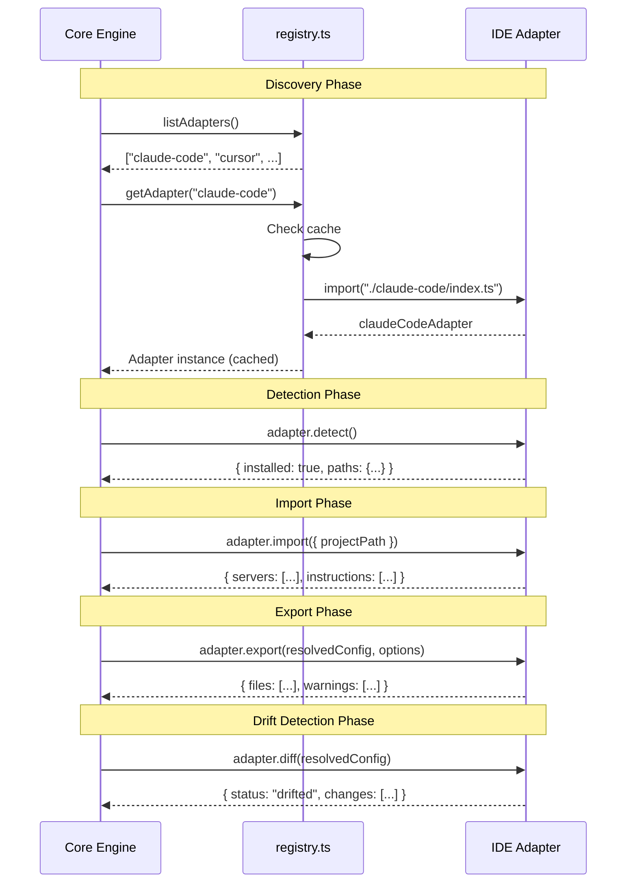

### Registry: Lazy Loading + Caching

The adapter registry in `src/adapters/registry.ts` uses a lazy factory pattern:

```typescript
const ADAPTER_FACTORIES: Record<string, AdapterFactory> = {
  "claude-code": async () => {
    const { claudeCodeAdapter } = await import("./claude-code/index.ts");
    return claudeCodeAdapter;
  },
  // ... 12 more
};
const adapterCache = new Map<string, Adapter>();
```

Key properties:
- **Lazy loading**: adapter code is only imported when first requested via `getAdapter()`
- **Cache**: once loaded, the adapter instance is cached in `adapterCache`
- **Detection**: `getDetectedAdapters()` iterates all factories, loads each adapter,
  and returns only those where `detect().installed === true`

### Two-Phase Validation (ADR-0007)

Validation happens in two passes:

1. **Phase 1 -- Core validation**: `ConfigSchema.parse(parsed)` in `src/core/schema.ts`
   validates all core fields strictly. Adapter sections (`[servers.X.adapters.Y]`)
   are typed as `z.record(z.string(), z.unknown()).optional()` -- preserved but not
   validated.

2. **Phase 2 -- Adapter validation**: Each adapter's `schema` property contains Zod
   schemas for its own section. When the adapter processes its data (during import or
   export), it validates its portion.

This allows adding adapter-specific fields without changing the core schema.

### Adapter File Structure

Each adapter follows the same directory layout:

```
src/adapters/<name>/
  index.ts    -- wires detect + import + export + diff into Adapter object
  detect.ts   -- checks if tool is installed, returns config file paths
  import.ts   -- parses native config files into ImportResult
  export.ts   -- writes ResolvedConfig to native config files
  diff.ts     -- structural comparison for drift detection
  schema.ts   -- Zod schemas for adapter-specific TOML fields
```

---

## 4. Platform Adapter Architecture

Platform adapters handle git remote detection, authentication, and encryption key
storage for the three supported git hosting platforms.

### Platform Detection

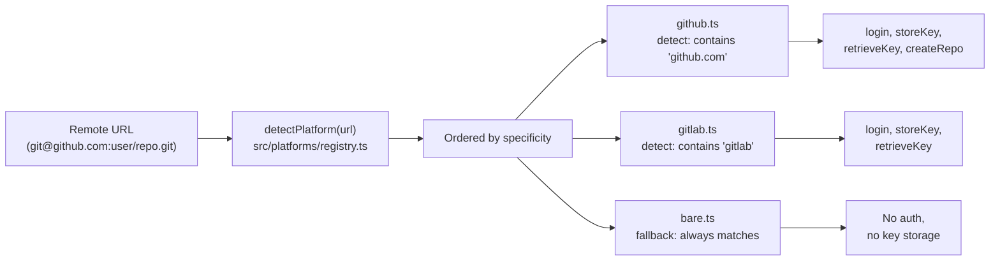

### GitPlatformAdapter Interface

```typescript
interface GitPlatformAdapter {
  meta: { name: string; displayName: string };
  detect(remoteUrl: string): boolean;
  login?(): Promise<AuthResult>;
  isAuthenticated?(): Promise<boolean>;
  storeKey?(repoUrl: string, key: string): Promise<void>;
  retrieveKey?(repoUrl: string): Promise<string | null>;
  createRepo?(name: string, options: RepoOptions): Promise<string>;
}
```

Detection is ordered by specificity in `src/platforms/registry.ts`: GitHub first,
GitLab second, bare as fallback. The `PLATFORMS` array order matters -- the first
adapter whose `detect()` returns `true` wins.

The `storeKey()` and `retrieveKey()` methods enable encryption key distribution
through platform-native secret stores (GitHub Secrets, GitLab CI/CD Variables).
The bare adapter has no key storage capability.

---

## 5. MCP Server Architecture

`am mcp-serve` implements a JSON-RPC 2.0 server over stdio, exposing 14 tools
across 3 permission tiers.

### Server Architecture

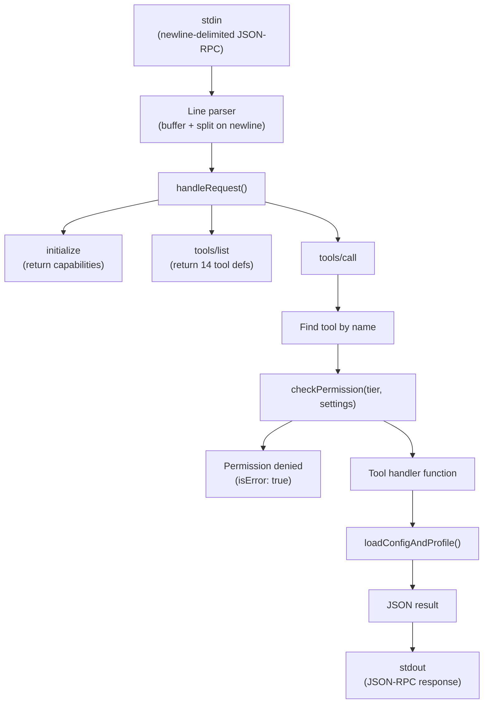

### Tool Registry Pattern

Tools are defined as `ToolEntry` objects in the `defineTools()` function:

```typescript
interface ToolEntry {
  def: McpToolDef;           // name, description, inputSchema
  tier: ToolTier;            // "read-only" | "write-local" | "write-remote"
  handler: (args) => Promise<unknown>;
}
```

### Permission Gate Logic

```typescript
function checkPermission(tier, settings) {
  if (tier === "read-only" || tier === "write-local") return { allowed: true };
  if (tier === "write-remote") {
    if (settings?.mcp_serve?.allow_push) return { allowed: true };
    return { allowed: false, reason: "..." };
  }
}
```

Key security measures:
- `am_config_show` redacts all `enc:v1:*` values to `[encrypted]`
- Write-remote tools require explicit config opt-in
- `am_apply` is write-local (only writes local native config files)

### All 14 Tools

| Tool | Tier | Purpose |
|------|------|---------|
| `am_list_servers` | read-only | List MCP servers in catalog |
| `am_list_profiles` | read-only | List profiles with active indicator |
| `am_status` | read-only | Drift detection + git sync state |
| `am_config_show` | read-only | Show resolved config (secrets redacted) |
| `am_session_list` | read-only | List sessions across tools |
| `am_session_export` | read-only | Export session with filters |
| `am_session_search` | read-only | Full-text search across sessions |
| `am_add_server` | write-local | Add server to catalog + commit |
| `am_remove_server` | write-local | Remove server + commit |
| `am_use_profile` | write-local | Switch active profile |
| `am_import` | write-local | Import from native config |
| `am_apply` | write-local | Generate native IDE configs |
| `am_sync_push` | write-remote | Push config to git remote |
| `am_sync_pull` | write-remote | Pull config from git remote |

---

## 6. Encryption Architecture

`am` uses AES-256-GCM symmetric encryption via Web Crypto API for secrets in TOML.
Implementation is in `src/core/secrets.ts`.

### Crypto Pipeline

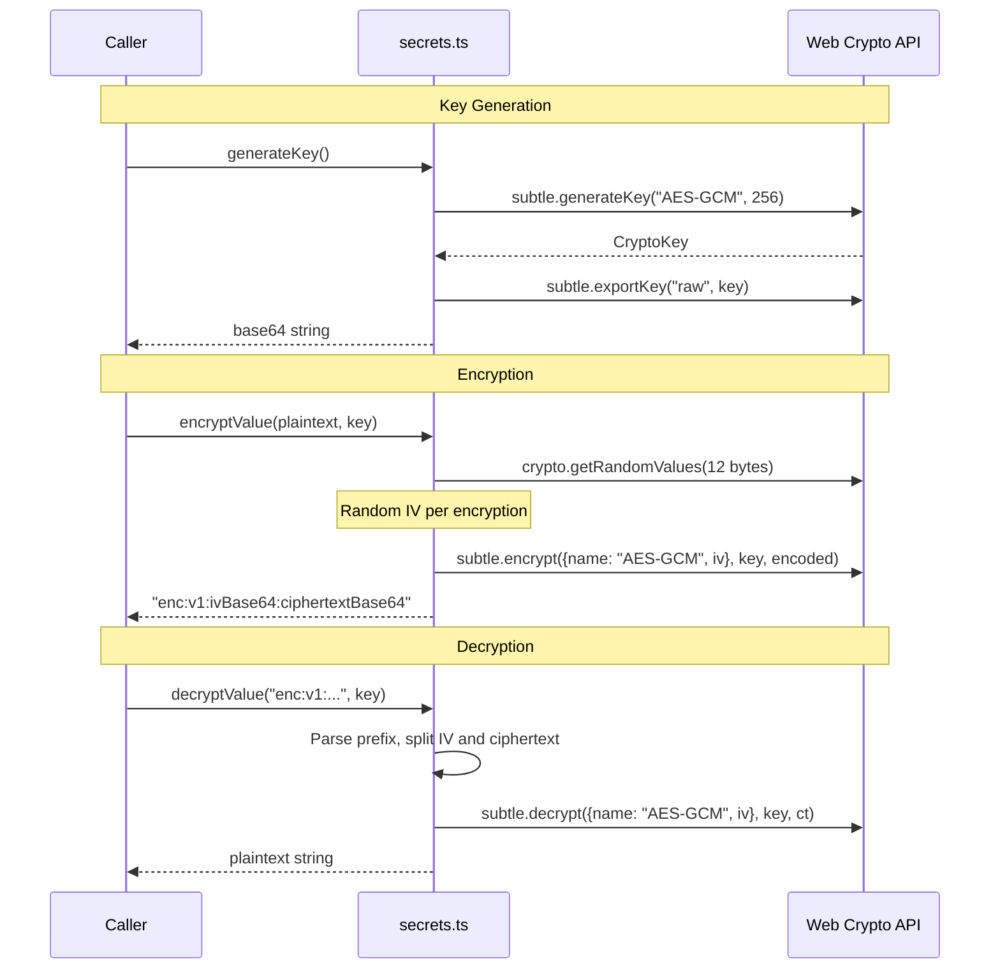

### Key Functions

| Function | File | Purpose |
|----------|------|---------|
| `generateKey()` | `secrets.ts` | Generate 256-bit AES key, return base64 |
| `importKey(base64)` | `secrets.ts` | Import base64 string as CryptoKey |
| `loadKey(configDir)` | `secrets.ts` | Load key from env var or file |
| `saveKey(configDir, base64)` | `secrets.ts` | Write key to `.agent-manager/key.txt` (mode 0o600) |
| `encryptValue(plaintext, key)` | `secrets.ts` | AES-256-GCM encrypt, return `enc:v1:...` |
| `decryptValue(encrypted, key)` | `secrets.ts` | Decrypt `enc:v1:...`, passthrough non-encrypted |
| `isEncrypted(value)` | `secrets.ts` | Check if string starts with `enc:v1:` |
| `interpolateEnv(config)` | `secrets.ts` | Resolve `${VAR}` references synchronously |
| `interpolateEnvAsync(config, opts)` | `secrets.ts` | Resolve vars + decrypt `enc:v1:` values |

### Key Storage Locations

| Location | Priority | Use Case |
|----------|----------|----------|
| `AM_ENCRYPTION_KEY` env var | 1 (highest) | CI/CD, containers |
| `.agent-manager/key.txt` file | 2 | Local development (default) |
| Platform secrets (GitHub/GitLab) | via `am push` | Cross-machine distribution |

### HKDF for Session Cookies

The Cloudflare Workers web UI (`src/web/worker.ts`) uses HKDF to derive a separate
AES-256-GCM key from the `SESSION_SECRET` for encrypting session cookies. This is
separate from the config encryption pipeline:

```typescript
async function deriveKey(secret: string): Promise<CryptoKey> {
  const keyMaterial = await crypto.subtle.importKey("raw", encode(secret), "HKDF", false, ["deriveKey"]);
  return crypto.subtle.deriveKey({
    name: "HKDF", hash: "SHA-256",
    salt: encode("agent-manager-session"),
    info: encode("aes-gcm-key"),
  }, keyMaterial, { name: "AES-GCM", length: 256 }, false, ["encrypt", "decrypt"]);
}
```

---

## 7. Session Harvest Architecture

Session harvest (ADR-0016) provides cross-tool AI coding session discovery, export,
and search. The implementation spans `src/core/session.ts` (types and pure functions)
and adapter-level `SessionReader` implementations.

### Session Type Model

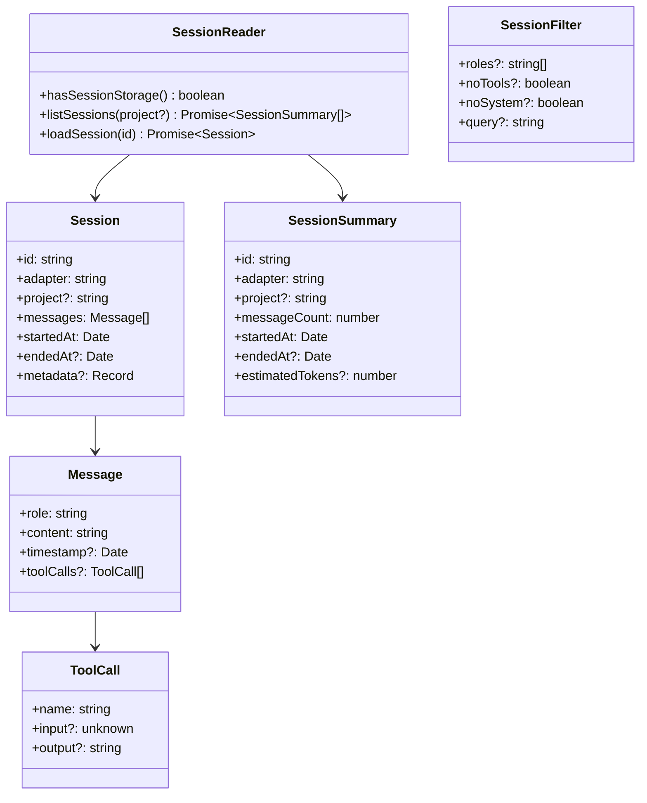

### Filter Pipeline

`filterMessages()` in `src/core/session.ts` applies filters in a fixed order:

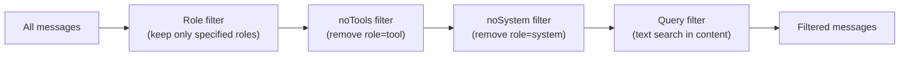

### Formatting

Two output formatters:
- `formatMarkdown(session, filter?)` -- generates a markdown document with headers
  per message, tool call blocks, and session metadata
- `formatJson(session, filter?)` -- returns a JSON-serializable object with ISO
  timestamps, message array, and metadata

Token estimation: `estimateTokens(text)` uses a rough 4-characters-per-token
heuristic, suitable for cost estimation and sorting.

### Adapter Support

SessionReader is optional on the `Adapter` interface. Currently implemented by:
- **Claude Code**: reads JSONL from `~/.claude/projects/<encoded-path>/*.jsonl`
- **Codex CLI**: reads JSONL from `~/.codex/sessions/YYYY/MM/DD/*.jsonl`

Other adapters do not implement `SessionReader` because their tools either do not
persist sessions locally or use undocumented formats.

---

## 8. Web Architecture

`am` includes two web deployments: a local Hono server for desktop use and a
Cloudflare Workers deployment for browser-based management from any device.

### Local Server vs Cloudflare Workers

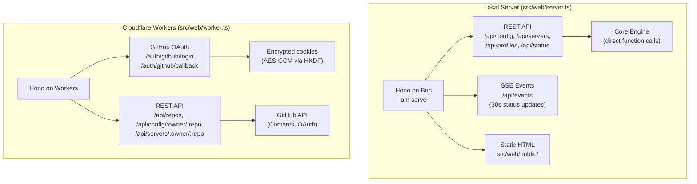

### Key Architectural Differences

| Aspect | Local Server | Cloudflare Workers |
|--------|-------------|-------------------|
| Config access | Direct filesystem | GitHub API |
| Authentication | None (localhost) | GitHub OAuth |
| Session storage | None needed | Encrypted cookies |
| State | Full core engine | Stateless (zero KV/D1/R2) |
| Apply support | Yes (`/api/apply`) | No (no filesystem) |
| Real-time | SSE events | Not implemented |

### OAuth Flow (Cloudflare Workers)

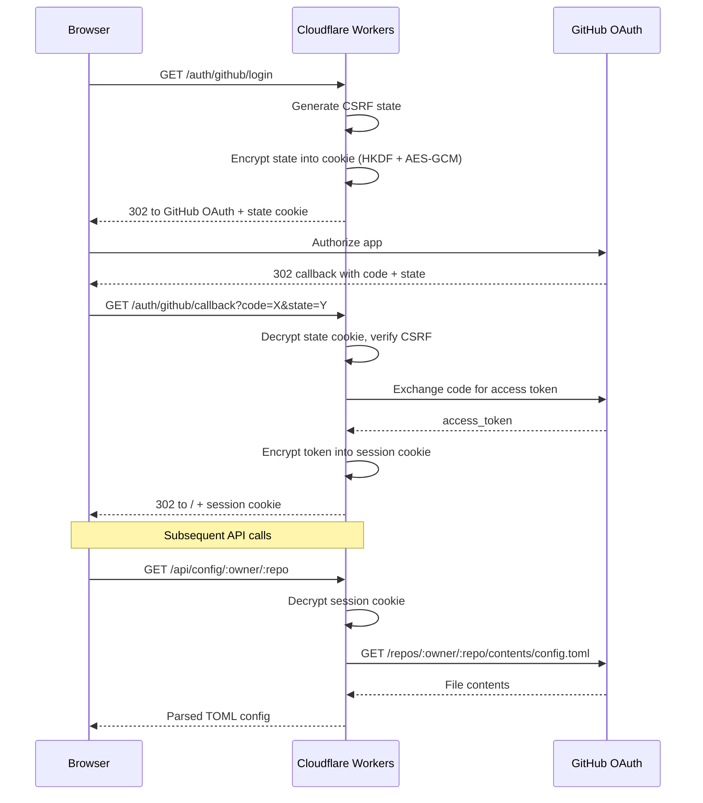

### Stateless Design (ADR-0015)

The Workers deployment uses zero persistent storage. Config lives in the user's
GitHub repository (accessed via API). Sessions use AES-GCM encrypted cookies
derived via HKDF from the `SESSION_SECRET`. Each cookie contains the GitHub
access token encrypted with a 256-bit key. No KV, D1, or R2 bindings are used.

---

## 9. TUI Architecture

The terminal UI (`am tui`) uses Silvery (a React-for-terminals framework) with
Flexily for layout (ADR-0018).

### Component Hierarchy

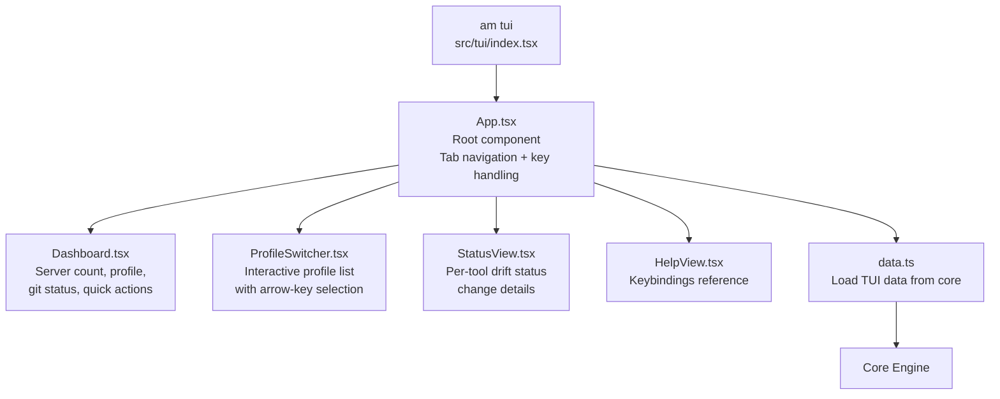

### Views and Navigation

The TUI has four views, switchable via tab bar or keyboard shortcuts:

| View | Key | Component | Data Source |
|------|-----|-----------|-------------|
| Dashboard | `1` | `Dashboard.tsx` | Config, git status, adapter list |
| Profiles | `2` or `p` | `ProfileSwitcher.tsx` | Profile definitions |
| Status | `3` or `t` | `StatusView.tsx` | `adapter.diff()` per tool |
| Help | `?` | `HelpView.tsx` | Static keybindings |

Global keybindings: `q` (quit), `s` (sync), `a` (apply), `Tab` (cycle views).

### Why Silvery (ADR-0018)

Silvery replaced Ink because Ink's Yoga WASM dependency breaks `bun build --compile`.
Silvery uses Flexily (pure TypeScript layout engine) which compiles cleanly into the
single binary. The migration preserved all existing views and the React-like component
model (JSX, hooks, declarative rendering).

---

## 10. Build System

The build system in `scripts/build.ts` produces single-binary executables via
`bun build --compile`.

### Build Pipeline

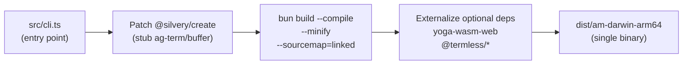

### The Silvery Patch Mechanism

`scripts/build.ts` patches `@silvery/create/src/create-app.tsx` before compilation.
The patch replaces a dynamic `require("@silvery/ag-term/buffer")` -- which only runs
on render mismatch detection -- with a no-op stub. This prevents a bundler resolution
failure without affecting runtime behavior.

The original file is backed up to `create-app.tsx.bak` and the patch is idempotent
(re-running build does not re-patch an already-patched file).

### Externalized Dependencies

Five optional Silvery dependencies are externalized via `--external` flags:

| Package | Why Externalized |
|---------|-----------------|
| `yoga-wasm-web` | WASM blob, not needed (Flexily replaces Yoga) |
| `yoga-wasm-web/auto` | Auto-loader for above |
| `@termless/core` | Headless testing framework, not needed at runtime |
| `@termless/xtermjs` | Xterm.js integration for testing |
| `@termless/ghostty` | Ghostty terminal integration for testing |

### Cross-Platform Targets

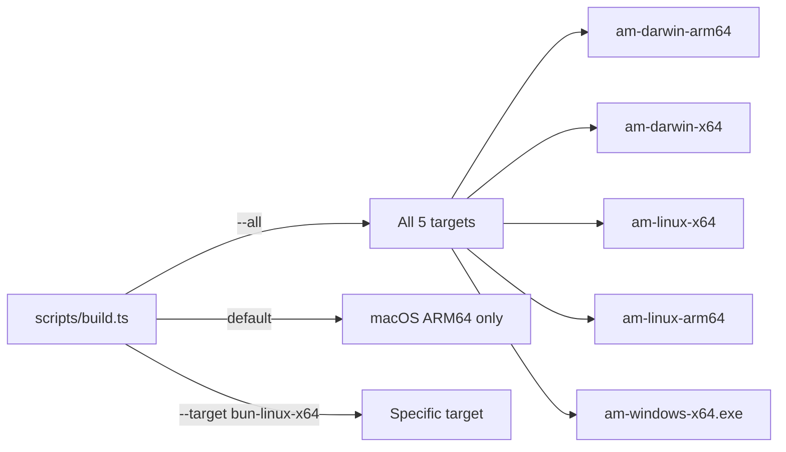

---

## 11. Protocol Landscape

`am` sits at the center of three agent interoperability protocols (ADR-0017).

### Protocol Map

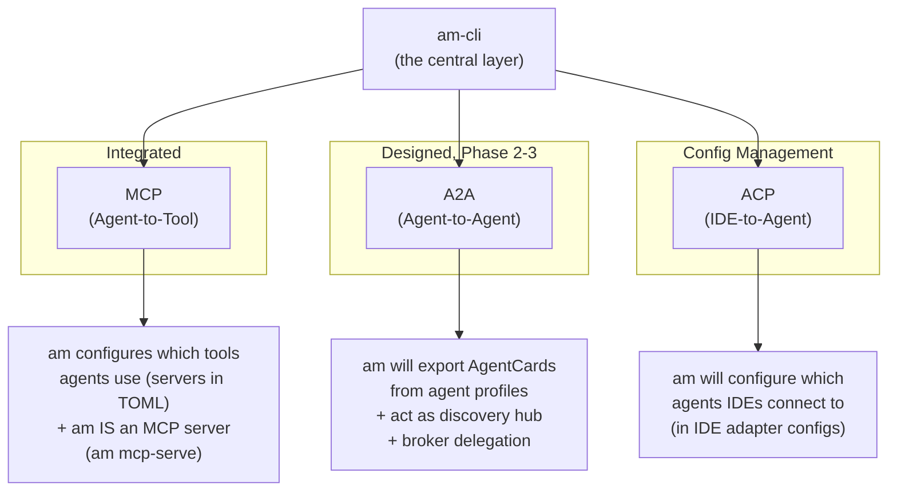

### How Each Protocol Fits

| Protocol | am's Relationship | Status |
|----------|------------------|--------|
| **MCP** | am configures MCP servers AND implements an MCP server | Done (14 tools) |
| **A2A** | am will participate as discovery hub and delegation broker | Designed (ADR-0017 Phase 2-3) |
| **ACP** | am will generate ACP agent registrations in IDE configs | Designed (ADR-0017 Phase 1c) |

### Future Integration Points

- **A2A AgentCard export**: `am a2a export` generates AgentCards from `[agents]`
  profiles with `adapters.a2a` metadata
- **A2A server**: `am a2a serve` publishes all managed agents at
  `/.well-known/agent.json` for discovery
- **ACP config generation**: Kiro adapter extension to emit ACP agent registrations
  when Kiro ships its ACP config format

---

## 12. Data Flow Diagrams

### Export Flow: config.toml to Native Files

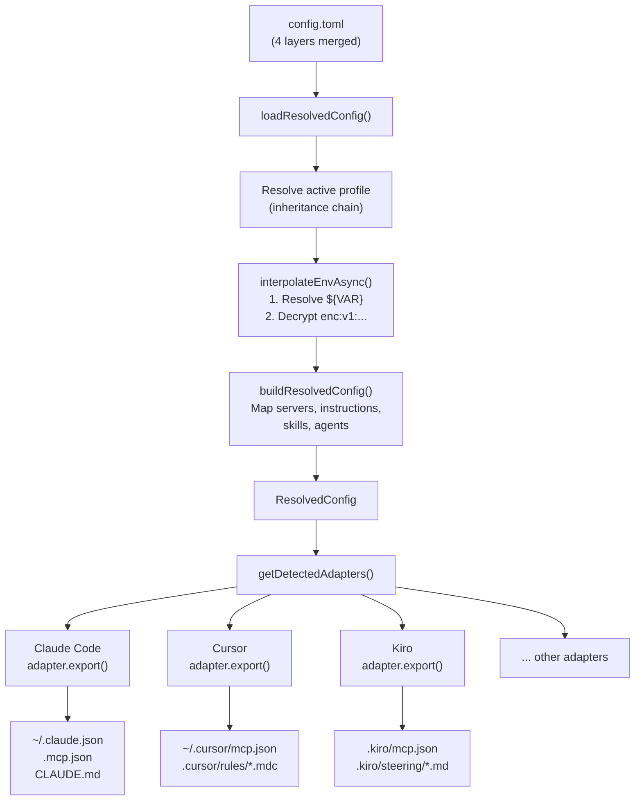

### Import Flow: Native Files to config.toml

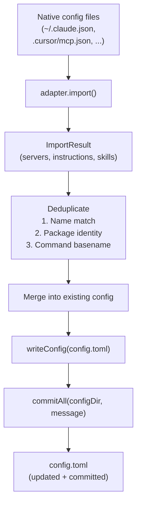

### Full Round-Trip

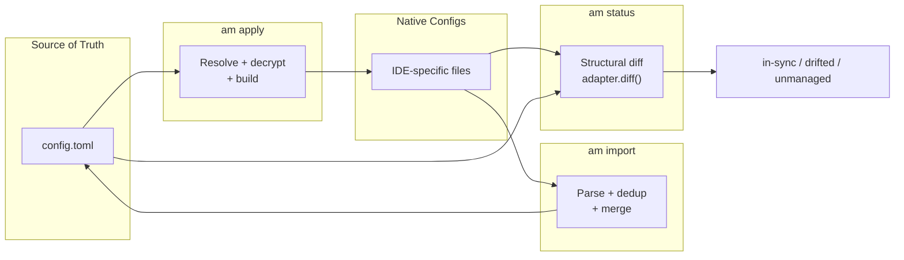
