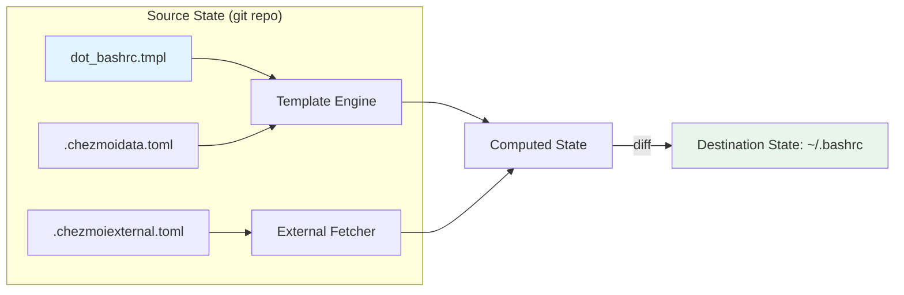
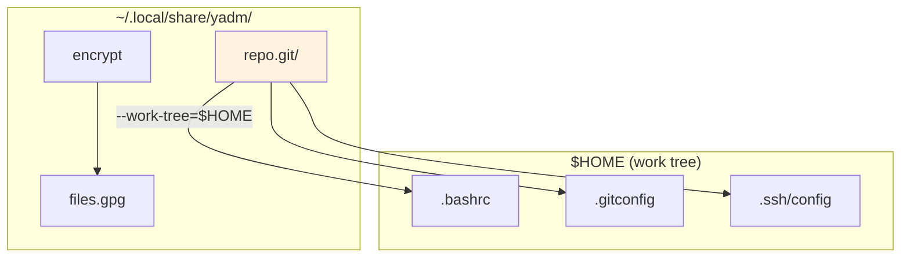
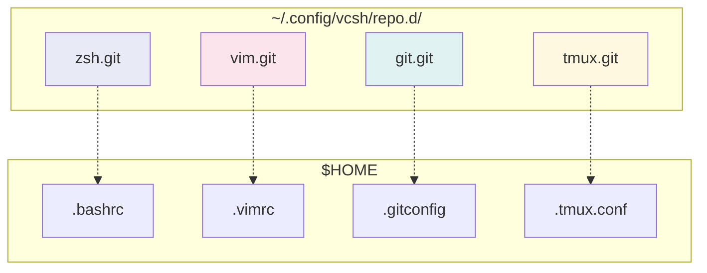
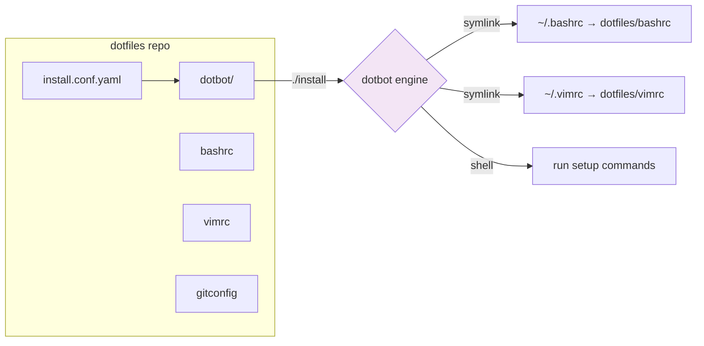
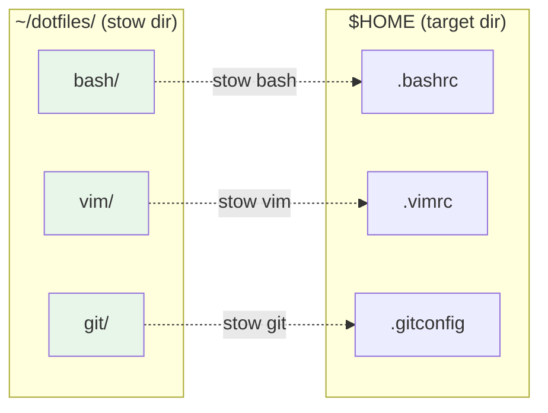
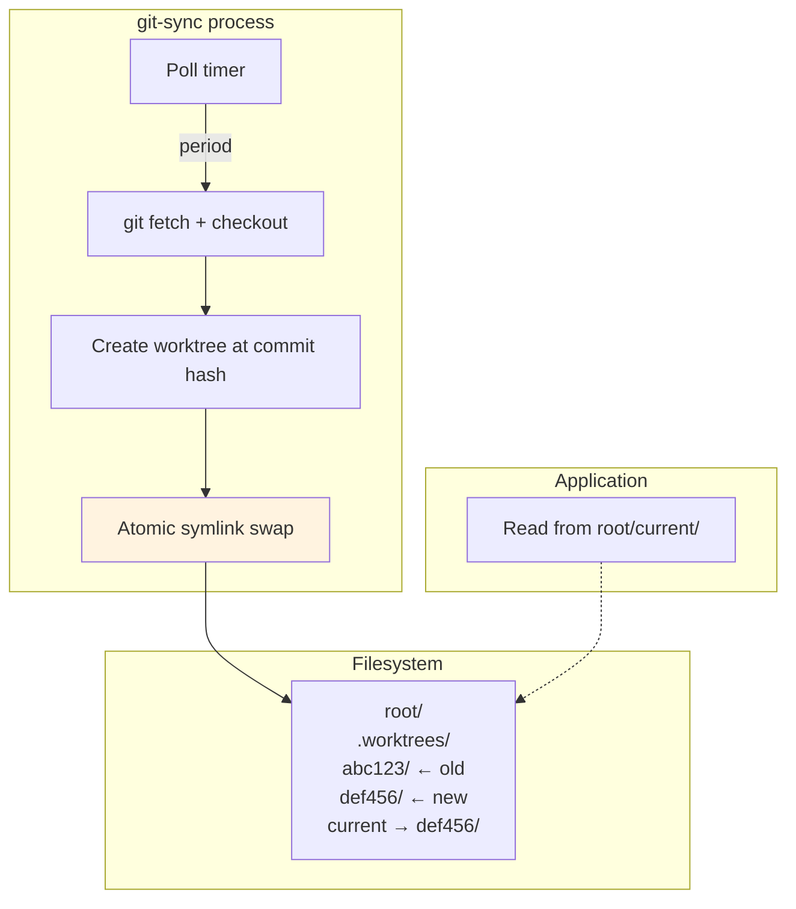
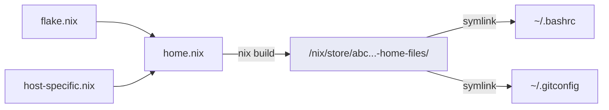
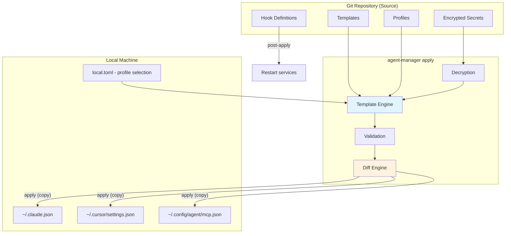

# Git-as-Backend Configuration Sync Patterns

> [!info] Research Context
> This document surveys how existing tools use git as a backend for configuration
> synchronization across machines. The patterns extracted here inform the design of
> **agent-manager** — a tool for syncing AI agent configurations (MCP servers,
> plugins, skills, hooks, settings) across development environments.
>
> Cross-references: [[01-existing-mcp-sync-tools]], [[08-agent-manager-architecture-design]]

## Table of Contents

1. [Tool Survey](#tool-survey)
   - [chezmoi — The Gold Standard](#chezmoi--the-gold-standard)
   - [yadm — Git Wrapper Approach](#yadm--git-wrapper-approach)
   - [vcsh — Multiple Repos in $HOME](#vcsh--multiple-repos-in-home)
   - [dotbot — YAML-Configured Symlink Manager](#dotbot--yaml-configured-symlink-manager)
   - [GNU Stow — Symlink Farm Manager](#gnu-stow--symlink-farm-manager)
   - [git-sync — Kubernetes Sidecar Pattern](#git-sync--kubernetes-sidecar-pattern)
   - [home-manager (Nix) — Declarative Home Directory](#home-manager-nix--declarative-home-directory)
   - [dotter — Rust-Based with TOML + Handlebars](#dotter--rust-based-with-toml--handlebars)
   - [Other Notable Tools](#other-notable-tools)
2. [Comparative Analysis](#comparative-analysis)
3. [Extracted Patterns](#extracted-patterns)
4. [Lessons for agent-manager](#lessons-for-agent-manager)

---

## Tool Survey

### chezmoi — The Gold Standard

| Attribute | Detail |
|-----------|--------|
| **Language** | Go |
| **Stars** | ~14k |
| **Architecture** | Source directory + declarative apply |
| **Config format** | TOML (primary), YAML, JSON |
| **Templating** | Go `text/template` |
| **Encryption** | age, GPG, rage |
| **Multi-machine** | Templates + `.chezmoidata` + `.chezmoiignore` |

#### Core Architecture

chezmoi uses a **source state / destination state** model. The source state lives in
`~/.local/share/chezmoi/` (a regular git repo), and the destination state is your actual
`$HOME`. chezmoi never modifies the source state during `apply` — it reads the source,
evaluates templates, compares with the destination, and applies diffs.



**Key design decisions:**

1. **Source directory naming convention** — Files are named with attribute prefixes:
   `dot_`, `private_`, `executable_`, `readonly_`, `encrypted_`, `run_`, `modify_`,
   `create_`, `remove_`, `symlink_`, etc. This encodes file metadata in the filename
   itself, avoiding a separate manifest.

2. **One-shot apply model** — `chezmoi apply` is idempotent and declarative. It
   computes the desired state, diffs against current state, and applies only what
   changed. No daemon, no file watchers.

3. **Two-phase operation** — `chezmoi diff` shows what would change, `chezmoi apply`
   executes it. This is analogous to `terraform plan` / `terraform apply`.

#### Template System

chezmoi uses Go's `text/template` with extensive custom functions:

```go
// Machine-specific configuration
{{ if eq .chezmoi.os "darwin" -}}
export HOMEBREW_PREFIX="/opt/homebrew"
{{ else if eq .chezmoi.os "linux" -}}
export HOMEBREW_PREFIX="/home/linuxbrew/.linuxbrew"
{{ end -}}

// Conditional inclusion based on custom data
{{ if .personal_computer -}}
source ~/.personal-aliases
{{ end -}}

// Password manager integration (secrets at template-eval time)
export API_TOKEN='{{ onepasswordRead "op://Personal/api-token/password" }}'
```

**Template data sources** (layered, with precedence):
1. Built-in variables (`.chezmoi.os`, `.chezmoi.hostname`, `.chezmoi.username`, etc.)
2. `.chezmoi.<format>.tmpl` — config file template (evaluated once at `chezmoi init`)
3. `.chezmoidata.<format>` — static data files (TOML/YAML/JSON)
4. `.chezmoidata/` directory — multiple data files merged
5. `promptBoolOnce`, `promptStringOnce` — interactive prompts cached to config

#### Encryption

chezmoi supports encrypting individual files with `age` or `gpg`:

```bash
# Add a file with encryption
chezmoi add --encrypt ~/.ssh/id_rsa
# Source file becomes: encrypted_private_dot_ssh/encrypted_id_rsa.age
```

Configuration in `chezmoi.toml`:
```toml
encryption = "age"
[age]
    identity = "~/.config/chezmoi/key.txt"
    recipient = "age1..."
```

Encrypted files are stored as `.age` or `.asc` blobs in the git repo. They are
decrypted at apply time, never stored decrypted on disk outside the destination.

#### Hook System

chezmoi has two hook mechanisms:

1. **Scripts** — Files prefixed with `run_` in the source directory:
   - `run_` — executed on every `chezmoi apply`
   - `run_once_` — executed once (tracked by content SHA256)
   - `run_onchange_` — executed when content changes
   - Can be `.tmpl` for templated scripts
   - Ordering: alphabetical by filename, `before_` prefix for pre-apply

2. **Hooks** (config-based) — Pre/post commands for chezmoi operations:
   ```toml
   [hooks.apply.pre]
   command = "echo"
   args = ["pre-apply-hook"]
   
   [hooks.apply.post]
   command = "notify-send"
   args = ["chezmoi", "Apply complete"]
   ```

#### External Data Sources

chezmoi can pull files from outside the git repo via `.chezmoiexternal.<format>`:

```toml
[".oh-my-zsh"]
    type = "archive"
    url = "https://github.com/ohmyzsh/ohmyzsh/archive/master.tar.gz"
    exact = true
    stripComponents = 1
    refreshPeriod = "168h"

[".vim/autoload/plug.vim"]
    type = "file"
    url = "https://raw.githubusercontent.com/junegunn/vim-plug/master/plug.vim"
    refreshPeriod = "168h"
```

This allows large third-party dependencies to stay out of the git repo while being
reproducibly fetched during `chezmoi apply`.

#### Git Workflow

chezmoi has optional **auto-commit** and **auto-push**:
```toml
[git]
    autoCommit = true
    autoPush = true
```

When enabled, every `chezmoi add` or `chezmoi edit` automatically commits and pushes.
This makes the git repo a fully automated sync backend.

> [!tip] Pattern: Source/Destination Separation
> chezmoi's fundamental insight is separating the "source of truth" (git repo with
> templates) from the "applied state" (actual files). This prevents the common problem
> of git repos that contain secrets or machine-specific values.

---

### yadm — Git Wrapper Approach

| Attribute | Detail |
|-----------|--------|
| **Language** | Bash (single script) |
| **Stars** | ~6.2k |
| **Architecture** | Git wrapper — bare repo with `$HOME` as worktree |
| **Config format** | Git config |
| **Templating** | Jinja2 (via `j2cli` or `envtpl`) |
| **Encryption** | GnuPG, OpenSSL, transcrypt, git-crypt |
| **Multi-machine** | Alternate files + templates + classes |

#### Core Architecture

yadm wraps git with `$HOME` as the work tree and a bare repo at `~/.local/share/yadm/repo.git`.
Every yadm command is essentially a git command with `--git-dir` and `--work-tree` pre-set.



**Key design decisions:**

1. **Zero abstraction over git** — `yadm add`, `yadm commit`, `yadm push` are literally
   `git add`, `git commit`, `git push` with flags. If you know git, you know yadm.

2. **Files stay in-place** — No source directory, no symlinks. Your actual dotfiles *are*
   the git-tracked files. This is the simplest possible model.

3. **`showUntrackedFiles = no`** — yadm configures git to not show untracked files,
   so `yadm status` only shows explicitly tracked dotfiles, not every file in `$HOME`.

#### Alternate Files System

yadm's killer feature for multi-machine support is **alternate files** — filename-based
overrides that get auto-linked:

```
~/.config/yadm/
  alt/
    .bashrc##os.Linux
    .bashrc##os.Darwin
    .bashrc##os.Linux,hostname.work-laptop
    .bashrc##class.personal
    .bashrc##template
```

**Resolution order:** `os`, `hostname`, `class`, `distro`, `arch`. Most specific match wins.
The `##template` suffix triggers Jinja2 templating.

#### Encryption

yadm maintains a list of globs in `~/.config/yadm/encrypt`:
```
.ssh/id_*
.gnupg/*.key
.config/secrets/*
```

`yadm encrypt` packs all matching files into `~/.local/share/yadm/archive.tar.gz.gpg`.
`yadm decrypt` restores them. The encrypted archive is committed to git.

**Supported backends:** GnuPG (default), OpenSSL, transcrypt, git-crypt.

#### Bootstrap

A `~/.config/yadm/bootstrap` script runs automatically after `yadm clone`:
```bash
#!/bin/bash
# Install packages, configure services, etc.
brew bundle --file=~/.Brewfile
```

#### Hooks

yadm supports pre/post hooks for every command:
```
~/.config/yadm/hooks/
  pre_status
  post_pull
  pre_push
```

---

### vcsh — Multiple Repos in $HOME

| Attribute | Detail |
|-----------|--------|
| **Language** | Shell (POSIX sh) |
| **Stars** | ~2.2k |
| **Architecture** | Multiple "fake bare repos" sharing `$HOME` as worktree |
| **Config format** | None (pure git) |
| **Templating** | None |
| **Encryption** | None (use with git-crypt) |
| **Multi-machine** | Branch-per-machine or repo-per-concern |

#### Core Architecture: The Fake Bare Repo Pattern

vcsh's insight is that you can have **multiple git repositories** all using `$HOME`
as their work tree, as long as each repo only tracks a non-overlapping subset of files.



**How it works:**

1. Each "fake bare repo" has `core.bare = false` but `core.worktree = $HOME`
2. Git data lives in `~/.config/vcsh/repo.d/<name>.git/`
3. `vcsh enter <repo>` sets `GIT_DIR` and `GIT_WORK_TREE` for interactive use
4. `vcsh run <repo> git <command>` runs a git command in a specific repo's context

**Key properties:**
- **Isolation** — Each repo has its own `.gitignore` (via `~/.gitignore.d/<repo>`)
- **Composition** — Works with **myrepos** (`mr`) for batch operations across all repos
- **Hooks** — Extensive hook system for pre/post operations on each repo
- **No symlinks** — Files live in their real locations, tracked by separate repos

#### Use with myrepos

```ini
# ~/.mrconfig
[vcsh/zsh]
checkout = vcsh clone git@github.com:user/zsh-config.git zsh

[vcsh/vim]
checkout = vcsh clone git@github.com:user/vim-config.git vim
```

`mr update` pulls all repos. `mr push` pushes all repos.

> [!warning] Complexity Tradeoff
> vcsh is powerful but complex. Managing `.gitignore.d/` to prevent repos from
> seeing each other's files requires discipline. The cognitive overhead is high
> compared to single-repo solutions.

---

### dotbot — YAML-Configured Symlink Manager

| Attribute | Detail |
|-----------|--------|
| **Language** | Python |
| **Stars** | ~7.8k |
| **Architecture** | YAML manifest + symlink creation |
| **Config format** | YAML |
| **Templating** | None (use with other tools) |
| **Encryption** | None |
| **Multi-machine** | Profile-based configs |

#### Core Architecture

dotbot is a lightweight bootstrapper included as a **git submodule** in your dotfiles repo.
It reads a YAML config and creates symlinks.



#### Directives

dotbot's YAML config supports four core directives:

```yaml
# install.conf.yaml
- defaults:
    link:
      relink: true    # Remove existing symlinks before creating
      create: true    # Create parent directories as needed

- clean: ['~']        # Remove dead symlinks in listed directories

- link:
    ~/.bashrc: bashrc
    ~/.vimrc: vimrc
    ~/.config/nvim:
      path: nvim
      create: true    # Create ~/.config/ if needed

- shell:
    - [git submodule update --init --recursive, Installing submodules]
    - command: brew bundle
      description: Installing Homebrew packages
      stdout: true
      stderr: true

- create:
    - ~/downloads
    - ~/projects
```

#### Plugin System

dotbot's most extensible feature. Plugins are Python classes that define new directives:

```python
import dotbot

class Brew(dotbot.Plugin):
    def can_handle(self, action):
        return action == 'brew'
    
    def handle(self, action, data):
        # Install homebrew packages from data
        ...
```

Plugins are added as git submodules and loaded at runtime. Popular plugins include:
`dotbot-brew`, `dotbot-pip`, `dotbot-apt`, `dotbot-snap`, `dotbot-asdf`.

#### Profile System

Multi-machine support via separate config files and a profile dispatcher:

```
meta/
  configs/
    git.yaml
    shell.yaml
    vim.yaml
  profiles/
    linux
    macos
    server
```

Each profile lists which configs to apply:
```
# meta/profiles/linux
git
shell
vim
```

> [!tip] Pattern: Submodule-as-Dependency
> dotbot itself lives as a git submodule in your dotfiles repo, pinned to a specific
> version. This is a clean dependency model — no system-wide installation needed.

---

### GNU Stow — Symlink Farm Manager

| Attribute | Detail |
|-----------|--------|
| **Language** | Perl |
| **Stars** | N/A (GNU project) |
| **Architecture** | Package-based symlink farm |
| **Config format** | Directory structure (convention-based) |
| **Templating** | None |
| **Encryption** | None |
| **Multi-machine** | Manual (separate packages) |

#### Core Architecture

Stow uses **directory structure as configuration**. Each "package" is a directory whose
internal structure mirrors the target (usually `$HOME`):

```
~/dotfiles/
  bash/
    .bashrc
    .bash_profile
  vim/
    .vimrc
    .vim/
      autoload/
  git/
    .gitconfig
    .gitignore_global
```

Running `stow -t ~ bash vim git` creates symlinks:
```
~/.bashrc → ~/dotfiles/bash/.bashrc
~/.vimrc → ~/dotfiles/vim/.vimrc
~/.gitconfig → ~/dotfiles/git/.gitconfig
```



**Key properties:**
- **No config files** — Directory structure IS the configuration
- **Atomic operations** — `stow` (link), `stow -D` (unlink), `stow -R` (restow)
- **Conflict detection** — Stow refuses to overwrite existing non-symlink files
- **Tree folding** — Stow creates symlinks at the highest possible level (directories
  when possible, individual files when the directory has non-stow content)

#### Limitations for agent-manager

- No templating — every file is literal
- No encryption — secrets must be handled externally
- No machine-specific logic — you'd need branches or separate packages
- No built-in git workflow — it's purely a local symlink manager

> [!tip] Pattern: Convention over Configuration
> Stow's directory-structure-as-manifest approach eliminates config file formats
> entirely. The filesystem IS the schema.

---

### git-sync — Kubernetes Sidecar Pattern

| Attribute | Detail |
|-----------|--------|
| **Language** | Go |
| **Repo** | `kubernetes/git-sync` |
| **Architecture** | Polling loop + atomic symlink swap |
| **Config format** | Environment variables / CLI flags |
| **Use case** | Continuous git-to-filesystem sync in containers |

#### Core Architecture

git-sync runs as a sidecar container or standalone daemon that continuously pulls from
a git repo and exposes the latest content via an atomic symlink:



**Key design decisions:**

1. **Atomic symlink swap** — The `current` symlink always points to a complete,
   consistent checkout. Applications never see partially-synced state.

2. **Worktree-per-commit** — Each sync creates a new directory named by commit hash.
   Old worktrees are garbage-collected after a configurable retention period.

3. **Signal-triggered sync** — `GITSYNC_SYNC_ON_SIGNAL=SIGHUP` allows on-demand sync
   in addition to periodic polling.

4. **Exechook** — Run a command after each successful sync:
   ```
   GITSYNC_EXECHOOK_COMMAND=/scripts/reload.sh
   ```

5. **Webhook** — HTTP callback on successful sync for integration with other services.

#### Configuration

All via environment variables:
```yaml
env:
  - name: GITSYNC_REPO
    value: "https://github.com/org/config.git"
  - name: GITSYNC_REF
    value: "main"
  - name: GITSYNC_ROOT
    value: "/git"
  - name: GITSYNC_LINK
    value: "current"
  - name: GITSYNC_PERIOD
    value: "60s"
  - name: GITSYNC_ONE_SHOT
    value: "true"  # Sync once and exit (for init containers)
```

> [!tip] Pattern: Atomic Symlink Swap
> git-sync's approach of maintaining worktrees per commit and atomically swapping
> a symlink guarantees consumers never see inconsistent state. This is directly
> applicable to agent-manager's config deployment.

---

### home-manager (Nix) — Declarative Home Directory

| Attribute | Detail |
|-----------|--------|
| **Language** | Nix |
| **Architecture** | Fully declarative, build-then-link |
| **Config format** | Nix expression language |
| **Templating** | Nix language (Turing-complete) |
| **Encryption** | Via `agenix` or `sops-nix` |
| **Multi-machine** | Nix flakes + host-specific configs |

#### Core Architecture

home-manager takes a fundamentally different approach: configuration files are **built
as Nix derivations** and stored in `/nix/store/`, then symlinked into `$HOME`.



**Key properties:**

1. **Immutable outputs** — Generated config files are read-only in `/nix/store/`.
   Every version is retained, enabling instant rollback.

2. **Atomic generations** — `home-manager switch` creates a new "generation" and
   atomically swaps all symlinks. Rollback is `home-manager rollback`.

3. **Declarative packages** — Both dotfiles AND the programs they configure are
   declared together:
   ```nix
   programs.git = {
     enable = true;
     userName = "Alice";
     userEmail = "alice@example.com";
     extraConfig = {
       pull.rebase = true;
     };
   };
   ```

4. **Mutable escape hatch** — `mkOutOfStoreSymlink` creates symlinks to files
   outside the Nix store, allowing in-place editing during development.

5. **Composition** — Nix modules compose: you can have a base config, overlay
   host-specific settings, and import shared modules.

#### Multi-machine via Flakes

```nix
# flake.nix
{
  outputs = { nixpkgs, home-manager, ... }: {
    homeConfigurations = {
      "alice@work-laptop" = home-manager.lib.homeManagerConfiguration {
        modules = [ ./common.nix ./work.nix ];
      };
      "alice@personal-mac" = home-manager.lib.homeManagerConfiguration {
        modules = [ ./common.nix ./personal.nix ./darwin.nix ];
      };
    };
  };
}
```

> [!tip] Pattern: Build-then-Link
> Nix's model of building config files as immutable artifacts and then linking
> them provides the strongest correctness guarantee. Rollback is trivial because
> old generations are never deleted (only garbage-collected explicitly).

---

### dotter — Rust-Based with TOML + Handlebars

| Attribute | Detail |
|-----------|--------|
| **Language** | Rust |
| **Stars** | ~1.9k |
| **Architecture** | TOML config + Handlebars templating |
| **Config format** | TOML |
| **Templating** | Handlebars |
| **Encryption** | None built-in |
| **Multi-machine** | Profile-based TOML configuration |

#### Core Architecture

dotter splits configuration into two files:

1. **`.dotter/global.toml`** — Defines files to manage and their target locations
2. **`.dotter/local.toml`** — Machine-specific profile selection and variable values

```toml
# .dotter/global.toml
[files]
bashrc = "~/.bashrc"
vimrc = "~/.vimrc"
gitconfig = "~/.gitconfig"

[files.ssh_config]
source = "ssh/config"
target = "~/.ssh/config"
type = "template"  # Process with Handlebars

[variables]
email = "default@example.com"

[profiles.personal]
includes = ["base"]
variables.email = "alice@personal.com"

[profiles.work]
includes = ["base"]
variables.email = "alice@work.com"
```

```toml
# .dotter/local.toml (NOT committed to git)
current_profile = "work"

[variables]
hostname = "work-laptop"
```

#### Deployment Strategy

dotter supports both **symlinks** and **template copies**:
- Plain files → symlinked to target
- Template files (Handlebars `.hbs` or files with `type = "template"`) → rendered and copied

```handlebars
{{! .gitconfig.hbs }}
[user]
    email = {{email}}
    name = Alice
{{#if (eq hostname "work-laptop")}}
[http]
    proxy = http://proxy.work.com:8080
{{/if}}
```

> [!tip] Pattern: Local-vs-Global Config Split
> dotter's split of "what to sync" (committed) from "which profile am I"
> (local, not committed) is a clean separation that prevents machine-specific
> data from leaking into the shared repo.

---

### Other Notable Tools

| Tool | Approach | Key Insight |
|------|----------|-------------|
| **rcm** | Shell scripts + tag-based overrides | Hostname and tag-based directory overlays |
| **dotdrop** | Python + Jinja2 + YAML config | Full Jinja2 templating with actions system |
| **Homesick** / **Homeshick** | Castle-based (multiple repos as "castles") | Each concern is a separate repo, linked via `link` command |
| **toml-bombadil** | Rust + TOML + Tera templates | Profile-based with GPG encryption and hook scripts |
| **DotState** | Rust TUI + profiles + sync | Modern TUI interface, profile switching swaps symlinks |

---

## Comparative Analysis

| Feature | chezmoi | yadm | vcsh | dotbot | GNU Stow | git-sync | home-manager | dotter |
|---------|---------|------|------|--------|----------|----------|--------------|--------|
| **Git model** | Regular repo | Bare repo in $HOME | Multiple bare repos | Regular repo + submodule | Regular repo | Pull-only daemon | Regular repo (Nix flake) | Regular repo |
| **File placement** | Source dir → Apply | In-place tracking | In-place (per-repo) | Repo → Symlinks | Repo → Symlinks | Repo → Atomic symlink | Nix store → Symlinks | Repo → Symlinks/copies |
| **Templating** | Go templates | Jinja2 | None | None | None | None | Nix language | Handlebars |
| **Encryption** | age, GPG | GPG, OpenSSL, transcrypt, git-crypt | None | None | None | None | agenix, sops-nix | None |
| **Multi-machine** | Templates + data + ignore | Alternate files + classes | Branches + repo subsets | Profiles (manual) | Separate packages | Branch selection | Flakes + modules | TOML profiles |
| **Hooks** | Scripts + config hooks | Pre/post per-command | vcsh hooks + mr hooks | Shell directive | None | Exechook + webhook | Nix activation scripts | Pre/post hooks |
| **Conflict resolution** | Diff + merge tool | Git merge | Per-repo git merge | Refuses on conflict | Refuses on conflict | Force overwrite (latest wins) | Immutable (no conflicts) | Warns on conflict |
| **Dependencies** | Single Go binary | Bash + git | Shell + git | Python (submodule) | Perl | Single Go binary | Nix ecosystem | Single Rust binary |
| **Learning curve** | Moderate | Low (if you know git) | High | Low | Very low | Low | Very high | Low |
| **Daemon/polling** | No (one-shot) | No | No | No | No | Yes (continuous) | No (one-shot) | No |

---

## Extracted Patterns

### Pattern 1: Git Bare Repo Trick

**Used by:** yadm, vcsh, bare-repo-in-$HOME tutorials

```bash
git init --bare ~/.dotfiles
alias dtf='git --git-dir=$HOME/.dotfiles --work-tree=$HOME'
dtf config --local status.showUntrackedFiles no
```

**Mechanism:** A git repo where `GIT_DIR` and `GIT_WORK_TREE` are decoupled.
The repo data lives in one place, the tracked files live in their real locations.

**Pros:**
- No symlinks — files are exactly where programs expect them
- Full git power (branches, merges, bisect)
- Zero runtime dependencies beyond git

**Cons:**
- `$HOME` as worktree is dangerous (`git clean -f` = disaster)
- No templating — machine-specific diffs must be managed via branches
- Must explicitly `showUntrackedFiles = no` or every file in `$HOME` shows as untracked

**Relevance to agent-manager:** Low for direct use (agent config files are in scattered
locations), but the `GIT_DIR` / `GIT_WORK_TREE` decoupling is a useful primitive.

---

### Pattern 2: Source-Apply Separation

**Used by:** chezmoi, home-manager, dotter (for templates)

```
Source (git repo) → [Transform] → Destination (actual files)
```

**Mechanism:** Configuration is maintained in a canonical form in git (possibly with
templates, encryption, or external references). An `apply` command reads the source,
transforms it, and writes to destinations.

**Pros:**
- Source repo never contains secrets or machine-specific values
- Safe to make repo public
- Idempotent apply — run it anytime to converge to desired state
- `diff` before `apply` for safety

**Cons:**
- Two representations to keep in sync
- Editing requires `edit` command (not direct file editing)
- "Which version is canonical?" confusion for new users

**Relevance to agent-manager:** **HIGH** — This is the primary pattern. Agent configs
in git contain templates/profiles; `agent-manager apply` materializes them to the
correct locations (`~/.claude.json`, `~/.cursor/`, etc.).

---

### Pattern 3: Symlink Farm

**Used by:** GNU Stow, dotbot, Homesick/Homeshick, DotState

```
repo/package/file → symlink → ~/target/file
```

**Mechanism:** Files live in the git repo, and symlinks point from the expected
location to the repo. Programs follow the symlink transparently.

**Pros:**
- Simple mental model
- Edits to the "installed" file actually edit the repo file
- Easy to see what's managed: `ls -la ~ | grep ^l`

**Cons:**
- Symlinks can break (moved repo, different mount points)
- Some programs don't follow symlinks (security-sensitive tools)
- No templating — file must be identical to what's deployed
- Cross-filesystem symlinks don't work

**Relevance to agent-manager:** Medium. Could work for files within the user's control
(e.g., `.claude/skills/`), but Claude Code's `settings.json` and other tool configs
may not be symlink-friendly.

---

### Pattern 4: Template-Based Config Generation

**Used by:** chezmoi (Go templates), yadm (Jinja2), dotter (Handlebars), dotdrop (Jinja2), home-manager (Nix)

```
template + variables → rendered config file
```

**Mechanism:** Config files contain template directives that are resolved at
apply time using machine-specific variables, environment data, or secrets.

**Pros:**
- One template serves many machines
- Secrets never stored in git (resolved from password managers at apply time)
- Complex conditional logic (OS, hostname, custom flags)

**Cons:**
- Templates add cognitive overhead
- Debugging template errors can be frustrating
- Template syntax varies widely between tools

**Relevance to agent-manager:** **HIGH** — Agent configs vary by machine (paths,
credentials, enabled features). Templates let one repo serve laptop + desktop + server.

---

### Pattern 5: Profile/Class System

**Used by:** dotter (TOML profiles), yadm (classes), chezmoi (data + ignore), dotbot (profile dirs)

**Mechanism:** Each machine belongs to one or more profiles/classes. The tool selects
which files to deploy and which variable values to use based on the active profile.

| Tool | Profile mechanism |
|------|------------------|
| chezmoi | `.chezmoidata` + `.chezmoiignore` templates |
| yadm | `##class.personal` filename suffixes |
| dotter | `[profiles.work]` in TOML, `local.toml` selects active |
| dotbot | Separate YAML files per profile |

**Relevance to agent-manager:** **CRITICAL** — Users will have profiles like "work-laptop",
"personal-desktop", "cloud-dev". Each profile enables different MCP servers, plugins, etc.

---

### Pattern 6: Encryption at Rest in Git

**Used by:** chezmoi (age/GPG per-file), yadm (archive-based GPG), git-crypt (transparent), transcrypt (transparent)

Two approaches:

1. **Per-file encryption** (chezmoi) — Individual files encrypted with age/GPG,
   stored as `.age`/`.asc` blobs. Decrypted during apply.

2. **Transparent encryption** (git-crypt, transcrypt) — Git smudge/clean filters
   encrypt on commit and decrypt on checkout. Files appear decrypted in worktree.

3. **Archive encryption** (yadm) — All sensitive files packed into one encrypted
   archive. All-or-nothing decrypt.

**Relevance to agent-manager:** **HIGH** — MCP server configs often contain API keys,
tokens, and credentials. Per-file encryption (chezmoi model) is most flexible.

---

### Pattern 7: Atomic Symlink Swap

**Used by:** git-sync, home-manager

**Mechanism:** New config is prepared in a staging directory. When ready, a single
`ln -sfn` atomically swaps a symlink to point to the new version.

```bash
# Prepare new version
cp -r config/ /versions/v2/
# Atomic swap
ln -sfn /versions/v2 /config/current
# Application reads from /config/current/
```

**Pros:**
- Zero downtime — consumers always see consistent state
- Instant rollback — swap symlink back to previous version
- No partial application states

**Relevance to agent-manager:** Medium-high. Could be used for "apply" operations to
ensure agent configs are never in a half-updated state.

---

### Pattern 8: Hook/Callback Systems

**Summary across tools:**

| Hook type | Examples |
|-----------|----------|
| **Pre/post command** | yadm hooks, chezmoi config hooks |
| **Content-triggered scripts** | chezmoi `run_onchange_` |
| **Plugin/directive extensions** | dotbot plugins |
| **External process notification** | git-sync exechook + webhook |
| **Activation scripts** | home-manager activation |

**Relevance to agent-manager:** **HIGH** — After applying config changes, agent-manager
may need to: restart MCP servers, reload Claude Code settings, notify the user, run
validation checks, etc.

---

## Lessons for agent-manager

### Which Patterns to Adopt

Based on this survey, here are the recommended patterns for agent-manager's git backend:

#### 1. Source-Apply Model (from chezmoi)

**Adopt.** agent-manager should maintain a git repo as the source of truth, with an
explicit `apply` command that materializes configs to their target locations. This keeps
the repo clean (no secrets, no machine-specific values) and enables `diff` before `apply`.

```
~/.agent-manager/
  repo/                    ← git repo (source state)
    agents/
      claude/
        settings.json.tmpl
        mcp.json.tmpl
      cursor/
        settings.json.tmpl
    profiles/
      work.toml
      personal.toml
    secrets.age             ← encrypted secrets
  state/                   ← applied state tracking
```

#### 2. TOML Profile System (from dotter + chezmoi)

**Adopt.** Use a local (non-committed) config file to select the active profile,
and committed profile definitions to specify which configs and variable values apply.
See [[04-toml-profile-configuration-design]] for detailed design.

```toml
# profiles/work.toml
[mcp_servers]
enabled = ["outlook", "sentral", "slack", "builder"]

[variables]
aws_profile = "work-sso"
email = "alice@company.com"
```

```toml
# local.toml (NOT committed)
active_profile = "work"
```

#### 3. Template-Based Config Generation (from chezmoi)

**Adopt with modification.** Use a template engine (Handlebars is a good fit for
TypeScript/Bun) to render agent configs from templates + profile variables. However,
keep templates simple — agent configs are typically JSON/TOML, not shell scripts.

#### 4. Per-File Encryption (from chezmoi's age model)

**Adopt.** Use `age` encryption for sensitive config files (API keys, tokens).
Encrypted files stored in git, decrypted during `apply`. age is modern, simple,
and has good library support.

#### 5. Hook System (from chezmoi + git-sync)

**Adopt.** Support pre/post hooks for:
- `pre-apply` — Validate config before applying
- `post-apply` — Restart affected services, send notifications
- `post-sync` — After pulling from remote, auto-apply if configured

#### 6. Atomic Apply (from git-sync + home-manager)

**Consider.** For critical configs, prepare the new state in a staging area and
swap atomically. Less critical for agent configs than for production services, but
prevents half-applied states during multi-file updates.

### What NOT to Adopt

| Pattern | Why not |
|---------|---------|
| **Bare repo in $HOME** (yadm/vcsh) | Agent configs are scattered across many tool-specific locations; a bare repo in $HOME would track too much or too little |
| **Symlink farm** (Stow) | Many AI tools don't follow symlinks for security-sensitive config files; template rendering + copy is safer |
| **Multiple repos** (vcsh) | Adds complexity without benefit — agent-manager configs are a single concern |
| **Nix-style immutable store** (home-manager) | Massive dependency (Nix ecosystem) for a narrow use case |
| **Polling daemon** (git-sync) | Desktop tools don't need continuous sync; explicit `apply` + optional auto-pull is sufficient |

### Architecture Summary



The recommended architecture for agent-manager's git backend combines:
- **chezmoi's** source-apply model and template system
- **dotter's** TOML profile split (global vs local)
- **chezmoi's** age encryption for secrets
- **git-sync's** atomic swap concept for safe applies
- **dotbot/chezmoi's** hook systems for post-apply actions

This gives agent-manager the strongest patterns from the dotfile management ecosystem
while avoiding the complexity traps (vcsh multi-repo, Nix dependency chain, bare-repo
danger zone).

---

> [!info] Next Steps
> - [[04-toml-profile-configuration-design]] — Detailed TOML profile schema design
> - [[08-agent-manager-architecture-design]] — How these patterns integrate into the full architecture
> - [[06-agent-ide-config-formats]] — Target config file formats that templates must generate
