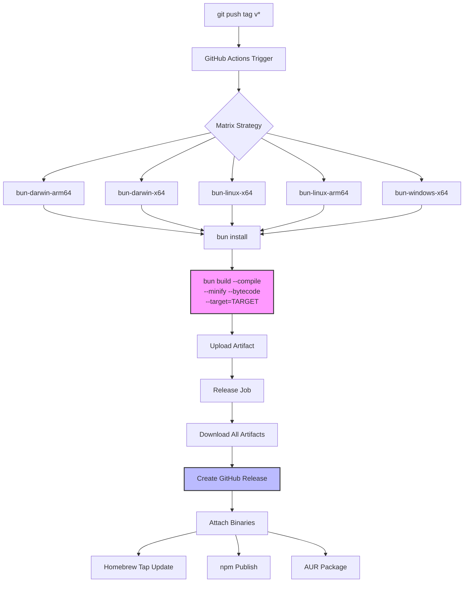

# BunTS Cross-Platform Binary Compilation

> Research into Bun's `bun build --compile` for producing single-file cross-platform
> binaries. Covers compilation targets, asset embedding, size optimization, CI/CD
> patterns, comparison with alternatives, and implications for agent-manager.

## Table of Contents

- [How bun build --compile Works](#how-bun-build---compile-works)
- [Cross-Compilation Targets](#cross-compilation-targets)
- [Asset Embedding](#asset-embedding)
- [Binary Size Analysis](#binary-size-analysis)
- [Optimization Flags](#optimization-flags)
- [Native Module Support](#native-module-support)
- [Comparison with Alternatives](#comparison-with-alternatives)
- [CI/CD Patterns](#cicd-patterns)
- [Real-World Examples](#real-world-examples)
- [Limitations and Gotchas](#limitations-and-gotchas)
- [Implications for agent-manager](#implications-for-agent-manager)
- [References](#references)

---

## How bun build --compile Works

Bun's bundler implements a `--compile` flag that generates a standalone binary from
TypeScript or JavaScript source files. The compilation process:

1. **Bundles** all imported files and packages (tree-shaking dead code)
2. **Transpiles** TypeScript/JSX to JavaScript
3. **Embeds** the bundled code into a copy of the Bun runtime
4. **Produces** a single native executable for the target platform

The resulting binary contains the full Bun runtime (JavaScriptCore engine, built-in
APIs, HTTP server, SQLite, etc.) plus the application code. No separate Bun or Node.js
installation is needed to run it.

### Basic Usage

**CLI:**

```bash
bun build ./cli.ts --compile --outfile mycli
```

**JavaScript API (Bun.build):**

```typescript
await Bun.build({
  entrypoints: ["./cli.ts"],
  compile: {
    outfile: "./mycli",
  },
});
```

### What Gets Embedded

| Component | Included | Notes |
|-----------|----------|-------|
| Bun runtime | Always | JavaScriptCore + Bun APIs (~50-95MB base) |
| Application code | Always | Bundled, transpiled, optionally minified |
| node_modules | Yes | Tree-shaken; only imported code is included |
| Static assets | Opt-in | Via `with { type: "file" }` imports |
| SQLite databases | Opt-in | Via `with { type: "sqlite", embed: "true" }` |
| .node native addons | Yes | N-API modules can be embedded |
| WASM files | Opt-in | Via `with { type: "file" }` imports |
| .env files | Runtime | Loaded at runtime by default (can disable) |

### Build-Time Constants

Inject compile-time values with `--define` for zero runtime overhead:

```bash
bun build --compile \
  --define BUILD_VERSION='"1.2.3"' \
  --define BUILD_TIME='"2026-04-07T10:00:00Z"' \
  --define IS_PRODUCTION='true' \
  src/cli.ts --outfile mycli
```

```typescript
// JavaScript API equivalent
await Bun.build({
  entrypoints: ["./src/cli.ts"],
  compile: { outfile: "./mycli" },
  define: {
    BUILD_VERSION: JSON.stringify("1.2.3"),
    BUILD_TIME: JSON.stringify(new Date().toISOString()),
    "process.env.NODE_ENV": JSON.stringify("production"),
  },
});
```

Constants are replaced at build time, enabling dead code elimination. For example,
`if (IS_PRODUCTION)` branches where the condition is always true/false get optimized away.

---

## Cross-Compilation Targets

Since Bun v1.1.5 (April 2024), `--target` enables cross-compilation from any host
platform to any supported target. The Bun runtime for each target is downloaded
automatically on first use.

### Supported Targets (as of Bun v1.3.x)

| Target | OS | Arch | Profile | Libc |
|--------|------|------|---------|------|
| `bun-linux-x64` | Linux | x64 | default | glibc |
| `bun-linux-x64-baseline` | Linux | x64 | pre-2013 CPUs | glibc |
| `bun-linux-x64-modern` | Linux | x64 | 2013+ (Haswell) | glibc |
| `bun-linux-arm64` | Linux | ARM64 | default | glibc |
| `bun-linux-x64-musl` | Linux | x64 | default | musl |
| `bun-linux-arm64-musl` | Linux | ARM64 | default | musl |
| `bun-windows-x64` | Windows | x64 | default | N/A |
| `bun-windows-x64-baseline` | Windows | x64 | pre-2013 CPUs | N/A |
| `bun-windows-x64-modern` | Windows | x64 | 2013+ (Haswell) | N/A |
| `bun-windows-arm64` | Windows | ARM64 | default | N/A |
| `bun-darwin-arm64` | macOS | ARM64 | default | N/A |
| `bun-darwin-x64` | macOS | x64 | default | N/A |

### Usage

```bash
# Cross-compile from macOS to Linux x64
bun build --compile --target=bun-linux-x64 ./index.ts --outfile myapp

# Target ARM64 Linux (e.g., AWS Graviton, Raspberry Pi 4+)
bun build --compile --target=bun-linux-arm64 ./index.ts --outfile myapp

# Windows (Bun auto-adds .exe extension)
bun build --compile --target=bun-windows-x64 ./index.ts --outfile myapp
```

```typescript
// JavaScript API - cross-compile
await Bun.build({
  entrypoints: ["./index.ts"],
  compile: {
    target: "bun-linux-x64",
    outfile: "./myapp",
  },
});

// Simple form: compile string implies target
await Bun.build({
  entrypoints: ["./index.ts"],
  compile: "bun-linux-x64",  // uses entrypoint name as output
});
```

### CPU Profile Selection

The `-baseline` targets support CPUs from before 2013 (Nehalem microarchitecture).
The `-modern` targets require 2013+ CPUs (Haswell) and enable AVX2/SIMD optimizations.
The default (no suffix) uses modern on most platforms.

If users see `"Illegal instruction"` errors, they need the `-baseline` variant.

### Known Cross-Compilation Issues

- **Windows to Linux:** There is an open issue (oven-sh/bun#25346) where cross-compiling
  from Windows to Linux may fail in certain configurations
- **Windows metadata flags** (`--windows-icon`, `--windows-hide-console`) cannot be used
  when cross-compiling because they depend on Windows APIs
- **musl targets** are not fully static -- they still link `libstdc++`, `libgcc_s`, and
  `libm` dynamically (see oven-sh/bun#23910 requesting a fully static target)

---

## Asset Embedding

Bun provides multiple mechanisms for embedding static files into compiled binaries.

### File Embedding with Import Attributes

Use `with { type: "file" }` to embed any file at build time:

```typescript
import icon from "./icon.png" with { type: "file" };
import config from "./config.json" with { type: "file" };
import template from "./email-template.html" with { type: "file" };
import wasmPath from "./processor.wasm" with { type: "file" };

// At runtime, these resolve to internal $bunfs/ paths
const iconBytes = await Bun.file(icon).arrayBuffer();
const configText = await Bun.file(config).text();
const templateHtml = await Bun.file(template).text();
```

### Embedding Directories (Glob Patterns)

```bash
# Embed all PNG files from public/
bun build --compile ./index.ts ./public/**/*.png
```

```typescript
// JavaScript API
import { Glob } from "bun";
const glob = new Glob("./public/**/*.png");
const pngFiles = Array.from(glob.scanSync("."));

await Bun.build({
  entrypoints: ["./index.ts", ...pngFiles],
  compile: { outfile: "./myapp" },
});
```

### SQLite Database Embedding

```typescript
// External SQLite (resolved at runtime relative to cwd)
import db from "./my.db" with { type: "sqlite" };

// Embedded SQLite (bundled into the binary, runs in-memory)
import myDb from "./my.db" with { type: "sqlite", embed: "true" };
console.log(myDb.query("SELECT * FROM users LIMIT 1").get());
```

> **Caveat:** Embedded SQLite databases are read-write at runtime but all changes are
> lost when the process exits (they run in-memory). For persistent data, use an
> external SQLite file path at runtime.

### Listing Embedded Files

```typescript
import { embeddedFiles } from "bun";

for (const blob of embeddedFiles) {
  console.log(`${blob.name} - ${blob.size} bytes`);
}
// icon-a1b2c3d4.png - 4096 bytes
// data-e5f6g7h8.json - 256 bytes
```

`Bun.embeddedFiles` returns `ReadonlyArray<Blob>` -- each with a `name` property.
Source code files (`.ts`, `.js`) are excluded to protect application source.

### Content Hash Control

By default, embedded files get a content hash appended (`icon-a1b2c3d4.png`).
To disable:

```bash
bun build --compile --asset-naming="[name].[ext]" ./index.ts
```

### Serving Embedded Assets via HTTP

```typescript
import favicon from "./favicon.ico" with { type: "file" };
import logo from "./logo.png" with { type: "file" };
import { file, serve, embeddedFiles } from "bun";

// Static route map from embedded files
const staticRoutes: Record<string, Blob> = {};
for (const blob of embeddedFiles) {
  const name = blob.name.replace(/-[a-f0-9]+\./, ".");
  staticRoutes[`/${name}`] = blob;
}

serve({
  static: {
    "/favicon.ico": file(favicon),
    "/logo.png": file(logo),
  },
  fetch(req) {
    const url = new URL(req.url);
    const asset = staticRoutes[url.pathname];
    if (asset) return new Response(asset);
    return new Response("Not found", { status: 404 });
  },
});
```

---

## Binary Size Analysis

The compiled binary includes the full Bun runtime, so even a "Hello World" program
has a significant base size. Here are measured sizes from multiple sources:

### Hello World Binary Sizes (console.log only)

| Target | Bun v1.3.x | Deno v2.7.x | Node.js v25.x |
|--------|-----------|-------------|---------------|
| darwin-arm64 | **59 MB** | 74.6 MB | 125.1 MB |
| darwin-x64 | 64 MB | N/A | N/A |
| linux-x64 | **95 MB** | 90.3 MB | 122.8 MB |
| linux-arm64 | 95 MB | N/A | N/A |
| linux-x64-musl | 90 MB | N/A | N/A |
| windows-x64 | **111 MB** | 90.4 MB | 91.0 MB |
| windows-arm64 | 107 MB | N/A | N/A |

**Key observations:**
- macOS arm64 is the smallest Bun target (~59MB) -- the most optimized platform
- Linux and Windows binaries are 90-111MB for Bun
- Bun wins decisively on macOS; Deno wins on Linux/Windows for minimal binaries
- Node.js SEA (Single Executable Application) produces the largest binaries on most
  platforms
- All three runtimes embed their full engine; the base size is mostly runtime overhead

### Real-World Application Sizes

From the rulesync CLI migration (Deno v5.5.0 to Bun v5.5.1):

| Platform | Deno (v5.5.0) | Bun (v5.5.1) | Reduction |
|----------|---------------|--------------|-----------|
| darwin-arm64 | 565 MB | 62.8 MB | **~9x smaller** |
| linux-arm64 | 508 MB | 97.6 MB | ~5x smaller |
| linux-x64 | 414 MB | 104 MB | ~4x smaller |
| windows-x64 | 648 MB | 116 MB | ~6x smaller |

The dramatic reduction is because `deno compile` without minification bundles all
source verbatim, while `bun build --compile --minify` tree-shakes and minifies the
code before embedding.

### Size Comparison Across Compilation Tools

| Tool | Hello World | Web Server App | Notes |
|------|-------------|----------------|-------|
| **Bun --compile** | 59-111 MB | 60-120 MB | Full runtime embedded |
| **Deno compile** | 74-90 MB | 80-650 MB | V8 + Deno runtime; halved in 2024 |
| **Node.js SEA** | 91-125 MB | 100-130 MB | Experimental; V8 + Node runtime |
| **pkg (Vercel)** | 40-60 MB | 45-70 MB | Deprecated; Node.js 18 max |
| **nexe** | 40-55 MB | 45-65 MB | Unmaintained; custom Node builds |
| **Go** | 2-8 MB | 8-15 MB | Static binary, no VM |
| **Rust** | 0.3-3 MB | 3-10 MB | Static binary, no VM |

> **Note:** The Bun team acknowledges "Bun's binary is still way too big and we need to
> make it smaller." Future versions may allow tree-shaking the runtime itself to exclude
> unused APIs.

---

## Optimization Flags

### Minification (`--minify`)

```bash
bun build --compile --minify ./index.ts --outfile myapp
```

Granular control via the JavaScript API:

```typescript
await Bun.build({
  entrypoints: ["./index.ts"],
  compile: { outfile: "./myapp" },
  minify: {
    whitespace: true,   // Remove whitespace
    syntax: true,       // Shorten syntax (e.g., if-else to ternary)
    identifiers: true,  // Mangle variable names
  },
});
```

For large applications, `--minify` can save megabytes. For small apps, it primarily
improves startup time.

### Bytecode Compilation (`--bytecode`)

```bash
bun build --compile --bytecode --minify --sourcemap ./app.ts --outfile myapp
```

- Moves JavaScript parsing from runtime to build time
- Can make startup **2x faster** (measured with `tsc`)
- Trade-off: `bun build` is slightly slower; binary is slightly larger
- Does NOT obscure source code (it's not an obfuscation tool)
- Supports both CJS and ESM formats

### Source Maps (`--sourcemap`)

```bash
bun build --compile --minify --sourcemap ./app.ts --outfile myapp
```

Source maps are compressed with zstd and embedded in the binary. When an error occurs,
Bun automatically decompresses and resolves the source map so stack traces point to
original source locations.

### Production Build Recipe

```bash
bun build --compile \
  --minify \
  --sourcemap \
  --bytecode \
  --define BUILD_VERSION='"1.0.0"' \
  --define 'process.env.NODE_ENV="production"' \
  --target=bun-linux-x64 \
  ./src/cli.ts \
  --outfile ./dist/myapp
```

```typescript
// Equivalent JavaScript API
const result = await Bun.build({
  entrypoints: ["./src/cli.ts"],
  compile: {
    target: "bun-linux-x64",
    outfile: "./dist/myapp",
    execArgv: ["--smol"],        // Reduce memory usage
    autoloadDotenv: false,       // Don't load .env at runtime
    autoloadBunfig: false,       // Don't load bunfig.toml at runtime
  },
  minify: true,
  sourcemap: "linked",
  bytecode: true,
  define: {
    BUILD_VERSION: JSON.stringify("1.0.0"),
    "process.env.NODE_ENV": JSON.stringify("production"),
  },
});

if (!result.success) {
  console.error("Build failed:", result.logs);
  process.exit(1);
}
```

### Runtime Config Loading Defaults

| Config File | Default in Compiled Binary |
|-------------|---------------------------|
| `tsconfig.json` | **Disabled** |
| `package.json` | **Disabled** |
| `.env` | **Enabled** |
| `bunfig.toml` | **Enabled** |

Override with flags:
- `--compile-autoload-tsconfig` / `--compile-autoload-package-json`
- `--no-compile-autoload-dotenv` / `--no-compile-autoload-bunfig`

---

## Native Module Support

### N-API / .node Addons

Bun supports Node-API (N-API) for native addons. `.node` files can be embedded
into compiled binaries:

```typescript
const addon = require("./addon.node");
console.log(addon.hello());
```

**Limitations:**
- The `.node` file must be directly `require()`'d -- tools like `@mapbox/node-pre-gyp`
  that resolve `.node` files dynamically may not bundle correctly
- Native addons are platform-specific -- a `.node` file compiled for macOS won't work
  in a Linux binary
- Cross-compilation of native addons is NOT handled by Bun -- you need to compile the
  `.node` file separately for each target platform

### Bun Native Plugins

Bun supports native bundler plugins as NAPI modules for multi-threaded performance:

```bash
# Create a native plugin with napi-rs
bun add -g @napi-rs/cli
napi new
cargo add bun-native-plugin
```

These plugins run on multiple threads during bundling, avoiding JavaScript's
single-threaded bottleneck.

### Rust FFI Pattern

For performance-critical code, the Rust FFI pattern works well with Bun:

```typescript
// Load a shared library via FFI
const lib = Bun.dlopen("./libcore.so", {
  process_data: { args: ["ptr", "u32"], returns: "ptr" },
  get_version: { args: [], returns: "cstring" },
});

console.log(lib.symbols.get_version());
```

> **Note for agent-manager:** Most dependencies (Ink, Hono, TOML parsers) are pure
> JavaScript/TypeScript. Native module concerns primarily apply if using native SQLite
> bindings or native git libraries.

---

## Comparison with Alternatives

### Feature Matrix

| Feature | Bun --compile | Deno compile | Node SEA | pkg | nexe |
|---------|--------------|--------------|----------|-----|------|
| **Status** | Stable | Stable | Experimental | Deprecated | Unmaintained |
| **TypeScript** | Native | Native | Needs transpile | Needs transpile | Needs transpile |
| **Cross-compile** | Yes (12 targets) | Yes (5 targets) | No | Yes | Limited |
| **Asset embedding** | Yes (files, dirs, SQLite) | Yes (include flag) | Yes (blob/snapshot) | Yes (snapshot FS) | Yes |
| **Tree shaking** | Yes | No (bundles all) | No | No | No |
| **Minification** | Yes | No | No | No | No |
| **Bytecode** | Yes | V8 code cache | V8 snapshot | V8 snapshot | V8 snapshot |
| **Source maps** | Yes (zstd) | Yes | No | No | No |
| **Base binary** | 59-111 MB | 74-90 MB | 91-125 MB | 40-60 MB | 40-55 MB |
| **Code signing** | macOS (v1.2.4+) | Yes | N/A | N/A | N/A |
| **GoReleaser** | Yes | No | No | No | No |
| **Build speed** | ~0.1s | ~1-3s | ~5-10s | ~10-30s | ~30-120s |
| **npm compat** | Full | Most | Full | Full | Full |
| **Maintained** | Active (Oven) | Active (Deno Land) | Active (Node.js) | No | No |

### Detailed Comparison

#### Bun --compile
**Strengths:** Fastest build time (~0.1s), native TS, tree shaking + minification,
widest target matrix (12), built-in bundler means no extra tooling, GoReleaser
integration, `--bytecode` for 2x faster startup.

**Weaknesses:** Largest baseline binary on Linux/Windows (~95-111 MB), no fully static
musl target yet, youngest ecosystem, binary includes full runtime even if only using
a fraction of APIs.

#### Deno compile
**Strengths:** Secure-by-default permissions, good binary sizes on Linux/Windows,
V8 code caching for fast startup, code signing support, halved binary size during 2024.

**Weaknesses:** No built-in minification/tree-shaking (produces massive binaries for
large apps without external bundler), fewer cross-compilation targets (5 vs 12),
slower build times, dynamic `import()` doesn't work in compiled binaries.

#### Node.js SEA (Single Executable Application)
**Strengths:** Widest ecosystem compatibility, works with any npm package.

**Weaknesses:** Experimental, no cross-compilation, requires manual blob injection,
no TypeScript support (must pre-transpile), no tree shaking, largest baseline binary.

#### pkg (Vercel) -- DEPRECATED
Was the go-to solution for Node.js binary compilation. Abandoned in 2023, only supports
Node.js 18. Not recommended for new projects.

#### nexe -- UNMAINTAINED
Similar to pkg but with custom Node.js builds. Last meaningful update years ago.

### Recommendation for agent-manager

**Bun --compile is the clear winner** for this project because:
1. Native TypeScript -- no transpilation step
2. Fastest build times for rapid iteration
3. Tree shaking + minification for smaller app code
4. Asset embedding for templates, config files, SQLite
5. Cross-compilation to all relevant platforms from a single CI machine
6. GoReleaser integration for release automation
7. Active development with frequent improvements

---

## CI/CD Patterns

### GitHub Actions: Multi-Platform Release

```yaml
# .github/workflows/release.yml
name: Release

on:
  push:
    tags: ['v*']

permissions:
  contents: write

jobs:
  build:
    runs-on: ubuntu-latest
    strategy:
      matrix:
        include:
          - target: bun-darwin-arm64
            artifact: am-darwin-arm64
          - target: bun-darwin-x64
            artifact: am-darwin-x64
          - target: bun-linux-x64
            artifact: am-linux-x64
          - target: bun-linux-arm64
            artifact: am-linux-arm64
          - target: bun-windows-x64
            artifact: am-windows-x64.exe

    steps:
      - uses: actions/checkout@v4

      - uses: oven-sh/setup-bun@v2
        with:
          bun-version: latest

      - name: Install dependencies
        run: bun install --frozen-lockfile

      - name: Build binary
        run: |
          bun build --compile \
            --minify \
            --sourcemap \
            --bytecode \
            --target=${{ matrix.target }} \
            --define BUILD_VERSION='"${{ github.ref_name }}"' \
            --define BUILD_TIME='"${{ github.event.head_commit.timestamp }}"' \
            ./src/cli.ts \
            --outfile ./dist/${{ matrix.artifact }}

      - name: Upload artifact
        uses: actions/upload-artifact@v4
        with:
          name: ${{ matrix.artifact }}
          path: ./dist/${{ matrix.artifact }}

  release:
    needs: build
    runs-on: ubuntu-latest
    steps:
      - uses: actions/download-artifact@v4
        with:
          path: ./artifacts
          merge-multiple: true

      - name: Create GitHub Release
        uses: softprops/action-gh-release@v2
        with:
          files: ./artifacts/*
          generate_release_notes: true
```

> **Key insight:** Unlike Go or Rust, Bun's cross-compilation works from a single
> `ubuntu-latest` runner. You do NOT need macOS or Windows runners, since `--target`
> downloads the appropriate Bun runtime automatically. This dramatically simplifies CI
> and reduces costs.

### GoReleaser Integration

GoReleaser (v2+) has native Bun builder support:

```yaml
# .goreleaser.yml
builds:
  - id: agent-manager
    builder: bun
    binary: am
    main: "./src/cli.ts"
    targets:
      - linux-x64-modern
      - linux-arm64
      - darwin-x64
      - darwin-arm64
      - windows-x64-modern
    flags:
      - --minify
      - --sourcemap
      - --bytecode
    env:
      - BUILD_VERSION={{.Version}}

archives:
  - format: tar.gz
    name_template: "am_{{ .Os }}_{{ .Arch }}"
    format_overrides:
      - goos: windows
        format: zip

brews:
  - name: agent-manager
    repository:
      owner: your-org
      name: homebrew-tap
    homepage: "https://github.com/your-org/agent-manager"
    description: "Unified MCP/plugin configuration manager"

nfpms:
  - package_name: agent-manager
    formats: [deb, rpm, apk]
    bindir: /usr/local/bin
```

### Build Pipeline Diagram



### oven-sh/setup-bun Action

The official GitHub Action for installing Bun in CI:

```yaml
- uses: oven-sh/setup-bun@v2
  with:
    bun-version: latest        # or "1.3.3", "canary"
    # bun-version-file: .bun-version  # Or read from file
```

---

## Real-World Examples

### Projects Shipping Bun-Compiled Binaries

| Project | Type | Targets | Distribution | Notes |
|---------|------|---------|-------------|-------|
| **rulesync** | AI coding utility CLI | 4 platforms | GitHub Releases | Migrated from Deno; 9x size reduction |
| **Chatfall** | Web app (ElysiaJS + React) | 5 platforms | Docker + binary | Embeds server, SSR, DB migrations |
| **vectronic templates** | Bun+Rust FFI | 3 platforms | Homebrew, winget | Dynamic import support post-compile |
| **Electrobun** | Desktop framework | macOS (primary) | Binary | ~14MB with bsdiff delta updates |

### Chatfall Architecture (Full-Stack in a Binary)

The Chatfall project demonstrates embedding a complete web application:

1. **Pre-build step:** Reads `./public/` files, encodes with MIME types into
   `public.generated.ts` as a JSON object
2. **Frontend:** React SSR app compiled to `frontend.js`, served from generated map
3. **Database:** Drizzle ORM SQL migration files embedded into `migration-data.generated.ts`;
   at runtime, written to temp dir, migrations run, temp dir deleted
4. **CLI:** Commander.js provides `server` and `migrate-db` subcommands
5. **Build:** `Bun.build()` bundles everything, then `bun build --compile` per platform

### rulesync Migration Pattern

The rulesync CLI tool (290M+ npm downloads) migrated from Deno to Bun:

```bash
# Their exact build command
bun build --compile --minify --sourcemap \
  --target=bun-linux-x64 \
  --outfile=dist/rulesync-linux-x64 \
  ./src/cli/index.ts
```

The migration was described as "simple with no major pitfalls."

---

## Limitations and Gotchas

### Binary Size

- **The elephant in the room.** Even a Hello World is 59-111 MB depending on target.
- The Bun team acknowledges this and plans to make it smaller.
- For agent-manager, the ~60-100 MB binary size is acceptable for a developer tool
  (comparable to VS Code, Docker CLI, etc.) but may matter for distribution bandwidth.

### Platform-Specific Issues

| Issue | Details |
|-------|---------|
| Windows metadata | `--windows-icon`, `--windows-hide-console` require building ON Windows |
| musl not fully static | Still links `libstdc++`, `libgcc_s` dynamically |
| macOS code signing | Requires Bun v1.2.4+; needs specific entitlements plist |
| Cross-compile from Windows | Open issue (oven-sh/bun#25346) for Windows to Linux |

### Runtime Behavior Differences

| Behavior | Compiled Binary | Regular `bun run` |
|----------|----------------|-------------------|
| `tsconfig.json` loading | Disabled | Enabled |
| `package.json` loading | Disabled | Enabled |
| `.env` loading | Enabled | Enabled |
| `bunfig.toml` loading | Enabled | Enabled |
| `__dirname` / `__filename` | Works (resolved to embedded path) | Works |
| `process.argv[0]` | Path to compiled binary | Path to `bun` |

### Embedded SQLite Limitations

- Embedded databases are in-memory only -- changes lost on exit
- For persistent state, use a runtime SQLite file path instead
- The embed is useful for read-only seed data, schemas, or lookup tables

### Worker Threads

- Worker entrypoints must be explicitly included in the build command
- Auto-detection of `new Worker(path)` is not yet supported
- Must manually list worker files as additional entrypoints

### No `--outdir` Support

Cannot output to a directory -- must use `--outfile` for a single binary output.
Exception: `--splitting` is supported but produces multiple files.

### Not Truly Portable on Linux

glibc-linked binaries require a compatible glibc version on the target system.
musl builds are more portable but still have dynamic dependencies. There is no
`FROM scratch` Docker support yet (open feature request).

---

## Implications for agent-manager

### What Works Well

**TUI Framework (Ink/blessed):** Pure JavaScript -- bundles perfectly. Ink's React-based
rendering, blessed's terminal control, and any JS-based TUI library will embed into
the compiled binary with full tree-shaking. See [[06-tui-frameworks-typescript-bun]] for
TUI framework details.

**Web Server (Hono/Elysia):** Bun has a built-in HTTP server (`Bun.serve()`). Hono or
Elysia frameworks bundle cleanly. Static assets (HTML, CSS, JS for the browser UI) can
be embedded using `with { type: "file" }` imports and served from memory. See
[[07-browser-ui-git-oauth]] for the web UI counterpart.

**TOML Parser:** Pure JS TOML parsers (`@iarna/toml`, `smol-toml`) bundle perfectly.
No native dependencies.

**Git Operations:** Libraries like `simple-git` spawn `git` as a subprocess and work
fully in compiled binaries. The binary will need `git` to be installed on the user's
system, which is a reasonable assumption for a developer tool.

**SQLite for Local State:** Two patterns:
1. **Embedded read-only seed data** (schema definitions, default configs) using
   `with { type: "sqlite", embed: "true" }`
2. **Runtime writable database** at a user-specific path (e.g., `~/.config/am/state.db`)
   using standard `new Database("path")` -- this is the right choice for persistent
   agent state and configuration cache

### The `am` Shorthand Alias

Two distribution patterns:

**1. Symlink (recommended for single binary):**
```bash
# In install script or Homebrew formula
ln -sf /usr/local/bin/agent-manager /usr/local/bin/am
```

**2. package.json bin field (for npm distribution):**
```json
{
  "name": "agent-manager",
  "bin": {
    "agent-manager": "./dist/agent-manager",
    "am": "./dist/agent-manager"
  }
}
```

**3. Shell alias (fallback):**
```bash
# Added to user's shell config by install script
alias am='agent-manager'
```

### Distribution Strategy

| Channel | Method | Notes |
|---------|--------|-------|
| **GitHub Releases** | Pre-compiled binaries per platform | Primary distribution |
| **Homebrew** | Tap formula downloading binary | `brew install org/tap/agent-manager` |
| **npm** | Package with postinstall downloading binary | `npx agent-manager` or `bunx agent-manager` |
| **AUR** | PKGBUILD for Arch Linux | Community contribution |
| **Cargo binstall pattern** | JSON manifest pointing to binaries | For Rust-familiar users |

### Recommended Build Configuration for agent-manager

```typescript
// scripts/build.ts
import { Glob } from "bun";

const version = process.env.VERSION || "0.0.0-dev";
const targets = [
  "bun-darwin-arm64",
  "bun-darwin-x64",
  "bun-linux-x64",
  "bun-linux-arm64",
  "bun-windows-x64",
] as const;

// Collect static assets for browser UI
const uiAssets = Array.from(
  new Glob("./src/ui/public/**/*").scanSync(".")
);

for (const target of targets) {
  const ext = target.includes("windows") ? ".exe" : "";
  const outfile = `./dist/am-${target.replace("bun-", "")}${ext}`;

  const result = await Bun.build({
    entrypoints: ["./src/cli.ts", ...uiAssets],
    compile: {
      target,
      outfile,
      autoloadDotenv: false,
      autoloadBunfig: false,
    },
    minify: true,
    sourcemap: "linked",
    bytecode: true,
    define: {
      BUILD_VERSION: JSON.stringify(version),
      BUILD_TIME: JSON.stringify(new Date().toISOString()),
      "process.env.NODE_ENV": JSON.stringify("production"),
    },
  });

  if (result.success) {
    console.log(`Built ${outfile}`);
  } else {
    console.error(`Failed ${target}:`, result.logs);
    process.exit(1);
  }
}
```

### Expected Binary Sizes for agent-manager

Based on the research data, with a TUI + web server + TOML parser + git integration:

| Target | Estimated Size | Notes |
|--------|---------------|-------|
| darwin-arm64 | ~60-65 MB | Smallest; primary dev platform |
| darwin-x64 | ~65-70 MB | Intel Mac support |
| linux-x64 | ~95-100 MB | Server/CI environments |
| linux-arm64 | ~95-100 MB | ARM servers (Graviton) |
| windows-x64 | ~110-115 MB | Windows developer workstations |

Application code (even with Ink, Hono, and all dependencies) adds only 1-5 MB on top
of the base runtime size after tree-shaking and minification.

---

## References

- [Bun Single-file executable docs](https://bun.com/docs/bundler/executables) -- Official documentation
- [Bun v1.1.5 Blog: Cross-compilation](https://bun.com/blog) -- Feature announcement
- [oven-sh/bun#10477](https://github.com/oven-sh/bun/pull/10477) -- Cross-compilation PR by Jarred Sumner
- [oven-sh/bun#23910](https://github.com/oven-sh/bun/issues/23910) -- Static musl target request
- [oven-sh/bun#25346](https://github.com/oven-sh/bun/issues/25346) -- Windows to Linux cross-compile issue
- [oven-sh/bun#5854](https://github.com/oven-sh/bun/issues/5854) -- Binary size tracking issue
- [GoReleaser Bun builder](https://goreleaser.com/customization/builds/builders/bun/) -- Release automation
- [oven-sh/setup-bun](https://github.com/oven-sh/setup-bun) -- GitHub Actions setup
- [rulesync: Deno to Bun migration](https://zenn.dev/dyoshikawa/articles/deno-to-bun-single-binary) -- 9x binary reduction
- [Chatfall: Bundling Node.js web app](https://hiddentao.com/archives/2024/11/16/bundling-your-nodejs-web-app-into-a-single-executable-using-bun/) -- Full-stack embedding
- [Bun, WASM and Rust with GitHub Actions](https://vectronic.io/posts/template-bun-wasm-and-rust-projects-with-github-actions/) -- FFI + brew + winget distribution
- [Bun Node-API docs](https://bun.com/docs/runtime/node-api) -- Native addon support
