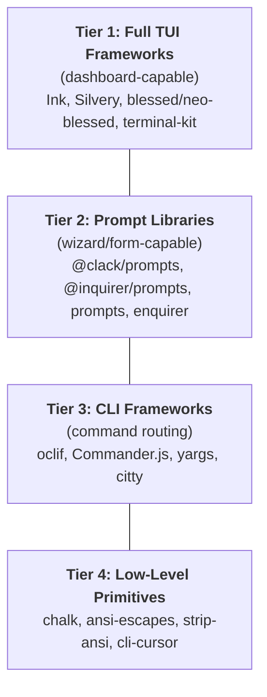
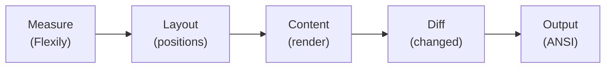
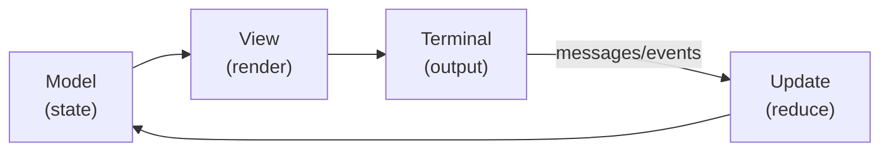
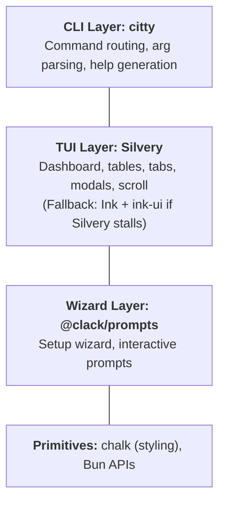

# TUI Frameworks for TypeScript/Bun

Research into Terminal User Interface (TUI) frameworks available for TypeScript,
evaluated for Bun compatibility, compilation to single binaries, and suitability
for the agent-manager CLI dashboard.

Cross-references: [[03-bunts-cross-platform-compilation]], [[08-agent-manager-architecture-design]]

---

## Table of Contents

1. [Framework Taxonomy](#framework-taxonomy)
2. [React-Based TUI Frameworks](#react-based-tui-frameworks)
3. [Traditional / Low-Level Frameworks](#traditional--low-level-frameworks)
4. [Prompt / Interactive Libraries](#prompt--interactive-libraries)
5. [CLI Frameworks (Command Parsing)](#cli-frameworks-command-parsing)
6. [Go/Rust Inspiration (Pattern Reference)](#gorust-inspiration-pattern-reference)
7. [Feature Comparison Matrix](#feature-comparison-matrix)
8. [Bun Compilation Compatibility](#bun-compilation-compatibility)
9. [Agent-Manager TUI Design](#agent-manager-tui-design)
10. [Recommendation](#recommendation)

---

## Framework Taxonomy

TUI frameworks for TypeScript fall into four tiers:



For agent-manager, we need **Tier 1 + Tier 3** — a full TUI framework for the
dashboard view, combined with a CLI framework for command routing (`agent-manager
sync`, `agent-manager install`, etc.).

---

## React-Based TUI Frameworks

### Ink (v6.8.0)

> **"React for interactive command-line apps"** — Vadim Demedes

| Attribute | Value |
|-----------|-------|
| GitHub | `vadimdemedes/ink` |
| Stars | ~37K |
| npm weekly | 2.7M downloads |
| License | MIT |
| Last release | v6.8.0 (Feb 2026) |
| TypeScript | Native (written in TS) |
| React version | React 18+ (concurrent rendering in v6.7+) |
| Bundle size | 478.8 KB unpacked |

**Architecture (Deep Dive):**

Ink implements a custom React host reconciler using `react-reconciler`. The pipeline
has four stages:

```
React.createElement → reconciler → in-memory DOM → Yoga layout
  → render-node-to-output → Screen buffer → diffEach → ANSI stdout
```

1. **Reconciler** — implements full host-config methods (`createInstance`,
   `appendChild`, `removeChild`, `prepareUpdate`, `commitUpdate`) that map React
   fiber updates to an in-memory DOM of `DOMElement` and `TextNode` instances
   (internal module `src/ink/dom.ts`).
2. **Yoga layout** — each `Box` corresponds to a Yoga node; style props map to Yoga
   setters. Layout dimensions are computed in terminal character cells (columns/lines).
3. **Screen buffer** — `renderNodeToOutput` walks the laid-out tree and writes styled
   characters into a packed `Screen` typed array representing terminal cells.
4. **Diff** — `diffEach` compares the new Screen buffer to the previous frame and
   emits only changed cells as ANSI escape sequences to stdout, minimizing flicker.

Ink records performance metrics separately for Yoga layout and commit duration
(`recordYogaMs`, `getLastCommitMs`). Optional repaint debugging can be enabled via
`CLAUDE_CODE_DEBUG_REPAINTS` environment flag.

**Layout engine:** Full CSS Flexbox via Yoga (prebuilt WASM/native bindings via
`yoga-layout-prebuilt`). Supports `flexDirection`, `justifyContent`, `alignItems`,
`flexGrow`, `flexShrink`, `padding`, `margin`, `width`, `height`, `minWidth/minHeight`,
`maxWidth/maxHeight`, `aspectRatio`, `borderStyle`, `borderColor`.

**Core components:**
- `<Box>` — primary layout container (maps to Yoga node)
- `<Text>` — styled text with `wrap` prop (`truncate`, `truncate-end`, `truncate-middle`,
  `truncate-start`), color, background color
- `<Static>` — permanent output above dynamic area (finished logs, completed items)
- `<Newline>` — line break with `count` prop
- `<Spacer>` — flexible whitespace
- `<Transform>` — per-line string transformation

**Core hooks:**
- `useInput()` — keyboard input handler; parses key combinations (Shift+Tab) and
  registers callbacks with Ink's stdin plumbing
- `useFocus()` / `useFocusManager()` — focus state and programmatic focus control
  (enable/disable, move between components)
- `useApp()` — app-level controls (exit, unmount)
- `useStdin()` / `useStdout()` / `useStderr()` — raw stream access

**Incremental rendering (v6.5+):**
- `incrementalRendering` option (default `false`) — updates only changed lines
  instead of full-frame redraws, leveraging the Screen buffer + `diffEach` mechanism
- `concurrent` option — enables React concurrent rendering (`useTransition`,
  `useDeferredValue`, `Suspense`)
- `maxFps` throttle (default 30) — controls frame rate
- v6.6.0+ requires React 19 peer dependency

**Bun compatibility (detailed):**
- Bun 1.2 — `stdin.ref` was undefined causing TypeError in Ink's `App.js` (#696,
  resolved March 2025)
- Bun 1.0.7 (Windows/WSL) — `useInput` not receiving keyboard input (bun#6862)
- Bun 1.1.26 (macOS arm64) — `ink-text-input` examples exit immediately (bun#13569)
- Cursor disappears on macOS with Bun (bun#26642, open)
- **Workaround pattern (from Gemini CLI):** resume `process.stdin` before launching
  Ink to resolve TTY hangs in headless environments
- Overall: **works with version-specific workarounds**, improving with each Bun release

**Binary compilation:** Ink + `bun build --compile` works. The React runtime and Yoga
WASM/native bindings must be bundled. Binary size is larger (~55-80 MB with Bun runtime).

**Verified production users:**
- **Gemini CLI** (Google) — verified: updated Ink to v6.6.7, uses `ui.incrementalRendering`
  and `ui.renderProcess` config options, applied `process.stdin` resume fix
- **Claude Code** (Anthropic) — partially verified: technical analysis references Ink
  internals and `CLAUDE_CODE_DEBUG_REPAINTS` env flag
- **kimi-cli** (Moonshot AI) — active PR rewriting from Python to Bun + Ink
- Wide ecosystem: ink-gradient, ink-big-text, ink-text-input, ink-spinner, ink-select-input

```tsx
// Ink example: simple dashboard component
import React from "react";
import { render, Box, Text, useInput } from "ink";

function Dashboard() {
  const [selected, setSelected] = React.useState(0);
  const items = ["MCP Servers", "Skills", "Plugins", "Profiles"];

  useInput((input, key) => {
    if (key.upArrow) setSelected((s) => Math.max(0, s - 1));
    if (key.downArrow) setSelected((s) => Math.min(items.length - 1, s + 1));
  });

  return (
    <Box flexDirection="column" padding={1}>
      <Text bold color="cyan">agent-manager dashboard</Text>
      <Box marginTop={1} flexDirection="column">
        {items.map((item, i) => (
          <Text key={item} color={i === selected ? "green" : "white"}>
            {i === selected ? "▸ " : "  "}{item}
          </Text>
        ))}
      </Box>
    </Box>
  );
}

render(<Dashboard />);
```

---

### Silvery (WIP — new in 2026)

> **"Polished Terminal UIs in React"** — by Bjorn Stabell (Palo Alto, CA).
> 45+ components, incremental rendering, full terminal protocol support.

| Attribute | Value |
|-----------|-------|
| Website | silvery.dev |
| GitHub | silvery repo (MIT license) |
| Status | **Work in progress** (APIs may change, used in production by author) |
| Runtime | Bun, Node.js 23.6+, Deno |
| TypeScript | Native (pure TS, zero native deps) |
| Size | ~177 KB gzipped (all-in) |
| Components | 45+ |
| Ink compat | 98.9% of Ink's test suite passes via compatibility layer |

**Origin story:** Author was building a multi-pane workspace with a kanban-style
board, thousands of nodes, and keyboard-driven navigation. Started with Ink, hit
two limitations (components can't know their size; full-tree re-renders too slow
for complex UIs), and the fix grew into a complete framework.

**Architecture (5-phase rendering pipeline):**

Silvery inverts Ink's pipeline — **layout runs first, then React renders** with
actual dimensions available:



1. **Measure** — Flexily (Yoga-compatible pure-TS layout engine) calculates sizes
2. **Layout** — positions computed; `useContentRect()` returns actual dimensions
3. **Content** — React renders components with correct dimensions available
4. **Diff** — per-node dirty tracking; cell-level ANSI-aware comparison
5. **Output** — only changed cells emitted to terminal

**Layout engine: Flexily** — a Yoga-compatible flexbox engine written in pure
TypeScript. Not a Yoga wrapper — a reimplementation:
- Standard CSS flexbox properties (`flexDirection`, `justifyContent`, `gap`, etc.)
- ~1.5x faster than Yoga WASM for typical terminal layouts
- 2.5x faster than Yoga WASM in some benchmarks
- Zero WASM, zero C++, zero native dependencies

**Key innovation: `useContentRect()`** — components know their rendered size during
render (like CSS container queries for terminals):

```tsx
function ResponsiveBoard({ items }) {
  const { width } = useContentRect();
  // Adapt column count to available space — works on FIRST paint
  const columns = width > 120 ? 4 : width > 80 ? 3 : width > 40 ? 2 : 1;
  return (
    <Box>
      {Array.from({ length: columns }, (_, i) => (
        <Box key={i} flexGrow={1} flexDirection="column">
          {items.filter((_, j) => j % columns === i).map((item) => (
            <Card key={item.id} item={item} />
          ))}
        </Box>
      ))}
    </Box>
  );
}
```

No prop drilling, no `measureElement` + `useEffect` dance. First render returns
`{ width: 0, height: 0 }` (guard with `if (width === 0) return null`); both renders
happen before first paint, so this is usually invisible.

**Performance benchmarks (from silvery.dev):**

| Scenario | Silvery | Ink | Result |
|----------|---------|-----|--------|
| Cold render (1 component) | 165 us | 271 us | Silvery 1.6x faster |
| Cold render (1000 components) | 463 ms | 541 ms | Silvery 1.2x faster |
| **Typical interactive update** | **169 us** | **20.7 ms** | **Silvery 122x faster** |
| Full tree re-render | Slower | Faster | Ink wins (Silvery's 5-phase overhead) |

The row that matters is **typical interactive update** — what happens when a user
presses a key in a mounted application. Per-node dirty tracking means only changed
nodes re-render (169 us). Ink re-renders entire React tree + full Yoga layout (20.7 ms).

**Incremental rendering details:**
- 7 independent dirty flags per node
- Only nodes that actually changed are re-rendered
- React reconciliation, layout, and content generation all skipped for clean nodes
- ANSI-aware cell compositing (proper style stacking, not string concatenation)
- Stable memory — normal JS garbage collection, no WASM heap growth

**Component inventory (45+):**

| Category | Components |
|----------|-----------|
| Layout | `Box`, `Spacer`, `Fill`, `Newline`, `Divider`, `SplitView` |
| Text & Display | `Text`, `Static`, `Transform`, `Badge`, `Divider`, `Link` (OSC 8 hyperlink) |
| Input | `TextInput`, `TextArea` (multi-line with cursor, selection, undo), `Toggle`, `Button` |
| Selection | `SelectList`, `MultiSelect`, `Checkbox`, `RadioGroup` |
| Data Display | `Table`, `VirtualList` (O(1) scroll for thousands), `TreeView` |
| Navigation | `Tabs`, `CommandPalette`, `Breadcrumbs`, `Menu` |
| Feedback | `Toast`, `ModalDialog`, `ConfirmDialog`, `Alert`, `Spinner`, `ProgressBar` |
| Layout Wrappers | `ThemeProvider`, `Form` / `FormField` (labels + validation) |

**Hooks:**

| Category | Hooks |
|----------|-------|
| Layout | `useContentRect`, `useScreenRect` |
| Input | `useInput` (keyboard), `useSelection` (text selection) |
| Focus | `useFocus`, `useFocusManager`, `useFocusWithin`, `useFocusable` |
| App | `useApp` (exit), `useTerm` (terminal capabilities), `useToast` |

**Runtime layers (graduated complexity):**

```
createApp().run()     — Zustand store, providers, useApp
run()                 — React components, useInput, useState
createStore()         — TEA state machines (optional)
createRuntime()       — events(), render(), schedule(), user-driven loop
layout() / diff()     — Pure functions, static output
```

Composition uses `pipe()` pattern with providers:
```tsx
import { pipe, createApp, withReact, withTerminal, withFocus, withDomEvents } from "@silvery/create";

const app = pipe(
  createApp(store),       // base: Zustand store, useApp
  withReact(),            // React renderer
  withTerminal(),         // terminal I/O
  withFocus(),            // spatial focus navigation
  withDomEvents(),        // mouse dispatch, hit testing, click-to-focus
);
await app.run();
```

**Terminal protocol support:**
- Full Kitty keyboard protocol (all 5 flags)
- Cursor position (CPR), pixel dimensions, text area size
- Device attributes (DA1/DA2/DA3)
- Hyperlinks (OSC 8), Sixel graphics, Kitty graphics
- 23 built-in color palettes with semantic tokens, auto-detects terminal colors

**Ecosystem (same author, MIT-licensed):**
- **Flexily** — pure JS flexbox layout engine (Silvery's layout layer)
- **Termless** — headless terminal testing (like Playwright for terminal apps;
  runs a real xterm.js emulator in-process)
- **terminfo.dev** — terminal feature compatibility database (161 features, 19 terminals)

**Ink migration path:** Swap imports (`ink` → `silvery/ink`, `chalk` → `silvery/chalk`),
run tests (98.9% pass), then gradually adopt native APIs.

**Bun compatibility:** First-class. Silvery lists Bun as a primary runtime target.
No WASM dependencies means cleanest Bun compilation path. All debugging examples
in docs use `bun run app`.

**Risk assessment:**
- Pre-1.0, APIs may change (pin version + watch changelog)
- Used in production by author's complex TUI (thousands of nodes, multiple views)
- Rendering pipeline tested with property-invariant fuzz tests (idempotence,
  no-op stability, inverse operations, viewport clipping)
- Single maintainer (Bjorn Stabell) — but the codebase and docs are comprehensive
- **Mitigation:** Ink fallback is low-cost due to 98.9% test compatibility layer

```tsx
// Silvery example: responsive dashboard with full features
import { useState } from "react";
import { render, Box, Text, useInput, useContentRect, createTerm } from "silvery";

function Dashboard() {
  const { width } = useContentRect();
  const [selected, setSelected] = useState(0);
  const isWide = width > 80;

  useInput((input, key) => {
    if (key.upArrow) setSelected((s) => Math.max(0, s - 1));
    if (key.downArrow) setSelected((s) => Math.min(3, s + 1));
    if (input === "q") process.exit(0);
  });

  return (
    <Box flexDirection="column" borderStyle="round" padding={1}>
      <Text bold>agent-manager {isWide ? "dashboard" : ""}</Text>
      <Box marginTop={1} flexDirection={isWide ? "row" : "column"}>
        {["Servers", "Skills", "Plugins", "Profiles"].map((item, i) => (
          <Text key={item} color={i === selected ? "green" : "white"}>
            {i === selected ? "▸ " : "  "}{item}
          </Text>
        ))}
      </Box>
    </Box>
  );
}

using term = createTerm();
const app = render(<Dashboard />, term, { alternateScreen: true });
await app.run();
```

---

### ink-ui (@inkjs/ui v2.0.0)

> Component library for Ink — adds higher-level widgets.

| Attribute | Value |
|-----------|-------|
| GitHub | `vadimdemedes/ink-ui` |
| Stars | ~2K |
| npm weekly | 165.6K downloads |
| Last release | v2.0.0 (May 2024) |

**Components:**
- `<TextInput>` — text input with placeholder, mask
- `<Select>` / `<MultiSelect>` — option pickers
- `<ConfirmInput>` — yes/no prompts
- `<Spinner>` — loading indicators
- `<StatusMessage>` — success/warning/error messages
- `<Badge>` — colored labels
- `<ProgressBar>` — progress visualization
- `<UnorderedList>` / `<OrderedList>` — lists
- `<Alert>` — info/warning/error boxes

**Assessment:** Good supplement to Ink, but much smaller component set than Silvery.
Missing: tables, trees, tabs, modals, scrollable containers, command palette.

---

### Pastel (v4.0.0)

> Framework for building Ink apps with file-system routing (like Next.js for CLIs).

| Attribute | Value |
|-----------|-------|
| GitHub | `vadimdemedes/pastel` |
| npm | v4.0.0 |
| Approach | Convention-over-configuration |

**Features:**
- File-system routing for commands (`commands/sync.tsx` → `agent-manager sync`)
- Auto-generated help
- Zod-based argument validation
- Built on Ink

**Assessment:** Interesting for command routing, but adds another layer of abstraction.
For agent-manager, a lighter approach (citty or Commander for routing + Ink/Silvery
for rendering) gives more control.

---

## Traditional / Low-Level Frameworks

### blessed / neo-blessed

> Curses-like terminal toolkit for Node.js.

| Attribute | blessed | neo-blessed |
|-----------|---------|-------------|
| GitHub | `chjj/blessed` | `embark-framework/neo-blessed` |
| Stars | ~11K | ~200 |
| Last commit | 2017 (abandoned) | 2020 (abandoned) |
| npm weekly | ~180K | ~15K |

**Features:** Full curses-style widgets — windows, lists, tables, forms, text areas,
scroll bars, borders, mouse support. Complex layouts with absolute/relative positioning.

**Rendering model:** Immediate mode — you create widget objects, set properties,
and call `screen.render()`. No React, no virtual DOM.

**Assessment:** **Not recommended.** Both projects are abandoned. No TypeScript
types (community `@types/blessed` exists but lags). No ESM support. The codebase
is large and unmaintained. The newer **Silvery** explicitly positions itself as the
blessed replacement with modern React patterns.

---

### terminal-kit

> Full-featured terminal manipulation library.

| Attribute | Value |
|-----------|-------|
| GitHub | `cronvel/terminal-kit` |
| Stars | ~3.2K |
| npm weekly | ~130K |
| Last commit | Active (2024-2025) |

**Features:**
- Low-level: cursor movement, colors, styles, clearing
- Input: single key, mouse events, input fields
- Widgets: progress bars, animated spinners, tables, menus
- Screen buffer for complex rendering
- 256-color and true-color support

**Rendering model:** Imperative API. No component model — you call functions to
draw to specific screen positions.

**Assessment:** Good for simple progress bars or status lines, but building a
full dashboard requires manual screen management. Too low-level for agent-manager.

---

### ansi-escapes / chalk (Tier 4 primitives)

| Library | Purpose | npm weekly |
|---------|---------|-----------|
| `chalk` | Terminal string styling (colors, bold, etc.) | 250M+ |
| `ansi-escapes` | ANSI escape codes (cursor, clear, links) | 100M+ |
| `strip-ansi` | Remove ANSI codes from strings | 200M+ |
| `cli-cursor` | Show/hide terminal cursor | 50M+ |
| `cli-spinners` | Spinner animation frames | 20M+ |
| `log-update` | Overwrite previous terminal output | 10M+ |

**Assessment:** These are building blocks, not frameworks. Every TUI framework above
uses some combination of these internally. Useful for understanding the stack, not
for direct use in agent-manager.

---

## Prompt / Interactive Libraries

### @clack/prompts (v1.2.0)

> **"Effortlessly build beautiful command-line apps"** — used by SvelteKit, Astro.

| Attribute | Value |
|-----------|-------|
| GitHub | `bombshell-dev/clack` |
| Stars | ~8K |
| npm weekly | High adoption |
| TypeScript | Native |
| ESM | Yes |

**Prompt types:** `text`, `password`, `confirm`, `select`, `multiselect`, `spinner`,
`group` (sequential prompts), `note`, `outro`.

**Design:** Beautiful Unicode box-drawing UI. Minimal API surface. Each prompt is a
standalone async function — no framework overhead.

```ts
import { intro, select, text, confirm, outro } from "@clack/prompts";

intro("agent-manager setup");

const profile = await select({
  message: "Select profile:",
  options: [
    { value: "work", label: "Work (Bedrock + Corp MCPs)" },
    { value: "personal", label: "Personal (API key)" },
    { value: "minimal", label: "Minimal" },
  ],
});

const name = await text({
  message: "Profile name:",
  placeholder: "my-profile",
  validate: (v) => (v.length < 1 ? "Required" : undefined),
});

const install = await confirm({
  message: "Install default MCP servers?",
});

outro("Profile created!");
```

**Bun compatibility:** Works with Bun out of the box (pure JS, no native deps).

**Assessment:** Perfect for installation wizards and interactive setup flows. Not
suitable for persistent dashboards (prompts are sequential, not persistent views).

---

### @inquirer/prompts (v8.3.2)

> Modular rewrite of the classic Inquirer.js.

| Attribute | Value |
|-----------|-------|
| GitHub | `SBoudrias/Inquirer.js` |
| Stars | ~20K+ |
| npm weekly | 21M downloads |
| TypeScript | Native |

**Prompt types:** `input`, `number`, `confirm`, `select`, `checkbox`, `password`,
`expand`, `editor`, `rawlist`, `search`.

**Design:** Each prompt is a standalone package (`@inquirer/input`, `@inquirer/select`,
etc.) or use the combined `@inquirer/prompts`. Supports custom themes and transformers.

**Assessment:** Most widely used prompt library. More features than @clack/prompts
(search, editor, rawlist) but less visually polished. Good fallback if @clack/prompts
doesn't cover a use case.

---

### prompts (by terkelg)

| Attribute | Value |
|-----------|-------|
| Stars | ~8.8K |
| npm weekly | ~10M |
| Size | Very small (~15 KB) |

**Assessment:** Lightweight but aging. No TypeScript source (community types only).
@clack/prompts is the modern replacement.

### enquirer

| Attribute | Value |
|-----------|-------|
| Stars | ~6.5K |
| npm weekly | ~10M |
| Maintainer | Jon Schlinkert |

**Assessment:** Feature-rich (snippet prompt, scale prompt, sort prompt) but
maintenance has slowed. @clack/prompts or @inquirer/prompts preferred for new projects.

---

## CLI Frameworks (Command Parsing)

### Commander.js

| Attribute | Value |
|-----------|-------|
| Stars | ~27K |
| npm weekly | 100M+ |
| API style | Chained builder |

```ts
import { Command } from "commander";

const program = new Command();
program
  .name("agent-manager")
  .description("Unified config manager for AI coding agents")
  .version("0.1.0");

program
  .command("sync")
  .description("Sync configs across agents")
  .option("-p, --profile <name>", "Profile to sync")
  .option("--dry-run", "Preview changes without writing")
  .action((opts) => { /* ... */ });

program
  .command("install <server>")
  .description("Install an MCP server")
  .action((server, opts) => { /* ... */ });

program.parse();
```

**Bun:** Works perfectly. Pure JS, no native deps.

---

### citty (v0.1.x)

> Elegant CLI builder from UnJS (Nuxt ecosystem).

| Attribute | Value |
|-----------|-------|
| GitHub | `unjs/citty` |
| Stars | ~1.2K |
| TypeScript | Native |
| Last push | March 2026 |

```ts
import { defineCommand, runMain } from "citty";

const sync = defineCommand({
  meta: { name: "sync", description: "Sync configs across agents" },
  args: {
    profile: { type: "string", description: "Profile to sync", alias: "p" },
    dryRun: { type: "boolean", description: "Preview changes" },
  },
  run({ args }) { /* ... */ },
});

const main = defineCommand({
  meta: { name: "agent-manager", version: "0.1.0" },
  subCommands: { sync, install, list, tui },
});

runMain(main);
```

**Assessment:** Clean, modern API. Lighter than oclif. Good match for agent-manager's
needs. Works with Bun.

---

### oclif (Salesforce)

| Attribute | Value |
|-----------|-------|
| Stars | ~9K |
| Approach | Full framework (plugins, hooks, help generation, testing) |
| TypeScript | Native |

**Assessment:** Powerful but heavy. Designed for large CLI ecosystems (Heroku CLI,
Salesforce CLI). Plugin system is sophisticated but overkill for agent-manager.
Historically Node-centric — Bun support is not a priority. **Not recommended** for
agent-manager due to weight and Node assumptions.

---

### yargs

| Attribute | Value |
|-----------|-------|
| Stars | ~11K |
| npm weekly | 80M+ |
| Approach | Declarative argument parsing |

**Assessment:** Mature and widely used but verbose API. Commander.js or citty
preferred for new TypeScript projects.

---

## Go/Rust Inspiration (Pattern Reference)

### bubbletea (Go) — The Gold Standard

| Attribute | Value |
|-----------|-------|
| GitHub | `charmbracelet/bubbletea` |
| Stars | ~41K |
| Architecture | Elm Architecture (Model-View-Update) |

**The Elm Architecture (MVU):**



1. **Model** — immutable state struct
2. **Update** — pure function: `(model, msg) → (model, cmd)`
3. **View** — pure function: `model → string`

**Key patterns that translate to TypeScript:**

- **Message-driven:** All input (keys, mouse, timers, async results) becomes a typed
  message. The update function handles them declaratively.
- **Commands:** Side effects are returned as `Cmd` values from Update, not executed
  directly. The runtime manages execution and feeds results back as messages.
- **Composition:** Components are just smaller Model/Update/View triples. Parent
  components delegate messages to children.

**Companion libraries (Charm ecosystem):**
- **Bubbles** — reusable components (text input, viewport, list, table, paginator,
  spinner, progress, timer, stopwatch, help, key)
- **Lip Gloss** — terminal styling (like CSS for terminals)
- **Harmonica** — spring animations
- **Wish** — SSH server for serving TUIs over SSH

```go
// bubbletea pattern — this is what we want to achieve in TS
type model struct {
    items    []string
    cursor   int
    selected map[int]struct{}
}

func (m model) Update(msg tea.Msg) (tea.Model, tea.Cmd) {
    switch msg := msg.(type) {
    case tea.KeyMsg:
        switch msg.String() {
        case "up":   m.cursor--
        case "down": m.cursor++
        case "enter": m.selected[m.cursor] = struct{}{}
        case "q":    return m, tea.Quit
        }
    }
    return m, nil
}

func (m model) View() string {
    s := "MCP Servers:\n\n"
    for i, item := range m.items {
        cursor := "  "
        if m.cursor == i { cursor = "▸ " }
        checked := "○"
        if _, ok := m.selected[i]; ok { checked = "●" }
        s += fmt.Sprintf("%s%s %s\n", cursor, checked, item)
    }
    return s
}
```

---

### ratatui (Rust)

| Attribute | Value |
|-----------|-------|
| GitHub | `ratatui/ratatui` |
| Stars | ~15K |
| Architecture | Immediate mode rendering |

**Key difference from bubbletea:** ratatui is immediate mode — you redraw the
entire screen each frame. No virtual DOM, no diffing. The `Widget` trait's
`render(area: Rect, buf: &mut Buffer)` gives each widget a rectangular area and a
character buffer.

**Layout system:** Constraint-based (`Constraint::Percentage(50)`,
`Constraint::Min(10)`, `Constraint::Length(3)`). More like CSS Grid than Flexbox.

**Relevance to TypeScript:** The immediate-mode pattern is harder to use in JS
(no struct-of-arrays, no zero-cost abstractions). React's retained mode (Ink/Silvery)
is more natural for TypeScript developers.

---

### How These Patterns Map to TypeScript

| bubbletea/ratatui Pattern | TypeScript Equivalent |
|---------------------------|----------------------|
| Elm Architecture (MVU) | `useReducer` + custom hooks in React |
| `tea.Msg` tagged union | TypeScript discriminated unions |
| `tea.Cmd` (deferred effects) | `useEffect` / async actions in Zustand |
| Bubbles components | Ink/Silvery components |
| Lip Gloss styles | `chalk` / Silvery's built-in styles |
| Immediate mode render | Not natural in JS — use React retained mode |
| Constraint-based layout | Flexbox (Yoga in Ink, pure TS in Silvery) |

**The React approach (Ink/Silvery) gives TypeScript developers a bubbletea-like
experience with familiar React patterns** — `useState` for model, event handlers
for update, JSX for view.

---

## Feature Comparison Matrix

### Tier 1: Full TUI Frameworks

| Feature | Ink 6.8 | Silvery (WIP) | blessed | terminal-kit |
|---------|---------|---------------|---------|--------------|
| **Stars** | 37K | New | 11K | 3.2K |
| **Maintained** | Active | Active | Abandoned | Low activity |
| **TypeScript** | Native | Native | @types only | @types only |
| **Rendering** | React reconciler | React reconciler | Immediate | Imperative |
| **Layout** | Flexbox (Yoga WASM) | Flexbox (Flexily, pure TS, 1.5x faster) | Absolute/relative | Manual |
| **Incremental render** | v6.5+ | Per-node dirty | N/A | Screen buffer |
| **Responsive** | No | `useContentRect()` | No | No |
| **Components** | 6 core + ink-ui | 45+ built-in | ~40 widgets | ~15 widgets |
| **Table** | Via ink-ui/custom | Built-in | Built-in | Built-in |
| **Tree view** | Custom only | Built-in | Built-in | No |
| **Tabs** | Custom only | Built-in | No | No |
| **Modal/Dialog** | Custom only | Built-in | Built-in | No |
| **Scroll** | Custom only | Built-in | Built-in | No |
| **Command palette** | Custom only | Built-in | No | No |
| **Mouse support** | Basic | Yes | Full | Yes |
| **Keyboard** | `useInput` hook | `useInput` hook | Key bindings | Key events |
| **Focus mgmt** | `useFocus` hook | Built-in | Manual | No |
| **Bun compat** | Works (workarounds) | First-class | Unknown | Unknown |
| **Binary compile** | Yes (large) | Yes (smaller) | Likely | Likely |
| **WASM deps** | Yes (Yoga) | None | None | None |
| **React version** | 18+ | 18+ | N/A | N/A |

### Tier 2: Prompt Libraries

| Feature | @clack/prompts | @inquirer/prompts | prompts | enquirer |
|---------|---------------|-------------------|---------|----------|
| **Stars** | 8K | 20K+ | 8.8K | 6.5K |
| **npm weekly** | Growing | 21M | 10M | 10M |
| **TypeScript** | Native | Native | @types | @types |
| **ESM** | Yes | Yes | CJS | CJS |
| **Visual polish** | Excellent | Good | Basic | Good |
| **Prompt types** | 7 | 10+ | 15 | 15+ |
| **Bun compat** | Yes | Yes | Yes | Yes |
| **Composable** | `group()` | Standalone | Chained | Standalone |
| **Custom themes** | Limited | Yes | No | Yes |

### Tier 3: CLI Frameworks

| Feature | Commander.js | citty | oclif | yargs |
|---------|-------------|-------|-------|-------|
| **Stars** | 27K | 1.2K | 9K | 11K |
| **TypeScript** | Native | Native | Native | @types |
| **Approach** | Builder chain | `defineCommand` | Class-based | Declarative |
| **Subcommands** | Yes | Yes | Yes (plugins) | Yes |
| **Help gen** | Auto | Auto | Auto (rich) | Auto |
| **Plugins** | No | No | Yes (core feature) | No |
| **Bun** | Yes | Yes | Partial | Yes |
| **Weight** | Light | Very light | Heavy | Medium |
| **Lazy loading** | No | Yes (async) | Yes | No |

---

## Bun Compilation Compatibility

### `bun build --compile` Overview

Bun can compile TypeScript/JavaScript into standalone single-file executables:

```bash
bun build ./cli.ts --compile --outfile agent-manager
```

**Cross-compilation targets:**
- `bun-linux-x64` / `bun-linux-x64-baseline`
- `bun-linux-arm64`
- `bun-darwin-arm64` (Apple Silicon)
- `bun-darwin-x64` (Intel Mac)
- `bun-windows-x64` / `bun-windows-x64-baseline`

**Key capabilities:**
- Bundles all imports and `node_modules` into the binary
- Embeds static assets (`import icon from "./icon.png"`)
- Supports `process.argv`, environment variables, `Bun.serve()`
- Auto-loads `.env`, `tsconfig.json`, `package.json` (configurable)
- Tree-shaking and minification (`--minify`)

**Size considerations:**
- Base Bun runtime: ~45-55 MB
- With Ink + React + Yoga: ~55-80 MB
- With Silvery (~177 KB gzipped, no WASM): ~48-58 MB
- With just CLI (Commander + clack): ~46-55 MB

**TUI framework compilation notes:**

| Framework | Compiles? | Notes |
|-----------|-----------|-------|
| Ink | Yes | Yoga WASM binary must be embedded. Cursor bug on macOS (bun#26642) |
| Silvery | Yes | No WASM — cleanest compilation path |
| @clack/prompts | Yes | Pure JS, no issues |
| Commander.js | Yes | Pure JS, no issues |
| citty | Yes | Pure JS, no issues |
| blessed | Untested | Large codebase, likely issues with terminal detection |
| terminal-kit | Untested | May have issues with optional native addons |

---

## Agent-Manager TUI Design

### View Architecture

The agent-manager TUI should have these primary views:

```
┌─────────────────────────────────────────────────────────────────┐
│ agent-manager v0.1.0                    Profile: work  [?] help│
├─────────────────────────────────────────────────────────────────┤
│ [Dashboard] [Servers] [Skills] [Plugins] [Profiles] [Config]   │
├─────────────────────────────────────────────────────────────────┤
│                                                                 │
│  Component Status Overview                                      │
│  ┌──────────────────────┬──────────┬─────────┬────────────────┐ │
│  │ Name                 │ Type     │ Status  │ Version        │ │
│  ├──────────────────────┼──────────┼─────────┼────────────────┤ │
│  │ aws-outlook-mcp      │ MCP      │ ● OK    │ 1.2.3          │ │
│  │ tavily-mcp           │ MCP      │ ● OK    │ 0.5.1          │ │
│  │ builder-mcp          │ MCP      │ ○ OFF   │ 2.0.0          │ │
│  │ research-rabbithole  │ Skill    │ ● OK    │ local          │ │
│  │ admin-lint           │ Skill    │ ● OK    │ local          │ │
│  │ superpowers          │ Plugin   │ ● OK    │ 0.4.2          │ │
│  │ hookify              │ Plugin   │ ⚠ WARN  │ 0.2.1          │ │
│  └──────────────────────┴──────────┴─────────┴────────────────┘ │
│                                                                 │
│  Quick Actions: [i]nstall  [r]emove  [s]ync  [e]dit  [q]uit    │
│                                                                 │
├─────────────────────────────────────────────────────────────────┤
│ Last sync: 2 min ago │ 12 servers │ 5 skills │ 3 plugins      │
└─────────────────────────────────────────────────────────────────┘
```

### View Descriptions

**1. Dashboard View** (default)
- Summary table of all components (MCP servers, skills, plugins)
- Status indicators (running, stopped, error, warning)
- Quick-action keyboard shortcuts
- Last sync timestamp and totals

**2. Servers View**
- Detailed MCP server list with expanded info
- Per-server: name, command, env vars, enabled/disabled, scope (global/project)
- Toggle enable/disable with Enter
- `[a]dd` new server, `[r]emove`, `[e]dit config`

**3. Skills View**
- List of installed skills (from `~/.claude/skills/` and plugins)
- Skill metadata: name, description, trigger patterns
- Preview SKILL.md content in a side panel

**4. Plugins View**
- Installed Claude Code plugins
- Version, update available, enabled/disabled
- Install from registry

**5. Profile Switcher**

```
┌─────────────────────────────────────────┐
│  Switch Profile                         │
│                                         │
│  ▸ work        Bedrock + Corp MCPs      │
│    personal    API key + OSS MCPs       │
│    minimal     No MCPs, fast startup    │
│    meta-sa     Meta account team config │
│                                         │
│  Current: work                          │
│  [Enter] switch  [n]ew  [d]elete       │
└─────────────────────────────────────────┘
```

**6. Config Editor**

```
┌──────────────────────────────────────────────────────────────┐
│  Edit: ~/.config/agent-manager/profiles/work.toml            │
│                                                              │
│  1 │ [profile]                                               │
│  2 │ name = "work"                                           │
│  3 │ description = "Bedrock + Corp MCPs"                     │
│  4 │                                                         │
│  5 │ [model]                                                 │
│  6 │ provider = "bedrock"                                    │
│  7 │ default = "claude-opus-4-6"                             │
│  8 │ fast = "claude-sonnet-4-6"                              │
│  9 │                                                         │
│ 10 │ [mcp.aws-outlook-mcp]                                   │
│ 11 │ command = "aws-outlook-mcp"                              │
│ 12 │ scope = "project"                                        │
│ 13 │ enabled = true                                           │
│                                                              │
│  [Ctrl+S] save  [Ctrl+Q] cancel  [Ctrl+/] comment           │
└──────────────────────────────────────────────────────────────┘
```

**7. Sync Status Display**

```
┌──────────────────────────────────────────────────────────────┐
│  Sync Status                                                 │
│                                                              │
│  ● Local → Git       Last push: 5 min ago                    │
│  ● Git → Local       Last pull: 2 min ago                    │
│  ⚠ Claude Code       settings.json out of sync               │
│  ● Cursor            .cursor/mcp.json synced                 │
│  ○ Windsurf          Not configured                          │
│                                                              │
│  Pending changes:                                            │
│    + aws-outlook-mcp added to claude-code                    │
│    ~ model.default changed: sonnet → opus                    │
│    - old-server removed from cursor                          │
│                                                              │
│  [s]ync now  [d]iff  [r]evert                                │
└──────────────────────────────────────────────────────────────┘
```

**8. Installation Wizard** (uses @clack/prompts, not the TUI)

```
┌  agent-manager setup
│
◇  Where do you store your configs?
│  ● Git repository (recommended)
│  ○ Local only
│  ○ Cloud sync
│
◇  Git repository URL:
│  git@github.com:user/dotfiles.git
│
◇  Which agents do you use?
│  ◼ Claude Code
│  ◼ Cursor
│  ◻ Windsurf
│  ◻ Cline
│  ◻ Aider
│
◇  Import existing config from Claude Code?
│  Yes
│
◇  Profile name for imported config:
│  work
│
└  Setup complete! Run `agent-manager tui` to open the dashboard.
```

### Component-to-Framework Mapping

| TUI Element | Ink Approach | Silvery Approach |
|-------------|-------------|-----------------|
| Tab bar | Custom `<Tabs>` component | Built-in `<Tabs>` |
| Data table | Custom or `ink-table` | Built-in `<Table>` |
| Status indicators | `<Text color="green">●</Text>` | `<Badge variant="success">` |
| Scrollable list | Manual with `useInput` | Built-in `<ScrollView>` |
| Modal dialog | Custom overlay | Built-in `<ModalDialog>` |
| Command palette | Custom (significant work) | Built-in `<CommandPalette>` |
| Config editor | External `$EDITOR` | Custom `<TextArea>` with highlighting |
| Profile picker | `<Select>` from ink-ui | Built-in `<SelectList>` |
| Progress/sync | Custom `<Spinner>` + text | Built-in `<Spinner>` + `<ProgressBar>` |
| Keyboard hints | Custom `<Box>` footer | Custom `<Box>` footer |

---

## Recommendation

### Primary Stack: Silvery + citty + @clack/prompts

**For the agent-manager TUI, the recommended architecture is:**



### Rationale

**Why Silvery over Ink?**

1. **45+ built-in components** vs Ink's 6 core + ink-ui's ~10 — Silvery ships exactly
   the widgets agent-manager needs (Table, Tabs, TreeView, SelectList, ModalDialog,
   CommandPalette, VirtualList, SplitView, TextArea, Form) out of the box
2. **Flexily layout engine** — pure TypeScript, Yoga-compatible, ~1.5x faster than
   Yoga WASM. Zero native dependencies = cleanest Bun compilation and smaller binaries
3. **Responsive layouts** — `useContentRect()` gives components their actual dimensions
   during render (like CSS container queries). Ink components cannot know their own
   dimensions — a known limitation since 2016
4. **122x faster interactive updates** — per-node dirty tracking with 7 independent
   flags means a key press in a 1000-node tree takes 169us vs Ink's 20.7ms
5. **First-class Bun support** — listed as primary runtime target; docs use `bun run`
6. **Ecosystem** — Termless (headless terminal testing like Playwright), Flexily,
   terminfo.dev compatibility database
7. **TEA state machines** — optional `@silvery/create` provides pure
   `(action, state) -> [state, effects]` for testing, replay, and time-travel debugging
8. **98.9% Ink compatibility** — migration path is `import "silvery/ink"` swap

**Why the Ink fallback?**

Silvery is pre-1.0 with APIs that may change. If it stalls or introduces breaking
changes, Ink (37K stars, 2.7M weekly downloads, verified in Gemini CLI production)
is the proven alternative. The 98.9% test compatibility layer means migration between
them is low-cost — swap imports, run tests, done.

**Why citty over Commander.js?**

- TypeScript-native with `defineCommand` pattern
- Lazy/async subcommand loading (important for TUI — don't load React until `tui` command)
- Lighter weight, modern ESM
- Active UnJS ecosystem maintenance

**Why @clack/prompts for wizards?**

- Beautiful visual output without React overhead
- Perfect for sequential setup flows (not persistent views)
- Works with Bun, compiles cleanly
- Used by major projects (SvelteKit, Astro)

### Risk Mitigation

| Risk | Mitigation |
|------|-----------|
| Silvery breaks/stalls | Ink + ink-ui fallback (same React model) |
| Bun compilation issues | Test CI matrix: macOS ARM64, Linux x64, Windows x64 |
| Binary size too large | `--minify`, `--external` for optional deps, lazy imports |
| Terminal compatibility | Test on: iTerm2, Terminal.app, Ghostty, Windows Terminal, VS Code terminal |
| React overhead for simple commands | citty handles non-TUI commands; React only loads for `tui` subcommand |

### Implementation Phases

**Phase 1: CLI skeleton (no TUI)**
- citty for command routing
- @clack/prompts for `init` wizard
- Plain text output for `list`, `sync`, `install`

**Phase 2: Basic TUI**
- Silvery dashboard with Table + Tabs
- Profile switcher
- Status overview

**Phase 3: Full TUI**
- Config editor (or delegate to `$EDITOR`)
- Sync status with live updates
- Command palette (Ctrl+P)
- Keyboard shortcuts throughout

---

## Appendix: Key Package Versions (April 2026)

| Package | Version | npm |
|---------|---------|-----|
| `ink` | 6.8.0 | `npm i ink` |
| `@inkjs/ui` | 2.0.0 | `npm i @inkjs/ui` |
| `silvery` | pre-1.0 | TBD |
| `@clack/prompts` | 1.2.0 | `npm i @clack/prompts` |
| `@inquirer/prompts` | 8.3.2 | `npm i @inquirer/prompts` |
| `citty` | 0.1.x | `npm i citty` |
| `commander` | 13.x | `npm i commander` |
| `chalk` | 5.x | `npm i chalk` |
| `react` | 19.x | `npm i react` |
| `bun` | 1.2.x | `curl -fsSL https://bun.sh/install \| bash` |

---

## Appendix: Sources

### Primary Research (Deep Research Tools)

**Ink architecture:**
- Tavily Pro research on Ink reconciler, Yoga layout, render pipeline, Bun compat
- vadimdemedes/ink GitHub (37K stars) — issues #696, #725; releases v6.5-v6.8
- Gemini CLI release notes and configuration docs (verified Ink production usage)
- zread.ai/instructkr/claude-code analysis of Ink internals

**Silvery architecture:**
- silvery.dev — full API reference, components guide, hooks guide, FAQ, architecture
- Exa deep search across silvery.dev for rendering pipeline, Flexily, performance
- silvery.dev/guide/why-silvery — origin story, benchmark methodology, Ink comparison
- silvery.dev/guide/runtime-layers — graduated architecture (run → createApp → createRuntime)

**CLI frameworks:**
- unjs/citty GitHub (1.2K stars) — defineCommand API, subcommands, lazy loading
- npmjs.com package pages for all frameworks (download stats, versions)

**Bun compilation:**
- bun.com/docs/bundler/executables — --compile flag, cross-compilation, asset embedding
- oven-sh/bun GitHub issues #6862, #13569, #26642 (Ink-specific Bun bugs)

**Go/Rust patterns:**
- charmbracelet/bubbletea (41K stars) — Elm Architecture documentation
- glukhov.org comparison of bubbletea vs ratatui rendering models
