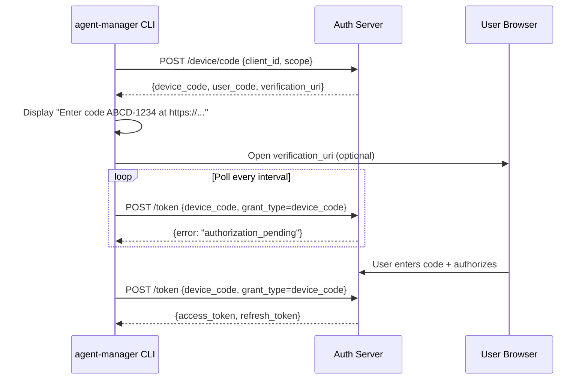
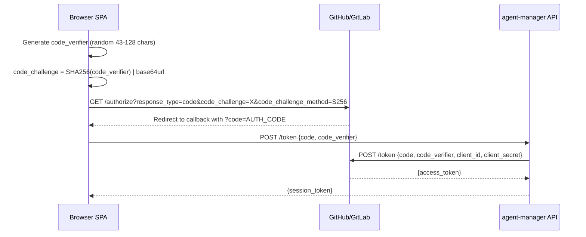
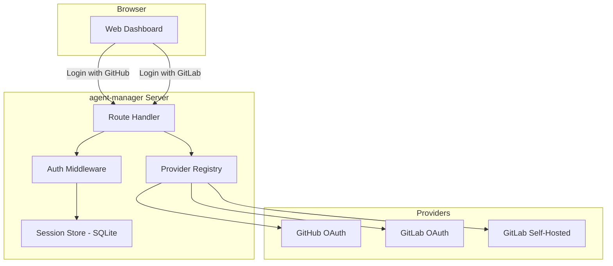
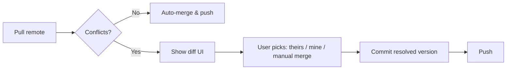
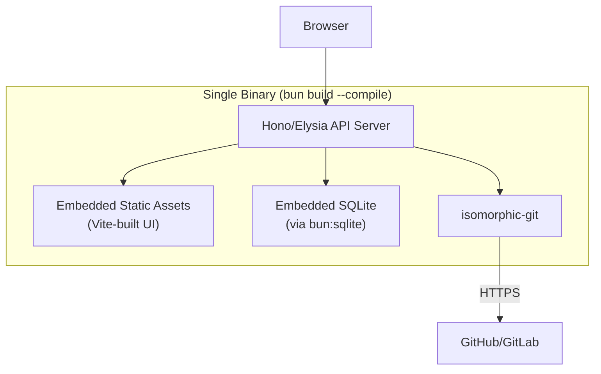
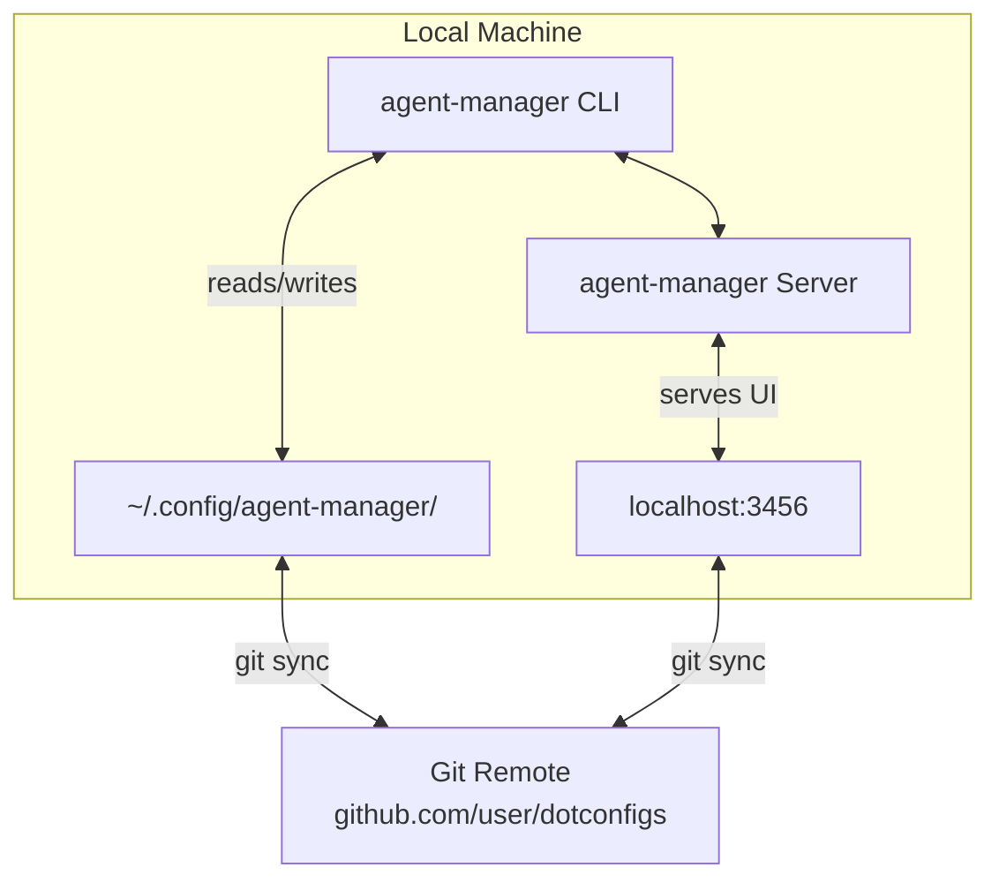
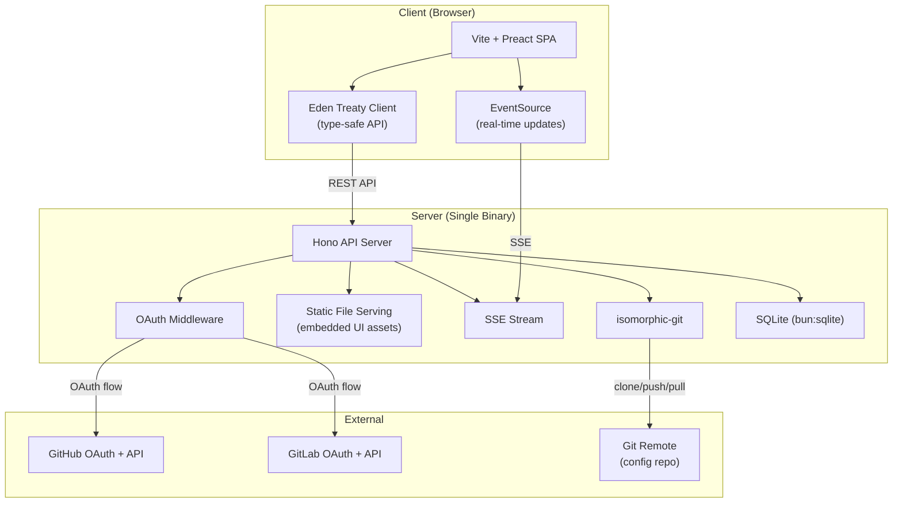
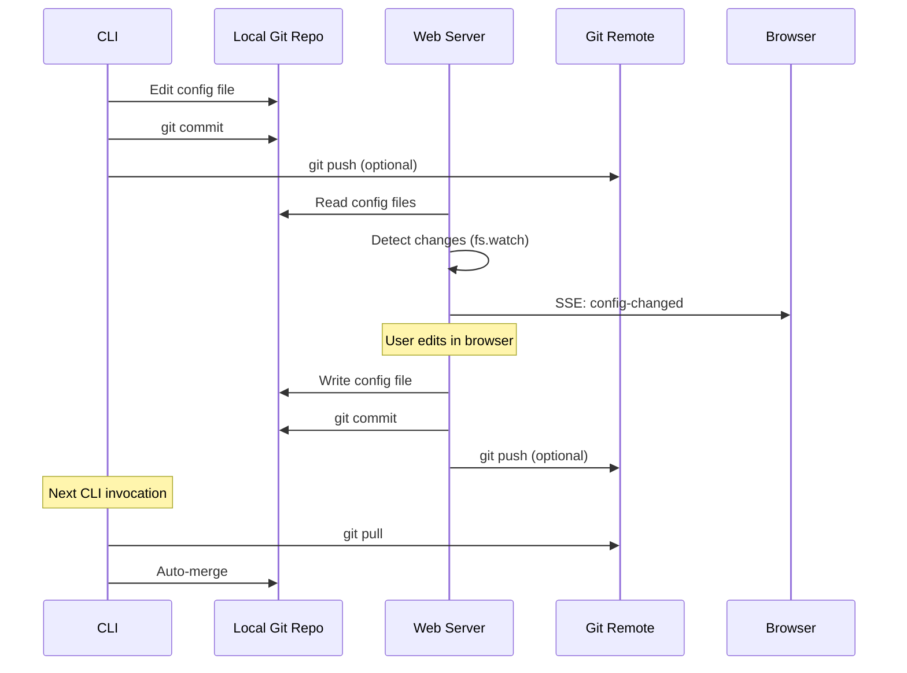

# 07 — Browser UI & Git OAuth Patterns

Research into building a self-hostable web dashboard for agent-manager with GitHub/GitLab
OAuth authentication, git-backed config sync, and real-time status monitoring.

Cross-references: [[03-bunts-cross-platform-compilation]], [[06-tui-frameworks-typescript-bun]]

---

## 1. OAuth Implementation Patterns

### 1.1 GitHub OAuth App vs GitHub App

Two distinct mechanisms for authenticating users and accessing GitHub APIs:

| Dimension | OAuth App | GitHub App |
|-----------|-----------|------------|
| **Identity** | Acts as the user | Acts as itself (bot) or on behalf of user |
| **Scope model** | Broad scopes (`repo`, `user`, `read:org`) | Fine-grained permissions per resource |
| **Installation** | Per-user authorization | Per-org/repo installation + user auth |
| **Rate limits** | 5,000 req/hr per user token | 5,000 per user; 15,000 per installation |
| **Webhooks** | No built-in | Built-in webhook delivery |
| **Token types** | User access token (long-lived) | Installation token (1hr), user token (8hr+refresh) |
| **Setup complexity** | Simple: client_id + secret | More complex: app ID, private key, manifest |
| **Best for** | User authentication (login) | CI/CD, bots, repo integrations |

**Recommendation for agent-manager:** Use an **OAuth App** for the login/identity flow
(simpler, user-centric), but consider a **GitHub App** if we need repo-level operations
(reading `.claude/` configs from repos) — the fine-grained permissions and installation
tokens are better suited for that.

### 1.2 GitLab OAuth Provider

GitLab supports standard OAuth 2.0 with Authorization Code flow. Works identically for
gitlab.com and self-hosted instances — just change the base URL.

```
# GitLab OAuth endpoints (self-hosted: replace gitlab.com with your instance)
Authorization: https://gitlab.com/oauth/authorize
Token:         https://gitlab.com/oauth/token
User Info:     https://gitlab.com/api/v4/user
```

**Key differences from GitHub:**
- GitLab uses `read_user` scope (vs GitHub's `user` scope)
- GitLab's `api` scope is very broad — prefer `read_api` + `read_repository`
- Self-hosted GitLab may use HTTP (not HTTPS) — handle in redirect URI validation
- GitLab supports PKCE natively since v15.0

**Multi-provider pattern:**

```typescript
interface OAuthProvider {
  name: 'github' | 'gitlab';
  authorizeUrl: string;
  tokenUrl: string;
  userInfoUrl: string;
  clientId: string;
  clientSecret: string;
  scopes: string[];
  // GitLab self-hosted support
  baseUrl?: string;
}

const providers: Record<string, OAuthProvider> = {
  github: {
    name: 'github',
    authorizeUrl: 'https://github.com/login/oauth/authorize',
    tokenUrl: 'https://github.com/login/oauth/access_token',
    userInfoUrl: 'https://api.github.com/user',
    clientId: process.env.GITHUB_CLIENT_ID!,
    clientSecret: process.env.GITHUB_CLIENT_SECRET!,
    scopes: ['user', 'repo'],
  },
  gitlab: {
    name: 'gitlab',
    authorizeUrl: `${process.env.GITLAB_URL ?? 'https://gitlab.com'}/oauth/authorize`,
    tokenUrl: `${process.env.GITLAB_URL ?? 'https://gitlab.com'}/oauth/token`,
    userInfoUrl: `${process.env.GITLAB_URL ?? 'https://gitlab.com'}/api/v4/user`,
    clientId: process.env.GITLAB_CLIENT_ID!,
    clientSecret: process.env.GITLAB_CLIENT_SECRET!,
    scopes: ['read_user', 'read_repository'],
    baseUrl: process.env.GITLAB_URL,
  },
};
```

### 1.3 OAuth Device Flow (CLI-to-Browser Auth)

The Device Authorization Grant (RFC 8628) is how CLIs like `gh auth login` work.
Perfect for agent-manager's CLI wanting to authenticate with the web dashboard.



**GitHub Device Flow:**
- GitHub supports device flow natively for OAuth Apps
- Endpoint: `POST https://github.com/login/device/code`
- Poll: `POST https://github.com/login/oauth/access_token` with `grant_type=urn:ietf:params:oauth:grant-type:device_code`
- User visits: `https://github.com/login/device` and enters the code

**GitLab Device Flow:**
- GitLab does NOT natively support device flow (as of GitLab 16.x)
- Workaround: Use the Authorization Code flow with a localhost redirect (`http://localhost:PORT/callback`)
- Alternative: Implement a custom device flow on the agent-manager server

### 1.4 PKCE Flow for SPAs

Proof Key for Code Exchange (RFC 7636) eliminates the need for a client secret in
browser-based apps. Essential if the web dashboard runs as a pure SPA.



**Implementation note:** Even with PKCE, the token exchange should happen server-side
(the agent-manager API) to keep the client_secret private. The SPA sends the auth code
+ code_verifier to the API, which completes the exchange.

### 1.5 Token Storage & Refresh Patterns

| Storage Location | Security | Persistence | Best For |
|-----------------|----------|-------------|----------|
| **HttpOnly cookie** | High (no JS access) | Session/persistent | Server-rendered apps |
| **Encrypted cookie** | High | Persistent | Hono/Elysia server sessions |
| **In-memory** | High (no persistence) | Tab only | Short-lived SPA sessions |
| **localStorage** | Low (XSS vulnerable) | Persistent | Never for access tokens |
| **Secure cookie + refresh** | Highest | Persistent | Production pattern |

**Recommended pattern for agent-manager:**

```typescript
// Server-side session with encrypted cookie
interface Session {
  userId: string;
  provider: 'github' | 'gitlab';
  accessToken: string;       // encrypted at rest
  refreshToken?: string;     // encrypted at rest
  expiresAt: number;
  gitlabBaseUrl?: string;    // for self-hosted
}

// Cookie: session_id -> lookup in SQLite
// Access token: never sent to browser
// Refresh: automatic on 401 from provider API
```

**Refresh flow:**
- GitHub OAuth App tokens don't expire (no refresh needed) unless revoked
- GitHub App user tokens expire after 8 hours — use refresh token
- GitLab tokens expire (configurable, default 2 hours) — always refresh

### 1.6 Multi-Provider Support Architecture



The key insight: store the provider name and base URL in the session, so all
subsequent API calls (fetching repos, reading configs) route through the correct
provider adapter.

---

## 2. Web Frameworks (Bun-Compatible)

### 2.1 Framework Comparison

| Framework | Runtime | Bundle Size | TypeScript | Auth Ecosystem | SSR | WebSocket | Self-Host Pattern |
|-----------|---------|-------------|------------|----------------|-----|-----------|-------------------|
| **Hono** | Any (Bun, Node, CF, Deno) | ~14KB | Native | JWT/Bearer MW, 3rd-party OAuth | Via middleware | Via adapter | Single binary w/ static |
| **Elysia** | Bun-native | ~21KB | End-to-end types | JWT plugin, macro auth | Limited | Native | Single binary w/ static |
| **Astro** | Node/Bun | Varies (SSG/SSR) | Yes | Lucia Auth, Auth.js | Excellent | Via integration | Docker/Node server |
| **SvelteKit** | Node (Bun experimental) | Small runtime | Yes | Auth.js, Lucia | Excellent | Via plugin | Node adapter → binary |
| **SolidStart** | Node/Bun | ~7KB runtime | Yes | Auth.js port | Yes | Vinxi/Nitro | Vinxi server |
| **Vite + React** | Browser + API | React runtime | Yes | Roll your own | CSR only | Via API | Static + API server |

### 2.2 Hono — Deep Dive

**Why Hono fits agent-manager:**
- Runs on Bun natively with zero adapter overhead
- Ultrafast: built on Web Standards (`Request`/`Response`)
- Tiny: ~14KB, perfect for embedding in a single binary
- Rich middleware: JWT, Bearer, CORS, static files, all built-in
- Multi-runtime: same code works in Bun, Node, Cloudflare Workers, Deno

**OAuth implementation in Hono:**

```typescript
import { Hono } from 'hono';
import { setCookie, getCookie } from 'hono/cookie';
import { serveStatic } from 'hono/bun';

const app = new Hono();

// Serve embedded static UI assets
app.use('/assets/*', serveStatic({ root: './ui/dist' }));

// OAuth login initiation
app.get('/auth/:provider/login', async (c) => {
  const provider = providers[c.req.param('provider')];
  if (!provider) return c.text('Unknown provider', 400);

  const state = crypto.randomUUID();
  // Store state in session for CSRF protection
  setCookie(c, 'oauth_state', state, { httpOnly: true, secure: true, sameSite: 'Lax' });

  const params = new URLSearchParams({
    client_id: provider.clientId,
    redirect_uri: `${c.req.url.split('/auth')[0]}/auth/${provider.name}/callback`,
    scope: provider.scopes.join(' '),
    state,
    response_type: 'code',
  });

  return c.redirect(`${provider.authorizeUrl}?${params}`);
});

// OAuth callback
app.get('/auth/:provider/callback', async (c) => {
  const provider = providers[c.req.param('provider')];
  const code = c.req.query('code');
  const state = c.req.query('state');
  const savedState = getCookie(c, 'oauth_state');

  if (state !== savedState) return c.text('Invalid state', 403);

  // Exchange code for token
  const tokenRes = await fetch(provider.tokenUrl, {
    method: 'POST',
    headers: { 'Accept': 'application/json', 'Content-Type': 'application/json' },
    body: JSON.stringify({
      client_id: provider.clientId,
      client_secret: provider.clientSecret,
      code,
      redirect_uri: `${c.req.url.split('/auth')[0]}/auth/${provider.name}/callback`,
    }),
  });

  const { access_token } = await tokenRes.json();

  // Fetch user info
  const userRes = await fetch(provider.userInfoUrl, {
    headers: { Authorization: `Bearer ${access_token}` },
  });
  const user = await userRes.json();

  // Create session
  const sessionId = crypto.randomUUID();
  await db.run('INSERT INTO sessions (id, provider, user_id, username, access_token) VALUES (?, ?, ?, ?, ?)',
    sessionId, provider.name, user.id, user.login ?? user.username, access_token);

  setCookie(c, 'session', sessionId, { httpOnly: true, secure: true, sameSite: 'Lax', maxAge: 86400 * 7 });
  return c.redirect('/');
});

// Auth middleware for API routes
const requireAuth = async (c, next) => {
  const sessionId = getCookie(c, 'session');
  if (!sessionId) return c.json({ error: 'Unauthorized' }, 401);

  const session = await db.get('SELECT * FROM sessions WHERE id = ?', sessionId);
  if (!session) return c.json({ error: 'Session expired' }, 401);

  c.set('session', session);
  return next();
};

app.use('/api/*', requireAuth);
```

**Hono + JSX for server-rendered pages:**

```typescript
import { Hono } from 'hono';
import { html } from 'hono/html';

app.get('/', (c) => {
  return c.html(
    html`<!DOCTYPE html>
    <html>
      <head><title>agent-manager</title></head>
      <body>
        <div id="app"></div>
        <script type="module" src="/assets/main.js"></script>
      </body>
    </html>`
  );
});
```

### 2.3 Elysia — Deep Dive

**Why Elysia fits agent-manager:**
- Bun-native: uses Bun's HTTP server directly (fastest possible)
- End-to-end type safety: request → response types inferred across the stack
- Eden Treaty: type-safe client SDK generated from server types
- Plugin ecosystem: JWT, static, CORS, WebSocket all available
- Macro system: declarative auth via `{ auth: true }` route option

**OAuth implementation in Elysia:**

```typescript
import { Elysia } from 'elysia';
import { jwt } from '@elysiajs/jwt';
import { staticPlugin } from '@elysiajs/static';

const app = new Elysia()
  .use(staticPlugin({ assets: 'ui/dist', prefix: '/' }))
  .use(jwt({ name: 'jwt', secret: process.env.JWT_SECRET! }))

  // OAuth login
  .get('/auth/:provider/login', ({ params: { provider }, set }) => {
    const p = providers[provider];
    const state = crypto.randomUUID();
    // ... build authorize URL
    set.redirect = `${p.authorizeUrl}?${params}`;
  })

  // OAuth callback
  .get('/auth/:provider/callback', async ({ params, query, jwt, cookie: { session } }) => {
    const p = providers[params.provider];
    // ... exchange code for token, fetch user
    const token = await jwt.sign({ userId: user.id, provider: params.provider });
    session.set({ value: token, httpOnly: true, maxAge: 7 * 86400 });
    return new Response(null, { status: 302, headers: { Location: '/' } });
  })

  // Protected API with macro
  .macro({
    auth: {
      async resolve({ jwt, cookie: { session }, status }) {
        const payload = await jwt.verify(session.value);
        if (!payload) return status(401);
        return { user: payload };
      }
    }
  })

  // Type-safe API routes
  .get('/api/profiles', ({ user }) => {
    return db.getProfiles(user.userId);
  }, { auth: true })

  .listen(3000);

// Eden Treaty client (auto-generated types!)
// import { treaty } from '@elysiajs/eden';
// const api = treaty<typeof app>('localhost:3000');
// const profiles = await api.api.profiles.get(); // fully typed!
```

**Elysia's Eden Treaty advantage:** The client SDK is auto-generated from the server
types. This means the web UI gets type-safe API calls without maintaining a separate
API schema or using codegen.

### 2.4 Framework Recommendation

For agent-manager, the choice depends on the deployment model:

**If single-binary self-hosted (primary goal):**
- **Hono** — best choice. Multi-runtime, tiny, proven middleware, easy to embed static
  assets. Works today in Bun's single-binary compilation.
- **Elysia** — strong alternative if Bun-only is acceptable. Eden Treaty is a killer
  feature for type-safe UI↔API communication.

**If we want rich SSR / island architecture:**
- **Astro** — excellent for documentation-heavy dashboards with interactive islands.
  Heavier build toolchain though.

**If we want full-stack framework:**
- **SvelteKit** — best DX for interactive dashboards, but Bun support is experimental.

**Verdict: Hono for the API + Vite-built SPA for the UI**, bundled together. This gives
us the best of both worlds: ultralight API server, modern frontend tooling, and easy
single-binary packaging. Elysia is a close second if we commit to Bun-only.

---

## 3. Git Operations from the Web

### 3.1 isomorphic-git — Pure JS Git

isomorphic-git is a complete git implementation in JavaScript. It works in both
Node.js/Bun (with `node:fs`) and browsers (with LightningFS or custom FS backends).

**Key capabilities:**
- `clone`, `fetch`, `pull`, `push`, `checkout`, `commit`, `log`, `status`, `diff`
- HTTP Smart Protocol (works with GitHub/GitLab HTTPS remotes)
- `onAuth` callback for credential injection
- `onProgress` callback for UI progress bars
- Custom HTTP backends (works with Bun's `fetch`)

**Server-side git operations (Bun/Node):**

```typescript
import git from 'isomorphic-git';
import http from 'isomorphic-git/http/node';
import fs from 'node:fs';

// Clone a config repo
await git.clone({
  fs,
  http,
  dir: '/data/config-repo',
  url: 'https://github.com/user/dotfiles.git',
  onAuth: () => ({ username: 'oauth2', password: accessToken }),
  onProgress: (progress) => {
    ws.send(JSON.stringify({ type: 'git-progress', ...progress }));
  },
});

// Read config file after clone
const content = fs.readFileSync('/data/config-repo/.claude/settings.json', 'utf8');

// Commit and push changes
await git.add({ fs, dir: '/data/config-repo', filepath: '.claude/settings.json' });
await git.commit({
  fs, dir: '/data/config-repo',
  message: 'Update Claude settings from web UI',
  author: { name: 'agent-manager', email: 'agent-manager@local' },
});
await git.push({
  fs, http, dir: '/data/config-repo',
  onAuth: () => ({ username: 'oauth2', password: accessToken }),
});
```

**Browser-side git operations:**

```typescript
import git from 'isomorphic-git';
import http from 'isomorphic-git/http/web';
import LightningFS from '@isomorphic-git/lightning-fs';

const fs = new LightningFS('agent-manager');

// Browser clone (needs CORS proxy for GitHub)
await git.clone({
  fs, http,
  dir: '/config-repo',
  url: 'https://github.com/user/dotfiles.git',
  corsProxy: 'https://cors.isomorphic-git.org',
  onAuth: () => ({ username: 'oauth2', password: userToken }),
});
```

### 3.2 simple-git — Node.js Git Wrapper

simple-git wraps the system `git` binary. Simpler than isomorphic-git for server-side
use, but requires git to be installed.

```typescript
import simpleGit from 'simple-git';

const git = simpleGit('/data/config-repo');

await git.clone('https://github.com/user/dotfiles.git', '/data/config-repo', {
  '--depth': 1,
});
await git.add('.claude/settings.json');
await git.commit('Update from web UI');
await git.push('origin', 'main');
```

**Trade-offs:**

| Dimension | isomorphic-git | simple-git |
|-----------|---------------|------------|
| Dependencies | Zero (pure JS) | Requires system `git` |
| Browser support | Yes | No |
| Performance | Slower for large repos | Native speed |
| Feature coverage | ~80% of git | Full git |
| Binary packaging | Works in single binary | Needs git on PATH |
| Shallow clone | Yes | Yes |
| Submodules | Limited | Full |

**Recommendation:** Use **isomorphic-git** for the single-binary distribution (no
external deps) and for browser-side previews. Fall back to **simple-git** when the
server has git available and needs advanced features (submodules, rebase, etc.).

### 3.3 GitHub/GitLab APIs vs Local Git

For many operations, REST APIs are simpler than cloning:

| Operation | Git (local/isomorphic) | REST API |
|-----------|----------------------|----------|
| Read single file | Clone → read (heavy) | GET /contents (light) |
| Read file tree | Clone → ls (heavy) | GET /tree (light) |
| Write single file | Clone → edit → commit → push | PUT /contents (light) |
| Bulk changes | Clone → edit multiple → commit → push (natural) | Multiple PUTs (awkward) |
| Branch management | Native | REST endpoints |
| Diff/conflict | Git diff (rich) | Compare API (limited) |
| Config sync | Clone + pull (stateful) | Polling API (stateless) |

**Hybrid approach for agent-manager:**
1. **Read operations:** Use REST APIs (fast, no local state)
2. **Write operations (single file):** Use REST API `PUT /contents`
3. **Bulk sync / conflict resolution:** Use isomorphic-git (full git semantics)
4. **Initial setup:** Clone via isomorphic-git, then incremental via API

### 3.4 Conflict Resolution UI Patterns

When two machines edit the same config file:



**UI approaches:**
- **Three-pane diff:** Base | Ours | Theirs (like VS Code merge editor)
- **Inline annotations:** Show conflict markers with accept/reject buttons
- **Simplified:** For JSON/TOML configs, show a key-by-key comparison table
  - "Server has `model: sonnet` / Local has `model: opus`" → pick one

Libraries for diff UI:
- `diff` (npm) — compute diffs programmatically
- `monaco-editor` — VS Code editor component with diff view
- `react-diff-viewer` — side-by-side diff component
- Custom TOML-aware differ — since configs are structured, diff at the key level

---

## 4. Self-Hosting Patterns

### 4.1 Single Binary Serving API + Static UI

The ideal deployment: one file, run it, everything works.



**Implementation with Bun:**

```typescript
// server.ts — entry point for `bun build --compile`
import { Hono } from 'hono';
import { serveStatic } from 'hono/bun';

const app = new Hono();

// Embedded static files (Bun resolves these at compile time)
// Pre-build: `cd ui && bun run build` → outputs to ui/dist/
app.use('/*', serveStatic({ root: './ui/dist' }));

// API routes
app.route('/api', apiRoutes);
app.route('/auth', authRoutes);

// SPA fallback
app.get('*', serveStatic({ path: './ui/dist/index.html' }));

export default {
  port: process.env.PORT ?? 3456,
  fetch: app.fetch,
};
```

**Build pipeline:**

```bash
# 1. Build the frontend
cd ui && bun run build  # → ui/dist/

# 2. Compile the server with embedded assets
bun build --compile --minify \
  --target=bun-darwin-arm64 \
  --outfile=agent-manager-server \
  server.ts

# Result: single binary with UI + API + SQLite + git
./agent-manager-server  # serves on :3456
```

**Note:** See [[03-bunts-cross-platform-compilation]] for cross-platform binary
compilation details. The web server binary can be built for all targets alongside
the CLI binary.

### 4.2 Docker Image Pattern

For users who prefer containers:

```dockerfile
FROM oven/bun:1-slim

WORKDIR /app
COPY package.json bun.lockb ./
RUN bun install --production

COPY ui/dist ./ui/dist
COPY src ./src

EXPOSE 3456
VOLUME /data

ENV DATABASE_PATH=/data/agent-manager.db
ENV CONFIG_REPO_PATH=/data/repos

CMD ["bun", "run", "src/server.ts"]
```

**Docker Compose with persistence:**

```yaml
version: '3.8'
services:
  agent-manager:
    image: agent-manager:latest
    ports:
      - "3456:3456"
    volumes:
      - agent-data:/data
    environment:
      - GITHUB_CLIENT_ID=${GITHUB_CLIENT_ID}
      - GITHUB_CLIENT_SECRET=${GITHUB_CLIENT_SECRET}
      - JWT_SECRET=${JWT_SECRET}
volumes:
  agent-data:
```

### 4.3 One-Click Cloud Deploy

**fly.io:**
```toml
# fly.toml
app = "my-agent-manager"

[build]
  dockerfile = "Dockerfile"

[http_service]
  internal_port = 3456
  force_https = true

[mounts]
  source = "agent_data"
  destination = "/data"
```

**Railway / Render:** Both support Dockerfile detection. Key requirement: persistent
volume for SQLite and cloned repos.

### 4.4 Local-First with Optional Cloud Sync

The agent-manager philosophy aligns with local-first:



- **Pure local:** CLI + server run locally, config in `~/.config/agent-manager/`
- **Local + git:** Same as above, but configs sync to a git repo
- **Cloud hosted:** Server runs on fly.io/Railway, CLI connects to it
- **Hybrid:** Local server for editing, cloud server for sharing across machines

### 4.5 SQLite for Server-Side State

SQLite is the natural choice for a self-hosted tool:

```sql
-- Core tables
CREATE TABLE sessions (
  id TEXT PRIMARY KEY,
  provider TEXT NOT NULL,         -- 'github' | 'gitlab'
  user_id TEXT NOT NULL,
  username TEXT NOT NULL,
  access_token TEXT NOT NULL,     -- encrypted
  refresh_token TEXT,             -- encrypted
  expires_at INTEGER,
  created_at INTEGER DEFAULT (unixepoch()),
  gitlab_base_url TEXT            -- NULL for github / gitlab.com
);

CREATE TABLE profiles (
  id TEXT PRIMARY KEY,
  name TEXT NOT NULL,
  description TEXT,
  config JSONB NOT NULL,          -- the merged config
  parent_id TEXT REFERENCES profiles(id),
  created_at INTEGER DEFAULT (unixepoch()),
  updated_at INTEGER DEFAULT (unixepoch())
);

CREATE TABLE sync_state (
  id TEXT PRIMARY KEY,
  repo_url TEXT NOT NULL,
  branch TEXT DEFAULT 'main',
  last_commit TEXT,
  last_synced_at INTEGER,
  status TEXT DEFAULT 'idle'      -- 'idle' | 'syncing' | 'conflict' | 'error'
);
```

**Litestream for replication** (optional cloud backup):
```bash
# Replicate SQLite to S3-compatible storage
litestream replicate /data/agent-manager.db s3://bucket/agent-manager.db
```

---

## 5. Dashboard UI Patterns

### 5.1 Reference Dashboards

Studying existing self-hosted dashboards that combine CLI + Web UI:

#### Coolify (coollabsio/coolify)
- **Stack:** Laravel + Vue.js + Livewire, PostgreSQL
- **Auth:** Built-in email/password + OAuth (GitHub, GitLab, Bitbucket, Google)
- **Pattern:** Server-side rendering with Livewire for interactivity
- **CLI↔UI sync:** Database is the source of truth; CLI writes to DB, UI reads from DB
- **Lesson:** Heavy stack (PHP + Node + Postgres) — too much for our use case, but the
  multi-provider OAuth pattern is solid

#### Portainer (portainer/portainer)
- **Stack:** Go backend + Angular frontend
- **Auth:** Built-in user management + LDAP + OAuth
- **Pattern:** REST API + SPA, single binary distribution
- **CLI↔UI sync:** API is the interface — both CLI and UI call the same REST endpoints
- **Lesson:** The single binary pattern works well. Their Docker image is the primary
  distribution, but they also ship standalone binaries.

#### n8n (n8n-io/n8n)
- **Stack:** TypeScript (Node.js) + Vue.js, SQLite/PostgreSQL
- **Auth:** Built-in + SAML + LDAP + OAuth
- **Pattern:** Monorepo with separate frontend/backend packages
- **CLI↔UI sync:** CLI triggers workflows via API; UI shows execution state
- **Lesson:** SQLite as default DB works great for self-hosted. Their migration from
  SQLite → Postgres for scaling is a good pattern to follow.

#### Grafana (grafana/grafana)
- **Stack:** Go backend + React frontend
- **Auth:** Built-in + OAuth + LDAP + JWT + API keys
- **Pattern:** Single binary, embedded frontend assets
- **CLI↔UI sync:** Provisioning YAML files + API — CLI writes provisioning files,
  server hot-reloads them
- **Lesson:** The "file provisioning + API" dual-mode is exactly what agent-manager
  needs. Config files on disk for CLI, REST API for web UI, git for sync.

#### mise (jdx/mise)
- **Stack:** Rust CLI, no built-in web UI
- **Pattern:** Pure CLI tool, no web companion
- **Lesson:** Sometimes a great CLI doesn't need a web UI. Consider if the TUI (see
  [[06-tui-frameworks-typescript-bun]]) is sufficient before building a web dashboard.

### 5.2 Key UI Components for agent-manager

#### Profile Management

```
┌─────────────────────────────────────────────────┐
│  Profiles                            [+ New]     │
├─────────────────────────────────────────────────┤
│                                                   │
│  📦 base                                         │
│  ├── 📦 work (inherits: base)                    │
│  │   ├── 📦 work-opus (inherits: work)           │
│  │   └── 📦 work-sonnet (inherits: work)         │
│  └── 📦 personal (inherits: base)                │
│                                                   │
│  ─────────────────────────────────────────────   │
│  Selected: work-opus                              │
│  Effective config (merged):                       │
│  ┌─────────────────────────────────────────┐     │
│  │ model = "opus"           ← work-opus    │     │
│  │ maxTokens = 4096         ← work         │     │
│  │ theme = "dark"           ← base         │     │
│  │ mcpServers.fetch = true  ← base         │     │
│  │ mcpServers.slack = true  ← work         │     │
│  └─────────────────────────────────────────┘     │
│                                                   │
│  [Edit] [Duplicate] [Export] [Delete]             │
└─────────────────────────────────────────────────┘
```

#### MCP Server Status Monitor

```
┌─────────────────────────────────────────────────┐
│  MCP Servers                    [+ Add Server]   │
├─────────────────────────────────────────────────┤
│  Status │ Name           │ Type    │ Tools │ Cfg │
│  ───────┼────────────────┼─────────┼───────┼─────│
│  🟢     │ fetch          │ stdio   │ 1     │ ✓   │
│  🟢     │ tavily-mcp     │ stdio   │ 8     │ ✓   │
│  🔴     │ slack-mcp      │ http    │ 42    │ ✓   │
│  🟡     │ builder-mcp    │ stdio   │ 31    │ ✓   │
│  ⚪     │ apd-aura-mcp   │ stdio   │ 15    │ ✗   │
│                                                   │
│  🟢 Running  🔴 Error  🟡 Starting  ⚪ Disabled  │
└─────────────────────────────────────────────────┘
```

#### Config Editor with Diff View

```
┌──────────────────────────┬──────────────────────┐
│  Local Config            │  Remote Config       │
├──────────────────────────┼──────────────────────┤
│  model = "opus"          │  model = "opus"      │
│- maxTokens = 4096        │+ maxTokens = 8192    │
│  theme = "dark"          │  theme = "dark"      │
│+ newSetting = true       │                      │
├──────────────────────────┴──────────────────────┤
│  [Accept Local] [Accept Remote] [Manual Merge]   │
└─────────────────────────────────────────────────┘
```

### 5.3 Real-Time Updates: WebSocket vs SSE

| Aspect | WebSocket | Server-Sent Events (SSE) |
|--------|-----------|-------------------------|
| Direction | Bidirectional | Server → Client only |
| Protocol | ws:// / wss:// | Regular HTTP |
| Reconnection | Manual | Automatic (EventSource) |
| Binary data | Yes | No (text only) |
| Proxy/CDN support | Often problematic | Excellent |
| Complexity | Higher | Lower |
| Best for | Interactive editing, chat | Status updates, sync notifications |

**Recommendation:** Use **SSE** for status updates (sync state, MCP server health) and
**WebSocket** for interactive features (live config editing, terminal).

**SSE implementation in Hono:**

```typescript
import { streamSSE } from 'hono/streaming';

app.get('/api/events', requireAuth, (c) => {
  return streamSSE(c, async (stream) => {
    // Send sync status updates
    const interval = setInterval(async () => {
      const status = await getSyncStatus();
      await stream.writeSSE({
        event: 'sync-status',
        data: JSON.stringify(status),
      });
    }, 5000);

    // Send MCP server health
    const mcpInterval = setInterval(async () => {
      const health = await getMcpHealth();
      await stream.writeSSE({
        event: 'mcp-health',
        data: JSON.stringify(health),
      });
    }, 10000);

    stream.onAbort(() => {
      clearInterval(interval);
      clearInterval(mcpInterval);
    });
  });
});
```

**WebSocket in Elysia:**

```typescript
app.ws('/ws', {
  message(ws, message) {
    if (message.type === 'config-update') {
      // Apply config change and broadcast
      applyConfigChange(message.payload);
      ws.publish('config-changes', JSON.stringify(message.payload));
    }
  },
  open(ws) {
    ws.subscribe('config-changes');
    ws.subscribe('sync-status');
  },
});
```

### 5.4 Drag-and-Drop Config Builder

For visual MCP server configuration:

**Pattern:** A palette of available MCP servers on the left, a workspace area on the
right. Users drag servers into profiles, configure them with forms, and see the
resulting TOML/JSON config in real-time.

**Libraries:**
- `@dnd-kit/core` — React drag-and-drop (accessible, performant)
- `svelte-dnd-action` — Svelte drag-and-drop
- `@formkit/auto-animate` — Smooth animations for list changes

**UI flow:**
```
1. Browse MCP server registry → See available servers with descriptions
2. Drag server into profile workspace → Server added with defaults
3. Click server → Edit config panel slides in (form-based)
4. See live preview of generated config (TOML/JSON toggle)
5. [Save] → writes to config file, triggers git commit if sync enabled
```

---

## 6. Recommended Architecture for agent-manager Web UI

### 6.1 Architecture Overview



### 6.2 Technology Stack Selection

| Layer | Choice | Rationale |
|-------|--------|-----------|
| **API Framework** | Hono | Multi-runtime, tiny, rich middleware, proven |
| **Frontend** | Preact + Vite | ~3KB runtime, React-compatible, fast builds |
| **Styling** | Tailwind CSS | Utility-first, no runtime, small bundle |
| **State Management** | Signals (@preact/signals) | Fine-grained reactivity, tiny |
| **Auth** | Custom OAuth (Hono middleware) | GitHub + GitLab + self-hosted GitLab |
| **Database** | SQLite (bun:sqlite) | Zero-config, embedded, fast |
| **Git** | isomorphic-git | Pure JS, no external deps, works in binary |
| **Real-time** | SSE (Hono streaming) | Simple, reliable, auto-reconnect |
| **Diff View** | Custom TOML-aware differ | Structured config diffing |
| **Build** | Bun (compile) | Single binary with embedded assets |

### 6.3 Route Map

```
GET  /                         → SPA entry point (index.html)
GET  /assets/*                 → Static UI assets

GET  /auth/github/login        → GitHub OAuth initiate
GET  /auth/github/callback     → GitHub OAuth callback
GET  /auth/gitlab/login        → GitLab OAuth initiate
GET  /auth/gitlab/callback     → GitLab OAuth callback
POST /auth/logout              → Clear session
POST /auth/device/code         → Device flow initiation (for CLI)
POST /auth/device/token        → Device flow token exchange

GET  /api/me                   → Current user info
GET  /api/profiles             → List profiles
POST /api/profiles             → Create profile
GET  /api/profiles/:id         → Get profile details
PUT  /api/profiles/:id         → Update profile
DEL  /api/profiles/:id         → Delete profile
GET  /api/profiles/:id/effective → Get merged/effective config

GET  /api/mcp-servers          → List available MCP servers
GET  /api/mcp-servers/:name/health → Check MCP server health

GET  /api/sync/status          → Git sync status
POST /api/sync/pull            → Pull from remote
POST /api/sync/push            → Push to remote
GET  /api/sync/conflicts       → List merge conflicts
POST /api/sync/resolve         → Resolve a conflict

GET  /api/events               → SSE stream (sync status, health)

GET  /api/config/preview       → Preview generated config (TOML/JSON)
POST /api/config/apply         → Apply config to local machine
```

### 6.4 CLI ↔ Web UI State Sync

The critical design question: how do the CLI and web UI stay in sync?

**Option A: Filesystem as source of truth**
- Both CLI and server read/write the same config files on disk
- Server watches filesystem for changes (`fs.watch`)
- Simple, works offline, no DB needed for config state
- Con: race conditions, no history

**Option B: SQLite as source of truth**
- Server owns the DB; CLI calls server API
- Config files are exported from DB on demand
- Con: server must be running for CLI to work

**Option C: Git as source of truth (recommended)**
- Config files live in a git repo (local clone)
- CLI edits files directly, commits locally
- Server edits files via API, commits locally
- Both push/pull to remote on demand or on schedule
- Git provides history, conflict detection, merge
- Works offline (local commits), syncs when online



---

## 7. Implementation Roadmap

### Phase 1: Core Authentication (Week 1)
- [ ] Hono server with static file serving
- [ ] GitHub OAuth (login/callback)
- [ ] GitLab OAuth (login/callback, self-hosted support)
- [ ] SQLite session management
- [ ] Device flow for CLI auth

### Phase 2: Config Management UI (Week 2-3)
- [ ] Profile CRUD API
- [ ] Profile tree visualization
- [ ] Config editor (TOML with syntax highlighting)
- [ ] Effective config preview (inheritance resolution)
- [ ] Import existing `.claude/settings.json`

### Phase 3: Git Sync (Week 3-4)
- [ ] isomorphic-git integration
- [ ] Clone/pull/push via web UI
- [ ] Conflict detection and resolution UI
- [ ] SSE for sync status updates

### Phase 4: MCP Server Dashboard (Week 4-5)
- [ ] MCP server registry browser
- [ ] Drag-and-drop server configuration
- [ ] Health monitoring (process status check)
- [ ] Generated config preview

### Phase 5: Polish & Deploy (Week 5-6)
- [ ] Single binary build pipeline
- [ ] Docker image
- [ ] One-click deploy configs (fly.io, Railway)
- [ ] Responsive mobile-friendly layout

---

## 8. Open Questions

1. **Auth-first or config-first?** Should OAuth be required to use the web UI, or
   should it work locally without auth (no login required when accessed from localhost)?

2. **Preact vs Svelte?** Preact is React-compatible and tiny, but Svelte produces
   even smaller bundles and has better DX for interactive UIs. SvelteKit's Bun support
   is experimental.

3. **isomorphic-git vs system git?** For the single binary, isomorphic-git is ideal.
   But if we detect system git, should we prefer it for performance?

4. **Config file format in git?** TOML (human-editable) or JSON (easier to parse)?
   See [[04-toml-profile-subset-configuration]] for the TOML design.

5. **Multi-user?** Is this always single-user (personal tool) or could teams share
   an instance? This affects auth, permissions, and conflict resolution design.

---

## 9. Key Takeaways

1. **Hono is the clear choice** for the API server — multi-runtime, tiny, great
   middleware, proven at scale. Elysia is the runner-up if Bun-only is acceptable.

2. **GitHub OAuth App + GitLab OAuth** cover the authentication needs. Device flow
   enables CLI → browser auth seamlessly.

3. **isomorphic-git** enables git operations without system dependencies, critical
   for the single-binary distribution model.

4. **Git as source of truth** for CLI↔UI sync is the most robust pattern — it provides
   history, conflict resolution, and offline support for free.

5. **SQLite + Litestream** gives us embedded database with optional cloud replication.

6. **SSE over WebSocket** for most real-time features — simpler, more reliable through
   proxies, with automatic reconnection.

7. **The Grafana pattern** (file provisioning + API + single binary) is the closest
   model to what agent-manager should be.
