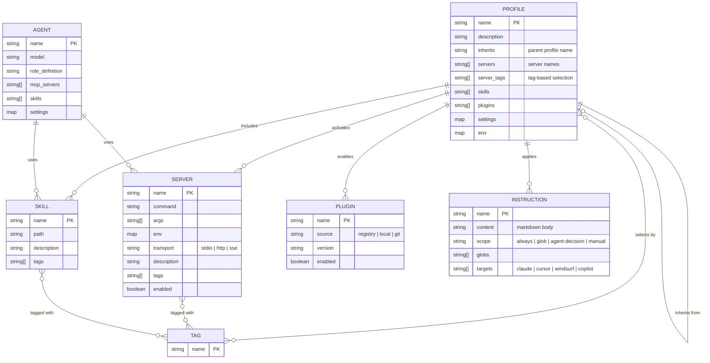
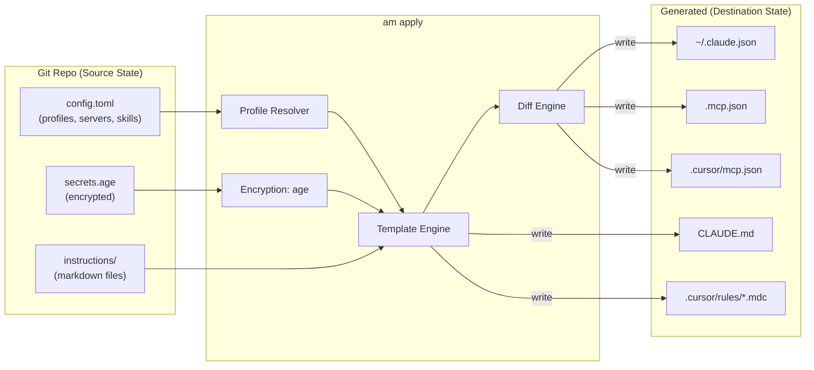
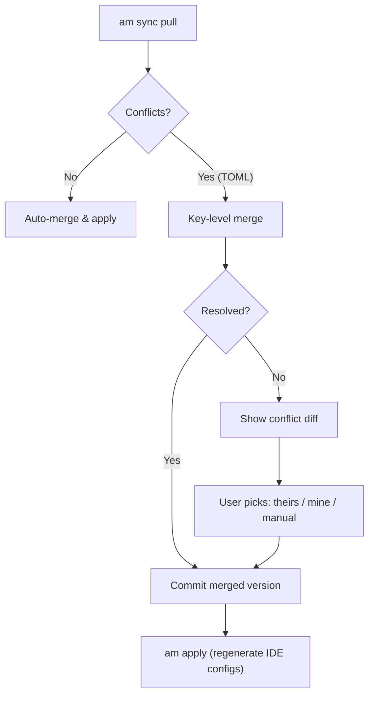
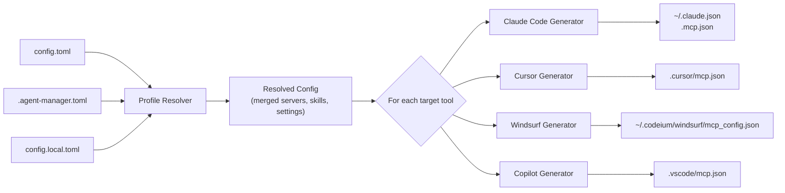
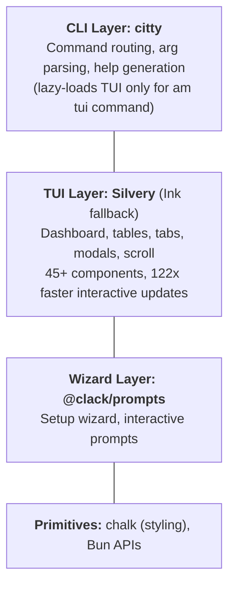
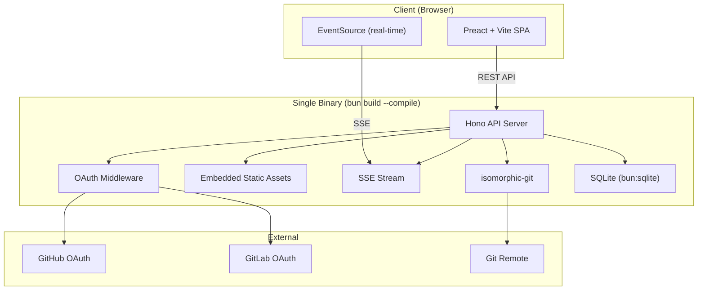
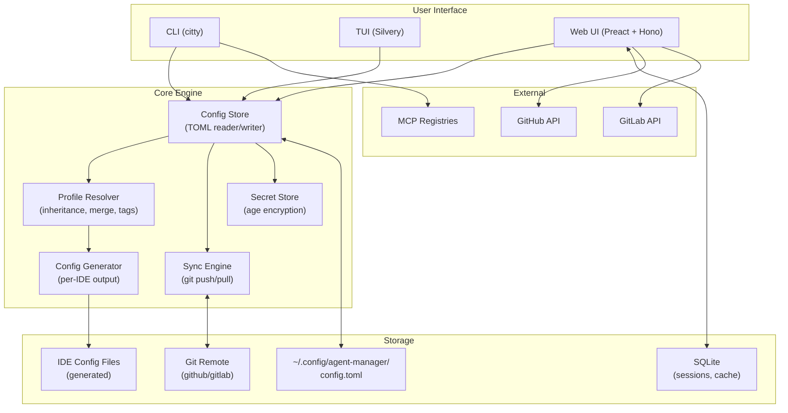
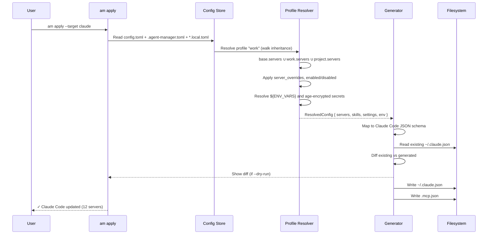
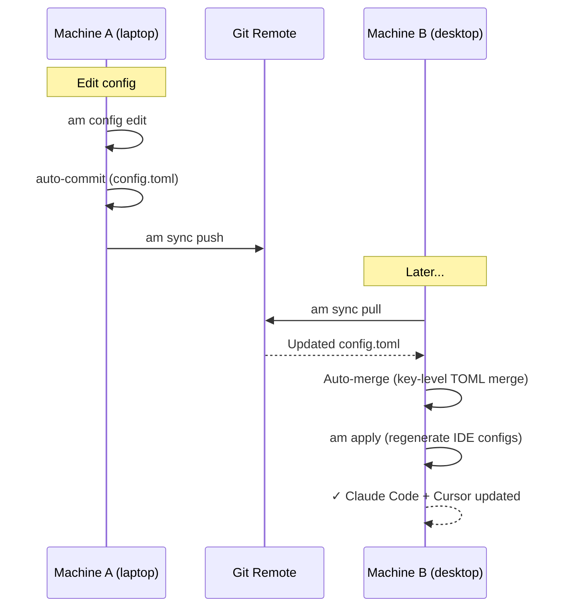
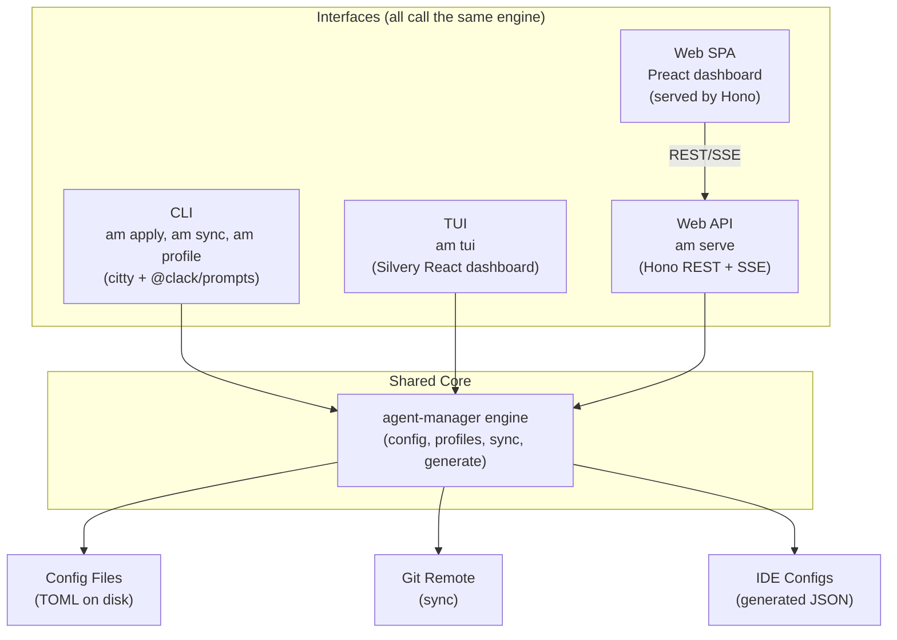

# agent-manager Architecture Design

> **Capstone synthesis of all research into a comprehensive architecture proposal for
> `agent-manager` (`am`) — a unified configuration manager for AI coding agents.**
>
> This document pulls together findings from seven research streams into an actionable
> design that someone can start building from.

> [!info] Cross-references
> - [[01-existing-mcp-sync-tools]] — 20+ existing tools, 10 gaps identified
> - [[02-git-as-backend-patterns]] — chezmoi, yadm, vcsh, dotter patterns
> - [[03-bunts-cross-platform-compilation]] — Bun compile, cross-platform, asset embedding
> - [[04-agent-ide-config-format-survey]] — 10 AI tools config formats, MCP near-universal
> - [[05-toml-profile-configuration-design]] — TOML profiles, Codex convergence validation
> - [[06-tui-frameworks-typescript-bun]] — Silvery/Ink, citty, @clack/prompts
> - [[07-browser-ui-git-oauth]] — Hono, OAuth, isomorphic-git, self-hosting

---

## Table of Contents

1. [Vision & Problem Statement](#1-vision--problem-statement)
2. [Data Model](#2-data-model)
3. [TOML Configuration Schema](#3-toml-configuration-schema)
4. [CLI Command Tree](#4-cli-command-tree)
5. [Git Sync Protocol](#5-git-sync-protocol)
6. [Config Generation (Apply)](#6-config-generation-apply)
7. [TUI Architecture](#7-tui-architecture)
8. [Web UI Architecture](#8-web-ui-architecture)
9. [Build & Distribution](#9-build--distribution)
10. [Implementation Roadmap](#10-implementation-roadmap)
11. [Architecture Diagrams](#11-architecture-diagrams)

---

## 1. Vision & Problem Statement

### The Problem

Every AI coding tool — Claude Code, Cursor, Windsurf, GitHub Copilot, Cline, Roo Code,
Continue, Amazon Q, Gemini CLI — stores its configuration differently. MCP server
definitions live in `~/.claude.json`, `.mcp.json`, `~/.cursor/mcp.json`,
`~/.codeium/windsurf/mcp_config.json`, `.vscode/mcp.json`, and a dozen other locations.
Instructions live in `CLAUDE.md`, `.cursor/rules/*.mdc`, `.windsurf/rules/*.md`,
`.github/copilot-instructions.md`, `GEMINI.md`, and more.

Developers who use multiple AI tools — or even a single tool across multiple machines —
face a fragmented, manual, error-prone configuration experience. There is no way to:

1. Define your MCP servers, skills, and agent configs **once** and deploy everywhere
2. **Sync** configurations across machines via git
3. Use **profiles** to switch between work/personal/minimal configurations
4. **Generate** tool-specific config files from a single source of truth
5. Manage the full stack — MCP servers + skills + plugins + instructions — **together**

### The 10 Gaps (from [[01-existing-mcp-sync-tools]])

Our survey of 20+ existing tools identified these unmet needs:

| # | Gap | Status in Ecosystem |
|---|-----|-------------------|
| 1 | **Git-based config sync** | No tool syncs via git. MCPM is local-only, Smithery is cloud-only. |
| 2 | **TOML-based configuration** | Everything is JSON or opaque. No comments, no human-friendly authoring. |
| 3 | **Unified server + skill + agent config** | Only Amazon's internal `aim` tool manages all three — and it's not public. |
| 4 | **Profile-based subsets with inheritance** | Only MCPM has profiles, and they're flat (no inheritance). |
| 5 | **Cross-client config generation** | No tool generates configs for ALL major AI tools from one source. |
| 6 | **Declarative IaC for AI tooling** | No version-controlled, diffable, reviewable manifest system. |
| 7 | **Plugin/hook system** | No tool has extensibility hooks for custom pre/post actions. |
| 8 | **Browser-based config editor with OAuth** | No web UI for editing configs with git provider auth. |
| 9 | **Offline-first with sync** | Tools are either fully local or fully cloud — never both. |
| 10 | **Cross-platform single binary** | Most tools require Python or Node.js runtimes. |

### Target Users

- **Multi-tool developers** who use Claude Code + Cursor + Copilot and want consistent
  MCP configs across all of them
- **Multi-machine developers** who work on a laptop, desktop, and cloud dev environment
  and need configs to follow them
- **Team leads** who want to define a standard set of MCP servers and instructions for
  their team, distributable via git
- **Power users** who manage 20+ MCP servers and need profiles to switch between
  work/personal/research/debugging configurations

### Elevator Pitch

> **agent-manager** is chezmoi for AI agent configs — define your MCP servers, skills,
> and instructions once in TOML, sync via git, and generate native configs for Claude
> Code, Cursor, Windsurf, Copilot, and every other AI coding tool. One config, every
> tool, every machine.

---

## 2. Data Model

### Core Entities

agent-manager manages six entity types that compose into a complete AI agent
configuration:

| Entity | Description | Example |
|--------|-------------|---------|
| **Server** | An MCP server definition (command, args, env, transport) | `aws-outlook-mcp`, `tavily-mcp` |
| **Skill** | A reusable prompt/instruction package (SKILL.md + metadata) | `research-rabbithole`, `admin-lint` |
| **Plugin** | An extension that adds skills, hooks, agents, or commands | `superpowers`, `hookify` |
| **Instruction** | A system prompt file with scoping rules (always/glob/manual) | `CLAUDE.md`, `.cursor/rules/ts.mdc` |
| **Profile** | A named subset of servers + skills + plugins + settings | `work`, `personal`, `minimal` |
| **Agent** | A subagent configuration (role, model, tools, instructions) | `admin-email`, `admin-research` |

### Entity Relationship Diagram



### Universal Config Normalization

The critical insight from [[04-agent-ide-config-format-survey]] is that MCP server
configuration is **near-universal** across AI tools. Every tool except Aider uses a
`mcpServers` (or `servers` for VS Code) object with identical fields:

```
agent-manager canonical → Claude Code ~/.claude.json
                        → Claude Code .mcp.json
                        → Cursor ~/.cursor/mcp.json
                        → Cursor .cursor/mcp.json
                        → Windsurf ~/.codeium/windsurf/mcp_config.json
                        → Copilot .vscode/mcp.json (key: "servers")
                        → Cline cline_mcp_settings.json
                        → Roo Code .roo/mcp.json
                        → Amazon Q .amazonq/default.json
                        → Gemini CLI .gemini/settings.json
                        → Continue ~/.continue/config.yaml (YAML list)
```

The normalization layer handles three key differences:
1. **Wrapper key:** `mcpServers` vs `servers` (VS Code/Copilot)
2. **Format:** JSON vs YAML (Continue)
3. **Extras:** Tool-specific fields like `alwaysAllow` (Cline), `trust` (Gemini),
   `disabled` (various)

---

## 3. TOML Configuration Schema

Based on the convergence analysis in [[05-toml-profile-configuration-design]] — where
OpenAI Codex independently adopted `[profiles.<name>]` tables in TOML, validating this
design — the schema has two files: a global config and a project binding.

### File Layout

```
~/.config/agent-manager/
  config.toml              # global: server catalog, profiles, settings
  config.local.toml        # local overrides (never synced)

<project-root>/
  .agent-manager.toml      # project binding: profile + overrides
  .agent-manager.local.toml # local project overrides (gitignored)
```

### Resolution Order (highest to lowest precedence)

```
CLI flags (--profile, --config key=value)
  ← Environment variables (AGENT_MANAGER_PROFILE, etc.)
    ← .agent-manager.local.toml (project-local, gitignored)
      ← .agent-manager.toml (project, version-controlled)
        ← config.local.toml (user-local)
          ← config.toml (user global, git-synced)
            ← Built-in defaults
```

### Global Config: `~/.config/agent-manager/config.toml`

```toml
# =============================================================================
# agent-manager global configuration
# Schema: https://agent-manager.dev/schema/config.json
# =============================================================================

# ---------------------------------------------------------------------------
# [settings] — Global behavior
# ---------------------------------------------------------------------------
[settings]
default_profile = "personal"
sync_remote = "https://github.com/user/agent-config.git"
auto_sync = true
log_level = "info"  # trace | debug | info | warn | error

# ---------------------------------------------------------------------------
# [servers.<name>] — MCP server catalog (definitions, not activations)
# ---------------------------------------------------------------------------
[servers.outlook]
command = "aws-outlook-mcp"
description = "Outlook email and calendar via Midway"
tags = ["email", "calendar", "work"]
env = { MIDWAY_AUTH = "true" }

[servers.slack]
command = "workplace-chat-mcp"
description = "Slack search, messages, AI, files"
tags = ["chat", "work"]

[servers.fetch]
command = "uvx"
args = ["mcp-server-fetch"]
description = "Raw URL fetching"
tags = ["web", "utility"]

[servers.tavily]
command = "bunx"
args = ["tavily-mcp@latest"]
description = "Web search and extraction"
tags = ["web", "search"]
env = { TAVILY_API_KEY = "${TAVILY_API_KEY}" }

[servers.context7]
command = "bunx"
args = ["@upstash/context7-mcp@latest"]
description = "Library documentation lookup"
tags = ["docs", "dev"]

[servers.exa]
command = "uvx"
args = ["mcp-proxy", "--transport", "streamablehttp", "--endpoint", "https://mcp.exa.ai/sse"]
description = "Exa web search, deep research"
tags = ["web", "search", "research"]
env = { EXA_API_KEY = "${EXA_API_KEY}" }

# ---------------------------------------------------------------------------
# [skills.<name>] — Skill catalog
# ---------------------------------------------------------------------------
[skills.research-rabbithole]
path = "~/.claude/skills/research-rabbithole"
description = "Multi-agent parallel research"
tags = ["research"]

[skills.admin-lint]
path = "~/.claude/skills/admin-lint"
description = "Vault health check"
tags = ["ops"]

# ---------------------------------------------------------------------------
# [plugins.<name>] — Plugin catalog
# ---------------------------------------------------------------------------
[plugins.superpowers]
source = "registry"
version = "latest"
description = "Enhanced workflow patterns"
tags = ["workflow"]

# ---------------------------------------------------------------------------
# [profiles.<name>] — Named configuration subsets
# ---------------------------------------------------------------------------
[profiles.base]
description = "Minimal baseline — always-on utilities"
servers = ["fetch", "tavily", "context7"]
skills = []
plugins = []

[profiles.personal]
description = "Personal projects and learning"
inherits = "base"
servers = ["exa"]
skills = ["research-rabbithole"]
plugins = ["superpowers"]

[profiles.work]
description = "Full work environment"
inherits = "base"
servers = ["outlook", "slack", "exa"]
skills = ["research-rabbithole", "admin-lint"]
plugins = ["superpowers"]

[profiles.work.settings]
log_level = "warn"

[profiles.work.env]
AWS_PROFILE = "work-sso"

[profiles.research]
description = "Deep research mode"
inherits = "base"
server_tags = ["search", "research", "docs"]  # tag-based activation
skills = ["research-rabbithole"]

# ---------------------------------------------------------------------------
# [[auto_detect]] — Automatic profile selection by directory
# ---------------------------------------------------------------------------
[[auto_detect]]
path_prefix = "~/work/"
profile = "work"

[[auto_detect]]
path_prefix = "~/research/"
profile = "research"
```

### Project Binding: `.agent-manager.toml`

```toml
# Project-level agent-manager configuration (version-controlled)
profile = "work"

[project]
name = "ADMINISTRIVIA"
description = "Personal productivity vault"

# Additional servers for this project only (additive)
[project.servers.wiki]
command = "amazon-wiki-mcp"
description = "Amazon Wiki access"
tags = ["wiki", "work"]

[project.servers.tickety]
command = "tickety-aws-mcp"
description = "Ticket management"
tags = ["tickets", "work"]

# Project-specific environment
[project.env]
VAULT_ROOT = "."
```

### Inheritance & Merge Model

Profile inheritance follows the Cargo `inherits` pattern (explicit single parent):

```
profiles.research
  └── inherits: profiles.base
        └── (built-in defaults)
```

**Merge rules per section type:**

| Section | Strategy | Behavior |
|---------|----------|----------|
| `servers` (list) | Union (additive) | Child adds to parent's servers |
| `server_tags` (list) | Union (additive) | Tags from both parent and child |
| `skills` (list) | Union (additive) | Child adds to parent's skills |
| `plugins` (list) | Union (additive) | Child adds to parent's plugins |
| `settings` (table) | Key-level override | Child key replaces parent; unset inherited |
| `env` (table) | Key-level override | Same as settings |
| `server_overrides` | Deep merge by server name | Child overrides merge into parent's |

**Computed active set (pseudocode):**

```python
active_servers = set()
for profile in reversed(inheritance_chain):
    active_servers |= set(profile.servers)
    active_servers |= servers_matching_tags(profile.server_tags)
active_servers |= set(project.servers)
for override in all_overrides:
    if override.enabled == False:
        active_servers.discard(override.server)
active_servers |= cli_add_servers
active_servers -= cli_remove_servers
```

---

## 4. CLI Command Tree

### Full Command Tree

```
am
├── init                          # Initialize a project (.agent-manager.toml)
├── add
│   ├── server <name|url>         # Add MCP server to global catalog
│   ├── skill <name|path>         # Add skill to catalog
│   └── plugin <name>             # Add plugin to catalog
├── remove
│   ├── server <name>
│   ├── skill <name>
│   └── plugin <name>
├── list
│   ├── servers [--active]        # List servers (all or active in profile)
│   ├── skills [--active]
│   ├── plugins [--active]
│   └── profiles
├── profile
│   ├── list                      # Show all profiles with inheritance tree
│   ├── show <name>               # Show computed config for profile
│   ├── use <name>                # Set default profile
│   ├── create <name> [--inherits <parent>]
│   └── delete <name>
├── apply [--dry-run]             # Generate IDE configs from TOML source
│   ├── --target claude           # Generate only for Claude Code
│   ├── --target cursor           # Generate only for Cursor
│   ├── --target all              # Generate for all detected tools
│   └── --diff                    # Show what would change
├── import
│   ├── claude                    # Import from ~/.claude.json + .mcp.json
│   ├── cursor                    # Import from ~/.cursor/mcp.json
│   └── auto                      # Auto-detect and import all
├── sync
│   ├── push                      # Push config to git remote
│   ├── pull                      # Pull config from git remote
│   ├── status                    # Show sync state
│   └── conflicts                 # List and resolve merge conflicts
├── config
│   ├── show                      # Show fully resolved config
│   ├── edit [--project]          # Open config in $EDITOR
│   └── validate                  # Validate against schema
├── tui                           # Launch interactive TUI dashboard
├── serve [--port 3456]           # Launch web UI server
├── login
│   ├── github                    # OAuth device flow for GitHub
│   └── gitlab [--url <base>]     # OAuth device flow for GitLab
├── doctor                        # Health check (MCP servers, paths, auth)
└── version
```

### Global Flags

```
--profile <name>          # Override active profile
--config key=value        # Per-run TOML-valued override (Codex pattern)
--server <name>           # Add server for this session
--no-server <name>        # Remove server for this session
--verbose / -v            # Increase log verbosity
--quiet / -q              # Suppress non-essential output
--json                    # JSON output for scripting
```

### Example Sessions

**First-time setup:**

```bash
$ am init
┌  agent-manager setup
│
◇  Which AI tools do you use?
│  ◼ Claude Code
│  ◼ Cursor
│  ◻ Windsurf
│  ◻ Copilot
│
◇  Import existing configs?
│  Yes — found ~/.claude.json (12 MCP servers)
│
◇  Profile name for imported config:
│  work
│
◇  Sync configs via git?
│  Yes
│
◇  Git repository URL:
│  git@github.com:user/agent-config.git
│
└  Setup complete! Created:
   ~/.config/agent-manager/config.toml (12 servers, 1 profile)
   .agent-manager.toml (project binding → work)
```

**Profile switching and apply:**

```bash
$ am profile list
  base        Minimal baseline — always-on utilities
▸ work        Full work environment (active)
  personal    Personal projects and learning
  research    Deep research mode

$ am profile use research
Switched to profile: research
Active servers: fetch, tavily, context7, exa (4 via tags: search, research, docs)

$ am apply --diff
Claude Code (~/.claude.json):
  - outlook (removed)
  - slack (removed)
  + exa (added, via tag: research)
Cursor (.cursor/mcp.json):
  - outlook (removed)
  - slack (removed)
  + exa (added)

$ am apply
✓ Claude Code  ~/.claude.json updated (4 servers)
✓ Claude Code  .mcp.json updated (2 project servers)
✓ Cursor       .cursor/mcp.json updated (4 servers)
```

**Sync workflow:**

```bash
$ am sync status
Local:  3 commits ahead, 0 behind
Remote: github.com/user/agent-config.git (main)

$ am sync push
Pushed 3 commits to origin/main
  + Added exa server
  + Created research profile
  ~ Updated work profile env vars

$ am sync pull  # on another machine
Pulled 3 commits from origin/main
Auto-applied: config.toml updated
Run `am apply` to regenerate IDE configs.
```

---

## 5. Git Sync Protocol

### Chezmoi-Inspired Source-Apply Model

Based on [[02-git-as-backend-patterns]], agent-manager uses chezmoi's **source-apply
separation**: the git repo is the source of truth, and IDE-specific config files are
generated outputs. This keeps the repo clean — no secrets, no machine-specific values,
no tool-specific JSON formats.



### What Lives in Git vs What's Generated Locally

| In Git (synced) | Local Only (generated or gitignored) |
|-----------------|--------------------------------------|
| `config.toml` | `config.local.toml` |
| `instructions/*.md` | IDE-specific JSON configs |
| `secrets.age` (encrypted) | Decrypted secrets |
| `.agent-manager.toml` (project) | `.agent-manager.local.toml` |
| Hook scripts | Runtime state (SQLite) |

### Conflict Resolution Strategy



Because configs are structured TOML (not arbitrary text), agent-manager can do
**key-level merging**: if machine A changed `servers.outlook.env.FOLDER` and machine B
changed `profiles.work.servers`, these merge cleanly without conflict.

### Encryption for Secrets

Following chezmoi's age-based encryption model:

```toml
# In config.toml
[settings]
encryption = "age"

[settings.age]
identity = "~/.config/agent-manager/key.txt"
recipient = "age1..."
```

Sensitive files (API keys, tokens) are encrypted with `age` before being stored in git.
Decrypted during `am apply`. The age identity key is **never** committed — it stays on
each machine.

```bash
# Encrypt a secret
am secret add TAVILY_API_KEY "tvly-..."
# → Appends to secrets.age in the git repo

# Secrets are resolved during apply
am apply
# → ${TAVILY_API_KEY} in config.toml resolves to decrypted value
```

### Push/Pull Mechanics

For the single-binary distribution (no system `git` required), agent-manager uses
**isomorphic-git** (pure JS) as documented in [[07-browser-ui-git-oauth]]. When system
git is available, it falls back to **simple-git** for performance.

```typescript
// Detection logic
const useSystemGit = await which('git').catch(() => null);
const git = useSystemGit ? simpleGit(repoDir) : isomorphicGit(repoDir);
```

Auto-sync (optional, enabled via `auto_sync = true`):
- **On profile switch:** pull before switching, push after
- **On apply:** pull before generating, push config changes after
- **On config edit:** commit + push after saving

---

## 6. Config Generation (Apply)

### How `am apply` Works

The apply command reads the resolved TOML config (profile + project + local overrides),
then generates native config files for each detected AI tool:



### Generator: MCP Server Configs

Each generator maps from the canonical TOML format to the tool's native JSON:

**Claude Code** (`~/.claude.json` and `.mcp.json`):

```typescript
function generateClaudeCode(resolved: ResolvedConfig): ClaudeConfig {
  const mcpServers: Record<string, ClaudeMcpServer> = {};
  for (const [name, server] of Object.entries(resolved.servers)) {
    mcpServers[name] = {
      command: server.command,
      ...(server.args?.length && { args: server.args }),
      ...(Object.keys(server.env ?? {}).length && { env: resolveEnv(server.env) }),
    };
  }
  return { mcpServers };
}
```

**Cursor** (`.cursor/mcp.json`):

```typescript
function generateCursor(resolved: ResolvedConfig): CursorConfig {
  // Same mcpServers key, same schema — direct mapping
  return { mcpServers: buildMcpServers(resolved) };
}
```

**Copilot / VS Code** (`.vscode/mcp.json`):

```typescript
function generateCopilot(resolved: ResolvedConfig): CopilotConfig {
  // VS Code uses "servers" not "mcpServers"
  const servers: Record<string, VsCodeMcpServer> = {};
  for (const [name, server] of Object.entries(resolved.servers)) {
    servers[name] = {
      command: server.command,
      args: server.args ?? [],
    };
  }
  return { servers };
}
```

### Generator: Instruction Files

Instructions are the hardest to normalize because each tool uses different scoping
mechanisms. agent-manager stores instructions in a universal format and generates
per-tool files:

**Canonical format** (in `instructions/` directory):

```yaml
---
name: typescript-conventions
scope: glob
globs: ["**/*.ts", "**/*.tsx"]
description: "TypeScript coding conventions"
targets: [claude, cursor, windsurf, copilot]
---

Use strict TypeScript with no `any` types. Prefer `interface` over `type` for objects.
```

**Generated outputs:**

| Target | Output File | Transformation |
|--------|------------|----------------|
| Claude Code | `CLAUDE.md` (appended section) | Strip frontmatter, concatenate always-on instructions |
| Cursor | `.cursor/rules/typescript-conventions.mdc` | Convert to `.mdc` frontmatter (`alwaysApply`, `globs`) |
| Windsurf | `.windsurf/rules/typescript-conventions.md` | Convert to Windsurf frontmatter (`trigger: glob`) |
| Copilot | `.github/instructions/typescript.instructions.md` | Convert to Copilot frontmatter (`applyTo`) |
| Gemini CLI | `GEMINI.md` (appended section) | Strip frontmatter, concatenate |

### Apply Modes

```bash
am apply                    # Apply to all detected tools
am apply --target claude    # Only Claude Code
am apply --dry-run          # Show what would change without writing
am apply --diff             # Show a diff of changes
am apply --force            # Overwrite even if target has local changes
```

The diff mode compares the generated config against the existing file and shows
changes. This is the `chezmoi diff` / `terraform plan` pattern — always preview before
applying.

---

## 7. TUI Architecture

Based on [[06-tui-frameworks-typescript-bun]], the TUI uses a three-layer architecture:

### Stack



### Why Silvery Over Ink

| Dimension | Silvery | Ink |
|-----------|---------|-----|
| Built-in components | 45+ (Table, Tabs, Modal, TreeView, CommandPalette) | 6 core + ink-ui's ~10 |
| Layout engine | Flexily (pure TS, zero WASM, 1.5x faster) | Yoga (WASM binary) |
| Interactive update speed | 169 us (per-node dirty tracking) | 20.7 ms (full tree re-render) |
| Responsive layout | `useContentRect()` — components know their size | Not available |
| Bun compilation | Clean — no WASM to embed | Works but larger binary |
| Risk | Pre-1.0, single maintainer | 37K stars, proven in Gemini CLI |
| Fallback cost | 98.9% Ink test compat — swap imports | N/A |

Silvery is the primary choice. If it stalls, Ink is a drop-in fallback via
`import "silvery/ink"` → `import "ink"`.

### Key Views

**Dashboard** (default `am tui` view):

```
┌─────────────────────────────────────────────────────────────────┐
│ agent-manager v0.1.0                    Profile: work  [?] help│
├─────────────────────────────────────────────────────────────────┤
│ [Dashboard] [Servers] [Skills] [Plugins] [Profiles] [Sync]     │
├─────────────────────────────────────────────────────────────────┤
│                                                                 │
│  ┌──────────────────────┬──────────┬─────────┬────────────────┐ │
│  │ Name                 │ Type     │ Status  │ Profile Source  │ │
│  ├──────────────────────┼──────────┼─────────┼────────────────┤ │
│  │ aws-outlook-mcp      │ Server   │ ● ON    │ work           │ │
│  │ tavily-mcp           │ Server   │ ● ON    │ base           │ │
│  │ builder-mcp          │ Server   │ ○ OFF   │ (not in work)  │ │
│  │ research-rabbithole  │ Skill    │ ● ON    │ work           │ │
│  │ superpowers          │ Plugin   │ ● ON    │ work           │ │
│  └──────────────────────┴──────────┴─────────┴────────────────┘ │
│                                                                 │
│  [i]nstall  [r]emove  [s]ync  [a]pply  [p]rofile  [q]uit       │
├─────────────────────────────────────────────────────────────────┤
│ Sync: ● up to date │ 12 servers │ 5 skills │ 3 plugins        │
└─────────────────────────────────────────────────────────────────┘
```

**Profile switcher** (Tabs → Profiles):

```
┌─────────────────────────────────────────┐
│  Switch Profile                         │
│                                         │
│  ▸ work        Full work environment    │
│    personal    Personal + learning      │
│    minimal     No MCPs, fast startup    │
│    research    Deep research mode       │
│                                         │
│  Current: work                          │
│  [Enter] switch  [n]ew  [d]elete       │
└─────────────────────────────────────────┘
```

**Sync status** (Tabs → Sync):

```
┌──────────────────────────────────────────────────────────────┐
│  Sync Status                                                 │
│  ● Local → Git       Last push: 5 min ago                    │
│  ● Git → Local       Last pull: 2 min ago                    │
│  ⚠ Claude Code       settings.json out of sync               │
│  ● Cursor            .cursor/mcp.json synced                 │
│  ○ Windsurf          Not configured                          │
│                                                              │
│  [s]ync now  [d]iff  [a]pply                                 │
└──────────────────────────────────────────────────────────────┘
```

### Component-to-Framework Mapping

| View Element | Silvery Component |
|-------------|-------------------|
| Tab navigation | `<Tabs>` |
| Server/skill table | `<Table>` |
| Profile picker | `<SelectList>` |
| Sync diff | `<Text>` with chalk coloring |
| Status indicators | `<Badge>` |
| Keyboard shortcuts | `useInput` hook |
| Scrollable lists | `<VirtualList>` |
| Config editing | External `$EDITOR` (via `useApp().exit()`) |

---

## 8. Web UI Architecture

Based on [[07-browser-ui-git-oauth]], the web UI follows the **Grafana pattern**: file
provisioning + API + single binary.

### Architecture Overview



### Technology Choices

| Layer | Choice | Rationale |
|-------|--------|-----------|
| API framework | **Hono** | Multi-runtime, ~14KB, rich middleware, Bun-native |
| Frontend | **Preact + Vite** | ~3KB runtime, React-compatible, fast builds |
| Styling | **Tailwind CSS** | Utility-first, no runtime, small bundle |
| Auth | **Custom OAuth** | GitHub + GitLab + self-hosted GitLab |
| Database | **SQLite** (bun:sqlite) | Zero-config, embedded, fast |
| Git operations | **isomorphic-git** | Pure JS, no system deps, works in binary |
| Real-time | **SSE** (Hono streaming) | Simple, auto-reconnect, proxy-friendly |

### OAuth Flows

**CLI-to-browser** (Device Flow, RFC 8628):

```
$ am login github
┌  GitHub Authentication
│
│  Enter code ABCD-1234 at:
│  https://github.com/login/device
│
│  Waiting for authorization...
│  ✓ Authenticated as @username
│
└  Token saved to ~/.config/agent-manager/auth.json
```

**Web UI** (Authorization Code + PKCE):
- User clicks "Login with GitHub/GitLab"
- Redirect to provider, user authorizes
- Callback exchanges code for token (server-side, keeps client_secret private)
- Session stored in SQLite, HttpOnly cookie for the browser

### Key API Routes

```
GET  /                           → SPA (embedded index.html)
GET  /auth/:provider/login       → OAuth initiate
GET  /auth/:provider/callback    → OAuth callback
POST /auth/logout                → Clear session

GET  /api/profiles               → List profiles
POST /api/profiles               → Create profile
GET  /api/profiles/:id/effective → Merged config for profile
PUT  /api/profiles/:id           → Update profile

GET  /api/servers                → List MCP servers
POST /api/config/apply           → Apply config to local machine
GET  /api/config/preview         → Preview generated config

GET  /api/sync/status            → Git sync state
POST /api/sync/pull              → Pull from remote
POST /api/sync/push              → Push to remote

GET  /api/events                 → SSE stream (status updates)
```

### CLI-to-Web State Sync

Git is the source of truth for both CLI and web UI (Option C from [[07-browser-ui-git-oauth]]):

1. CLI edits config files directly, commits locally
2. Web server reads the same config files, watches for changes (`fs.watch`)
3. Both push/pull to the same git remote
4. Git provides history, conflict detection, and merge semantics

---

## 9. Build & Distribution

Based on [[03-bunts-cross-platform-compilation]], agent-manager compiles to a single
binary per platform using `bun build --compile`.

### Build Targets

| Target | OS | Arch | Estimated Size |
|--------|------|------|---------------|
| `bun-darwin-arm64` | macOS | ARM64 (Apple Silicon) | ~60-65 MB |
| `bun-darwin-x64` | macOS | Intel | ~65-70 MB |
| `bun-linux-x64` | Linux | x64 | ~95-100 MB |
| `bun-linux-arm64` | Linux | ARM64 (Graviton) | ~95-100 MB |
| `bun-windows-x64` | Windows | x64 | ~110-115 MB |

All targets built from a **single CI runner** (Ubuntu) — Bun's cross-compilation
downloads the target runtime automatically.

### Build Script

```typescript
// scripts/build.ts
const version = process.env.VERSION || "0.0.0-dev";
const targets = [
  "bun-darwin-arm64", "bun-darwin-x64",
  "bun-linux-x64", "bun-linux-arm64",
  "bun-windows-x64",
] as const;

for (const target of targets) {
  const ext = target.includes("windows") ? ".exe" : "";
  await Bun.build({
    entrypoints: ["./src/cli.ts"],
    compile: {
      target,
      outfile: `./dist/am-${target.replace("bun-", "")}${ext}`,
      autoloadDotenv: false,
    },
    minify: true,
    sourcemap: "linked",
    bytecode: true,
    define: {
      BUILD_VERSION: JSON.stringify(version),
      BUILD_TIME: JSON.stringify(new Date().toISOString()),
    },
  });
}
```

### CI/CD Pipeline (GitHub Actions)

```yaml
name: Release
on:
  push:
    tags: ['v*']

jobs:
  build:
    runs-on: ubuntu-latest
    strategy:
      matrix:
        include:
          - target: bun-darwin-arm64
            artifact: am-darwin-arm64
          - target: bun-darwin-x64
            artifact: am-darwin-x64
          - target: bun-linux-x64
            artifact: am-linux-x64
          - target: bun-linux-arm64
            artifact: am-linux-arm64
          - target: bun-windows-x64
            artifact: am-windows-x64.exe
    steps:
      - uses: actions/checkout@v4
      - uses: oven-sh/setup-bun@v2
      - run: bun install --frozen-lockfile
      - run: |
          bun build --compile --minify --sourcemap --bytecode \
            --target=${{ matrix.target }} \
            --define BUILD_VERSION='"${{ github.ref_name }}"' \
            ./src/cli.ts --outfile ./dist/${{ matrix.artifact }}
      - uses: actions/upload-artifact@v4
        with:
          name: ${{ matrix.artifact }}
          path: ./dist/${{ matrix.artifact }}

  release:
    needs: build
    runs-on: ubuntu-latest
    steps:
      - uses: actions/download-artifact@v4
        with: { path: ./artifacts, merge-multiple: true }
      - uses: softprops/action-gh-release@v2
        with:
          files: ./artifacts/*
          generate_release_notes: true
```

### Distribution Channels

| Channel | Method | Command |
|---------|--------|---------|
| **GitHub Releases** | Pre-compiled binaries | Download from releases page |
| **Homebrew** | Tap formula | `brew install org/tap/agent-manager` |
| **npm** | Package with bin field | `npx agent-manager` / `bunx agent-manager` |

### The `am` Alias

```json
{
  "name": "agent-manager",
  "bin": {
    "agent-manager": "./dist/agent-manager",
    "am": "./dist/agent-manager"
  }
}
```

For binary distribution: `ln -sf /usr/local/bin/agent-manager /usr/local/bin/am`

---

## 10. Implementation Roadmap

### Phase 1: MVP — CLI + TOML + Git Sync + Claude Code Apply

**Goal:** A working CLI that reads TOML config, syncs via git, and generates
`~/.claude.json` and `.mcp.json` for Claude Code.

| Task | Description |
|------|-------------|
| Project scaffold | Bun + TypeScript + citty for CLI routing |
| TOML parser | Read/write `config.toml` and `.agent-manager.toml` |
| Profile resolver | Implement inheritance chain and merge rules |
| Claude Code generator | Generate `~/.claude.json` and `.mcp.json` |
| Git sync | isomorphic-git push/pull with auto-commit |
| Import command | `am import claude` reads existing configs |
| Init wizard | @clack/prompts setup flow |
| Binary build | `bun build --compile` for macOS/Linux |

**Deliverable:** `am init`, `am apply --target claude`, `am sync push/pull`

### Phase 2: Multi-IDE Apply + Profiles

| Task | Description |
|------|-------------|
| Cursor generator | `.cursor/mcp.json` |
| Windsurf generator | `~/.codeium/windsurf/mcp_config.json` |
| Copilot generator | `.vscode/mcp.json` (key: `servers`) |
| Instruction generator | CLAUDE.md, `.cursor/rules/*.mdc`, etc. |
| Profile management | `am profile create/use/show/delete` |
| Auto-detect | Profile selection by directory prefix |
| Secret encryption | age-based encryption for sensitive values |

**Deliverable:** `am apply --target all`, `am profile use work`

### Phase 3: TUI

| Task | Description |
|------|-------------|
| Silvery integration | Dashboard view with Table + Tabs |
| Server list view | Enable/disable, status indicators |
| Profile switcher | Select and apply profiles interactively |
| Sync status view | Show git state, pending changes |
| Keyboard shortcuts | Full vim-style navigation |

**Deliverable:** `am tui` with full interactive dashboard

### Phase 4: Web UI + OAuth

| Task | Description |
|------|-------------|
| Hono API server | REST API for profiles, servers, sync |
| GitHub OAuth | Device flow (CLI) + Authorization Code (SPA) |
| GitLab OAuth | Including self-hosted instance support |
| Preact SPA | Dashboard, profile editor, diff viewer |
| SSE real-time | Sync status, MCP server health |
| Single binary embed | UI assets compiled into binary |

**Deliverable:** `am serve` launches web dashboard on localhost

### Phase 5: Plugin Ecosystem + Community

| Task | Description |
|------|-------------|
| Hook system | Pre/post apply, post-sync hooks |
| Plugin architecture | Custom generators for new tools |
| Registry integration | Browse mcpm.sh / Smithery / official MCP registry |
| More IDE targets | Cline, Roo Code, Continue, Amazon Q, Gemini CLI |
| Team features | Shared profiles via git, org-level config |

**Deliverable:** `am add server --from registry`, plugin API

---

## 11. Architecture Diagrams

### System Architecture



### Data Flow: TOML to IDE Config Generation



### Git Sync Flow



### CLI, TUI, and Web UI Relationship



All three interfaces — CLI, TUI, and Web UI — share the same core engine. The engine
handles config reading, profile resolution, config generation, and git sync. The
interfaces are thin layers that present different interaction models on top of the same
operations. This means `am apply` from the CLI, pressing "Apply" in the TUI, and
clicking "Apply" in the web UI all execute identical logic.

---

## Summary

agent-manager fills a clear gap in the AI tooling ecosystem: **no existing tool manages
the full stack of AI agent configuration as version-controlled, git-synced,
human-readable TOML with profile-based subsets and multi-IDE generation.**

The design draws on proven patterns:
- **chezmoi's** source-apply model for clean git repos
- **Cargo's** `inherits` keyword for explicit profile inheritance
- **Docker Compose's** tag-based activation for flexible server selection
- **dotter's** global-vs-local config split for machine-specific overrides
- **OpenAI Codex's** `[profiles.<name>]` TOML pattern (independent convergence)

The implementation path is incremental: Phase 1 delivers a useful CLI for Claude Code
users in weeks, while later phases add multi-IDE support, TUI, web UI, and a plugin
ecosystem. Each phase delivers standalone value.

> [!tip] Start Building
> Phase 1 requires: `bun init`, `citty`, `@iarna/toml`, `@clack/prompts`,
> `isomorphic-git`, and `age-encryption`. That's it. The MVP is a single TypeScript
> file that reads TOML, resolves a profile, and writes JSON.
