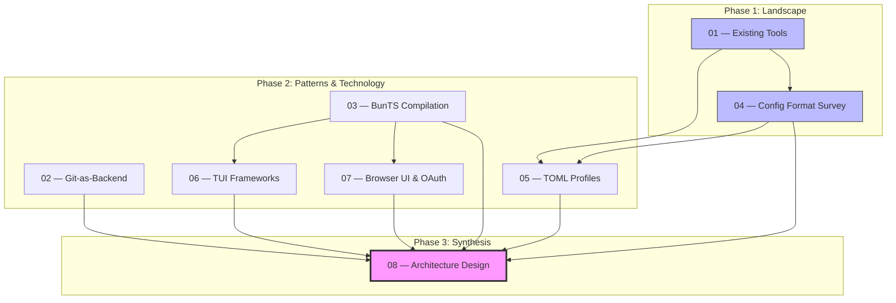

# agent-manager Research Index

> [!info] Purpose
> This index catalogs the research conducted during the design phase of **agent-manager**
> (`am`) — a unified configuration manager for AI coding agents. Eight documents cover
> the full landscape from existing tools through architecture design.

---

## Topic Overview

The research answers a single question: **How should we build a tool that manages
MCP servers, skills, plugins, instructions, and settings across every major AI
coding agent (Claude Code, Cursor, Windsurf, Copilot, Cline, Roo, Codex, Gemini CLI)
with git-backed sync, profile inheritance, and both TUI and web interfaces?**

The investigation proceeded in three phases:

1. **Landscape & Gaps** (docs 01, 04) — What exists today, what formats do tools use,
   and where are the gaps?
2. **Patterns & Technology** (docs 02, 03, 05, 06, 07) — What design patterns and
   technology choices should we adopt?
3. **Synthesis** (doc 08) — How does it all come together into a buildable architecture?

---

## Document Table

| # | Document | Tags | Key Contribution |
|---|----------|------|------------------|
| 01 | [[01-existing-mcp-sync-tools\|Existing MCP/Plugin Sync Tools]] | `tools/mcp`, `tools/cli` | Survey of 20+ tools; 10-gap analysis defining the opportunity space |
| 02 | [[02-git-as-backend-patterns\|Git-as-Backend Patterns]] | `patterns/git`, `tools/dotfiles` | 8 patterns from chezmoi, yadm, dotter, GNU Stow; source-apply model recommendation |
| 03 | [[03-bunts-cross-platform-compilation\|BunTS Cross-Platform Compilation]] | `tools/bun`, `patterns/compilation` | Bun `--compile` to 5 targets; asset embedding; CI/CD matrix strategy |
| 04 | [[04-agent-ide-config-format-survey\|Agent/IDE Config Format Survey]] | `config/formats`, `tools/ide` | Config anatomy of 10 AI tools; MCP near-universal `mcpServers` key; normalization strategy |
| 05 | [[05-toml-profile-configuration-design\|TOML Profile Configuration Design]] | `config/toml`, `patterns/profiles` | 13-system survey; Cargo-style `inherits`; 7-layer resolution; merge semantics |
| 06 | [[06-tui-frameworks-typescript-bun\|TUI Frameworks for TypeScript/Bun]] | `tools/tui`, `tools/typescript` | Silvery recommended (122x faster); citty for CLI; @clack/prompts for wizards |
| 07 | [[07-browser-ui-git-oauth\|Browser UI & Git OAuth]] | `patterns/oauth`, `tools/web-ui` | Hono + Preact SPA; OAuth Device Flow; isomorphic-git; SSE; Grafana single-binary pattern |
| 08 | [[08-agent-manager-architecture-design\|Architecture Design (Capstone)]] | `architecture`, `design` | Full synthesis: data model, TOML schema, CLI tree, git sync, config gen, TUI, web, roadmap |

---

## Suggested Reading Order

### Quick path (architecture decision-makers)

1. **[[08-agent-manager-architecture-design]]** — Start here for the full picture
2. **[[01-existing-mcp-sync-tools]]** — Understand the competitive landscape
3. **[[05-toml-profile-configuration-design]]** — Deep dive on the config model

### Full path (implementers)

1. **[[01-existing-mcp-sync-tools]]** — Landscape: what exists and what's missing
2. **[[04-agent-ide-config-format-survey]]** — Target formats we must generate
3. **[[05-toml-profile-configuration-design]]** — The canonical config model
4. **[[02-git-as-backend-patterns]]** — How git sync should work
5. **[[03-bunts-cross-platform-compilation]]** — Build and distribution strategy
6. **[[06-tui-frameworks-typescript-bun]]** — Terminal interface technology
7. **[[07-browser-ui-git-oauth]]** — Web interface technology
8. **[[08-agent-manager-architecture-design]]** — Capstone: the complete architecture

### By implementation phase

| Phase | Documents | Focus |
|-------|-----------|-------|
| Phase 1: CLI MVP | [[05-toml-profile-configuration-design\|05]], [[04-agent-ide-config-format-survey\|04]], [[01-existing-mcp-sync-tools\|01]] | TOML parsing, config generation, basic commands |
| Phase 2: Git Sync | [[02-git-as-backend-patterns\|02]], [[03-bunts-cross-platform-compilation\|03]] | Source-apply model, age encryption, cross-platform binaries |
| Phase 3: TUI | [[06-tui-frameworks-typescript-bun\|06]] | Silvery dashboard, interactive config editing |
| Phase 4: Web UI | [[07-browser-ui-git-oauth\|07]] | Hono server, Preact SPA, OAuth, SSE |
| All phases | [[08-agent-manager-architecture-design\|08]] | Reference architecture for every phase |

---

## Key Decisions & Recommendations

These are the most consequential recommendations from the research:

| Decision | Recommendation | Source |
|----------|---------------|--------|
| Config format | TOML with Cargo-style `inherits` | [[05-toml-profile-configuration-design\|Doc 05]] |
| Sync model | chezmoi source-apply (git repo = source of truth) | [[02-git-as-backend-patterns\|Doc 02]] |
| Secret management | age encryption for secrets in git | [[02-git-as-backend-patterns\|Doc 02]] |
| Build toolchain | Bun compile to 5 targets from single CI runner | [[03-bunts-cross-platform-compilation\|Doc 03]] |
| CLI framework | citty (lightweight UnJS router) | [[06-tui-frameworks-typescript-bun\|Doc 06]] |
| TUI framework | Silvery (45+ components, 122x faster than Ink) | [[06-tui-frameworks-typescript-bun\|Doc 06]] |
| Web server | Hono (~14KB, multi-runtime) | [[07-browser-ui-git-oauth\|Doc 07]] |
| Web frontend | Preact (~3KB React-compatible) | [[07-browser-ui-git-oauth\|Doc 07]] |
| Auth flow | OAuth Device Flow (RFC 8628) | [[07-browser-ui-git-oauth\|Doc 07]] |
| Real-time updates | SSE over WebSocket | [[07-browser-ui-git-oauth\|Doc 07]] |
| MCP config key | `mcpServers` (near-universal, VS Code uses `servers`) | [[04-agent-ide-config-format-survey\|Doc 04]] |
| Merge semantics | Union merge for lists, key-level override for maps | [[05-toml-profile-configuration-design\|Doc 05]] |

---

## Research Dependency Graph

---

## Key External References

| Resource | Relevance |
|----------|-----------|
| [chezmoi](https://chezmoi.io) | Source-apply model adopted for git sync |
| [Bun docs — bun build --compile](https://bun.sh/docs/bundler/executables) | Single-binary compilation |
| [Silvery](https://github.com/anthropics/silvery) | TUI framework (React-based, Flexily layout) |
| [Hono](https://hono.dev) | Web server framework |
| [Preact](https://preactjs.com) | Lightweight frontend framework |
| [citty](https://github.com/unjs/citty) | CLI command router |
| [@clack/prompts](https://github.com/bombshell-dev/clack) | Interactive CLI wizard prompts |
| [isomorphic-git](https://isomorphic-git.org) | Pure JS git for single-binary embedding |
| [age](https://age-encryption.org) | File encryption for secrets in git |
| [RFC 8628](https://tools.ietf.org/html/rfc8628) | OAuth 2.0 Device Authorization Grant |

---

## Statistics

- **Total documents:** 8
- **Research phase:** 2026-04-07
- **Tools surveyed:** 20+ MCP tools, 8 dotfile managers, 10 AI coding agents, 13 config systems, 6 TUI frameworks, 4 web frameworks
- **Architecture entities:** 6 (Server, Skill, Plugin, Instruction, Profile, Agent)
- **Implementation phases:** 5 (CLI MVP → Git Sync → TUI → Web UI → Community)
